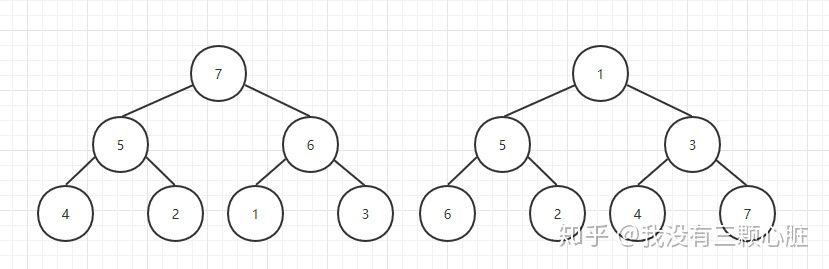

# 优先队列

## 优先队列概述

优先队列（Priority Queue)其实就是一种特殊的队列，它是一种特殊的数据结构。

优先队列核心功能是：**找出，返回和删除优先队列里的最小(最大）的元素**。

对于一个优先队列而言，其本身需要实现三种方法：

 - insert 插入元素
 - lookup 查询最大/最小元素
 - pop 移除最大/最小元素


## 优先队列的堆实现

优先队列底层可以有多种不同的实现方式，其中，最简单的一种实现方式就是 "堆" 。

那么，"堆" 又是什么呢？

堆是一颗具有特定性质的二叉树，堆的基本要求就是

 - 堆中所有结点的值必须大于或等于（或小于或等于）其孩子结点的值
 - 是当 h > 0 时，所有叶子结点都处于第 h 或 h - 1 层（其中 h 为树的高度，完全二叉树），也就是说，堆应该是一颗完全二叉树；


在下面的例子中，左边的树为堆（每个元素都大于其孩子结点的值），而右边的树不是堆（因为5大于其孩子结点2）。



## Python 中堆的使用

在 Python 中，内置的 `heapq` 模块内置实现了堆算法，下面，我们就来了解一下如何使用。

### 创建堆

在 Python 中，创建一个堆非常简单，只需要用 `heapify` 函数就可以将一个 list 转化为一个 heap。

示例代码如下：

```python
import heapq

list_info = [2, 3, 5, 1, 4]
heapq.heapify(list_info)
print(list_info)
```

其中，需要注意如下几点:

1. heapify 接收一个数组变量，并将其原地修改为heap。
2. heapify 生成的堆默认为小顶堆，如果你的需求是想要获取大顶堆，那么其实可以相当于把所有的元素全部取负数即可。


下面，我们来介绍一下 heap 对象中常用的一些操作：

```python
import heapq
heap = [2, 3, 5, 1, 4]
heapq.heapify(heap)
# 将 item 的值加入 heap 中
heapq.heappush(heap, 5)
print(heap)
# 弹出并返回 heap 的最小的元素，保持堆的不变性。如果堆为空，抛出 IndexError
min_element = heapq.heappop(heap)
print(min_element)
print(heap)
# 访问heap中最小的元素
print(heap[0])
# 将 item 放入堆中，然后弹出并返回 heap 的最小元素。
heapq.heappushpop(heap, 3)
print(heap)
```

此外，`heapq` 中还提供了三个基于堆的通用函数：

```python
import heapq
# 将多个已排序的输入合并为一个已排序的输出
output = heapq.merge(*iterables, key=None, reverse=False)
# 从 iterable 所定义的数据集中返回前 n 个最大元素组成的列表。
max_list = heapq.nlargest(n, iterable, key=None)
# 从 iterable 所定义的数据集中返回前 n 个最小元素组成的列表。
min_list = heapq.nsmallest(n, iterable, key=None)
```

## 常见题目

