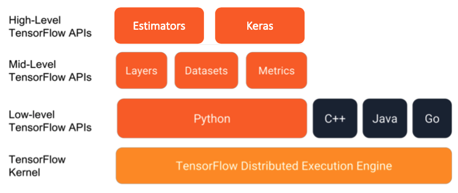
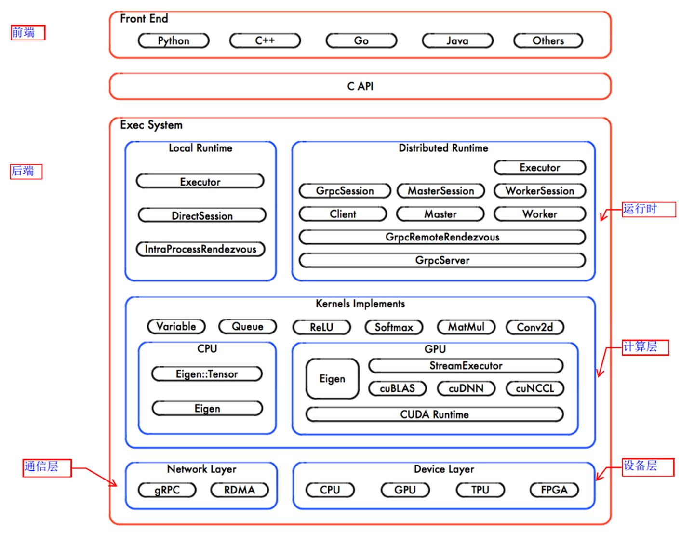
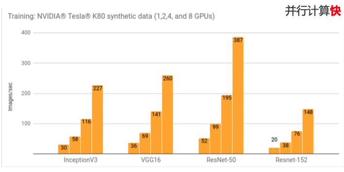
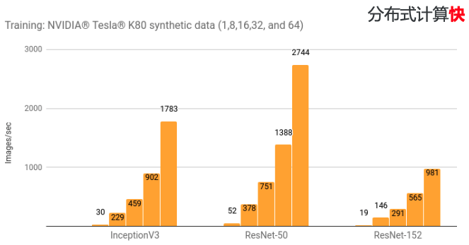

# tensorflow 架构介绍

看上去， tensorflow 仅仅是一个 Python 的第三方库而已，你可能还在想，一个第三方库也需要介绍架构？

如果你这么想的话，那你实在是太小瞧了 tensorflow 。

## 模块和API

首先，我们先从大的模块分类了解 tensorflow 包含哪些模块:

从面向用户的分层结构上来看， tensorflow 可以大致分为 4 层。
其中，用户往往仅关心前两层到三层。

下面，我们依次来讲解每一层的功能和使用场景。我们从上向下进行分析：

1. High-Level Tensorflow APIs: Estimators 和 Keras 其实都是针对 tensorflow 高度封装
   的API，通过 Estimators 和 Keras，我们甚至可以使用不到10行代码就能够实现一个相当复杂的模型。因此，
   High-Level Tensorflow APIs 非常适用于相当直接使用 Tensorflow 来完成某项任务的工程师。
2. Mid-Level Tensorflow APIs: 包括了很多常用的深度学习网络层的函数、数据集的操作管理函数以及相关各种指标管理的函数。
   因此，当现有的Estimators 和 Keras模型无法满足你的需求时（如需要自定义网络模型），那Mid-Level Tensorflow APIs可能
   就是一个不错的选择了。
3. Low-Level Tensorflow APIs 则是更加底层的 tensorflow 操作 API，它甚至可以提供基于tensorflow的算法操作等。
   因此，当你需要完全自定义相关计算逻辑时，至少也可以直接调用Low-Level Tensorflow APIs。同时，Low-Level Tensorflow APIs
   提供了各个语言的版本，你可以将训练好的模型通过各个语言进行调用并在不同的场景下进行执行。
4. Tensorflow Kernel 是 Tensorflow 真正的精华所在，负责整体的任务计算、执行、调度等一系列操作，各个 Level 的 API 最终
   都是通过与 Tensorflow Kernel 进行交互实现对应的计算任务。

## Tensorflow 架构

上面，我们从用户视角了解了 Tensorflow 的基本分层思想，下面，我们要从系统架构的角度来了解 Tensorflow 的架构。

上图是 Tensorflow 的系统架构图。

Tensorflow的系统结构以C API为界，将整个系统分为前端和后端两个子系统：

 - 前端负责设计数据流图
 - 后端执行数据流图，可再细分为：
   - 运行时：提供本地模式和分布式模式
   - 计算层：由 kernel 函数组成
   - 通信层：基于 gRPC 实现组件间的数据交换，并能够在支持 IB 网络的节点间实现RDMA通信
   - 设备层：计算设备是 OP 执行的主要载体，TensorFlow 支持多种异构的计算设备类型

从图管理的角度来看，tensorflow 包括：

1. 设计数据流图: 仅仅设计数据流图的组织关系，但是不执行，由前端 API 实现。
2. 编排数据流图: 将计算图的节点以最佳的执行方案部署在集群中各个计算设备上，有运行时来负责相关的功能。
3. 运行数据流图: 按照拓扑排序执行图中的节点，并启动每个OP的Kernel计算(计算层、通信层、设备层)

而从系统组成部分来看，还可以分成:

 - client: 毫无疑问，client 是 tensorflow 的使用入口，负责设计数据流图并与 master 交互发送任务。
 - master: master 负责接收数据流图并进行处理和任务分配
   1. client 在执行 Session.run 时，传递整个计算图(Full Graph)给后端的 Master。
   2. master 通过 Session.run 中的 fetches、feeds 参数根据依赖关系将 Full Graph 剪枝为小的依赖子图(Client Graph)。
   3. master 根据任务名称将 Client Graph 分为多个 Graph Partition(SplitByTask)，每个 Graph Partition 被注册到相应的 Worker 上(任务和 Worker 一一对应)。
   4. master 通知所有 worker 启动相应 Graph Partition 并发执行。
 - worker: worker 是最终的数据流图的计算执行者
   1. 接收来自 master 下发的执行任务。
   2. 对注册的 Graph Partition 根据本地设备集二次分裂(SplitByDevice)，其中每个计算设备对应一个 Graph Partition
      (是注册的Graph Partition中更小的Partition)，并通知各个计算设备并发执行这个更小的 Graph Partition
      (计算根据图中节点之间的依赖关系执行拓扑排序算法)。
   3. 按照拓扑排序算法在某个计算设备上执行本地子图，并调度OP的Kernel实现。
   4. 协同任务之间的数据通信(交换OP运算的结果)
      - 本地CPU与GPU之间，使用 cudaMemcpyAsync 实现异步拷贝。
      - 本地GPU之间，使用端到端的 DMA 操作，避免主机端CPU的拷贝。
      - 分布式运行时，通过 gRPC 协议完成跨节点的数据通信。
 - kernel: Kernel 是 OP 在某种硬件设备的特定实现，它负责执行 OP 的具体运算，大多数 Kernel 基于 Eigen::Tensor 实现。

## 数据流图概述

在上述 tensorflow 的架构中，我们不止一次的提到了 **数据流图** 这一核心概念。

那么，我们接下来需要学习一下在 tensorflow 中的数据流图究竟是什么。

如上图所示，这就是一个典型的可视化的 tensorflow 的数据流图。

在这一数据流图中，可以看到两个类型的元素，分别是:

 - 节点：在 tensorflow 中，节点通常表示的就是数据流图中的数学操作（Operation），此外，除操作外，我们还用节点来表示一些数据输入。
 - 有向边：在 tensorflow 中，有向边指的是在各个数学操作之间流动的数据，由于在深度学习中的计算通常的高维数据，因此，有向边也就是对应着张量数据。

那数据流图有什么作用呢？

TensorFlow 程序通常被组织成一个构建图阶段和一个执行图阶段。

 - 在构建阶段, op 的执行步骤被描述成一个图。 
 - 在执行阶段, 使用会话执行执行图中的 op。

通过这个步骤的拆分，在构建阶段，本质上只是在设计操作流程，并不会真正触发计算操作。而是统一在执行阶段执行相关的操作。

这样一来，Tesorflow 在执行阶段，可以有效的将计算任务进行拆分和分配，从而能够充分发挥出计算资源的能力，尽可能快速的完成计算任务。

具体体现在，在多块GPU卡并行计算中：

n 块 GPU 卡能处理的图片数目几乎等于 1 块 GPU 卡能处理的图片数目 * n。

在多台服务器分布式计算中：

n 块 GPU 卡能处理的图片数目几乎等于 1 块 GPU 卡能处理的图片数目 * n。

## 参考资源

1. [极客时间-tensorflow入门](https://time.geekbang.org/course/detail/100023001-80142)
2. [知乎-《TensorFlow 内核剖析》笔记——系统架构](https://zhuanlan.zhihu.com/p/133645486)
