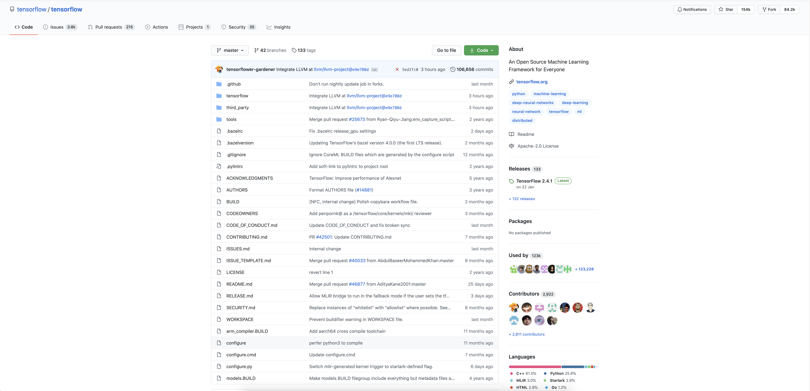

# tensorflow快速入门

## 简述

tensorflow 是由 Google 开源的一款深度学习框架，也是目前最流行的深度学习框架。

早在2012年，Google 内部就使用了一个名为 Google DistBelief 的第一代
深度学习平台用于公司内部的深度学习算法相关开发与应用。

而在2015年，Google 推出了它的第二代深度学习框架 - Tensorflow ，并将其开源，
从而也逐步变成了社区最流行的深度学习框架。

对于Tensorflow框架而言，其具备如下优点:

1. 包含灵活通用的深度学习库
2. 兼容端云结合的运行场景
3. 是一款高性能的基础平台软件
4. 具备跨平台运行的能力

## Tensorflow 典型应用场景

深度学习近些年来突然大火，不得不提及的就是 Alpha Go 大胜人类围棋高手的事件了。

而 Alpha Go 就是 Google 基于 tensorflow 编写的众多AI算法模型之一了。

但是，其实除了 Alpha Go 之外，深度学习近些年来其实已经深入到了我们生活的方方面面。

常见的包括基于人脸识别算法的人脸签到和门禁；基于OCR识别的身份证信息识别与核对等等一系列场景。

而目前使用 Tensorflow 的公司也是不胜枚举，除了 Google 自家公司之外，国外的 NVIDIA, Intel、 
国内的小米、腾讯、网易等等都在使用着 Tensorflow 框架来开发自己的 AI 应用。

## Tensorflow 发展现状

目前，Github 中的 tensorflow 代码库已经有了超过 154K 的Star，同时也被 Fork 了超过 84.2k 次。
这一数据在 Github 中已经进入了前10名的范围。

同时，最新的 tensorflow 也已经进入 2.0+ 版本，相比 1.0+ 版本而言， 2.0版本有了更加友好的体验和更加强大的功能。

Tensorflow 也支持各种编程语言的接口，例如 Python, c++, Java, Go, JS等等，基本可以满足任何开发场景的需求。

怎么样？听了我们的描述，是不是对 Tensorflow 已经充满了求知的欲望，下面，来跟着我们一起进入 tensorflow 的学习吧。
