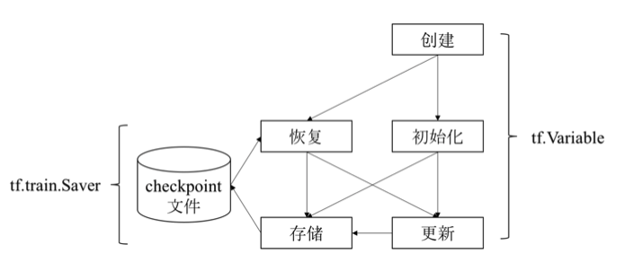

# tensorflow 核心概念

在进一步学习 tensorflow 的使用之前，我们非常有必要来了解一些 tensorflow 的一些核心概念。

## 张量（tensor）

在数学定义中， **张量** 是一种几何实体，从广义上来讲，张量可以表示任意形式的数据。

其中：

 - 标量可以认为是0阶张量。
 - 向量可以认为是1阶张量。
 - 矩阵可以认为是2阶张量。
 - 数据立方体可以认为是3阶向量。
 - 超过3维的数据可以认为是n阶张量。


可以看出，张量的 **阶数** 描述它表示数据的最大维度。

而具体到 Tensorflow 中， Tensor 表示的是某种相同数据类型的多维数组。

因此，对于张量而言，它有两个重要属性:

 - 数据的类型：如浮点型、整型、字符串型等等。
 - 数组的形状：如各个维度的大小。


那么，在 Tensorflow 中，张量是用来做什么的呢，又具备哪些特点呢？

1. 首先，张量是用来表示 Tensorflow 计算过程中的多维数据的。
2. 对于 Tensorflow 中的每次执行操作而言，它的输入和输出数据其实都是张量。
3. 而张量本身也是有 Tensorflow 的执行操作来创建和计算的。
4. 同时，张量的形状在编译时可能不会完全确定，而是在运行的过程中通过输入内容进行推断计算得到的。


而 Tensorflow 中有几个相对特别的张量，我们来此处进行简单说明：

 - tf.constant: Tensorflow 中定义的常量，一旦设置后不能进行修改。 
 - tf.placeholder: Tensorflow 中定义的占位符，往往用于接收输入数据。
 - tf.Variable: Tensorflow 中定义的变量，在数据流图的计算过程中进行计算和赋值等操作。


针对上述提及的 constant 而言，相对来说比较简单，我们在后续应用到时直接讲解就行。

而针对 Variable 和 placeholder ，我们需要多提几句。

## 变量（Variable）

Tensorflow 中的 Variable 的主要作用是维护特定节点的状态，如深度学习或机器学习的模型参数。

其中：

 - tf.Variable 方法是一个 Operation。
 - 而 tf.Variable 方法的返回值是一个变量（一种张量）。


通过 tf.Variable 方法创建的变量与张量一样，也可以作为 Operation 的输入和输出，但是需要注意的是：

 - 普通张量的生命周期通常随着依赖的计算完成而结束，内存也就随之能够正常释放。
 - 而 Variable 变量则是常驻内存，在每一步训练时不断更新其值，从而实现模型参数的不断迭代优化。


此外，考虑到 tensorflow 在大型模型的训练过程中往往不是一蹴而就的，可能需要分多个阶段进行训练，甚至训练的过程中还会出现人工介入
进行参数调优等现象，因此，我们需要能够将 tensorflow 训练的模型参数能够持久化保存和恢复。

为此，tensorflow 提供了一个能够将 Variable 持久化到文件中的方法: `tf.train.Saver` 。



如上图所示，Variable 在持久化保存时，会保存至 checkpoint 文件，同时，我们也可以在任意阶段重新进行持久化或者从持久化文件中恢复参数。


## 占位符（placeholder）

Tensorflow 使用占位符操作表示图外输入的数据，如训练数据和测试数据。

Tensorflow 数据流图描述了算法模型的计算拓扑，其中的各个操作（节点）都是抽象的函数映射和数学表达式。

换句话说，数据流图本身是一个具有计算拓扑和内部结构的『壳』，在用户向数据流图填充数据之前，图中并没有执行任何的计算。

```python
# 定义placeholder
x = tf.placeholder(tf.int16, shape=(), name="x")
y = tf.placeholder(tf.int16, shape=(), name="y")

# 建立session
with tf.Session() as session:
    # 填充数据后真正执行操作
    print(session.run(add, feed_dict={x: 2, y: 3}))  # 其中add和mul都是提前定义好的数据流图的操作
    print(session.run(mul, feed_dict={x: 2, y: 3}))
```


## 操作（operation）

在 Tensorflow 中用 数据流图 来表示算法模型。而数据流图是由节点和有向边组成的，每一个节点都对应了一个具体的操作。

因此，数据流图中，本身上就是定义了如何通过一组操作来依次处理数据的过程。

现在，我们就来学习一些 tensorflow 中的 操作（operation）具体的含义。

tensorflow 中的节点按照功能可以分为 3 种：

 - 存储节点：有状态的变量操作，通常用来存储模型参数。
 - 计算节点：无状态的计算或者控制操作，主要负责算法的逻辑表达式或者流程控制。
 - 数据节点：数据的占位符操作，用于描述图外的输入数据的属性。


下面，我们来看一下 tensorflow 中支持了哪些典型的计算和控制操作：

|操作类型|典型操作|
|-------|------|
|基础算术|add / multiply / mod / sqrt / sin / trace / fft / argmin|
|数组运算|size / rank / split / reverse / cast / one_hot / quantize|
|梯度裁剪|clip_by_value / clip_by_norm / clip_by_global_norm|
|逻辑控制和调试|identity / logical_and / equal / less / is_finite / is_nan|
|数据流控制|enqueue / dequeue / size / take_grad / apply_grad|
|初始化操作|zeros_initializer / random_normal_initializer / orthogonal_initializer|
|神经网络运算|convolution / pool / bias_add / softmax / dropout / erosion2d|
|随机运算|random_normal / random_shuffle / multinomial / random_gamma|
|字符串运算|string_to_hash_bucket / reduce_join / substr / encode_base64|
|图像处理运算|encode_png / resize_images / rot90 / hsv_to_rgb / adjust_gamma|


## 会话（session）

会话提供了计算张量和执行操作的运行环境。

具体来说，它本质上是一个发送计算任务的客户端，通过客户端将所有的计算任务下发给它连接的执行引擎来完成计算。

一个典型的Session流程包含如下步骤：

```python
# 1. 创建会话
session = tf.Session(target=..., graph=..., config=...)

# 2. 执行操作计算张量
session.run(...)

# 3. 关闭会话
session.close()
```

其中，可以看到，在创建 Session 对象时，用到了三个参数，它们的含义如下：

|参数名称|功能说明|
|------|-------|
|target|会话连接时的执行引擎|
|graph|会话加载时的数据流图|
|config|会话启动时的配置项|


关于上述参数的具体使用方式和详细介绍，在后续的文章中我们都会一一进行讲解。

下面，我们来看一个完整的示例：

```python
import tensorflow as tf
# 定义数据流图： z = x * y
x = tf.placeholder(tf.int16, shape=(), name="x")
y = tf.placeholder(tf.int16, shape=(), name="y")
z = tf.multiply(x, y, name="z")
# 创建会话
session = tf.Session()

# 执行操作计算张量
print(session.run(z, feed_dict={x: 3.0, z: 2.0}))

# 关闭会话
session.close()
```

除了上述示例中获取张量值用到的 `session.run` 外，其他还有两种方法来计算张量值：

 - Tensor.eval()
 - Operation.run()


我们以下面的代码为例进行说明：

```python
import tensorflow as tf
# 创建数据流图: y = W * x + b, 其中，W 和 b 为存储节点， x 为数据节点
x = tf.placehold(tf.float32)
W = tf.Variable(1.0)
b = tf.Variable(1.0)
y = W * x + b

# 创建会话
with tf.Session() as session:
    tf.global_variables_initializer().run()  # 初始化全部变量
    fetch = y.eval(feed_dict={x: 3.0})   # 等价于 fetch = session.run(y, feed_dict={x: 3.0})
    print(fetch)
```

那么，Tensorflow 的会话究竟是怎么执行的呢？下面，我们来简单看一下其执行原理。

当我们调用 `session.run(train_op)` 语句执行训练操作时:

1. 首先，程序内部提取操作依赖的所有前置操作。这些操作的节点会共同构成一副子图。
2. 然后，程序会将子图中的计算节点、存储节点、数据节点按照鸽子的执行设备进行分类，相同设备上的节点组成了一副局部图。
3. 最后，每个设备上的局部图在实际执行时，根据节点间的依赖关系将各个节点有序的加载到设备上执行。


对于一个单机程序而言，相同机器上不同编号的 GPU 或者 CPU 其实就是不同的设备，我们在创建节点的的时候其实就可以指定执行该节点的设备：

```python
# 在0号CPU执行的存储节点
with tf.device("/cpu:0"):
    v = tf.Variable(...)

# 在0号GPU执行计算的计算
with tf.device("/gpu:0"):
    z = tf.matmul(x, y)
```


## 优化器（optimizer）


