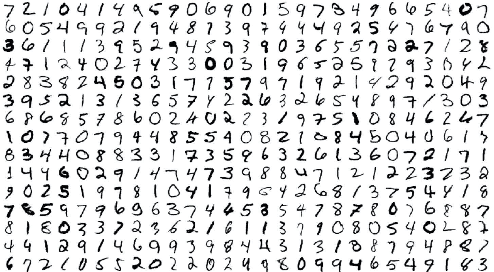
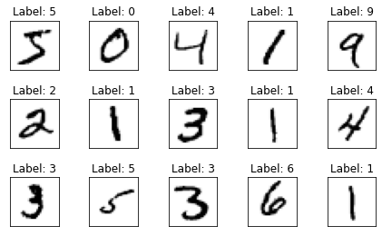
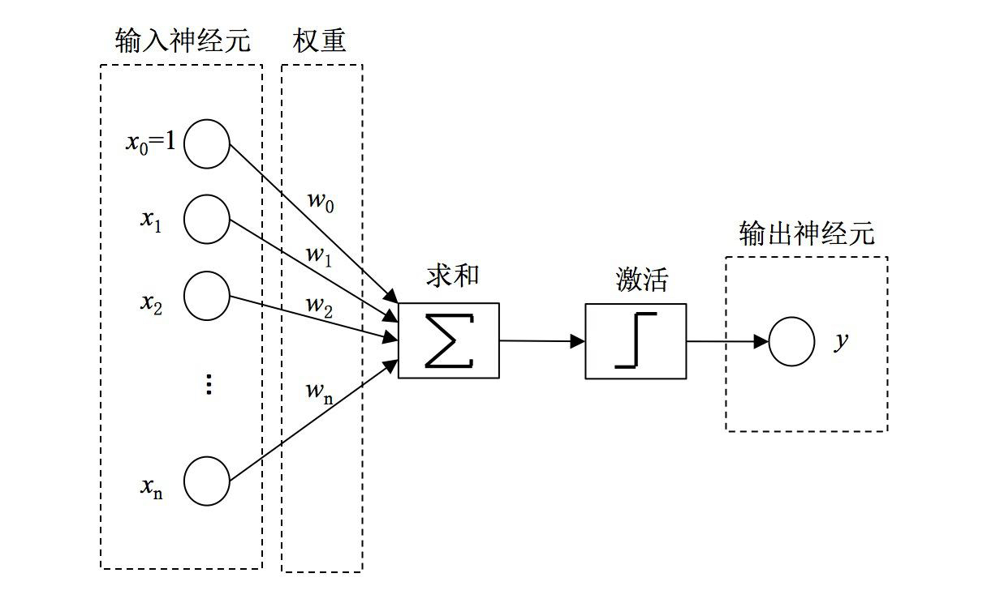
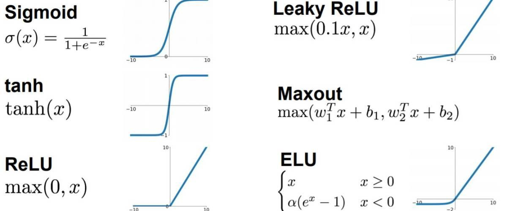
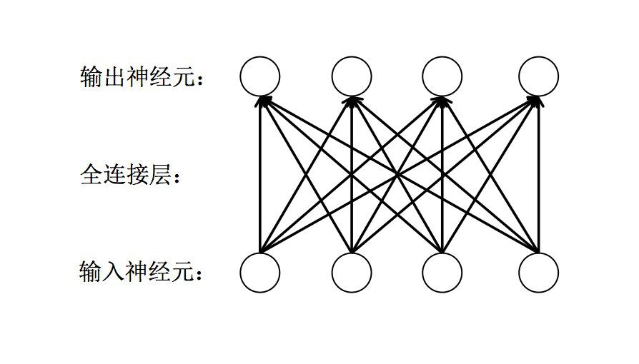
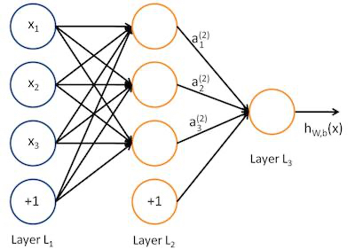
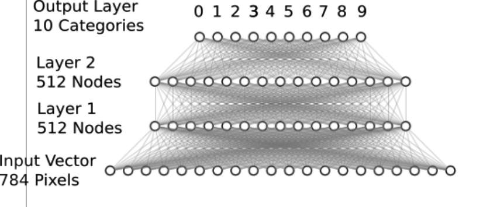

# Keras实战之手写数字识别

在之前的实战章节中，我们学会了如何使用 tensorflow 自身提供的 API 去实现一个房价预测的模型。

但是，这个模型是一个非常简单的线性回归，并不能算作深度学习。

而在本节中，我们将以一个类似于深度学习的 `hello world` 示例来演示如何使用 Tensorflow 的 High Level API **Keras** 来实现一个
用于自动识别手写数字的模型。

## MNIST 数据集简介

MNIST 是一套手写体数字的图像数据集，包含 60000 个训练样本和 10000 个测试样本，由纽约大学的 Yann LeCun 等人维护。



MNIST 图像数据集使用形如［28，28］的二阶数组来表示每个手写体数字，数组中的每个元素对应一个像素点，
即每张图像大小固定为 28x28 像素。

MNIST 数据集中的图像都是256阶灰度图，即灰度值 0 表示白色（背景），255 表示 黑色（前景），
使用取值为［0，255］的uint8数据类型表示图像。

### 下载 mnist 数据集

Keras 提供了一个 datasets 的模块，其中包括了各个常用的开放数据集。因此，我们可以直接使用 `keras.datasets` 来下载 mnist 数据集。

```python
from keras.datasets import mnist

(x_train, y_train), (x_test, y_test) = mnist.load_data('mnist/mnist.npz')

print(x_train.shape, y_train.shape)
print(x_test.shape, y_test.shape)

# (60000, 28, 28) (60000,)
# (10000, 28, 28) (10000,)
```

其中， `load_data` 函数接收一个参数 `path` 表示数据集下载后存放的地址。
需要注意的是，该地址是一个相对目录，实际存放数据集的绝对目录为: `~/.keras/datasets/$path` 。

我们可以将下载的部分数据进行可视化显示:

```python
import matplotlib.pyplot as plt

fig = plt.figure()
for i in range(15):
    plt.subplot(3,5,i+1) # 绘制前15个手写体数字，以3行5列子图形式展示
    plt.tight_layout() # 自动适配子图尺寸
    plt.imshow(x_train[i], cmap='Greys') # 使用灰色显示像素灰度值
    plt.title("Label: {}".format(y_train[i])) # 设置标签为子图标题
    plt.xticks([]) # 删除x轴标记
    plt.yticks([]) # 删除y轴标记
```




## Softmax 网络介绍

### Perceptron

1957 年，Frank Rosenblatt 发明了神经感知机模型 **Perceptron** 。 其模型结构如下所示：



可以看到，在该模型中，在对输入参数加权求和之后，加入了一个激活函数，即
当加权求和值大于某个阈值时，输出为1，否则，输出为0。

这一模型常常用于解决一些二分类的问题。

而随着时代的发展，人们发现 Perceptron 中由于仅有权重参数，能够解决的问题非常有限。

### ANN

因此，人们又提出了 人工神经网络（ANN）。

人工神经网络是多层神经元之间的连接，上一层的神经元输出可以作为下一层的神经元输出，从输入数据到输出数据之间，中间可能会包含多层神经元，如下所示：


### 激活函数

但是，尽管神经网络的层数不断变高，但是，由于每一层都是线性关系，因此最终组合后的结果仍然只能完成线性分割的任务。

而为了解决一些线性不可分的问题，人们又提出了 **激活函数** 的概念，通过激活函数来实现非线性问题的分割。

激活函数都采用非线性函数，常用的有Sigmoid、tanh、ReLU等。



其中，最常用的应该就是 `ReLU` 激活函数了，再后续的示例中我们也会用到相关内容。

### 全连接层

全连接层是一种对输入数据直接做线性变换的线性计算层。

它是神经网络中最常用的一种层，用于学习输出数据和输入数据之间的变换关系。

 - 全连接层可作为特征提取层使用，在学习特征的同时实现特征融合；
 - 全连接层也可作为最终的分类层使用，其输出神经元的值代表了每个输出类别的概率。




### 前向传播

在多层神经网络的评估过程中，首先会进行前向传播来计算输出。

以下图为例:



其中:

 - $$L$$ 表示网络层数，$$w$$ 和 $$b$$ 为模型参数，$$X$$ 为输入数据。
 - $$x_i$$ 表示第 $$i$$ 个神经元的输入。
 - $$a_{i}^{(l)}$$ 表示第 $$l$$ 层的第 $$i$$ 个神经元的输出。
 - $$w_{ij}^{(l)}$$ 表示第 $$l$$ 层的第 $$j$$ 个神经元 到 第 $$l+1$$ 层的第 $$i$$ 个神经元的权重。
 - $$b_{i}^{(l)}$$ 表示第 $$l$$ 层的第 $$i$$ 个神经元的偏置。
 - $$h_{w,b}(X)$$ 表示神经网络的输出数据。


根据上述的符号表示，前向传播的计算公式如下：

$$
a_{i}^{(l)} = f( \sum_{j=1}^{n} w_{j}^{(l-1)}a^{(l-1)} + b^{(l-1)})
$$

其中: $$f$$ 表示激活函数。

### 反向传播

BP 算法的基本思想就是通过损失函数对模型中的各个参数进行求导，
并据复合函数求导常用的“链式法则”将不同层的模型参数的梯度联系起来，使得计算所有模型参数的梯度更简单。

BP算法的思想早在 1960 年就被提出来了。
直到1986年， David Rumelhart 和 Geoffrey Hinton 等人发表了一篇后来成为经典的论文，清晰地描述了BP算法的框架，才使得BP算法真正流行起来，并带来了神经网络在80年代的辉煌。


### Softmax 网络

softmax 也是一种激活函数，非常适合用于多分类问题的输出层。

softmax 将多个神经元的输出，映射到（0,1）区间内，可以看成是当前输出是属于各个分类的概率。
其中，所有分类的概率之和为1，而 softmax 会找出所有分类概率中概率值最大的结果作为输出结果，从而来解决多分类问题。

假设有一个数组 $$v$$ ， $$v_i$$ 为数据中的第 $$i$$ 个元素。那么，$$v_i$$ 元素进行 softmax 激活函数后得到的结果如下：

$$
S_i = \frac{e^{v_i}}{\sum_j e^{v_j}}
$$

因此，我们可以通过两层全连接层 + 最终的 Softmax 激活函数得到一个如下的神经网络模型:



可以看到，输入的数据是将 28 * 28 的图像展开后为 784 长度的输入，接着加入了两层全连接层，最后通过 softmax 层进行输出。

## 利用 Softmax 实现手写数字识别的模型

上述内容讲述了通过全连接层 + softmax 激活函数实现的多分类模型的基础知识，接下来，我们来看看如何用代码来实现它。

下面，我们用以 tensorflow 的 High Level API 为例进行示范:

```python
# 加载 MNIST 数据集
from keras.datasets import mnist
from keras.utils import np_utils
from keras.models import Sequential
from keras.layers.core import Dense, Activation


(x_train, y_train), (x_test, y_test) = mnist.load_data('mnist/mnist.npz')

# 数据预处理 与 归一化

# 数据展开
X_train = x_train.reshape(60000, 784)  
X_test = x_test.reshape(10000, 784)

# 将数据类型转换为float32
X_train = X_train.astype('float32')
X_test = X_test.astype('float32')

# 数据归一化
X_train /= 255
X_test /= 255

# one-hot 转化
n_classes = 10
print("Shape before one-hot encoding: ", y_train.shape)
Y_train = np_utils.to_categorical(y_train, n_classes)  # 对标记数据进行 one-hot 转化
print("Shape after one-hot encoding: ", Y_train.shape)
Y_test = np_utils.to_categorical(y_test, n_classes)

# 定义神经网络
model = Sequential()
model.add(Dense(512, input_shape=(784,)))
model.add(Activation('relu'))                            

model.add(Dense(512))
model.add(Activation('relu'))

model.add(Dense(10))
model.add(Activation('softmax'))

# 编译模型
model.compile(loss='categorical_crossentropy', metrics=['accuracy'], optimizer='adam')

# 训练模型
history = model.fit(X_train,
                    Y_train,
                    batch_size=128,
                    epochs=5,
                    verbose=2,
                    validation_data=(X_test, Y_test))
```

感受一下？ Keras API 是不是非常的便捷？仅仅数十行代码就可以实现一个完整的神经网络的模型训练。

经过训练，可以看到，我们的模型在训练集上的准确率大约可以到 99% ，在测试集上的准确率也能够达到 97% 以上。

## CNN 网络介绍

CNN模型是一种以卷积为核心的前馈神经网络模型。

20世纪60年代，Hubel和Wiesel在研究猫脑皮层中用于局部敏感和方向选择的神经元时发现其独特的网络结构可以有效地降低反馈神经网络的复杂性，
继而提出了卷积神经网络（Convolutional Neural Networks，简称CNN）。


## 利用 CNN 实现手写数字识别的模型


