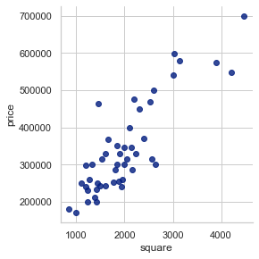

# tensorflow初体验之房价预测

了解了 tensorflow 的基本概念后，接下来，我们将以一个 房价预测 的案例为例，演示 tensorflow 的基本功能使用。

## 背景知识说明

开始正式进入 Tensorflow 实战之前，我们还需要了解一些机器学习相关的背景知识。

### 监督学习（supervised learning）

监督学习是机器学习的方法之一，它是指从训练数据（输入和预期输出）中学到的一个模型（函数），并且可以根据模型推断出新实例的方法。

其中，函数的输出既可以是一个连续值（如回归分析）或一个离散值/类别标签（如分类问题）。


上图表示了一个监督学习的基本流程。

典型的监督学习算法非常多，例如：

 - 线性回归（Linear Regression）
 - 逻辑回归（Logistic Regression）
 - 决策树（Decision Tree）
 - 随机森林（Random Forest）
 - 最近邻算法（k-NN）
 - 朴素贝叶斯（Naive Bayes）
 - 支持向量机（SVM）
 - 感知器（Perceptron）
 - 深度神经网络（DNN）


### 线性回归与梯度下降法

线性回归可以说是监督学习中最简单的算法了，下面我们来对线性回归进行分析。

在统计学中，线性回归是指 **利用线性回归方程的最小二乘函数对一个或多个自变量和因变量之间的关系进行建模的一种回归分析** 。

这种函数是一个或多个称为回归系数的模型参数的线性组合。

以 单变量线性回归 为例，如果一个模型是线性关系的，那么它可以表示如下：

$$
y = wx + b
$$

那么，我们也就可以假设函数如下：

$$
h_\theta(x) = \theta(x)_0 + \theta(x)_{1}x_1 = \theta(x)_{0}x_0 + \theta(x)_{1}x_1 = \theta(x)^Tx  (x_0=1)
$$

其中，$$\theta$$ 就是我们假设的函数参数。

而假设函数和理想模型的损失值（误差）就是：

$$
loss = y - h_{\theta}(x)
$$

因此，我们想要做的就是从一组样本 $$(x_i, y_i)$$ 中找出误差最小的 $$\theta$$ 值。
此时，我们可以使用最小二乘法，即它的优化目标为最小化残差平方和：

$$
J(\theta) = \frac{1}{n} \sum_{i=1}^{n} (h_{\theta}(x_i) - y_i)^2
$$

而梯度迭代法就是指在优化目标函数的每一轮迭代中，都按照模型参数 $$\theta$$ 的梯度方向进行变更，即表达式如下：

$$
\theta_j := \theta_j - \alpha \frac{\partial}{\partial\theta_j} J(\theta)
$$

代入 $$J(\theta)$$ 进行求导，得到的结果如下：

$$
\theta_j := \theta_j - 2\alpha \frac{1}{n} \sum_{i=1}^{n} (h_{\theta}(x_i) - y_i) (x_i)
$$

下面，我们来看一下 **多变量** 线性回归的场景：

多变量线性回归可以表示如下：

$$
y = w_{0} + w_{1}x_{1} + w_{2}x_{2} = W^{T}X
$$

那么，我们也就可以假设函数如下：

$$
h_\theta(X) = \theta_0(x_0) + \theta_1(x_1) + \theta_2(x_2) = \theta(x)^{T}X      (x_0=1)
$$

其中，$$\theta$$ 就是我们假设的函数参数。

而假设函数和理想模型的损失值（误差）就是：

$$
loss = y - h_{\theta}(X)
$$

同样可以使用最小二乘法，即它的优化目标为最小化残差平方和：

$$
J(\theta) = (h_\theta(X) - y)^T(h_\theta(X) - y)
$$


## 问题描述

下面，我们来以单变量房价预测问题为例，即根据房屋面试 $$x$$ 来预测销售价格 $$y$$ 。

示例的训练数据如下：

|面积（平方英尺）|价格（美元）|
|-------------|----------|
|2104|399900|
|1600|329900|
|2400|369000|
|1416|232000|
|3000|539900|
|1985|299900|
|1534|314900|
|1427|198999|
|1380|212000|
|1494|242500|
|1940|239999|
|2000|347000|
|1890|329999|
|4478|699900|
|1268|259900|
|....|......|

此外，我们来考虑一下当房价预测问题为多变量预测问题时，输入的数据会是什么样？
假设给定的输入数据中包含房屋面积 $$x_1$$ 和 卧室数量 $$x_2$$，来预测其房屋价格：

示例的训练数据如下：

|面积（平方英尺）|卧室数量（个）|价格（美元）|
|-------------|----------|-----------|
|2104|3|399900|
|1600|3|329900|
|2400|3|369000|
|1416|2|232000|
|3000|4|539900|
|1985|4|299900|
|1534|3|314900|
|1427|3|198999|
|1380|3|212000|
|1494|3|242500|
|1940|4|239999|
|2000|3|347000|
|1890|3|329999|
|4478|5|699900|
|1268|3|259900|
|....|......|


了解了想要解决的问题之后，我们就要看如何一步步的解决问题了。

使用 Tensorflow 训练模型的整体工作流如下图所示：

1. 数据读入
2. 数据分析
3. 数据预处理（数据规范化）
4. 创建模型（数据流图）
5. 创建会话（运行环境）
6. 训练模型


下面，我们来依次学习如下步骤。

## 数据读入

首先是数据读入，对于机器学习中的数据，常常是使用 csv 文件的方式进行存储，而我们想要做的其实就是从 csv 中读取文件。

在 Python 的大量第三方库中，其实有很多库都可以操作 csv 文件，而在此处，我们将会使用的是一个 `pandas` 的库。

熟悉机器学习的同学应该对 `pandas` 库并不会太陌生。它是一个基于 BSD 开源协议许可的软件库，
面向 Python 用户的高性能和易于上手的数据结构化和数据分析的工具。

在 pandas 中， DataFrame 是其最核心的数据存储对象。
具体来说，DataFrame 是一个二维带标记的数据结构，每一列的数据类型可以不同，我们常常可以用它来当做电子表格或数据库表。


而使用 `pandas` 来读取 csv 文件的内容非常简单，简单到只需要一行代码就能将 excel 数据转换为 dataframe 对象：

```python
import pandas as pd
# 读取指定 csv 文件，并为每一列设置列名
df0 = pd.read_csv('data0.csv', names=['square', 'price'])
# 打印 dataframe 的前五行
df0.head()
```


## 数据预处理与可视化

当我们将 csv 数据读入后，常常会简单的对数据进行一定的分析，如数据分布情况等。而数据分析的最佳方式之一就是数据可视化了。

接下来，我们来看一下如何进行数据的可视化。

Python 中关于数据可视化提供了如下相关的第三方库：

1. matplotlib: 它是一个 Python 的 2D 绘图库，可以生成高质量的图片并支持各种存储格式，同时能够广泛支持多个运行平台，
   如 Python 脚本、 IPython Shell 和 Jupyter Notebook.
2. seaborn: 它是一个基于 matplotlib 的 High Level 的 Python 数据可视化库，提供了更加易用的高级接口，用于绘制
   精美且信息丰富的统计图形。
3. mpl_toolkits.mplot3d: 它是一个基础的 3D 绘图工具集，也是 matplotlib 的一部分。


其数据可视化数据如下，横轴表示房屋面积，纵轴表示房屋价格：




我们想要做

## 模型训练


