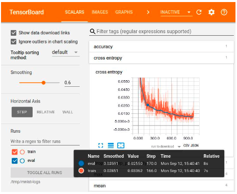
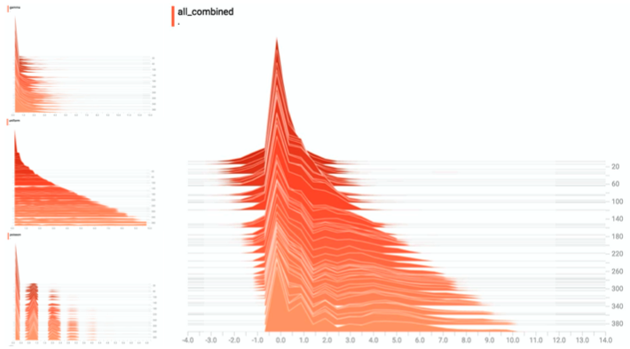
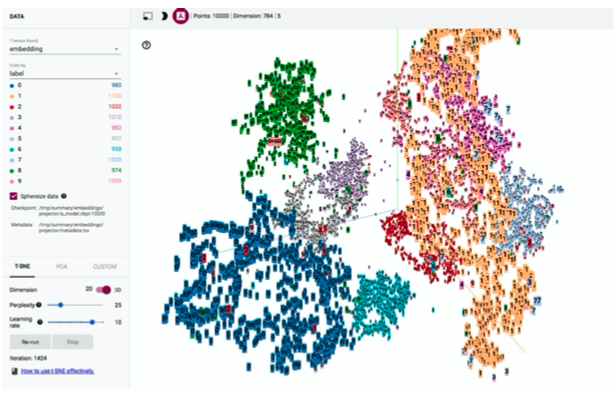
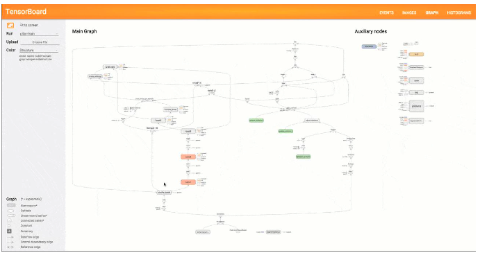
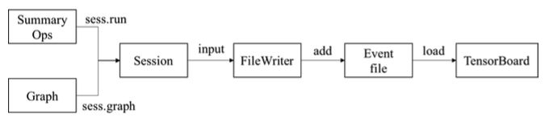
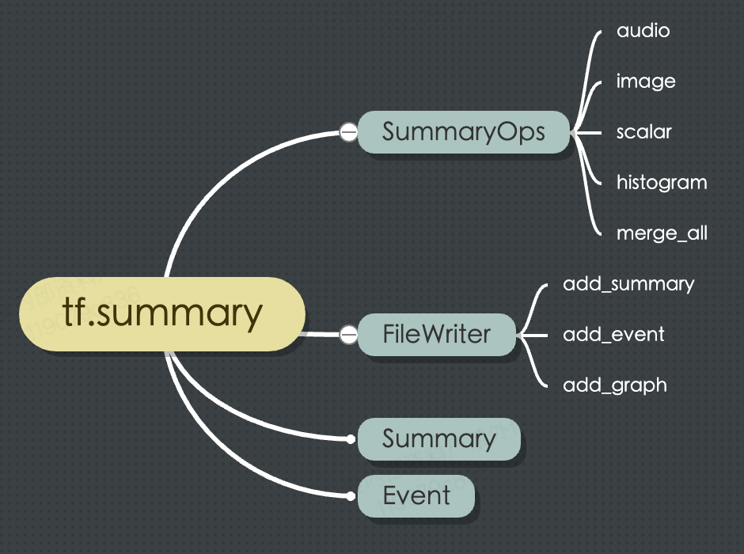
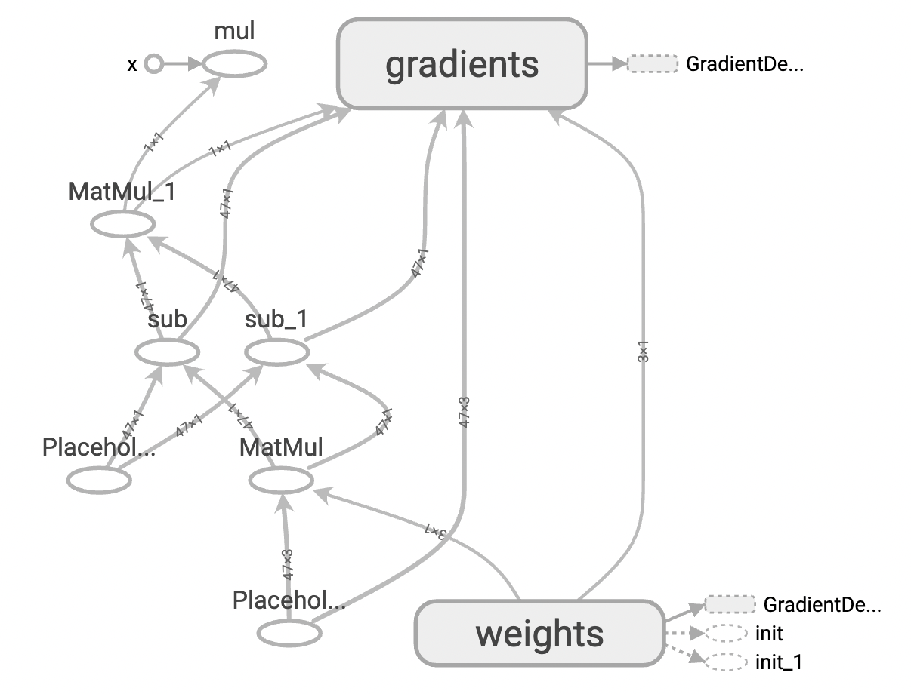
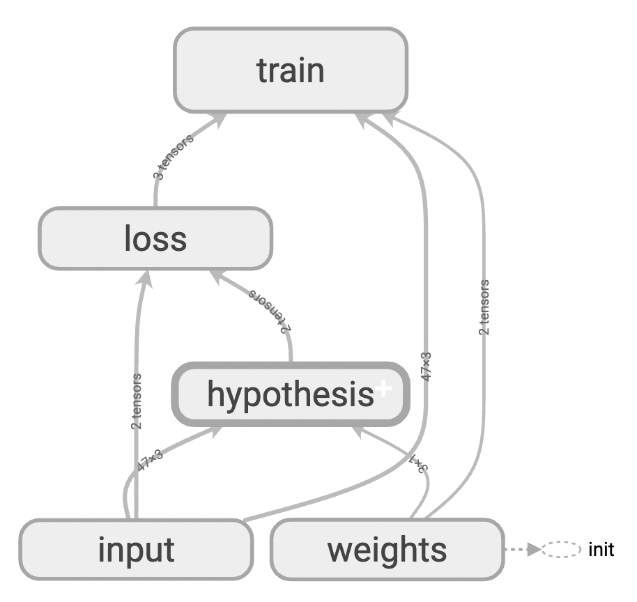

# TensorBoard 快速入门

为了能够在 Tensorflow 的使用过程中有更好的体验，Tensorflow 还提供了一个重要的可视化工具: **TensorBoard** 。

## TensorBoard 的使用场景

TensorBoard 的使用场景非常广泛：

 - 在数据处理的过程中，可视化地直观的查看数据集分布情况。
 - 在模型设计的过程中，分析和检查数据流图的实现是否正确。
 - 在模型训练的过程中，关注模型参数和超参数的变化趋势。
 - 在模型测试的过程中，查看准确率和召回率等评估指标。


而 TensorBoard 正是这样一个可以通过图形的可视化展示来有效辅助机器学习程序的开发者和使用者理解算法模型及
工作流程，提升模型开发工具的一大利器。

### 模型训练过程中的可视化



### 统计数据的可视化



### 数据集的可视化



### 数据流图的可视化



## TensorBoard 使用流程

TensorBoard 本质上可视化的内容实际是数据流图和张量，它们需要在会话中加载或者执行操作后才能获取。
然后，用户需要利用 `FileWriter` 实例将这些数据写入事件文件中。

此时，我们就可以启动 TensorBoard 程序，来加载事件文件中的序列化数据，从而在各个面板中展示对应的可视化对象。

其整体使用流程图如下所示：



上述内容中提到的 `FileWriter` 实例和汇总操作（Summary Ops）均属于 `tf.summary` 模块。
其主要功能是获取和输出模型相关的序列化数据，它是 TensorBoard 整个使用流程的中核心内容。

`tf.summary` 模块的核心部分由一组操作以及 `FileWriter` 、 `Summary` 和 `Event` 三个类组成。




## TensorBoard 数据流图的可视化

接下来，我们先来看一下如何进行数据流图的可视化。

我们仍然基于房价预测一节中的代码为例，在 Session 计算中增加如下两行代码：

```python
with tf.Session() as sess:
    # 初始化全局变量
    sess.run(tf.global_variables_initializer())
    # 创建FileWriter实例，并传入当前会话加载的数据流图
    writer = tf.summary.FileWriter('./summary/linear-regression-1', sess.graph)
    # 开始训练模型
    # 因为训练集较小，所以每轮都使用全量数据训练
    for e in range(1, epoch + 1):
        sess.run(train_op, feed_dict={X: X_data, y: y_data})
        if e % 10 == 0:
            loss, w = sess.run([loss_op, W], feed_dict={X: X_data, y: y_data})
            log_str = "Epoch %d \t Loss=%.4g \t Model: y = %.4gx1 + %.4gx2 + %.4g"
            print(log_str % (e, loss, w[1], w[2], w[0]))

# 关闭FileWriter的输出流
writer.close()
```

即我们在 session 内部，创建了一个 `FileWriter` 对象，并进行了保存。 此时，我们就已经将对应的数据流图保存到了一组events文件中了。

接下来，我们再次进入 `summary` 目录下，启动 TensorBoard :

```shell
tensorboard --logdir=./  --host=localhost
```

此时，使用浏览器打开 `http://localhost:6006/` ，你就可以看到刚才保存的数据流图了。



但是你应该会发现，这个数据流图实在是有点儿乱，并不方便我们理解和分析。

接下来，我们来看看如何能够让数据流图更加的有条理。

为了使得数据流图能够更加条理，我们需要为变量进行分组并设置抽象作用域，修改数据流图的定义代码如下：

```
import tensorflow as tf

alpha = 0.01 # 学习率 alpha
epoch = 500 # 训练全量数据集的轮数

with tf.name_scope('input'):
    # 输入 X，形状[47, 3]
    X = tf.placeholder(tf.float32, X_data.shape, name='X')
    # 输出 y，形状[47, 1]
    y = tf.placeholder(tf.float32, y_data.shape, name='y')

with tf.name_scope('hypothesis'):
    # 权重变量 W，形状[3,1]
    W = tf.get_variable("weights",
                        (X_data.shape[1], 1),
                        initializer=tf.constant_initializer())
    # 假设函数 h(x) = w0*x0+w1*x1+w2*x2, 其中x0恒为1
    # 推理值 y_pred  形状[47,1]
    y_pred = tf.matmul(X, W, name='y_pred')

with tf.name_scope('loss'):
    # 损失函数采用最小二乘法，y_pred - y 是形如[47, 1]的向量。
    # tf.matmul(a,b,transpose_a=True) 表示：矩阵a的转置乘矩阵b，即 [1,47] X [47,1]
    # 损失函数操作 loss
    loss_op = 1 / (2 * len(X_data)) * tf.matmul((y_pred - y), (y_pred - y), transpose_a=True)
with tf.name_scope('train'):
    # 随机梯度下降优化器 opt
    train_op = tf.train.GradientDescentOptimizer(learning_rate=alpha).minimize(loss_op)
```

重新运行并生成新的 events 文件后，再次打开 tensorboard。

这次你将会看到一个如下的数据流图：



嗯，果然，此时的数据流图已经变的清晰了很多。此外，如果想要分析每个组件内部的具体细节逻辑，双击节点即可展开其内部细节，
快来体验吧~
