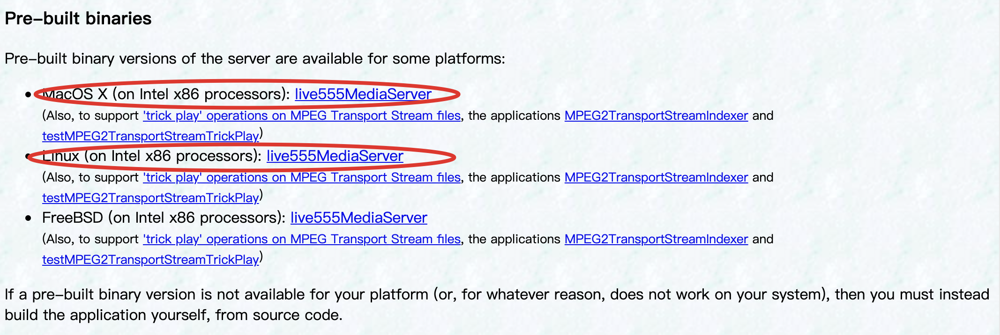
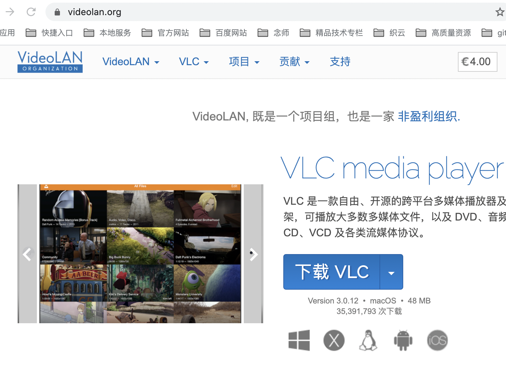
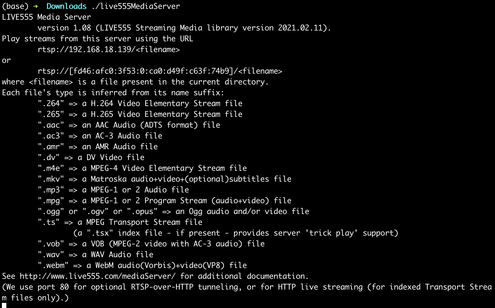
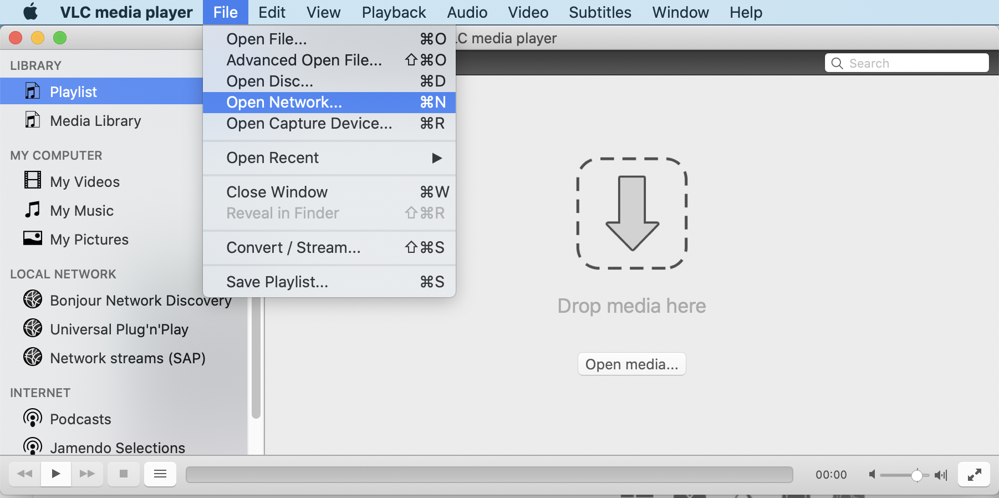
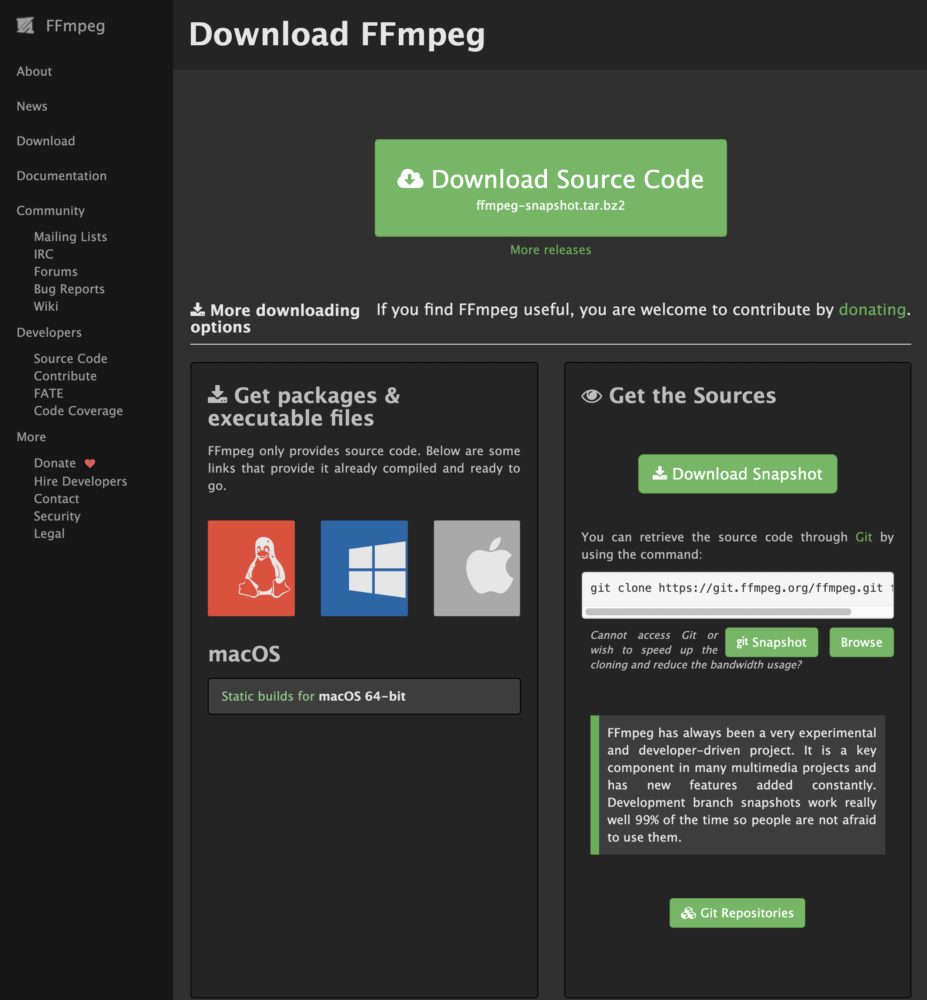

# rtsp协议杂谈与实战

## rtsp协议概述

RTSP（Real Time Streaming Protocol），RFC2326，实时流传输协议，是TCP/IP协议体系中的一个 **应用层协议** ，由哥伦比亚大学、网景和RealNetworks公司提交的IETF RFC标准。

该协议定义了一对多应用程序如何有效地通过IP网络传送多媒体数据。

RTSP在体系结构上位于RTP和RTCP之上，它使用TCP或UDP完成数据传输。

HTTP与RTSP相比，HTTP请求由客户机发出，服务器作出响应；使用RTSP时，客户机和服务器都可以发出请求，即RTSP可以是双向的。

RTSP是用来控制声音或影像的多媒体串流协议，并允许同时多个串流需求控制，传输时所用的网络通讯协定并不在其定义的范围内，服务器端可以自行选择使用TCP或UDP来传送串流内容，它的语法和运作跟HTTP 1.1类似，但并不特别强调时间同步，所以比较能容忍网络延迟。

而前面提到的允许同时多个串流需求控制（Multicast），除了可以降低服务器端的网络用量，更进而支持多方视讯会议（Video Conference）。

因为与HTTP1.1的运作方式相似，所以代理服务器〈Proxy〉的快取功能〈Cache〉也同样适用于RTSP，并因RTSP具有重新导向功能，可视实际负载情况来转换提供服务的服务器，以避免过大的负载集中于同一服务器而造成延迟。


## rtsp服务器搭建（live555）

live555是一个为流媒体提供解决方案的跨平台的C++开源项目，它实现了标准流媒体传输，是一个为流媒体提供解决方案的跨平台的C++开源项目，它实现了对标准流媒体传输协议如RTP/RTCP、RTSP、SIP等的支持。

Live555实现了对多种音视频编码格式的音视频数据的流化、接收和处理等支持，包括MPEG、H.263+ 、DV、JPEG视频和多种音频编码。

同时由于良好的设计，Live555非常容易扩展对其他格式的支持。

Live555已经被用于多款播放器的流媒体播放功能的实现，如VLC(VideoLan)、MPlayer。

因此，通过live555，我们就可以搭建一个rtsp的服务器。

live555可以在 [此处](http://www.live555.com/mediaServer/) 进行下载。



下载完成后，我们需要给 live555MediaServer 增加可执行权限。

```shell
chmod a+x live555MediaServer
```

## rtsp初体验之播放rtsp流

### 环境准备

除了上述通过 live555 搭建的rtsp server之外，我们还需要做如下准备：

1. 准备一个mp4的视频文件用于验证
2. 下载 [VLC media player](https://videolan.org) 用于播放rtsp视频流。



### 把mp4文件转化为ts文件

mp4是一种常见的视频格式，但是无法直接被live555MediaServer使用，因此，我们需要将mp4文件转化为ts文件。

我们可以通过 [convertio](https://convertio.co/mp4-ts/) 网站进行视频文件在线转换。

我们将转换后的ts文件放在live555MediaServer的同级目录下。

### 启动live555MediaServer

```shell
./live555MediaServer
```



此时，我们可以看到rtsp中打印出服务启动的rstp的地址: rtsp://192.168.18.139/<filename>。

### 使用VLC media player播放rtsp视频流

打开 VLC media player 软件，选择 File -> Open Network... 。



在地址栏中输入刚才得到的rtsp地址 + 文件名称，Open即可。

此时，VLC media player预期就可以正常的播放视频喽~

## rtsp初体验之推送rtsp流

### 环境准备

1. 准备一个mp4的视频文件用于验证
2. 安装ffmpeg命令行工具。
3. 安装VLC media player软件。

其中，ffmpeg命令行工具可以去 [官方网站](https://ffmpeg.org/download.html) 下载。



### 拉取rtsp服务镜像

```shell
docker pull gemfield/zlmediakit:20.04-runtime-ubuntu18.04
```

启动rtsp镜像容器：

```shell
docker run -id -p 1935:1935  -p 554:554  -p 8080:80 gemfield/zlmediakit:20.04-runtime-ubuntu18.04
```

### 使用 ffmpeg 推送rtsp视频流

先来看一下ffmpeg的一个基本命令：

```shell
./ffmpeg -i ${input_video} -f flv rtmp://${server}/live/${streamName}
```

其中：

1. -i：表示输入视频文件，后跟视频文件路径/URL。
2. -f：强制ffmpeg采用某种格式，后跟对应的格式。
3. 最后输入的表示推送到 rtmps服务器的地址。

例如：

```shell
./ffmpeg -re -i SampleVideo_1280x720_20mb.mp4 -vcodec h264 -acodec aac -strict -2 -f rtsp -rtsp_transport tcp rtsp://127.0.0.1/live/test1
```

其中:

1. SampleVideo_1280x720_20mb.mp4 是我们提前准备好的mp4文件
2. -re 表示以本地帧频读数据，主要用于模拟捕获设备
3. -i SampleVideo_1280x720_20mb.mp4 表示指定本地文件
4. -vcodec h264 设置视频编码为h264编码
5. -acodec aac  设置音频编码为aac
6. -strict -2   设置strictness跟标准的严格性
7. -f rtsp  强制ffmpeg输出为rtsp流。
8. -rtsp_transport tcp  设置rtsp底层协议为tcp协议
9. rtsp://127.0.0.1/live/test1 是rtsp服务器推流的地址，其中 /live/test1 为自定义地址。

最后，我们再次使用 VLC media player 播放rtsp视频流，同样还是Open Network，只需要在地址兰总输入刚才的推流地址即可。
