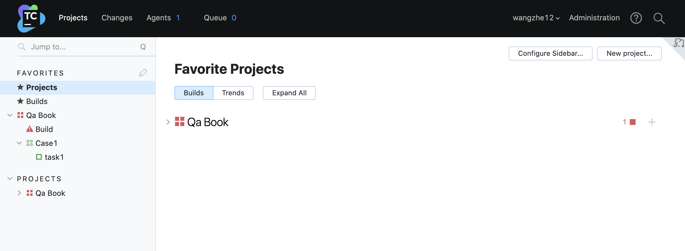

# TeamCity 的安装

TeamCity 的安装非常简单，下面，我们将会以不同的操作系统为例来演示如何进行安装。

## MacOS 下安装 TeamCity

首先，我们以 MacOS 系统为例，来演示如何快速搭建 TeamCity 并用于相关的学习和验证。

其中，需要说明的是，TeamCity 分为服务端和Agent端，而在演示学习环境中，我们会同时在一台机器中安装服务端和Agent端。
如果是生产环境，则不建议如此使用。

Step1: 前置工作: 安装 JDK 并配置 JAVA_HOME 环境变量。

Step2: 下载 TeamCity 安装包， [下载地址](https://www.jetbrains.com/teamcity/download/#section=on-premises) 。

Step3: 解压 TeamCity 安装包。

```shell
tar -zxvf TeamCity<version number>.tar.gz
```

Step4: 启动 TeamCity 服务

```shell
./bin/runAll.sh start
```

默认情况下，TeamCity 启动后会绑定本地 8111 端口，即 http://localhost:8111/ 。


