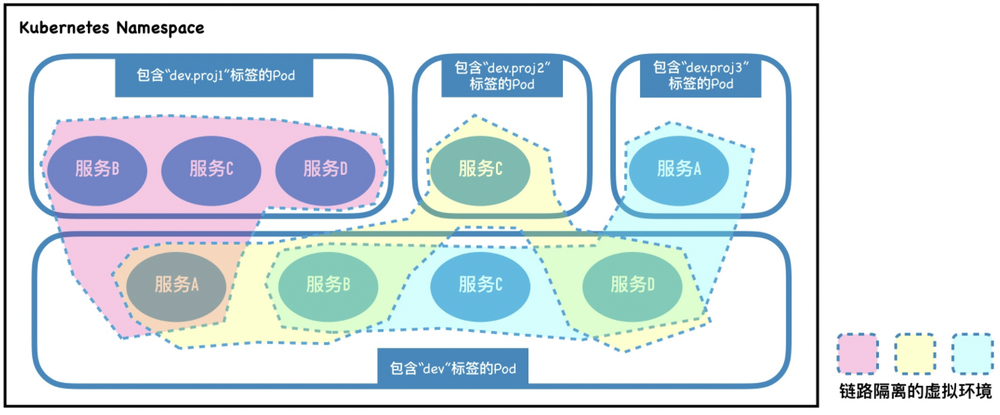

# KT-env实战

KtEnv 是一种基于ServiceMesh的微服务环境复用工具，源于阿里内部的“项目环境”实践。

通过识别Pod上的虚拟环境标签，KtEnv能够自动将测试环境网络动态隔离成多个虚拟隔离域，
同时以简单规则在隔离域间局部复用Pod实例，
从而达到只需很少资源成本即可创建大量不同微服务版本组合的独立测试环境的目的。

在本系列文章中，我们将会详细介绍 KT-env 的原理，使用，源码实现等等。

希望通过本系列的文章，可以让你熟练掌握 KT-env 相关的使用。
