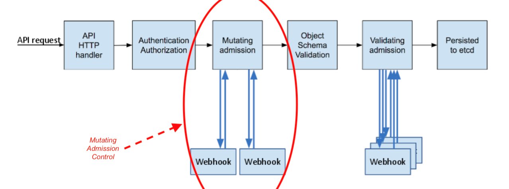

# KT-env源码解读

了解了 KT-env 的基本功能、原理和使用之后，我们最后再来了解一下 KT-env 相关的源码实现。

KT-env 的源码仓库地址: [virtual-environment](https://github.com/alibaba/virtual-environment)

其中，我们先来了解一下它们的目录结构和功能：

 - cmd: 二进制程序的入口文件 - 核心目录。
 - pkg: 相关功能模块的封装模块 - 核心目录。
 - version: 版本信息。
 - build: 编译脚本。
 - deploy: 部署脚本。
 - docs: 文档。
 - examples: 示例相关代码。
 - sdk: 透传 headers 相关的SDK。

其中，核心的源码目录是 cmd 和 pkg 两个目录。

查看 cmd 目录下的内容，可以很容易的看出，它一共涉及到三个二进制可执行程序，分别是 `operator`，`inspector` 和 `webhook`。

其中，`inspector` 的功能非常简单，就是一个 HTTP 客户端，可以调用 operator 的接口查询 operator 模块的版本信息、状态以及修改日志级别，不再赘述。

我们重点来分析 `operator` 和 `webhook` 两个程序的功能。

## operator


## webhook

在 KT-env 中包含了一个全局的**Mutating Admission Webhook组件**，
它的主要作用是将Pod上的环境标信息通过环境变量注入到Sidecar容器里，便于Sidecar为出口流量的Header添加恰当的环境标。

那么什么是 **Mutating Admission Webhook** 呢？这是 K8s 中的一个特有的概念，我们先来了解一下。

Admission webhook 是一种用于接收准入请求并对其进行处理的 HTTP 回调机制。
K8s 中可以定义两种类型的 admission webhook，即 validating admission webhook 和 mutating admission webhook。
其中，Mutating admission webhook 会先被调用。
它们可以更改发送到 API 服务器的对象以执行自定义的设置默认值操作。

K8s的具体的处理流程如下图所示：



而 Kt-env 中的 Webhook 其实就是这么一个组件，它主要用于将Pod上的环境标信息通过环境变量注入到Sidecar容器里，
即在 Webhook 阶段，修改了 Sidecar 的配置，向其中设置了对应的环境变量。

了解了 webhook 的原理之后，我们就来看一下 KT-env 中的 webhook 是如何实现的吧。

首先，我们先来简单看一下 Webhook 对应的 yaml 配置文件：

```yaml
apiVersion: admissionregistration.k8s.io/v1beta1
kind: MutatingWebhookConfiguration
metadata:
  name: virtual-environment-webhook
webhooks:
  - name: webhook-server.kt-virtual-environment.svc
    failurePolicy: Fail
    clientConfig:
      service:
        name: webhook-server
        namespace: kt-virtual-environment
        path: "/inject"
      caBundle: LS0tLS1CRUdJTiBDRVJUSUZJQ0FURS0tLS0tCk1JSURYVENDQWtXZ0F3SUJBZ0lVZG42TEl2bDNaV2ltbndEVGwxS3U3ODhKcDBrd0RRWUpLb1pJaHZjTkFRRUwKQlFBd1BqRThNRG9HQTFVRUF3d3pWbWx5ZEhWaGJDQkZiblpwY205dWJXVnVkQ0JCWkcxcGMzTnBiMjRnUTI5dQpkSEp2Ykd4bGNpQlhaV0pvYjI5cklFTkJNQjRYRFRJd01EZ3lOVEUxTURrMU5Wb1hEVE13TURneU16RTFNRGsxCk5Wb3dQakU4TURvR0ExVUVBd3d6Vm1seWRIVmhiQ0JGYm5acGNtOXViV1Z1ZENCQlpHMXBjM05wYjI0Z1EyOXUKZEhKdmJHeGxjaUJYWldKb2IyOXJJRU5CTUlJQklqQU5CZ2txaGtpRzl3MEJBUUVGQUFPQ0FROEFNSUlCQ2dLQwpBUUVBeDYrQkZIaXlkZk9uR3FMRmt4Y2lpL21ZMG9XU3dRV2krTHYwdmNqeklQTndKa2c0V0FJYTRWK0RqdTV2CmZ5NlE2RFhUaitlRnhlK212MmtVSEFtYjNsWS9iT3RaWGp2VnQ4bnBHS1VLdlBBN0hVRFdhUkZKOTR1eUJpQm8KQnlXTnZtTGNka0VFTjRVMVVGTlVIV3B1L1lHNXNaSC9ZQWZjZGEyMDhIUzVkQmllNTNYMmJjdjQrNGhzS3oyOAp0UUR2MmR3ZkxFT2crZ2lVUWRWRHUrN0lXUXpjRkp4NmdpdlBpVkl1UVRHVk04K0tya2dITlhXVjU4OGIwcTU1CnNPNjR2YWQ4cW5XT0t5bk5oSThyZzN0dGVJVkFHdkEvUnJGczFocytERHVBZlMxamhiRWUyUEJHSHVMeGx6TGIKNjR2NUV5VEhEdDVVOS93bFpxS0hMWlZQeFFJREFRQUJvMU13VVRBZEJnTlZIUTRFRmdRVVg1cEI4dkYzbnducQpUUjA1TlVhVlhaQzd4VjB3SHdZRFZSMGpCQmd3Rm9BVVg1cEI4dkYzbnducVRSMDVOVWFWWFpDN3hWMHdEd1lEClZSMFRBUUgvQkFVd0F3RUIvekFOQmdrcWhraUc5dzBCQVFzRkFBT0NBUUVBbFU0YkxNMGlzbm5KaDA1dCs3TDkKWkFtS2M1eXhGdkUremlsK2Y5aEUzdzJpYjI0bVNYTVpOSWEvUWd6akxGK0owQVlIbUxXZTRQa2I4eXliQnVjRQp6d2VRNEc5Y3U2QWV5VFRHTk9zbU5lREx4WGRVOUJ1aElvRmZsR2ZDV1pudHA5ajZsbnFJbndqdjZJWDBEQmc1CkFEbXRNdVVrS0gyMXdUTHhXNVBWSmhQWnZiL3p1ZGNlNUxWRG1zT0Z5cjFkK2lnVnZPVzJJam51QUw3eGpXWFQKenVGYng5NnZBYTJjS0hWRjYyVzdoekp6NURiN0cwdWxJMXptOTF0ZXJaZjRYSHlUT3FzUC8wczFsYjV1V1k5cAo2NUZiZCtHMXJOL2NBcUM4NXo0K1Rrc2QrdTV1ZDFVREc5MEsvRG9UdS9vcis3U3o2bWNWdjVBejlLSHVxRzE2CnlBPT0KLS0tLS1FTkQgQ0VSVElGSUNBVEUtLS0tLQo=
    rules:
      - operations: ["CREATE"]
        apiGroups: [""]
        apiVersions: ["v1"]
        resources: ["pods"]
    namespaceSelector:
      matchLabels:
        environment-tag-injection: enabled
```

上述配置文件表示针对:

 - 设置了 `environment-tag-injection: enabled` 的 namespace 下
 - Pod 资源对象在创建时
 - 会触发 Mutating Admission Webhook 调用
 - 调用的请求地址是 webhook-server.kt-virtual-environment.svc/inject


而具体的注入环境变量的逻辑则在 `webhook-server` 模块内，
其核心代码见 [main.go](https://github.com/alibaba/virtual-environment/blob/master/cmd/webhook/main.go) 。

我们选择其中部分的核心代码进行说明：

```go
envLabels := os.Getenv("envLabel")
if envLabels == "" {
    logger.Fatal("Cannot determine env label !!")
}
envLabelList := strings.Split(envLabels, ",")
envTag := ""
for _, label := range envLabelList {
    if value, ok := pod.Labels[label]; ok {
        envTag = value
        break
    }
}
```

从环境变量中读取 `envLabel` 的配置，并判断 Pod 上是否存在其中的某个 label，如果存在，则表示使用该 label 对应的 value 用于 headers 追加。

```go
var patches []PatchOperation
if envVarIndex < 0 {
    patches = append(patches, PatchOperation{
        Op:    "add",
        Path:  fmt.Sprintf("/spec/containers/%d/env/0", sidecarContainerIndex),
        Value: corev1.EnvVar{Name: envVarName, Value: envTag},
    })
} else {
    patches = append(patches, PatchOperation{
        Op:    "replace",
        Path:  fmt.Sprintf("/spec/containers/%d/env/%d/value", sidecarContainerIndex, envVarIndex),
        Value: envTag,
    })
}
```

表示根据之前的计算规则，生成 patch 操作，用于向 Pod 中追加/修改对应的环境变量，
其中，key 为 `VIRTUAL_ENVIRONMENT_TAG`，取值为之前步骤中从 Pod 上获取到的 label 对应的值。

通过上述步骤，就完成了将业务 Pod 上中指定的 Label 对应的值设置到 Sidecar 容器中的环境变量中了。

那么，Sidecar 中的环境变量是如何追加到发送请求的 header 中的呢？

这个其实是用到了 Istio 中的功能 `EnvoyFilter`。

如上文所示，在 `operator` 模块中，会创建 `EnvoyFilter`，在 `EnvoyFilter` 中，通过 `lua` 脚本，在出流量的阶段中，追加了 headers 信息。

示例 `EnvoyFilter` 配置如下:

```yaml
kind: EnvoyFilter
apiVersion: networking.istio.io/v1alpha3
metadata:
  name: demo-virtualenv
  namespace: kt-env1
  labels:
    envHeader: ali-env-mark
    envLabel: virtual-env
spec:
  workloadSelector: ~
  configPatches:
    - applyTo: HTTP_FILTER
      match:
        context: SIDECAR_OUTBOUND
        listener:
          filterChain:
            filter:
              name: envoy.http_connection_manager
      patch:
        operation: INSERT_BEFORE
        value:
          name: virtual.environment.lua
          typed_config:
            '@type': type.googleapis.com/envoy.config.filter.http.lua.v2.Lua
            inline_code: |-
              local curEnv = os.getenv("VIRTUAL_ENVIRONMENT_TAG")
              function envoy_on_request(req)
                local env = req:headers():get("ali-env-mark")
                if env == nil and curEnv ~= nil then
                  req:headers():add("ali-env-mark", curEnv)
                end
              end
```

其中，我们可以重点关注最下方的 lua 脚本，可以看出其基本的逻辑如下：
判断请求头部中是否包含 `ali-env-mark`，如果没有包含，
则从环境变量中取出 VIRTUAL_ENVIRONMENT_TAG 的值并设置为 `ali-env-mark` headers 的值。
