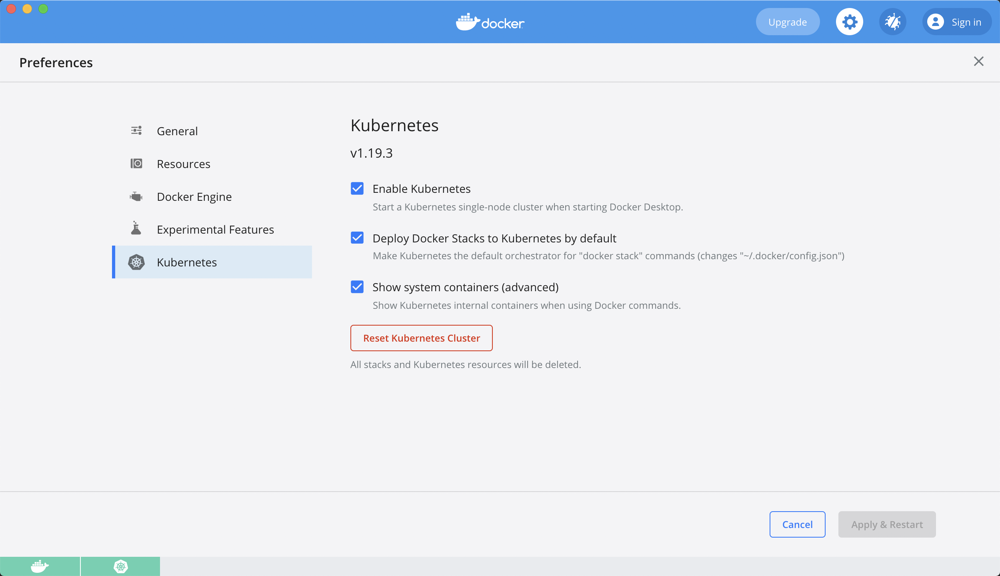

# Kubernetes环境搭建

在本文中，我们将会分别讲解在不同的平台下如何搭建 Kubernetes 环境。

## Mac 下 kubernetes 环境搭建

在 Mac 下，Docker Desktop 可以自带 Kubernetes 部署。

但是，由于国内的网络无法访问 kubernetes 镜像仓库，因此，我们需要从其他镜像仓库拉取镜像后重新修改镜像名称。

针对这一需求，Github 代码库可以很好的帮助我们：

```shell
git clone https://github.com/maguowei/k8s-docker-for-mac
cd ./k8s-docker-for-mac
sh ./load_images.sh
```

`load_images.sh` 脚本的作用就是从其他镜像仓库拉取 kubernetes 组件的镜像，并修改镜像名称为原始镜像名称。

接下来，我们只需要在 Docker Desktop 中开启 Kubernetes 服务即可：


