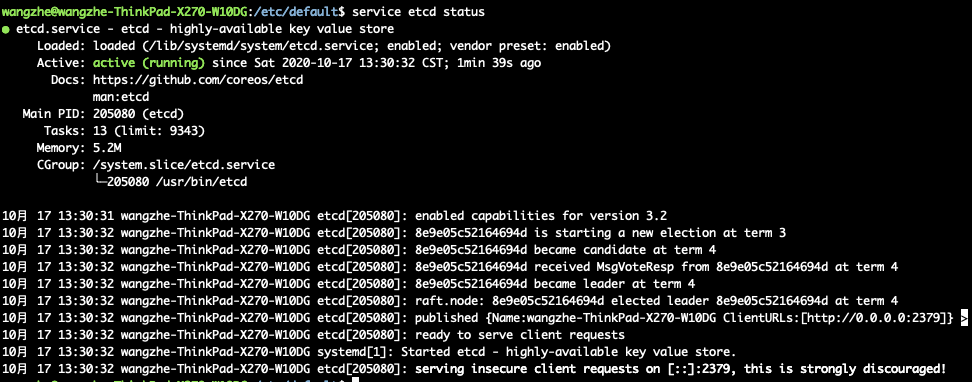

# ETCD的安装

本文中，我们将会讲解ETCD在各种平台下的安装方式。

## Ubuntu下安装ETCD

在Ubuntu系统下，ETCD的安装非常简单，可以直接使用 `apt-get` 命令安装即可。

```bash
sudo apt-get install etcd
```

安装完成后，我们可以检查服务状态已经端口是否正常启动：

```bash
# 检查服务状态
service etcd status

# 检查端口是否正常启动
sudo lsof -i:2379
```

此时，我们已经可以在本机访问ETCD服务了，但是如果你尝试跨主机访问ETCD的服务的话，会发现端口无法正常连接。
其原因是etcd的默认配置仅运行127.0.0.1地址进行进行访问，因此，我们需要修改etcd的配置文件。

默认情况下，etcd的配置文件位于: `/etc/default/etcd`。

在这个配置文件中，我们主要需要修改如下两项：

```bash
ETCD_LISTEN_CLIENT_URLS="http://0.0.0.0:2379"
ETCD_ADVERTISE_CLIENT_URLS="http://0.0.0.0:2379"
```

修改完成后，重启ETCD并检查状态即可：

```bash
service etcd restart
service etcd status
```


