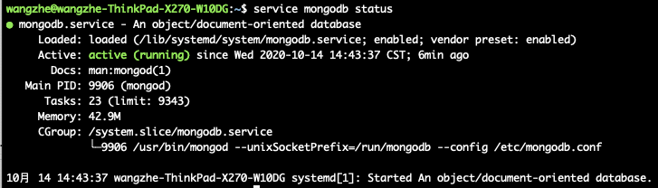

# MongoDB的安装

本文中，我们将会讲解MongoDB在各种平台下的安装方式。

## Ubuntu下安装MongoDB

在Ubuntu系统下，MongoDB的安装非常简单，可以直接使用 `apt-get` 命令安装即可。

```bash
sudo apt-get install mongodb
```

安装完成后，我们可以检查服务状态已经端口是否正常启动：

```bash
# 检查服务状态
service mongodb status

# 检查端口是否正常启动
sudo lsof -i:27017
```



默认情况下，mongoDB服务仅允许在127.0.0.1进行本地访问。
因此，我们需要修改配置文件使得它运行外网访问。

mongodb的配置文件位于: `/etc/mongodb.conf`。

```
bind_ip = 0.0.0.0
```

Ps：修改配置文件中bind_ip的值为0.0.0.0即可。

配置文件修改完成后，需要重新启动mongodb服务使之生效：

```bash
service mongodb restart
```
