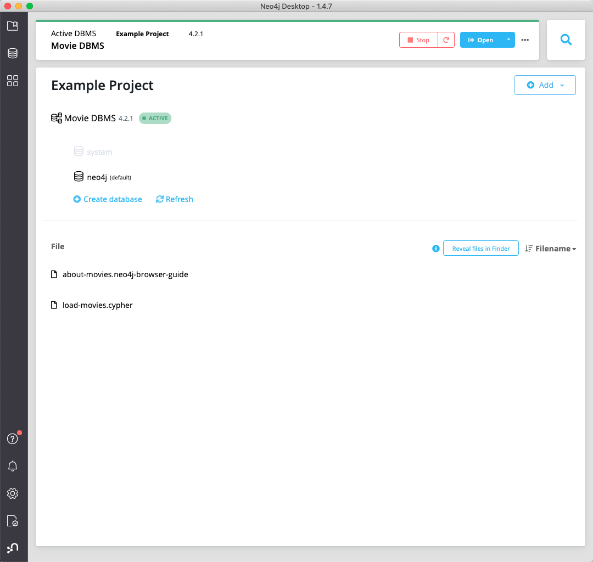
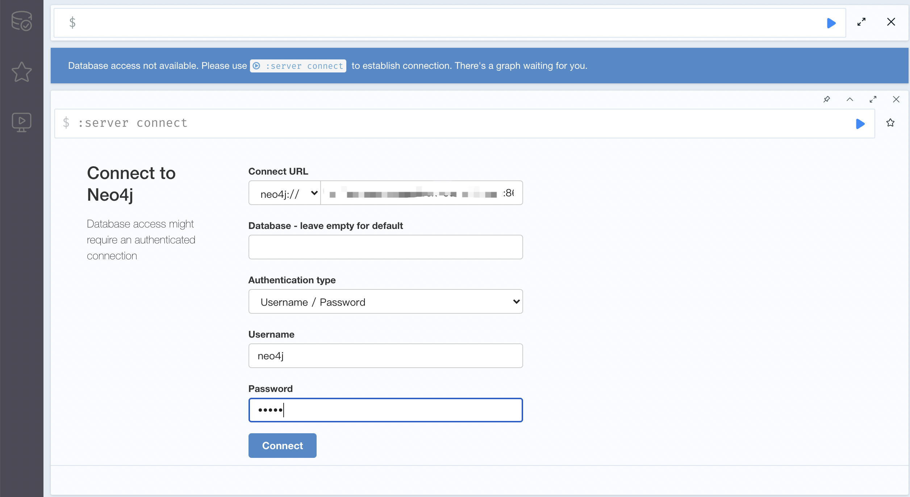

# neo4j 的安装

在本文中，我们会介绍介绍几种在不同场景下适用的搭建 neo4j 数据库的方法。

## Mac/Window 下安装 Neo4j Desktop

如果你想要在 Mac/Windows 下本地学习 Neo4j 相关的功能和使用，那么，Neo4j Desktop 就是最推荐的安装方法了。

你可以从 [下载链接](https://neo4j.com/download-center/#community) 中下载 Neo4j Desktop。

下载得到的会是一个 exe 安装包（Windows）或 pkg 安装包（MacOS），然后就像普通软件安装一样正常安装即可。

安装后的页面如下图所示：



Neo4j Desktop 不仅仅内置了 Neo4j 数据库，同时还带有了数据库管理系统，并集成了 Neo4j Brower, Neo4j Bloom 等应用，
对于新人学习而言，应该是一个非常棒的选择。

## Linux 下安装 Neo4j

如果我们想要在 Linux 服务器上搭建一个 Neo4j 的数据库，这时，Desktop 的安装方法就不再适用了。

此时，我们需要从 [下载链接](https://neo4j.com/download-center/#community) 中下载 tar 格式的安装包。

接下来，我们就可以解压并启动对应的 Neo4j Server 了：

```sh
tar -xvf neo4j-community-4.3.2-unix.tar
cd neo4j-community-4.3.2
```

解压后，你会看到其中包含如下一些目录:

 - bin: 启动脚本和一些可执行文件
 - conf: neo4j 的一些配置文件
 - data: 数据库中数据存储的目录
 - lib: 依赖的lib库
 - plugins: 用户可扩展的插件
 - logs: 日志文件目录
 - import: 可导入的 CSV 文件目录

下面，我们就准备来启动 neo4j 服务。

```sh
./bin/neo4j console  # 前台启动
# Directories in use:
# home:         /home/neo4j/neo4j-community-4.3.2
# config:       /home/neo4j/neo4j-community-4.3.2/conf
# logs:         /home/neo4j/neo4j-community-4.3.2/logs
# plugins:      /home/neo4j/neo4j-community-4.3.2/plugins
# import:       /home/neo4j/neo4j-community-4.3.2/import
# data:         /home/neo4j/neo4j-community-4.3.2/data
# certificates: /home/neo4j/neo4j-community-4.3.2/certificates
# licenses:     /home/neo4j/neo4j-community-4.3.2/licenses
# run:          /home/neo4j/neo4j-community-4.3.2/run
# Starting Neo4j.
# 2021-07-21 10:58:10.981+0000 INFO  Starting...
# 2021-07-21 10:58:13.124+0000 INFO  ======== Neo4j 4.3.2 ========
# 2021-07-21 10:58:14.900+0000 INFO  org.neo4j.internal.kernel.api.security.AbstractSecurityLog$SecurityLogLine@4b5cdd07
# 2021-07-21 10:58:14.907+0000 INFO  org.neo4j.internal.kernel.api.security.AbstractSecurityLog$SecurityLogLine@65f470f8
# 2021-07-21 10:58:14.908+0000 INFO  org.neo4j.internal.kernel.api.security.AbstractSecurityLog$SecurityLogLine@531299d3
# 2021-07-21 10:58:14.913+0000 INFO  org.neo4j.internal.kernel.api.security.AbstractSecurityLog$SecurityLogLine@332fa1c
# 2021-07-21 10:58:14.914+0000 INFO  org.neo4j.internal.kernel.api.security.AbstractSecurityLog$SecurityLogLine@1d0f7bcf
# 2021-07-21 10:58:14.916+0000 INFO  org.neo4j.internal.kernel.api.security.AbstractSecurityLog$SecurityLogLine@1978b0d5
# 2021-07-21 10:58:15.069+0000 INFO  Bolt enabled on localhost:7687.
# 2021-07-21 10:58:15.959+0000 INFO  Remote interface available at http://localhost:7474/
# 2021-07-21 10:58:15.961+0000 INFO  Started.

# ./bin/neo4j start 后台启动
# ./bin/neo4j stop 后台停止
# ./bin/neo4j restart 后台重启
# ./bin/neo4j status 状态检查
```

Ps: 启动 neo4j 之前，需要保证已经有了对应的 JVM 环境，其中，neo4j 4.x 版本依赖的 Java 版本为 Java11。

此时，我们就可以打开浏览器访问 [http://localhost:7474/](http://localhost:7474/) 。



其中，初始的用户名和密码都是 neo4j 。

首次登录后会要求你进行修改密码，修改密码后，就可以正常使用 neo4j 相关的功能了。

## Docker 镜像启动 Neo4j

最后，我们再来讲解一个简单的安装 neo4j 的方法，那就是利用 Docker 镜像直接启动 neo4j 服务。

启动命令如下：

```sh
docker run \
    --publish=7474:7474 --publish=7687:7687 \
    --volume=$HOME/neo4j/data:/data \
    neo4j
```

其中，分别将 7474 和 7687 端口映射到了宿主上，同时将宿主机的 /data 目录挂载至容器中，用于数据的持久化。
