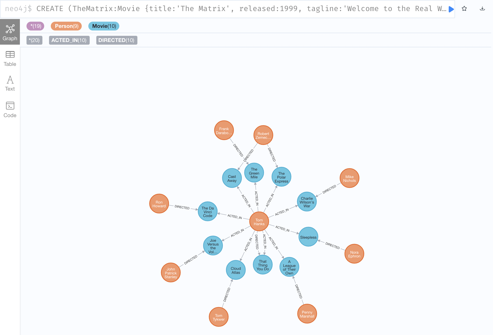
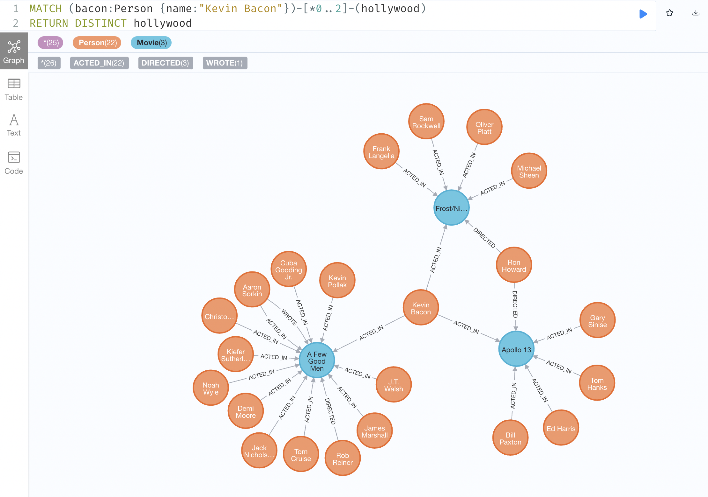

# neo4j的快速使用

当我们完成 neo4j 的环境搭建后，我们就赶快来体验一下 neo4j 相关的功能吧。

在Neo4dj的 [安装](./install.md) 中，我们已经完成了 neo4j 的安装并进入到了 Neo4j 的浏览器中 WEB 页面中。

那么，在本文中，我们就将会基于 Neo4j Browser 来体验一下 Neo4j 的相关功能。

## Neo4j Browser 概述

Neo4j Browser 是 Neo4j 提供的一款开发者工具，通过 Neo4j Browser ，开发者可以查看 Neo4j 数据库中的数据、
执行 Cypher 语句、查询结果和查询图表。

此外，还可以通过 Neo4j Browser 来：

 - 导入数据。
 - 调用自定义的 Java 程序
 - Profile 查询等


## 示例数据演示

下面，我们就在 Neo4j Browser 上针对 Neo4j 提供的示例数据进行相关功能的演示和学习。

输入如下指令:

```sh
:play movie graph
```

可以看到如下页面，即我们可以使用 `Movie Graph` 示例数据集来进行学习。


这个示例可以带着我们学习如何进行：

1. 数据写入: 将电影数据写入至 graph 中。
2. 检索: 检索指定的电影和演员。
3. 查询: 查询相关的演员和导演。
4. 关系链路查询。

### 数据写入

右侧是一个巨大的代码块，其中包含由多个 CREATE 子句组成的单个 Cypher 语句。
这些指令将会创建一个电影的 Graph。

点击代码块就可以执行对应的数据写入命令了。


命令执行完成后，可以看到一个如下的图：



可以看到，在上图中包含了10部电影和9个人。其中，一共包含了20个『关系』，10个是『导演』的关系，10个是『演员』的关系。

### 数据检索

下面，我们可以演示一些 Cypher 的基本语句来进行一些数据检索：

```
MATCH (tom {name: "Tom Hanks"}) RETURN tom
```

执行上述命令，可以看到你会检索得到一个 Person，该 Person 的姓名是 "Tom Hanks"。

```
MATCH (cloudAtlas {title: "Cloud Atlas"}) RETURN cloudAtlas
```

执行上述命令，可以看到你会检索得到一个 Movie，该 Movie 的名称是 "Cloud Atlas"。

```
MATCH (people:Person) RETURN people.name LIMIT 10
```

执行上述命令，可以看到你会检索得到一个列表，列表中罗列了10个人的名称，即根据数据类型进行检索。

```
MATCH (nineties:Movie) WHERE nineties.released >= 1990 AND nineties.released < 2000 RETURN nineties.title
```

执行上述命令，可以看到你会检索得到一个列表，列表中罗列 1990 年到 2000 年发布的电影的名称。

### 数据查询

至此，看起来相关的功能还是传统的数据库非常的类似，但是下面的内容会让你了解到图数据库的强大。

下面，我们可以演示一些 Cypher 的基本语句来进行一些数据查询：

```
MATCH (tom:Person {name: "Tom Hanks"})-[:ACTED_IN]->(tomHanksMovies) RETURN tom,tomHanksMovies
```

可以看到，上述命令可以直接查询出 Tom Hanks 饰演的全部电影，并返回了 Tom Hanks 的信息和对应的电影的信息。

```
MATCH (cloudAtlas {title: "Cloud Atlas"})<-[:DIRECTED]-(directors) RETURN directors.name
```

可以看到，上述命令可以直接查询出 Cloud Atlas 电影的导演姓名。

```
MATCH (tom:Person {name:"Tom Hanks"})-[:ACTED_IN]->(m)<-[:ACTED_IN]-(coActors) RETURN coActors.name
```

可以看到，上述命令可以直接查询出和 Tom Hanks 合作的的演员姓名。

```
MATCH (people:Person)-[relatedTo]-(:Movie {title: "Cloud Atlas"}) RETURN people.name, Type(relatedTo), relatedTo
```

可以看到，上述命令可以直接查询出所有和 Cloud Atlas 电影有关的人物信息以及他们在电影中承担的工作。

怎么样？通过上述命令是不是已经感受到了图数据库的便捷？

### 关系链路查询

```
MATCH (bacon:Person {name:"Kevin Bacon"})-[*1..2]-(hollywood)
RETURN DISTINCT hollywood
```



从上图可以看到，上述指令可以查询出与 Kevin Bacon 通过2个节点能存在关联的所有人和电影。

```
MATCH p=shortestPath(
(bacon:Person {name:"Kevin Bacon"})-[*]-(meg:Person {name:"Meg Ryan"})
)
RETURN p
```


上述命令表示查询 Kevin Bacon 到 Meg Ryan 之间的最短路径。

### 推荐

图数据库常常还可以用于推荐场景，例如，我们可以找出一些推荐和 Tom Hanks 合作的演员。

```
MATCH (tom:Person {name:"Tom Hanks"})-[:ACTED_IN]->(m)<-[:ACTED_IN]-(coActors),
  (coActors)-[:ACTED_IN]->(m2)<-[:ACTED_IN]-(cocoActors)
WHERE NOT (tom)-[:ACTED_IN]->()<-[:ACTED_IN]-(cocoActors) AND tom <> cocoActors
RETURN cocoActors.name AS Recommended, count(*) AS Strength ORDER BY Strength DESC
```

我们来看一下上述指令的作用：

1. 首先，我们需要找的演员是没有和 Tom Hanks 直接合作过的演员，但是其实是和 Tom Hanks 间接合作过的演员。
2. 同时，按照间接合作的次数进行排序。

```
MATCH (tom:Person {name:"Tom Hanks"})-[:ACTED_IN]->(m)<-[:ACTED_IN]-(coActors),
  (coActors)-[:ACTED_IN]->(m2)<-[:ACTED_IN]-(cruise:Person {name:"Tom Cruise"})
RETURN tom, m, coActors, m2, cruise
```

上述命令表示找出 Tom Hanks 和 Tom Cruise 间接合作过的完整的链路。

### 删除数据

当我们完成上述实验之后，就可以删除相关的数据了：

```
MATCH (n) DETACH DELETE n
```

删除完成之后，可以使用如下指令验证数据是否已经删除干净了：

```
MATCH (n) RETURN n
```

此时，我们关于对 Neo4j 的初步的了解就先告一段落了。


## 总结

Neo4j 适用于一些复杂关系的场景，例如内容欺诈、网络/IT分析、物联网等等。
