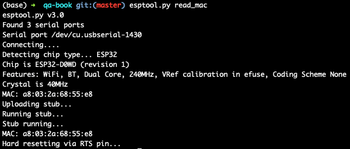
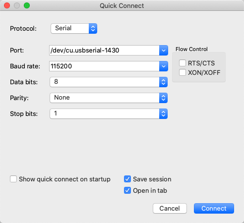
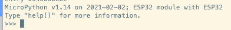

# micro-python环境搭建

学习嵌入式开发的第一步就是要搭建嵌入式的开发环境。

首先，我们需要选择一块合适的开发板。

我们推荐选择开源硬件的开发板，有两个原因。第一，硬件、软件的各种技术实现是公开的，方便分析问题，也方便后期转化为量产的产品；第二，有社区氛围，使用的人比较多，大家可以针对具体的问题进行交流。

比如说 NodeMCU 就是一个不错的选择。基于 [ESP32S](http://www.1zlab.com/wiki/micropython-esp32/pins-and-gpio/) 芯片的版本，Flash 空间有 4MB，自带 Wi-Fi 功能，而且价格便宜，在国内外都非常流行。


## 搭建 MicroPython 开发环境

接下来，我们需要吧MicroPython部署到NodeMCU开发板上，准备好开发环境。

### 准备固件文件

首先，我们需要为 NodeMCU 准备好 MicroPython 固件文件。MicroPython 官方已经为 ESP32 准备了[现成的固件](https://micropython.org/download/esp32/) ，省去了交叉编译的工作。

我们需要选择“Firmware with ESP-IDF v3.x”下面的“GENERIC”类别，直接下载最新版本的固件文件到电脑中。

### 安装烧录工具

然后，我们使用一根 USB 数据线，将 NodeMCU 开发板和电脑连接起来。USB 数据线选择一头是 USB-A 接口、另一头是 Micro-USB 接口，并且支持数据传输的完整线缆。

接着，我们在电脑终端运行下面的命令，安装用来烧录的工具 **esptool** ：

```
pip3 install esptool
```

esptool 安装完成后，你可以运行

```
esptool.py read_mac
```

命令，确认 NodeMCU 板子是否连接成功。连接成功后的屏幕显示是这样的：



如果连接不成功应该怎么办呢？

如果是Mac系统，可以在电脑的terminal中输入

```
ls -l /dev/cu.*
```

查看是否有`/dev/cu.usbserial-***`相关的名字的设备文件。

如果没有，那应该是板子或者usb线有问题，建议更换重试。

### 烧录固件

接下来我们需要烧录固件。

在这之前，我们需要先输入下面命令，擦除 Flash 芯片：

```bash
esptool.py --chip esp32 --port /dev/cu.usbserial-xxxx erase_flash
```

Ps: 需要将上述命令中的cu.usbserial-xxxx修改为你自己的设备名称。后续的命令同理。

擦除成功后，我们进入存储前面下载固件的目录中，运行下面的命令，将固件文件烧录到开发板的 Flash 中：

```bash
esptool.py --chip esp32 --port /dev/cu.usbserial-xxxx --baud 460800 write_flash -z 0x1000 esp32-idf3-20200902-v1.13.bin
```

烧录成功后，MicroPython 预期已经在你的开发板上运行起来了。

### 确认运行状态

但是开发板跟电脑不一样，是没有显示屏的，我们要怎么确认它的运行状态呢？

接下来，我们就要使用串口连接开发板来验证 MicroPython 环境是否已经搭建完成了。

同样还是用USB线将开发版和电脑连接起来。

通过查询`ls /dev/cu.*`查询到对应的设备名称后，下载终端连接软件，例如[SecureCRT](https://www.vandyke.com/cgi-bin/releases.php?product=securecrt) ，通过串口协议与开发板进行交互。

需要注意的是，波特率（Baud rate）设置为 115200，这与前面烧录时选择的值不同。



成功连接后，SecureCRT 的窗口会输出类似下面的结果：



看到熟悉的 >>> 引导符，我们就直接引入进入了Python的交互式命令行了。

Ps:  SecureCRT串口连接后，如果无法看到 >>> 引导符，可能是有如下原因

1. 开发板上已经在运行一些阻塞运行的程序，导致阻塞串口交互。解决方案是删除开发板根目录下的main.py文件。
2. 开发板之前的连接没有断开。解决方案，断开其他终端的连接方式，并按复位键。

### 体验交互

先用“Hello World”来个经典的打招呼吧。

```python
print("Hello World from MicroPython!")
```

可以看到，和普通的Python并没有什么区别，在开发板上，同样打印出了相关的语句。

下面，我们来尝试点亮一个LED灯吧。

首先导入machine 模块，machine模块几乎包含了整个ESP32的硬件资源的接口.

NodeMCU32-S开发板上有一个蓝色的LED， 由P2引脚的输出来控制，高电平亮，低电平灭，因此我们可以控制P2引脚的输出来点亮该LED：

声明一个管脚，GPIO编号为2，在板子的引脚上标记为P2, 模式为输出模式，即设置为machine.PIN.OUT，并将管脚写入高电平。

```python
import machine
pin2 = machine.Pin(2, machine.Pin.OUT)
pin2.value(1)
```

这时你应该可以看到该led灯被点亮，散发出宝石般的蓝色光芒。

## 部署代码到开发板

上面的例子中，我们已经使用交互式命令行运行了Python的命令。

但是交互式命令行只是在调试场景比较适用，对于生产环境而言，我们希望的是它能够直接运行一个/组Python文件。

比如，我们有一段如下代码：

```python

import machine
import time

# 指明 GPIO2 管脚
pin = machine.Pin(2, machine.Pin.OUT)

# 循环执行
while True:
    time.sleep(2)   # 等待 2 秒
    pin.on()        # 控制 LED 状态
    time.sleep(2)   # 等待 2 秒
    pin.off()       # 切换 LED 状
```

这段代码实现的功能是，控制 LED 灯以 2 秒的间隔，不断点亮、熄灭。

为了在电路板上运行这个 Python 代码，我们需要做两件事情：

1. 将代码段保存到一个文件中，这个文件的名字必须是 main.py。
2. 将代码文件 main.py 放到开发板的文件系统中，而且是根目录。

这样，当开发板启动或者重启的时候，就会自动执行 main.py 文件中的代码。

第一点我们可以很容易做到。但是，怎么把代码文件上传到开发板上呢？

推荐的一个工具是 [ampy](https://learn.adafruit.com/micropython-basics-load-files-and-run-code/install-ampy) .

一般情况下，你可以用下面的命令完成安装：

```
pip3 install adafruit-ampy
```

所以在使用的时候，我们需要先设置一个环境变量 —— AMPY_DELAY。延时的推荐值是 0.5。

```bash
export AMPY_DELAY=0.5
```

建议可以将它加入到 .bashrc 或 .zshrc 等配置文件中，避免每次都需要重复输入。

使用 ampy 的过程中，常用的环境变量还有下面两个，可以根据具体情况设置：

```bash
#设备名称请根据你的情况修改
export AMPY_PORT=/dev/cu.wchusbserialxxxx

#串口通信的波特率   
export AMPY_BAUD=115200
```

然后，输入下面的命令，就把代码部署到开发板上了。

```bash
ampy put main.py
```

其实，ampy还有很多实用的功能，你可以在下面自己进行探索。

参考资料：

1. [ESP32S](http://www.1zlab.com/wiki/micropython-esp32/pins-and-gpio/) 引脚说明书
2. [SecureCRT](https://www.vandyke.com/cgi-bin/releases.php?product=securecrt) 下载地址
3. [ampy](https://learn.adafruit.com/micropython-basics-load-files-and-run-code/install-ampy) 安装文档
