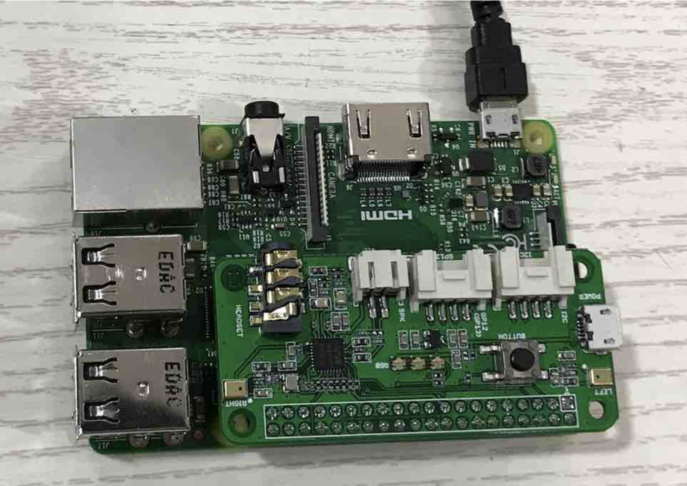
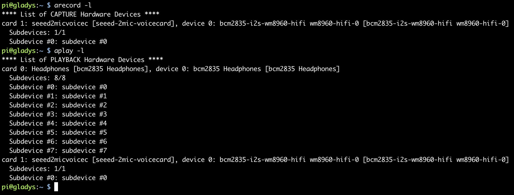
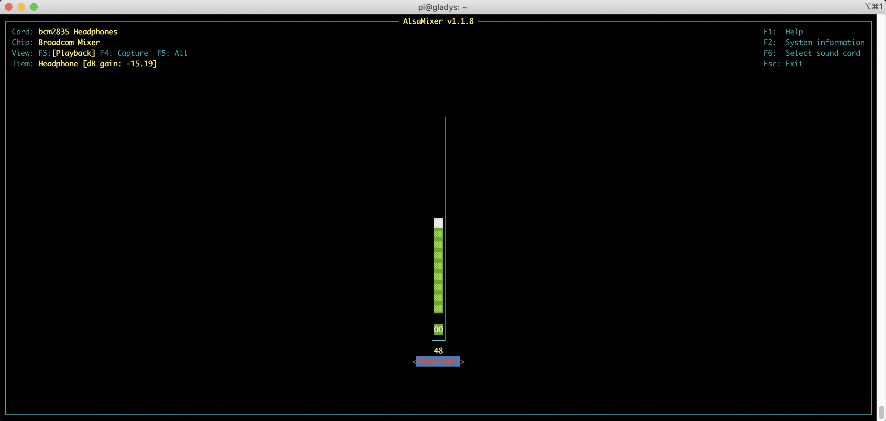

# 树莓派语音处理实战

## 设备依赖组件

在本文中，我们将会针对上一节中搭建的树莓派环境进行进一步实战，了解如何使用树莓派来支持语音的录音和播放。

为了完成本节内容，我们需要准备以下组件：

1. 树莓派开发板
2. 麦克风阵列（ReSpeaker 2-Mics Pi HAT）
3. 耳机/扬声器

## 环境搭建

下面，我们来安装相关的驱动程序。

首先，你最好切换一下树莓派的软件安装源，将它切换到国内的腾讯云安装源，这样下载安装的速度比较快。

运行下面的命令修改配置文件：

```shell
vim /etc/apt/sources.list
```

注释掉原有的内容，修改如下：

```shell
deb https://mirrors.cloud.tencent.com/raspbian/raspbian/ buster main contrib non-free rpi
# Uncomment line below then 'apt-get update' to enable 'apt-get source'
deb-src https://mirrors.cloud.tencent.com/raspbian/raspbian/ buster main contrib non-free rpi
```

修改另一个软件安装源的配置文件，命令如下所示：

```shell
vim /etc/apt/sources.list.d/raspi.list
```

修改后的文件内容如下：

```shell
deb https://mirrors.cloud.tencent.com/raspberrypi/ buster main
# Uncomment line below then 'apt-get update' to enable 'apt-get source'
deb-src https://mirrors.cloud.tencent.com/raspberrypi/ buster main
```

然后，你需要运行下面的命令更新安装源：

```shell
sudo apt-get clean all
sudo apt-get update
```

现在，你可以运行下面命令安装麦克风阵列的驱动程序。

因为这个驱动依赖的 wm8960 编解码器没有包含在树莓派系统的内核里面，需要重新加载内核，编译驱动，所以整个过程比较久。

```shell
sudo apt-get install git
git clone --depth=1 https://github.com/respeaker/seeed-voicecard
cd seeed-voicecard
sudo ./install.sh --compat-kernel
sudo reboot
```

驱动程序安装完成后，我们就需要开始完成整个物理环境的连接。

1. 把 ReSpeaker 2-Mics Pi HAT 直接插入到树莓派板子上。如图所示：
2. 把耳机通过耳机孔插入到树莓派的3.5mm的耳机孔中。

## 录音与声音播放实战

连线完成后，检查音频的输入和输出设备是否正常工作。

```shell
arecord -l
aplay -l
```



如果一切正常，我们就可以测试录音和播放功能了。

在 ReSpeaker 2-Mics Pi HAT 的耳机插口上插入耳机或者扬声器，运行下面的命令，并说几句话。

```shell
arecord -d 5 test.wav
aplay test.wav
```

另外，你也可以通过软件 AlsaMixer（命令 alsamixer）来配置声音设置和调整音量，左、右箭头键用于选择通道或设备，向上、向下箭头控制当前所选设备的音量。

退出程序使用 ALT + Q，或者按 Esc 键。

```shell
alsamixer
```



使用方式如上图所示。
