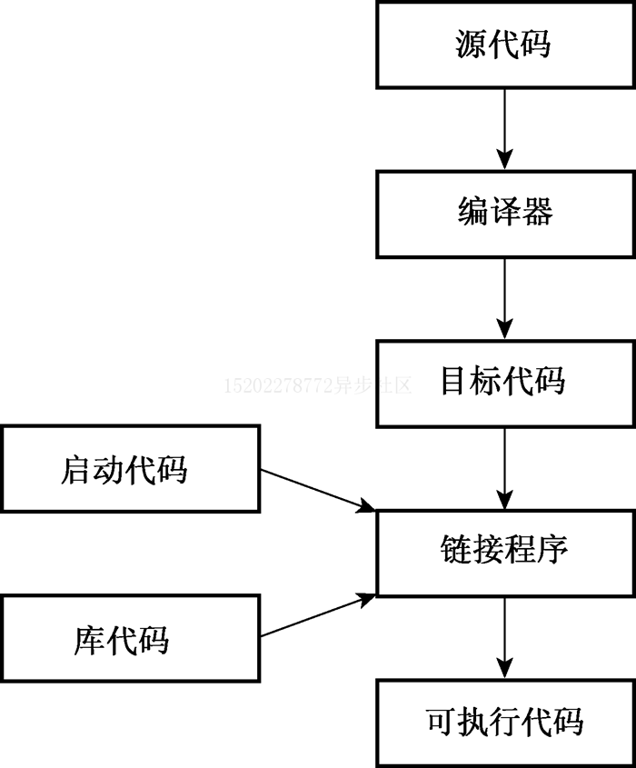

# 初识 C++

欢迎来到 C++ 的世界。

C++ 继承了 C 语言高效、简捷、快速、可移植性的传统，同时针对面向对象的特性提供了全新的编程方法，这种方法是为应对复杂程度不断提高的现代编程
任务来设计的。

同时，C++ 的模板特性提供了一种全新的编程方法: 范型编程。

## C++ 简介

C++ 融合了3中不同的编程方式: C 语言代表的过程性语言；C++ 扩展的类从而支持的面向对象编程；C++ 模板支持的泛型编程。

而本系列的文章也会围绕这三个部分逐步展开，从而帮助你更快的了解 C++ 这门语言。

## C++ 简史

### C 语言介绍

我们都知道，C++ 是基于 C 语言延伸和扩展而来的，那么，我们需要首先了解一下 C 语言的基本特点。

在 C 语言之前，我们编程用到的往往都是汇编语言。而汇编语言总是针对于特定的计算机处理器而编写的。
这也就意味着如果我们想要将汇编程序从一台计算机上移植到另外一台计算机上时，必须使用不同的汇编语言重新编写程序。

而 UNIX 操作系统的出现则是出现了一个契机，UNIX 就是为不同的计算机(平台) 上进行工作而设计的。
因此，C 语言也在 UNIX 平台下被开发了出来，它可以通过编译器将 C 语言翻译成特定计算机的内部语言，从而实现代码的可移植。

对于一个计算机语言而言，往往要处理的两个核心概念是: **数据** 和 **算法** 。

其中:

 - 数据是程序要使用和处理的信息。
 - 算法是程序使用的方法和处理步骤。

对于 C 语言这样的面向过程性的语言而言，它更加强调的是程序的 **算法** 过程，及更关注的是程序的整体流程和逻辑的。

随着项目规模的不断扩大，为了保证项目的可控性，在编程过程中，逐渐形成了一种 **自顶向下** 的设计原则:
将一个大型的程序拆分成为若干个小型的、便于管理的程序。
例如一个项目拆分为多个模块，每个模块在拆分为多个函数等等。

### C++ 面向对象编程

然而，即使有了 **自顶向下** 的设计原则，再面对一些更大规模的项目时，仍然面临着大量的挑战。
此时，一种新的编程思想被提出了: **面向对象编程** 。

与面向过程性的方法不同，面向对象编程语言中的核心是 **数据**。
而我们在编程过程中，首先要做的是定义程序要处理的核心对象是什么？同时，针对每个对象定义其可以进行的操作，并实现这个对象的程序。
最后，只需要最后通过一个程序将各个对象的处理串连起来即可。
这种方法也称之为 **自下向上** 编程。

而为了具备这种 **面向对象编程** 的能力，C++ 中提供了类的概念，它可以用来描述一种数据对象，并且可以规定可以进行哪些操作等。

除了思路的转变之外，面向对象编程的这种方法还带来了很多实际的好处：

 - 代码可重用。
 - 信息隐藏，避免数据被不适当的访问。
 - 多态可以为运算符和函数创建多个定义。
 - 继承可以根据旧的类扩展出新的类。

### C++ 泛型编程

泛型编程是 C++ 支持的又一个核心编程模式，它的目的也是让我们编程更加的方便。

但是与面向对象编程不同，面向对象编程强调的是以数据对象为核心，而泛型编程则是希望程序可以与数据解绑。
即我们不需要针对不同的数据类型编写多份相同处理逻辑的代码。

C++ 泛型编程主要是依赖 **模板** 功能来实现的。

## C++ 程序创建

编写一个 C++ 程序并将其运行起来，大约需要分为如下这些步骤：

1. 使用文本编辑器编写源代码并保存。
2. 编译源代码，将源代码翻译为主机使用的机器语言，即得到目标代码。
3. 将目标代码和其他代码链接起来，例如和lib库函数等，最终得到可执行程序。
4. 运行可执行程序即可。

如下图所示:

### 源代码编写

在不同平台开发 C++ 程序时，依赖的 C++ 程序编译器并不一样，因此，对于编写源代码的方式也不完全相同。

主要体现在以下两点：

 - 不同平台依赖的开发工具不一样，例如 Windows 下可以用 VisualStudio 等IDE，而在 Linux 下，则可能需要使用 vim 等编辑器。
 - 不同编译器对源代码的文件名后缀的要求也不一样，如下表所示。

|平台|源代码文件的扩展名|
|---|-----|
|UNIX|C, cc, cxx, c|
|GNU C++|C, cc, cxx, cpp, c++|
|Microsoft Visual C++|cpp, cxx, cc|

### 编译和链接

之前已经提到了，在不同的平台下，编译器并不一样，编译和链接的方法也不同，下面，我们来看看各个平台的编译工具怎么用吧。

|平台|编译/链接工具|
|---|-----|
|UNIX|CC|
|Linux(GNU C++)|g++|
|Windows命令行|g++(Cygwin/MinGW)|
|Windows IDE|Microsoft Visual C++ 2010|
|Mac|Xcode、Terminal进行UNIX模式|

