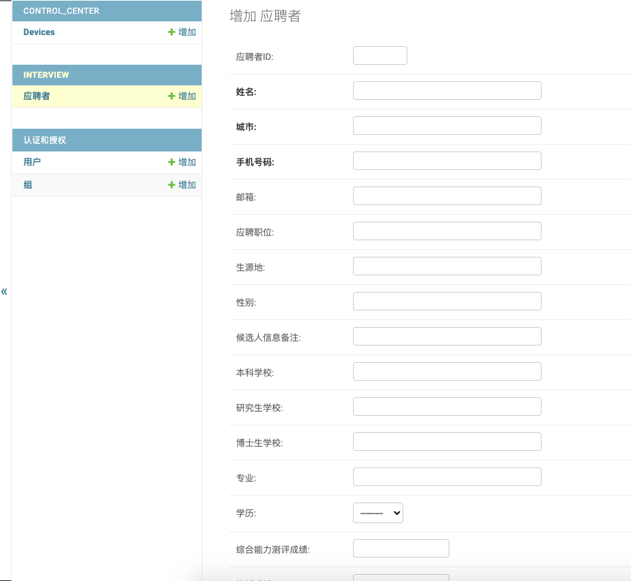

# DjangoAdmin高级用法

在本节的内容中，我们将会继续以职位管理系统为例，来逐步讲解一些DjangoAdmin的高级功能。

## 数据分页展示

首先，我们需要在已有的项目中创建一个`interview`的应用。

```shell
python3 manage.py startapp interview
```

接下来，我们定义`models.py`文件如下：

```python
from django.db import models
from django.contrib.auth.models import User

from jobs.models import DEGREE_TYPE

# 第一轮面试结果
FIRST_INTERVIEW_RESULT_TYPE = ((u'建议复试', u'建议复试'), (u'待定', u'待定'), (u'放弃', u'放弃'))

# 复试面试建议
INTERVIEW_RESULT_TYPE = ((u'建议录用', u'建议录用'), (u'待定', u'待定'), (u'放弃', u'放弃'))

# HR终面结论
HR_SCORE_TYPE = (('S', 'S'), ('A', 'A'), ('B', 'B'), ('C', 'C'))

class Candidate(models.Model):
    # 基础信息
    userid = models.IntegerField(unique=True, blank=True, null=True, verbose_name=u'应聘者ID')
    username = models.CharField(max_length=135, verbose_name=u'姓名')
    city = models.CharField(max_length=135, verbose_name=u'城市')
    phone = models.CharField(max_length=135, verbose_name=u'手机号码')
    email = models.EmailField(max_length=135, blank=True, verbose_name=u'邮箱')
    apply_position = models.CharField(max_length=135, blank=True, verbose_name=u'应聘职位')
    born_address = models.CharField(max_length=135, blank=True, verbose_name=u'生源地')
    gender = models.CharField(max_length=135, blank=True, verbose_name=u'性别')
    candidate_remark = models.CharField(max_length=135, blank=True, verbose_name=u'候选人信息备注')

    # 学校与学历信息
    bachelor_school = models.CharField(max_length=135, blank=True, verbose_name=u'本科学校')
    master_school = models.CharField(max_length=135, blank=True, verbose_name=u'研究生学校')
    doctor_school = models.CharField(max_length=135, blank=True, verbose_name=u'博士生学校')
    major = models.CharField(max_length=135, blank=True, verbose_name=u'专业')
    degree = models.CharField(max_length=135, choices=DEGREE_TYPE, blank=True, verbose_name=u'学历')

    # 综合能力测评成绩，笔试测评成绩
    test_score_of_general_ability = models.DecimalField(decimal_places=1, null=True, max_digits=3, blank=True,
                                                        verbose_name=u'综合能力测评成绩')
    paper_score = models.DecimalField(decimal_places=1, null=True, max_digits=3, blank=True, verbose_name=u'笔试成绩')

    # 第一轮面试记录
    first_score = models.DecimalField(decimal_places=1, null=True, max_digits=2, blank=True, verbose_name=u'初试分',
                                      help_text=u'1-5分，极优秀: >=4.5，优秀: 4-4.4，良好: 3.5-3.9，一般: 3-3.4，较差: <3分')
    first_learning_ability = models.DecimalField(decimal_places=1, null=True, max_digits=2, blank=True,
                                                 verbose_name=u'学习能力得分')
    first_professional_competency = models.DecimalField(decimal_places=1, null=True, max_digits=2, blank=True,
                                                        verbose_name=u'专业能力得分')
    first_advantage = models.TextField(max_length=1024, blank=True, verbose_name=u'优势')
    first_disadvantage = models.TextField(max_length=1024, blank=True, verbose_name=u'顾虑和不足')
    first_result = models.CharField(max_length=256, choices=FIRST_INTERVIEW_RESULT_TYPE, blank=True,
                                    verbose_name=u'初试结果')
    first_recommend_position = models.CharField(max_length=256, blank=True, verbose_name=u'推荐部门')
    first_interviewer_user = models.ForeignKey(User, related_name='first_interviewer_user', blank=True, null=True, on_delete=models.CASCADE, verbose_name=u'面试官')

    first_remark = models.CharField(max_length=135, blank=True, verbose_name=u'初试备注')

    # 第二轮面试记录
    second_score = models.DecimalField(decimal_places=1, null=True, max_digits=2, blank=True, verbose_name=u'专业复试得分',
                                       help_text=u'1-5分，极优秀: >=4.5，优秀: 4-4.4，良好: 3.5-3.9，一般: 3-3.4，较差: <3分')
    second_learning_ability = models.DecimalField(decimal_places=1, null=True, max_digits=2, blank=True,
                                                  verbose_name=u'学习能力得分')
    second_professional_competency = models.DecimalField(decimal_places=1, null=True, max_digits=2, blank=True,
                                                         verbose_name=u'专业能力得分')
    second_pursue_of_excellence = models.DecimalField(decimal_places=1, null=True, max_digits=2, blank=True,
                                                      verbose_name=u'追求卓越得分')
    second_communication_ability = models.DecimalField(decimal_places=1, null=True, max_digits=2, blank=True,
                                                       verbose_name=u'沟通能力得分')
    second_pressure_score = models.DecimalField(decimal_places=1, null=True, max_digits=2, blank=True,
                                                verbose_name=u'抗压能力得分')
    second_advantage = models.TextField(max_length=1024, blank=True, verbose_name=u'优势')
    second_disadvantage = models.TextField(max_length=1024, blank=True, verbose_name=u'顾虑和不足')
    second_result = models.CharField(max_length=256, choices=INTERVIEW_RESULT_TYPE, blank=True, verbose_name=u'专业复试结果')
    second_recommend_position = models.CharField(max_length=256, blank=True, verbose_name=u'建议方向或推荐部门')
    second_interviewer_user = models.ForeignKey(User, related_name='second_interviewer_user', blank=True, null=True, on_delete=models.CASCADE, verbose_name=u'二面面试官')
    second_remark = models.CharField(max_length=135, blank=True, verbose_name=u'专业复试备注')

    # HR终面
    hr_score = models.CharField(max_length=10, choices=HR_SCORE_TYPE, blank=True, verbose_name=u'HR复试综合等级')
    hr_responsibility = models.CharField(max_length=10, choices=HR_SCORE_TYPE, blank=True, verbose_name=u'HR责任心')
    hr_communication_ability = models.CharField(max_length=10, choices=HR_SCORE_TYPE, blank=True,
                                                verbose_name=u'HR坦诚沟通')
    hr_logic_ability = models.CharField(max_length=10, choices=HR_SCORE_TYPE, blank=True, verbose_name=u'HR逻辑思维')
    hr_potential = models.CharField(max_length=10, choices=HR_SCORE_TYPE, blank=True, verbose_name=u'HR发展潜力')
    hr_stability = models.CharField(max_length=10, choices=HR_SCORE_TYPE, blank=True, verbose_name=u'HR稳定性')
    hr_advantage = models.TextField(max_length=1024, blank=True, verbose_name=u'优势')
    hr_disadvantage = models.TextField(max_length=1024, blank=True, verbose_name=u'顾虑和不足')
    hr_result = models.CharField(max_length=256, choices=INTERVIEW_RESULT_TYPE, blank=True, verbose_name=u'HR复试结果')
    hr_interviewer_user = models.ForeignKey(User, related_name='hr_interviewer_user', blank=True, null=True, on_delete=models.CASCADE, verbose_name=u'HR面试官')
    hr_remark = models.CharField(max_length=256, blank=True, verbose_name=u'HR复试备注')

    creator = models.CharField(max_length=256, blank=True, verbose_name=u'候选人数据的创建人')
    created_date = models.DateTimeField(auto_now_add=True, verbose_name=u'创建时间')
    modified_date = models.DateTimeField(auto_now=True, null=True, blank=True, verbose_name=u'更新时间')
    last_editor = models.CharField(max_length=256, blank=True, verbose_name=u'最后编辑者')

    class Meta:
        db_table = 'candidate'
        verbose_name = '应聘者'
        verbose_name_plural = '应聘者'

    def __str__(self):
        return self.username
```

可以看到，这个Candidate对象中包括了大量的属性字段。

同时，我们在Candidate类内，又定义了一个Meta类，其中包含db_table、verbose_name和verbose_name_plural三个属性。

这些其实也都是Django框架内定义的一些特殊变量，分别表示对应的数据库表的名称，数据库表在Web页面上显示的名称，数据库表的复数形式。

`__str__`是Python3的类中的一个特殊含义的函数，它表示将对象转换成str类型时，得到的string字符串的值。

下面，我们定义`admin.py`文件如下：

```python
from django.contrib import admin
from interview.models import Candidate

# 候选人管理类
class CandidateAdmin(admin.ModelAdmin):
    exclude = ('creator', 'created_date', 'modified_date')
    list_display = (
        'username', 'city', 'bachelor_school','get_resume', 'first_score', 'first_result', 'first_interviewer_user', 'second_score',
        'second_result', 'second_interviewer_user', 'hr_score', 'hr_result', 'hr_interviewer_user',)

admin.site.register(Candidate, CandidateAdmin)
```

同时，我们还需要在全局`settings.py`的INSTALL_APPS中增加`interview`这个应用。

接下来，我们需要初始化数据库：

```shell
python3 ./manage.py makemigrations
python3 ./manage.py migrate
```

此时，再次进入admin管理页面，可以点击"应聘者" +号来添加一个用户。



在添加应聘者页面中，你应该会看到有一个巨大无比的表单，这个表单看起来就非常的令人头痛，我们需要对这个表单进行分组和优化管理来使得大家在使用过程中没有那么痛苦。

我们需要扩展`admin.py`文件，在`CandidateAdmin`类中增加`fieldsets`属性，示例如下：

```python
from django.contrib import admin
class CandidateAdmin(admin.ModelAdmin):
    fieldsets = (
        (None, {"fields": ("userid", "username", "email")}),
        ("第一轮面试", {"fields": ("first_score", "first_advantage")}),
        ("第二轮面试", {"fields": ("second_score", "second_advantage")}),
        ("第三轮面试", {"fields": ("hr_score", "hr_advantage")}),
    )
```

其中，`fieldsets`是表示字段分组的方式，本身是一个元组，元组中的每一个元素表示一个字段块。

每个`fieldset`又是由一个元组组成，元组的第一个元素表示分组名称，第二个元素是一个字典信息，包含一个fields字段，里面是属于当前块的字段。

此时，我们已经将所有字段都进行了分组显示，但是查看表单，我们会发现像用户名这种输入内容很短的字段，也需要占用一行，导致整体页面过长，这种显示方法并不合适。

因此，我们需要再次进行优化，将多个字段合并至同一行。

例如，我们希望将`username`和`email`合并成为一行：

```python
from django.contrib import admin
class CandidateAdmin(admin.ModelAdmin):
    fieldsets = (
        (None, {"fields": ("userid", ("username", "email"))}),
        ("第一轮面试", {"fields": ("first_score", "first_advantage")}),
        ("第二轮面试", {"fields": ("second_score", "second_advantage")}),
        ("第三轮面试", {"fields": ("hr_score", "hr_advantage")}),
    )
```

Ps: 我们只需要将"username", "email"再次用一个元组进行包围即可。


## 扩展命令行支持批量导入数据

虽然我们对管理页面进行了各种优化，但是仍然存在着大量的输入字段，因此从Web页面逐个添加用户仍然有着较大的成本。

因此，我们需要能够支持通过excel进行大量的数据导入，接下来，我们需要扩展admin工具来支持批量的excel数据导入。

在Django框架中，有一个management commands的机制，它可以扩展命令行功能来满足个性化的需求。

首先，我们首先需要创建`management/commands`目录，并在该目录下创建`import_candidates.py`文件：

```python
import csv
from django.core.management import BaseCommand   # 命令行扩展的基类
from interview.models import Candidate


class Command(BaseCommand):
    help = '从一个CSV文件的内容中读取候选人列表，导入到数据库中'  # 帮助信息
    def add_arguments(self, parser):
        # 接收一个--path的参数
        parser.add_argument('--path', type=str)

    def handle(self, *args, **kwargs):   # handle函数编写具体的处理逻辑
        path = kwargs['path']
        with open(path, 'rt', encoding="gbk") as f:
            reader = csv.reader(f, dialect='excel', delimiter=';')
            for row in reader:
                candidate = Candidate.objects.create(
                    username=row[0],
                    city=row[1],
                    phone=row[2],
                    bachelor_school=row[3],
                    major=row[4],
                    degree=row[5],
                    test_score_of_general_ability=row[6],
                    paper_score=row[7]
                )
                print(candidate)
```

此时，我们只需要执行如下命令即可实现批量上传数据：

```shell
python manage.py import_candidates --path /path/to/your/file.csv
```


## 列表支持筛选和查询

当我们导入大量的候选人后，我们会发现从候选人列表中查询指定特征的候选人变的非常难，因此，我们需要对候选人列表支持**搜索、过滤和排序**。

这些功能都可以借助Django的Admin的相关配置来快速实现，下面我们来看看应该怎么做把！

依旧是修改`admin.py`文件中的`CandidateAdmin`类，增加如下属性：

```python
class CandidateAdmin(admin.ModelAdmin):
    # 右侧筛选条件
    list_filter = ('city','first_result','second_result','hr_result','first_interviewer_user','second_interviewer_user','hr_interviewer_user')

    # 支持通用查询字段
    search_fields = ('username', 'phone', 'email', 'bachelor_school')

    ### 列表页默认排序字段
    ordering = ('hr_result','second_result','first_result')
```

可以看到，我们可以：

1. list_filter增加筛选条件
2. search_fields增加可搜索条件
3. ordering添加字段默认排序规则
