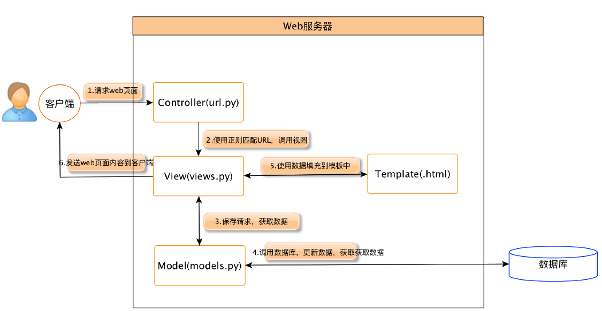

# 熟练掌握Django

Django 是一个高级的 Python 网络框架，可以快速开发安全和可维护的网站。由经验丰富的开发者构建，Django负责处理网站开发中麻烦的部分，因此你可以专注于编写应用程序，而无需重新开发。
它是免费和开源的，有活跃繁荣的社区，丰富的文档，以及很多免费和付费的解决方案。

## 优点

1. 完备性: Django遵循“功能完备”的理念，提供开发人员可能想要“开箱即用”的几乎所有功能。
2. 通用性: Django 可以（并已经）用于构建几乎任何类型的网站—从内容管理系统和维基，到社交网络和新闻网站。它可以与任何客户端框架一起工作，并且可以提供几乎任何格式（包括 HTML，Rss源，JSON，XML等）的内容。
3. 安全性: Django 提供了多种完善的安全保护机制可以直接使用。
4. 可扩展: Django 使用基于组件的 “无共享” 架构 (架构的每一部分独立于其他架构，因此可以根据需要进行替换或更改)。
5. 可维护: Django 代码编写是遵照设计原则和模式，鼓励创建可维护和可重复使用的代码。特别是它使用了不要重复自己（DRY）原则，所以没有不必要的重复，减少了代码的数量。
6. 灵活性: Django 是用Python编写的，它在许多平台上运行。这意味着你不受任务特定的服务器平台的限制，并且可以在许多种类的Linux，Windows和Mac OsX 上运行应用程序。

## Django架构

## 开发环境准备

1. [Anaconda](https://www.anaconda.com/products/individual)
2. [PyCharm](https://www.jetbrains.com/pycharm/download/)
