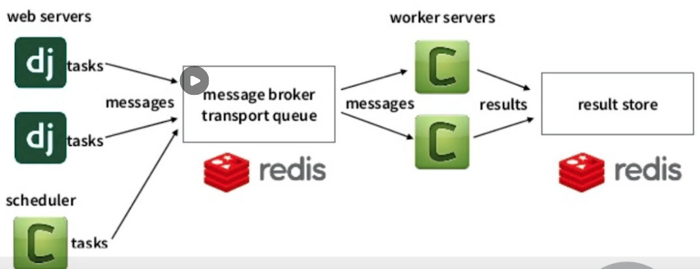
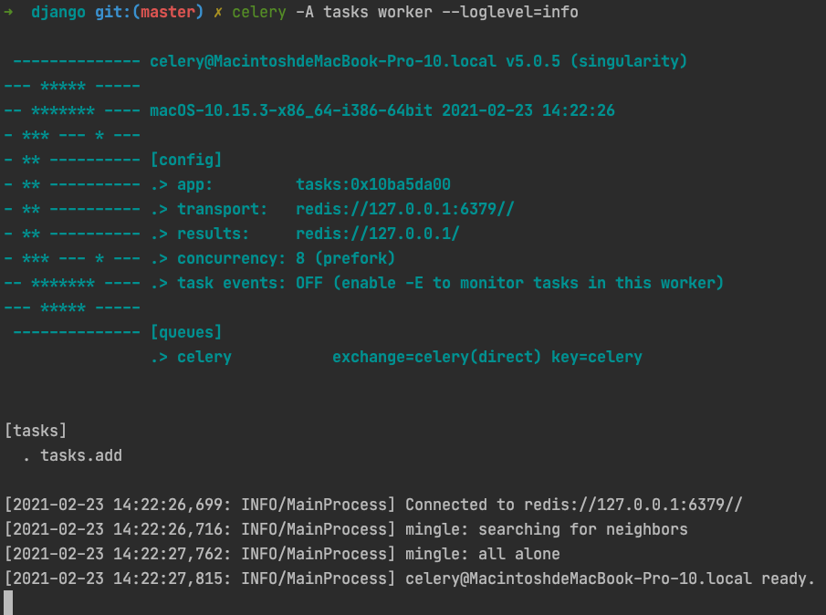
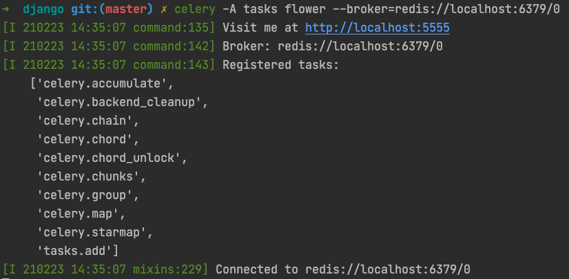
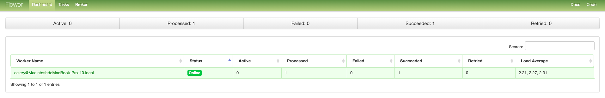

# Django Celery快速入门

## 什么是Celery

Celery是一个分布式任务的框架，具备如下特点：

1. 简单：几行代码就可以创建一个简单的Celery任务。
2. 高可用：任务可以自动重试。
3. 快速：可以在一分钟内执行上百万个任务。
4. 灵活：每一部分都可以轻松进行扩展。


## Celery使用场景

Celery非常适合用于去做需要异步执行的任务，例如：

1. 发送电子邮件，发送IM消息通知
2. 爬取网页，数据分析
3. 图片和视频处理
4. 生成报告等

## Celery架构

Celery架构如下图所示：



1. 首先，任务的来源可以是WebServer下发，也是可以是定时任务器下发。
2. 接下来，下发的任务首先会存放到一个Broker的队列中等待处理。
3. 然后Worker会从Broker消息队列中读取消息并处理。
4. 最后将处理后得到的结果再次写入一个数据库进行存储。


## Celery环境搭建

下面，我们来看如何搭建Celery的环境。

第一步：安装Celery第三方库

```shell
pip3 install celery
```

第二步：安装Celery依赖库

```shell
pip3 install "celery[librabbitmq,redis,auth,msgpack]"
```

第三步：做为Broker示例，我们需要安装一个Redis，此处，我们用docker了部署一个Redis实例

```shell
docker run -d -p 6379:6379 redis
```

到此为止，Celery的基本环境我们就已经准备完成了，下面我们可以用一个Celery的demo来验证我们的环境是否OK。

## Celery Demo

创建`tasks.py`文件如下:

```python
from celery import Celery


app = Celery('tasks', broker='redis://127.0.0.1', backend='redis://127.0.0.1')


@app.task
def add(x, y):
    return x + y
```

启动celery worker:

```shell
celery -A tasks worker --loglevel=info
```



接下来，我们创建一个运行任务的脚本`run_task.py`:

```python
from tasks import add

result = add.delay(4, 4)
print('Is Task ready: %s' % result.ready())

run_result = result.get(timeout=1)
print("task result: %s" % run_result)
```

运行脚本，观察输出如下：

```shell
python3 ./run_task.py
# Is Task ready: False
# task result: 8
```

可以看到，该任务的确是异步执行的，首先执行后，任务的状态并未完成，然后等待任务执行完成后，获取到了计算的结果。

## Celery任务的监控

因为任务异步化对于我们项目的运维和问题定位无疑是增加了一定的成本，为了能够让我们的系统更加容易监控和观察，Celery提供了一套监控方案：Flower。

下面，我们来体验一下Flower。

Step1: 安装flower

```shell
pip3 install flower==0.9.7
```

Step2: 启动flower

```shell
celery -A tasks flower --broker=redis://localhost:6379/0
```



访问localhost:5555可以看到如下页面:



在该页面中，我们可以查询Celery相关的节点，任务等一系列详细信息。

## Django集成Celery

在上面的例子中，我们主要在讲解Celery自身的功能和用法，接下来，我们将会结合Django来讲解如何在Django中使用Celery。

第一步: 在Django主应用的目录下，创建一个`celery.py`文件：

```python
from __future__ import absolute_import, unicode_literals
import os
from celery import Celery

os.environ.setdefault('DJANGO_SETTINGS_MODULE', 'project_name.settings')


app = Celery('project_name')

# Using a string here means the worker doesn't have to serialize
# the configuration object to child processes.
# - namespace='CELERY' means all celery-related configuration keys
#   should have a `CELERY_` prefix.
app.config_from_object('django.conf:settings', namespace='CELERY')


# Load task modules from all registered Django app configs.
app.autodiscover_tasks()   # 自动收集各个应用下的tasks.py文件


@app.task(bind=True)
def debug_task(self):
    print('Request: {0!r}'.format(self.request))
```

第二步: 在Django主应用目录下修改`__init__.py`文件如下：

```python
from __future__ import absolute_import, unicode_literals

# This will make sure the app is always imported when
# Django starts so that shared_task will use this app.
from .celery import app as celery_app

__all__ = ('celery_app',)
```

它的作用是在项目启动的时候初始化Celery APP对象。

第三步: 修改`settings.py`文件，增加Celery的相关配置。

```python
CELERY_BROKER_URL = 'redis://redis:6379/0'
CELERY_RESULT_BACKEND = 'redis://redis:6379/1'
CELERY_ACCEPT_CONTENT = ['application/json']
CELERY_RESULT_SERIALIZER = 'json'
CELERY_TASK_SERIALIZER = 'json'
CELERY_TIMEZONE = 'Asia/Shanghai'
CELERYD_MAX_TASKS_PER_CHILD = 10
CELERYD_LOG_FILE = os.path.join(BASE_DIR, "logs", "celery_work.log")
CELERYBEAT_LOG_FILE = os.path.join(BASE_DIR, "logs", "celery_beat.log")
```

第四步：在对应的APP目录下，创建`tasks.py`文件：

```python
from __future__ import absolute_import, unicode_literals

from celery import shared_task 
from .dingtalk import send

@shared_task
def send_dingtalk_message(message):
    send(message)
```

此时，只需要在将之前调用`send`的方法改成`send_dingtalk_message.delay`的方式调用，即可实现异步任务执行的逻辑。

第五步: 启动相关服务

1. 启动Celery

```shell
celery --app ${project_name} worker -l info
```

2. 启动Django

```shell
python3 ./manage.py runserver 0.0.0.0:8000
```

3. 启动flower监控

```shell
celery -A ${project_name} flower
```

## Django支持定时任务

上面的内容中，我们使用Django + Celery结合实现了异步任务的执行，接下来，我们将会利用Celery + Django实现定时任务。

### 准备工作

Step1: 安装第三方依赖

```shell
pip3 install django-celery-beat
```

Step2: 在项目配置的INSTALL_APPS中添加`django_celery_beat`。

Step3: 同步数据库表结构。

```shell
python3 ./manage.py migrate
```

Step4: 启动Beat进程

```shell
celery -A ${project_name} beat --scheduler django_celery_beat.schedulers:DatabaseScheduler
```

### 管理定时任务的方法

在django-celery-beat中，有如下几种管理定时任务的方式：

1. 在Admin后台添加管理定时任务。
2. 系统启动时自动注册定时任务。
3. 直接设置应用的beat_scheduler。
4. 运行时添加定时任务。

### django-celery-beat管理后台管理定时任务

打开django-celery-beat管理后台，你会看到Periodic Task的项目下存在Intervals 、 Crontabs 、 Periodic task。

其中：

1. Intervals 定义了定时任务的间隔时间。
2. Crontabs 支持通过 Linux Crontabs 的格式来定义任务的运行时机的。
3. Periodic task 中定义了具体有哪些定时任务。


最终，我们可以通过在Admin管理后台创建 Periodic task 来实现定时任务的管理。

### 系统启动时自动注册定时任务

除了Admin管理后台外，我们还可以在系统启动时启动注册定时任务，注册的方式如下，修改`project_name/celery.py`文件，增加如下内容：

```python
from celery.schedules import crontab

@app.task
def test(arg):
    print(arg)

@app.on_after_configure.connect
def setup_periodic_tasks(sender, **kwargs):
    # Calls test('hello') every 10 seconds.
    sender.add_periodic_task(10.0, test.s('hello'), name='hello every 10')

    # Calls test('world') every 30 seconds
    sender.add_periodic_task(30.0, test.s('world'), expires=10)

    # Executes every Monday morning at 7:30 a.m.
    sender.add_periodic_task(
        crontab(hour=7, minute=30, day_of_week=1),
        test.s('Happy Mondays!'),
    )
```

### 直接设置应用的beat_scheduler

```python
app.conf.beat_schedule = {
    'add-every-10-seconds': {
        'task': 'app_name.tasks.function_name',
        'schedule': 10.0,
        'args': (16, 4, )
    },
}
```

直接对Celery对象设置 `conf.beat_schedule` 即可。

### 运行时添加定时任务

```python
from django_celery_beat.models import PeriodicTask, IntervalSchedule

# 创建定时策略
scheduler, created = IntervalSchedule.object.get_or_create(every=10, period=IntervalSchedule.SECONDS)

# 创建任务
task = PeriodicTask.objects.create(
    interval=scheduler, name="say welcome", task='project_name.celery.function', args=json.dumps(data)
)
```


## 参考资源

1. [Celery官方文档](https://docs.celeryproject.org/en/stable/)
