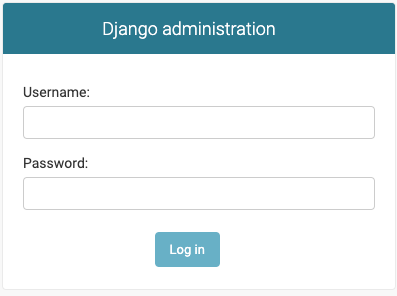

# Django快速上手

了解了Django的基本特点，并完成了相关开发环境准备后，接下来，我们将会从一个最简单的示例开始进行Django的学习。

## 创建第一个项目

Step1: 创建一个会议室管理项目，项目名称为meetingroom.

```shell
django-admin startproject meetingroom
cd meetingroom
```

Step2: 启动项目

```shell
python manage.py runserver 0.0.0.0:8080
```

Step3: 开发浏览器，访问 http://127.0.0.1:8080。

正常情况下，你会看到如下内容：


## 初识后台管理系统

Django的一大优势是其自带了一个强大的后台管理系统，及时不写一行前端代码，也能够有一个配套的Web页面进行相关的管理操作。

下面，我们就来了解一下Django的后台管理系统吧。

打开浏览器，访问 http://127.0.0.1:8080/admin ，你将会看到如下登录框：



但是，我们好像还没有创建任何用户呢！

下面，我们就先来创建一个用户。

创建用户之前，我们首先需要初始化Django内置表的数据库。

Ps: 由于Django默认使用了sqlite数据库，因此，再前期的实验环节，我们就不在额外搭建数据库了，而是使用默认的sqlite数据库。

初始化内置表的数据库的命令如下：

```shell
python3 manage.py migrate
# Operations to perform:
#   Apply all migrations: admin, auth, contenttypes, sessions
# Running migrations:
#   Applying contenttypes.0001_initial... OK
#   Applying auth.0001_initial... OK
#   Applying admin.0001_initial... OK
#   Applying admin.0002_logentry_remove_auto_add... OK
#   Applying admin.0003_logentry_add_action_flag_choices... OK
#   Applying contenttypes.0002_remove_content_type_name... OK
#   Applying auth.0002_alter_permission_name_max_length... OK
#   Applying auth.0003_alter_user_email_max_length... OK
#   Applying auth.0004_alter_user_username_opts... OK
#   Applying auth.0005_alter_user_last_login_null... OK
#   Applying auth.0006_require_contenttypes_0002... OK
#   Applying auth.0007_alter_validators_add_error_messages... OK
#   Applying auth.0008_alter_user_username_max_length... OK
#   Applying auth.0009_alter_user_last_name_max_length... OK
#   Applying auth.0010_alter_group_name_max_length... OK
#   Applying auth.0011_update_proxy_permissions... OK
#   Applying auth.0012_alter_user_first_name_max_length... OK
#   Applying sessions.0001_initial... OK
```

可以看到，我们创建了admin, auth, contenttypes, sessions等相关的数据库表。

下面，我们就可以使用命令行来添加用户了：

```shell
python3 ./manage.py createsuperuser 
# Username: missshi  
# Email address: wangzhe0912@tju.edu.cn
# Password: 
# Password (again): 
# Superuser created successfully.
```

可以看到，输出`createsuperuser`子命令后，会提供交互式命令行接收用户名、邮箱、密码等相关参数。

全部信息输入完成后，我们想要创建的用户也就创建完成了，下面我们可以用刚才创建的用户登录看看。

登录成功后，正常情况下你将会看到如下页面：


可以看到，在这个页面中，我们可以看到Groups和Users两种对象，这些都是Django框架内置的功能。

此时，如果你点击Users进入到User列表页面的话，还能够看到你刚才创建的用户。

甚至，你已经可以在这个页面中进行用户、用户组的创建和管理了。是不是非常赞呢？


## 创建一个应用

下面，我们需要创建一个职位管理系统的应用，这个应用需要实现的功能如下：

1. 管理员能够发布职位
2. 匿名用户能够浏览职位
3. 匿名用户能够投递简历


