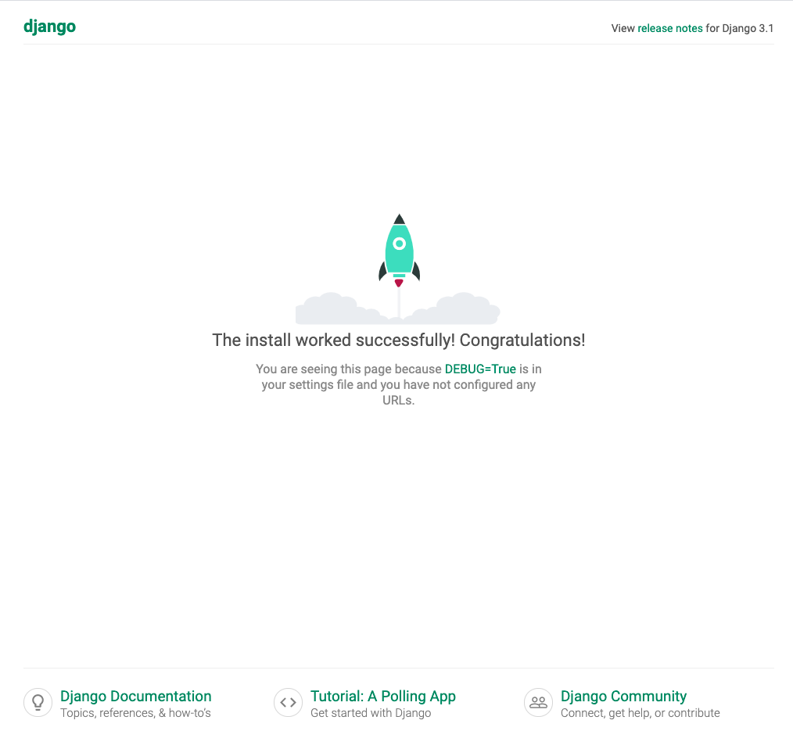

# Django快速上手

了解了Django的基本特点，并完成了相关开发环境准备后，接下来，我们将会从一个最简单的示例开始进行Django的学习。

## 创建第一个项目

Step1: 创建一个会议室管理项目，项目名称为meetingroom.

```shell
django-admin startproject meetingroom
cd meetingroom
```

Step2: 启动项目

```shell
python manage.py runserver 0.0.0.0:8080
```

Step3: 开发浏览器，访问 http://127.0.0.1:8080。

正常情况下，你会看到如下内容：




## 创建一个应用

下面，我们需要创建一个职位管理系统的应用，这个应用需要实现的功能如下：

1. 管理员能够发布职位
2. 匿名用户能够浏览职位
3. 匿名用户能够投递简历


