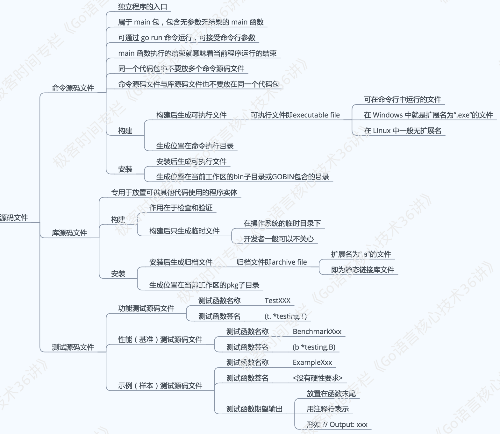

# 命令源码文件

## 前言

我们已经知道，环境变量 GOPATH 指向的是一个或多个工作区，每个工作区中都会有以代码包为基本组织形式的源码文件。

这里的源码文件又分为三种，即：命令源码文件、库源码文件和测试源码文件，它们都有着不同的用途和编写规则。



今天，我们就沿着命令源码文件的知识点展开进行学习。

一旦开始学习用编程语言编写程序，我们就一定希望在编码的过程中及时地得到反馈，只有这样才能清楚对错。
实际上，我们的有效学习和进步，都是通过不断地接受反馈和执行修正实现的。

对于 Go 语言学习者来说，你在学习阶段中，也一定会经常编写可以直接运行的程序。这样的程序肯定会涉及命令源码文件的编写，而且，命令源码文件也可以很方便地用go run命令启动。

那么，命令源码文件的用途是什么，怎样编写它？

**命令源码文件是程序的运行入口，是每个可独立运行的程序必须拥有的。我们可以通过构建或安装，生成与其对应的可执行文件，后者一般会与该命令源码文件的直接父目录同名。**

如果一个源码文件声明属于main包，并且包含一个无参数声明且无结果声明的main函数，那么它就是命令源码文件。 就像下面这段代码：

```go
package main

import "fmt"

func main() {
  fmt.Println("Hello, world!")
}
```

如果你把这段代码存成 demo1.go 文件，那么运行`go run demo1.go`命令后就会在屏幕（标准输出）中看到Hello, world!

PS：当需要模块化编程时，我们往往会将代码拆分到多个文件，甚至拆分到不同的代码包中。但无论怎样，对于一个独立的程序来说，命令源码文件永远只会也只能有一个。如果有与命令源码文件同包的源码文件，那么它们也应该声明属于main包。


## 知识精讲

### 命令源码文件怎样接收参数

无论是 Linux 还是 Windows，如果你用过命令行（command line）的话，肯定就会知道几乎所有命令（command）都是可以接收参数（argument）的。
通过构建或安装命令源码文件，生成的可执行文件就可以被视为“命令”，既然是命令，那么就应该具备接收参数的能力。

我们先看一段不完整的代码：

```go
package main

import (
  // 需在此处添加代码。[1]
  "fmt"
)

var name string

func init() {
  // 需在此处添加代码。[2]
}

func main() {
  // 需在此处添加代码。[3]
  fmt.Printf("Hello, %s!\n", name)
}
```

下面，我们一起来看看如何补齐这一段代码吧。

首先，Go 语言标准库中有一个代码包专门用于接收和解析命令参数。这个代码包的名字叫flag。

如果想要在代码中使用某个包中的程序实体，那么应该先导入这个包。
因此，我们需要在[1]处添加代码"flag"。
注意，这里应该在代码包导入路径的前后加上英文半角的引号。
如此一来，上述代码导入了flag和fmt这两个包。

其次，人名肯定是由字符串代表的。所以我们要在[2]处添加调用flag包的StringVar函数的代码。就像这样：

```go
flag.StringVar(&name, "name", "everyone", "The greeting object.")
```

其中，函数flag.StringVar接受 4 个参数：

第 1 个参数是用于存储该命令参数值的地址，具体到这里就是在前面声明的变量name的地址了，由表达式&name表示。
第 2 个参数是为了指定该命令参数的名称，这里是name。
第 3 个参数是为了指定在未追加该命令参数时的默认值，这里是everyone。
至于第 4 个函数参数，即是该命令参数的简短说明了，这在打印命令说明时会用到。

顺便说一下，还有一个与flag.StringVar函数类似的函数，叫flag.String。
这两个函数的区别是，后者会直接返回一个已经分配好的用于存储命令参数值的地址。

例如：

```go
var name = flag.String("name", "everyone", "The greeting object.")
```

再说最后一个填空。我们需要在[3]处添加代码flag.Parse()。
函数flag.Parse用于真正解析命令参数，并把它们的值赋给相应的变量。

对该函数的调用必须在所有命令参数存储载体的声明（这里是对变量name的声明）和设置（这里是在[2]处对flag.StringVar函数的调用）之后，并且在读取任何命令参数值之前进行。

正因为如此，我们最好把flag.Parse()放在main函数的函数体的第一行。

修改的代码如下：

```go
package main

import (
  "flag"
  "fmt"
)

var name string

func init() {
  flag.StringVar(&name, "name", "everyone", "The greeting object.")
}

func main() {
  flag.Parse()
  fmt.Printf("Hello, %s!\n", name)
}
```

### 运行命令源码文件时如何传入参数？

如果我们把上述代码存成名为 `demo2.go` 的文件，那么运行如下命令就可以为参数name传值：

```go
go run demo2.go -name="Robert"
```

运行后，打印到标准输出（stdout）的内容会是：`Hello, Robert!`

另外，如果想查看该命令源码文件的参数说明，可以这样做：

```bash
go run demo2.go --help
```

运行输出后可以得到如下结果：

```
Usage of /var/folders/ts/7lg_tl_x2gd_k1lm5g_48c7w0000gn/T/go-build155438482/b001/exe/demo2:
 -name string
    The greeting object. (default "everyone")
exit status 2
```

你可能不明白下面这段输出代码的意思，下面我们来进行详细的说明：

/var/folders/ts/7lg_tl_x2gd_k1lm5g_48c7w0000gn/T/go-build155438482/b001/exe/demo2 其实是go run命令构建上述命令源码文件时临时生成的可执行文件的完整路径。

如果我们先构建这个命令源码文件再运行生成的可执行文件，像这样：

```bash
go build demo2.go
./demo2 --help
```

那么输出结果会是：

```
Usage of ./demo2:
 -name string
    The greeting object. (default "everyone")
```

### 怎样自定义命令源码文件的参数使用说明？

Golang支持多种方式自定义参数的使用说明，最简单的一种方式就是对变量flag.Usage重新赋值。

flag.Usage的类型是func()，即一种无参数声明且无结果声明的函数类型。

flag.Usage变量在声明时就已经被赋值了，所以我们才能够在运行命令`go run demo2.go --help`时看到正确的结果。

Ps：对flag.Usage的赋值必须在调用flag.Parse函数之前。

现在，我们把 demo2.go 另存为 demo3.go，然后在main函数体的开始处加入如下代码：

```go
package main

import (
  "flag"
  "fmt"
)

var name string

func init() {
  flag.StringVar(&name, "name", "everyone", "The greeting object.")
}

func main() {
  flag.Usage = func() {
   _, _ = fmt.Fprintf(os.Stderr, "Usage of %s:\n", "question")
   flag.PrintDefaults()
  }
  flag.Parse()
  fmt.Printf("Hello, %s!\n", name)
}
```

那么，再次运行如下命令时：

```
go run demo3.go --help
```

可以看到：

```
Usage of question:
 -name string
    The greeting object. (default "everyone")
exit status 2
```

现在再深入一层，我们在调用flag包中的一些函数（比如StringVar、Parse等等）的时候，
实际上是在调用flag.CommandLine变量的对应方法。

flag.CommandLine相当于默认情况下的命令参数容器。
所以，通过对flag.CommandLine重新赋值，我们可以更深层次地定制当前命令源码文件的参数使用说明。


## 总结

你现在已经走出了 Go 语言编程的第一步。
你可以用 Go 编写命令，并可以让它们像众多操作系统命令那样被使用，甚至可以把它们嵌入到各种脚本中。

另外，如果你想详细了解flag包的用法，可以到[这个网址](https://golang.google.cn/pkg/flag/)查看文档。
或者直接使用godoc命令在本地启动一个 Go 语言文档服务器。怎样使用godoc命令？你可以参看[这里](https://github.com/hyper0x/go_command_tutorial/blob/master/0.5.md)。
