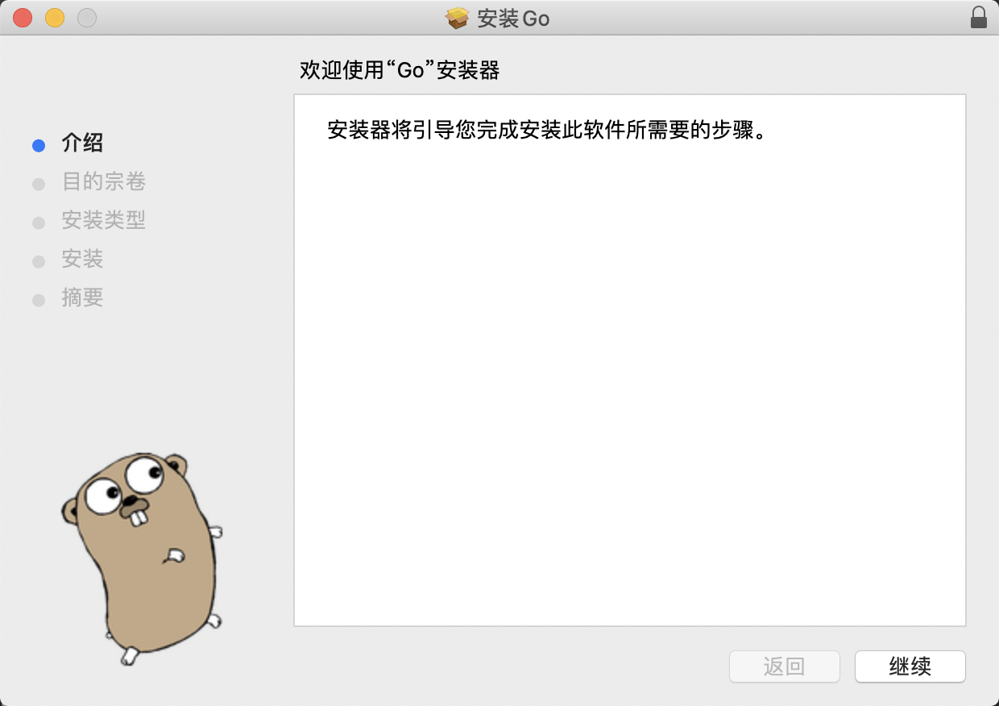

# Go开发环境搭建

在本文中，我们将会介绍如何搭建 Go 的开发环境，包括 Go 基础环境、 GoLand IDE 等。

Ps: 本文基于最新的 Golang 1.16.6 版本编写。

## 下载 golang

要搭建Go语言开发环境，我们第一步要下载go的开发工具包，目前最新稳定版本是 1.16.6 。
Go为我们所熟知的所有平台架构提供了开发工具包，比如我们熟知的Linux、Mac和Windows，其他的还有FreeBSD等。

Golang 下载地址: [https://golang.org/dl/](https://golang.org/dl/)

我们选择 Apple macOS 版本的 pkg 安装包进行下载。



Mac安装版下载后双击可以看到安装界面，按照提示一步步选择操作即可。

安装版默认安装目录(GOROOT)是`/usr/local/go`，并且也会自动的把`/usr/local/go/bin`目录加入到PATH环境变量中，
重新打开一个终端，就可以使用`go version`进行测试了.

```shell
go version
# go version go1.16.6 darwin/amd64
```

## GOPATH目录

自从 Golang 采用 Module 的方式管理项目后，GOPATH 目录已经不是那么重要了，
目前主要用来存放依赖的 Module 库，生成的可执行文件等。

我们可以在 `~/.bash_profile` 文件中增加 `GOPATH` 环境变量的配置，具体的路径可以根据自己的需求来配置。

```shell
export GOPATH=/Users/wangzhe/Desktop/go
```

该目录下有3个子目录，他们分别是：

 - bin: 存放go install命名生成的可执行文件，可以把GOPATH/bin路径加入到PATH环境变量里，就和我们上面配置的GOROOT/bin一样，
   这样就可以直接在终端里使用我们go开发生成的程序了。
 - pkg: pkg文件夹是存在go编译生成的文件。
 - src: src存放的是非Go Module项目源代码。


## Go 项目工程结构

配置好工作环境后，就可以编码开发了，在这之前，我们看下go的通用项目结构,这里的结构主要是源代码相应地资源文件存放目录结构。

基于Go Module，你可以在任意位置创建一个Go项目，而不再像以前一样局限在$GOPATH/src目录下。

假设我要创建一个tour项目，它位于`~/Desktop/tour`目录下，那我现在打开终端，cd 到`~/Desktop/tour`目录下，
输入如下命令即可创建一个Go Module工程。

```shell
mkdir ~/Desktop/tour
cd ~/Desktop/tour
go mod init flysnow.org/tour
# go: creating new go.mod: module flysnow.org/tour
```

上述命令会生成Go Module工程中的 `go.mod` 文件，文件内容如下：

```shell
module flysnow.org/tour

go 1.16
```

其中module flysnow.org/tour代表该项目的path,也就是最顶层的package，
go 1.16 表示该项目需要go 1.16版本及其以上才能编译运行。

go.mod文件是Go语言工具链用于管理Go语言项目的一个配置文件，我们不用手动修改它，Go语言的工具链会帮我们自动更新，比如当我们的项目添加一个新的第三方库的时候。

使用第三方库，也就是使用第三方库里的包，那么我们如何引用一个包呢，使用的就是go语言的import关键字，比如：

```go
import (
	"github.com/gohugoio/hugo/commands"
)
```

以上引入的github.com/gohugoio/hugo/commands这个包是属于 github.com/gohugoio/hugo/这个Go Module的。

所以相应的，我们也可以在我们自己的Go Module工程里创建一些包(其实就是子目录),
比如我创建了lib1目录，那么它的对应的包就是flysnow.org/tour/lib1,
其他包只有通过这个包名才能使用flysnow.org/tour/lib1包中的函数方法等。

```
.
├── go.mod
├── lib1
├── lib2
└── main.go
```

所以最后你的项目目录类似上面的结构，每个子目录都是一个包，子目录里可以放go文件。

## Hello World

好了，有了tour项目，就可以演示下Go语言版本的Hello World了，在tour根目录下的`main.go`（如没有这个文件，就新建一个）文件中，添加如下Go代码。

```go
package main

import (
	"fmt"
)

func main() {
	fmt.Println("Hello World")
}
```

Go版Hello World非常简单。在~/Desktop/tour目录下运行go run main.go命令就可以看到打印的输出Hello World，下面解释下这段代码:

1. package 是一个关键字，定义一个包，和Java里的package一样，也是模块化的关键。
2. main包是一个特殊的包名，它表示当前是一个可执行程序，而不是一个库。
3. import 也是一个关键字，表示要引入的包，和Java的import关键字一样，引入后才可以使用它。
4. fmt是一个包名，这里表示要引入fmt这个包，这样我们就可以使用它的函数了。
5. main函数是主函数，表示程序执行的入口，Java也有同名函数，但是多了一个String[]类型的参数。
6. Println是fmt包里的函数，和Java里的system.out.println作用类似，这里输出一段文字。

整段代码非常简洁，关键字、函数、包等和Java非常相似，不过注意，go是不需要以;(分号)结尾的。

## 安装程序

安装的意思，就是生成可执行的程序，以供我们使用，为此go为我们提供了很方便的install命令，可以快速的把我们的程序安装到$GOAPTH/bin目录下。

在~/Desktop/tour目录下运行如下代码即可安装。

```shell
go install flysnow.org/tour
```

打开终端，运行上面的命令即可，install后跟全路径的包名。 然后我们在终端里运行tour就看到打印的Hello World了:

```shell
~/Desktop/go/bin/tour
# Hell World
```

## 跨平台编译

之前的运行和安装，都是默认根据我们当前的机器生成的可执行文件，比如你的是Linux 64位，就会生成Linux 64位下的可执行文件，
比如我的Mac，可以使用go env查看编译环境,以下截取重要的部分。

```shell
GOARCH="amd64"
GOEXE=""
GOHOSTARCH="amd64"
GOHOSTOS="darwin"
GOOS="darwin"
GOROOT="/usr/local/go"
GOTOOLDIR="/usr/local/go/pkg/tool/darwin_amd64"
```

注意里面两个重要的环境变量GOOS和GOARCH,其中GOOS指的是目标操作系统，它的可用值为：

- aix
- android
- darwin
- dragonfly
- freebsd
- illumos
- js
- linux
- netbsd
- openbsd
- plan9
- solaris
- windows


一共支持13种操作系统。GOARCH指的是目标处理器的架构，目前支持的有：

- arm
- arm64
- 386
- amd64
- ppc64
- ppc64le
- mips
- mipsle
- mips64
- mips64le
- s390x
- wasm

一共支持12种处理器的架构，GOOS和GOARCH组合起来，支持生成的可执行程序种类很多，具体组合参考 
[https://golang.org/doc/install/source#environment](https://golang.org/doc/install/source#environment) 。

如果我们要生成不同平台架构的可执行程序，只要改变这两个环境变量就可以了，比如要生成linux 64位的程序，命令如下：

```shell
GOOS=linux GOARCH=amd64 go build flysnow.org/tour
```

前面两个赋值，是更改环境变量，这样的好处是只针对本次运行有效，不会更改我们默认的配置。

## 拉取远程包

由于国内的网络访问 google 等仓库时，存在一定的网络限制，因此，我们需要先配置代理，同时启用 go modules 模块来管理依赖库。

设置命令如下：

```shell
go env -w GO111MODULE=on
go env -w GOPROXY=https://goproxy.io,direct  # 或者 https://goproxy.cn
```

设置好代理后，就可以使用go提供的一个获取远程包的工具go get来获取远程包了,它需要一个完整的包名作为参数，
只要这个完整的包名是可访问的，就可以被获取到，比如我们获取一个CLI的开源库：

```shell
go get -v github.com/spf13/cobra
```

就可以下载这个库到我们$GOPATH/pkg/mod目录下了，这样我们就可以像导入其他包一样import了。

同时，在执行 `go get` 命令时，还会将对应的第三方依赖库的信息会写入 `go.mod` 文件中。

```gomod
require github.com/spf13/cobra v1.2.1 // indirect
```

此外，还会生成一个对应的 `go.sum` 文件，来记录对应的依赖的版本信息。

如果我们使用的远程包有更新，我们可以使用如下命令进行更新,多了一个`-u`标识:

```shell
go get -u -v github.com/spf13/cobra
```

此外，如果我们想要下载指定版本的第三方依赖时，下载的方式如下：

```shell
go get -v knative.dev/pkg@v0.0.0-20191024051936-4befa47ec54b
```

即可以在依赖模块名称后使用@追加版本号下载。

如果是对于一个已有的项目（已经存在对应的 `go.mod` 文件），我们想要本地安装全部依赖的话其实非常简单，只要执行如下命令即可：

```shell
go mod download
```

## 获取 gitlab 私有库包

如果是私有的git库怎么获取呢？比如在公司使用gitlab搭建的git仓库，设置的都是private权限的。

这种情况下我们可以配置下git，就可以了，在此之前你公司使用的gitlab必须要在7.8之上。然后要把我们http协议获取的方式换成ssh，
假设你要获取http://git.flysnow.org，对应的ssh地址为git@git.flysnow.org，那么要在终端执行如下命令。

```shell
git config --global url."git@git.flysnow.org:".insteadOf "http://git.flysnow.org/"
```

这段配置的意思就是，当我们使用http://git.flysnow.org/获取git库代码的时候，实际上使用的是git@git.flysnow.org这个url地址获取的，
也就是http到ssh协议的转换，是自动的，他其实就是在我们的`~/.gitconfig`配置文件中，增加了如下配置:

```
[url "git@git.flysnow.org:"]
	insteadOf = http://git.flysnow.org/
```

然后需要把git.flysnow.org加入GOPRIVATE环境变量中，因为它是你的私有仓库，不需要走GOPROXY代理:

```shell
# 设置不走 proxy 的私有仓库，多个用逗号相隔（可选）
go env -w GOPRIVATE=git.flysnow.org
```

现在我们就可以使用go get直接获取了，比如：

```shell
go get -v -insecure git.flysnow.org/hello
```

仔细看，多了一个-insecure标识，因为我们使用的是http协议，是不安全的。
当然如果你自己搭建的gitlab支持https协议，就不用加-insecure了，同时把上面的url insteadOf换成https的就可以了。

## Goland 安装

Go采用的是UTF-8的文本文件存放源代码，所以原则上你可以使用任何一款文本编辑器。

目前，关于 Go 语言开发有一款非常流行的 IDE: GoLand，它是 jetbrains 针对 Go 这门语言提供的 IDE，可以去
[https://www.jetbrains.com/go/](https://www.jetbrains.com/go/) 下载使用。

Goland 的安装非常简单，直接使用下一步进行正常安装即可，此处不再赘述。

关于 Goland 的更多使用介绍可以参考 [文档](https://www.k8stech.net/go-book/ch2/readme2.html) 。
