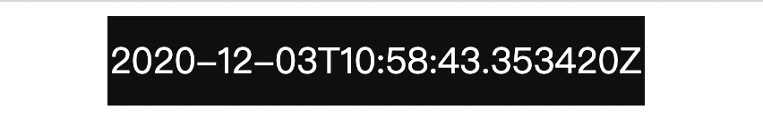

# Flask websocket协议实战

在[Python实战websocket协议](./websockets.md)中，我们已经了解了如果使用Python实践基本的websocket协议。

而对于更加常用的场景，我们以Flask框架为例，来演示如何实现更加复杂的应用。

## flask_sockets介绍

flask_sockets是一个基于Python3的，用于扩展Flask框架以支持websocket协议的Python第三方库。

安装方式如下：

```bash
pip3 install flask_sockets
```


## 基于Flask实现的websocket接口

保存如下内容至`flask_ws_server.py`文件：

```python
# -*- coding: UTF-8 -*-
"""
# www.missshi.cn
"""
from flask import Flask
from flask_sockets import Sockets
import datetime
import time


app = Flask(__name__)
sockets = Sockets(app)


@sockets.route('/echo')
def echo_socket(ws):
    """
    # WebSocket接口实现
    :param ws:
    :return:
    """
    while not ws.closed:
        now = datetime.datetime.now().isoformat() + 'Z'
        ws.send(now)  #发送数据
        time.sleep(1)


@app.route('/')
def hello():
    """
    # HTTP接口
    :return:
    """
    return 'Hello World!'


if __name__ == "__main__":
    from gevent import pywsgi
    from geventwebsocket.handler import WebSocketHandler
    server = pywsgi.WSGIServer(('', 5000), app, handler_class=WebSocketHandler)
    print('server start')
    server.serve_forever()
```


## 前端Demo访问websocket接口

为了能够更加直观的体验websocket接口的功能，我们需要一个前端页面来进行可视化显示。

保存如下内容为`index.html`文件：

```html
<!DOCTYPE html>
<html lang="en">
<head>
    <meta charset="UTF-8">
    <title>Title</title>
    <script src="https://cdn.bootcss.com/jquery/3.2.0/jquery.js"></script>
</head>
<body>
    <div id="time" style="width: 300px;height: 50px;background-color: #0C0C0C;
    color: white;text-align: center;line-height: 50px;margin-left: 40%;font-size: 20px"></div>

    <script>
            var ws = new WebSocket("ws://127.0.0.1:5000/echo");

            ws.onmessage = function (event) {
                content = document.createTextNode(event.data);
                $("#time").html(content);
            };

    </script>
    </body>
</html>
```

使用浏览器打开`index.html`文件即可看到如下内容：



可以看到，浏览器中的时间每隔1s会进行一次变化。
