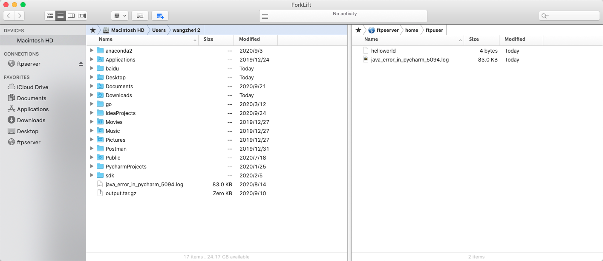

# Ubuntu系统下搭建FTP服务器

## 环境准备

在本文中，我们将会以 Ubuntu 20.04 版本的操作系统为例，演示如何快速搭建一个FTP服务器。

## Step By Step

**Step1: 安装FTP服务器**

```bash
sudo apt-get install vsftpd
```

简单一条命令，其实我们就已经完成了FTP服务的安装，接下来我们需要创建对应的用户并修改相关配置文件使其生效。

**Step2：创建FTP用户**

```bash
# 创建用户
sudo useradd -m ftpuser

# 设置用户密码
sudo passwd ftpuser
```

至此，FTP用户已经成功创建好了，下面，我们来修改FTP服务的相关配置文件

**Step3：修改FTP配置文件**

```bash
sudo vim /etc/vsftpd.conf
```

此时，为了能够让我们的FTP服务器能够正常运行，我们仅仅只需要修改开启write_enable即可：

```bash
# Uncomment this to enable any form of FTP write command.
write_enable=YES
```

其他配置可以保持不变。

**Step4：重启FTP服务使配置生效**

```bash
service vsftpd restart
```

此时，FTP服务已经正常启动了，接下来我们就可以正常使用FTP服务了。

## FTP服务文件上传下载

### 客户端工具

我们以Mac为例，可以选择使用 ForkLift 客户端软件来与FTP服务器进行交互。



### 命令行工具

除了客户端外，我们最常用的命令行工具就是 *wget* 工具了。

```bash
wget ftp://${username}:${password}@{hostname}:${port}/{filepath}
```

其中，FTP协议的默认端口是21，如果没有修改端口的话，可以不用传入端口信息。
