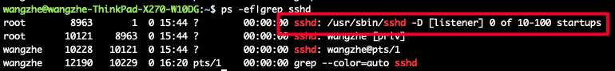

# Linux系统开启远程ssh访问

## 什么是SSH？

SSH通过在网络中创建安全隧道来实现SSH客户端与服务器之间的连接。
SSH最常见的用途是远程登录系统，人们通常利用SSH来传输命令行界面和远程执行命令。

## 开启步骤

Linux系统开启远程ssh访问的方法非常简单，仅需要安装ssh服务端并启动即可。

下面，我们以Ubuntu系统为例。

Step1: 安装ssh服务端

```bash
sudo apt-get install openssh-server
```

Step2: 检查ssh服务端是否正常启动

```bash
ps -ef|grep sshd
```



在上图中，我们可以看到 `/usr/sbin/sshd` 进程，那么就说明我们的ssh服务端已经正常启动了。

Step3: 如果没有找到ssh服务端进程，则可以使用如下命令重启ssh服务端

```bash
service ssh restart
```

接下来，你就可以在一台网络相互联通的机器上通过 `ssh` 命令进行尝试远程登录了。
