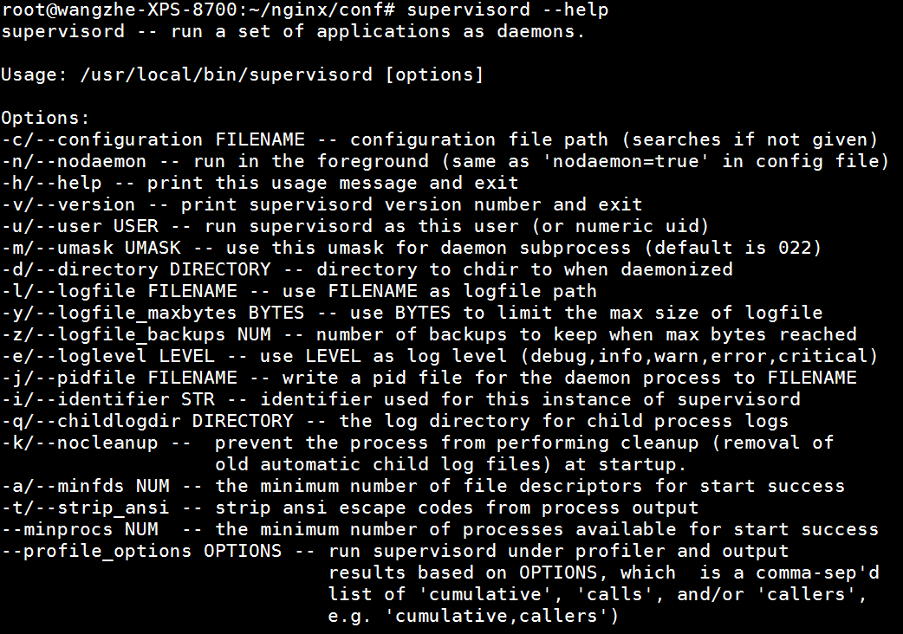
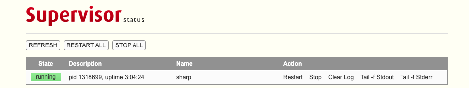

# supervisor 进程托管系统

Supervisor是用Python开发的一套通用的进程管理程序，能将一个普通的命令行进程变为后台daemon，并监控进程状态，异常退出时能自动重启。

它是通过fork/exec的方式把这些被管理的进程当作supervisor的子进程来启动，这样只要在supervisor的配置文件中，把要管理的进程的可执行文件的路径写进去即可。

也实现当子进程挂掉的时候，父进程可以准确获取子进程挂掉的信息的，可以选择是否自己启动和报警。

supervisor还提供了一个功能，可以为supervisord或者每个子进程，设置一个非root的user，这个user就可以管理它对应的进程。


## 安装

Supervisor是一个用Python开发的进程管理程序。因此，可以使用Python自带的包管理工具`pip`进行安装。

```bash
pip install supervisor
```

安装完成后，我们可以测试一下是否已经安装完成：

```bash
supervisord --help
```

正常情况下我们可以看到如下内容：




## 配置解析

在命令行中执行如下命令 `echo_supervisord_conf` 可以看到在标准输出中输出了一份标准的配置文件模板。

我们可以将其重定向到某个文件中，从而生成一个配置文件:

```bash
echo_supervisord_conf > /home/work/supervisor/conf/supervisord.conf
```

此时，我们将会得到一个文件 `/home/work/supervisor/conf/supervisord.conf`。

下面我们来浅谈一下配置文件的内容，从上至下，依次包括如下Section：

1. unix_http_server，其中，file指定了socket file的位置。
2. inet_http_server，用于启动一个含有前端的服务，可以从Web页面中管理服务。其中，port用于设置访问地址，username和password用于设置授权认证。
3. supervisord是对管理服务本身的配置。包含日志文件相关、进程文件、启动方式等等。
4. rpcinterface:supervisor中包含了rpc相关的接口。
5. supervisorctl是对supervisorctl服务相关的配置。
6. program是真正配置需要管理的任务。
7. eventlistener是对事件进行的管理。
8. group可以实现对任务组的管理。
9. include中可以引用其他的配置文件。

推荐使用方式：

将系统相关配置文件写在一个配置文件中，而在这个配置文件中的include Section中引入一个文件夹。具体的服务管理机制则针对每个任务单独编写文件。

下面，我们可以给出一个demo的配置文件：

```bash
[unix_http_server]
file=/tmp/supervisor.sock  

[inet_http_server]     
port=*:9001   
username=user        
password=123

[supervisord]
logfile=/tmp/supervisord.log ; main log file; default $CWD/supervisord.log
logfile_maxbytes=50MB        ; max main logfile bytes b4 rotation; default 50MB
logfile_backups=10           ; # of main logfile backups; 0 means none, default 10
loglevel=info                ; log level; default info; others: debug,warn,trace
pidfile=/tmp/supervisord.pid ; supervisord pidfile; default supervisord.pid
nodaemon=false               ; start in foreground if true; default false
minfds=1024                  ; min. avail startup file descriptors; default 1024
minprocs=200                 ; min. avail process descriptors;default 200

[rpcinterface:supervisor]
supervisor.rpcinterface_factory = supervisor.rpcinterface:make_main_rpcinterface

[supervisorctl]
serverurl=unix:///tmp/supervisor.sock ; use a unix:// URL  for a unix socket

[include]
files = /etc/supervisord.d/*.ini
```

具体的进程托管命令如下，`/etc/supervisord.d/logstash.ini`文件：

```bash
[program:nianshi_logstash]
command=/root/logstash/logstash-6.2.2/bin/logstash -f /root/logstash/conf/logstash.conf
startsecs=3               
user=root            
stdout_logfile=/root/logstash/log/stdout.log
stderr_logfile=/root/logstash/log/stderr.log
environment=PYTHONPATH=$PYTHONPATH:/home/wangzhe/bcm-onlinecheck/alarm-online-check
directory=/home/wangzhe/bcm-onlinecheck/alarm-online-check
```

## Web管理界面

可以看到在之前的配置中，我们增加了如下内容：

```bash
[inet_http_server]     
port=*:9001   
username=user        
password=123
```

该配置表示我们开启了9001端口提供一个Web服务，登录的用户名、密码分别是user, 123。

supervisor服务启动后，访问对应的URL并登录后，可以看到如下页面：



在该页面中，我们可以查询托管进程的状态，也能够启动、停止、重启对应的托管进程。


## 常见使用方式

### 启动

当我们完成配置文件的准备后，就可以启动supervisord服务了。

```bash
supervisord -c /home/nianshi/supervisor/conf/supervisord.conf
```

其中，-c用于指定配置文件。

当发生错误时，我们可以使用-n参数运行从而可以在前端运行，方便定位原因。

### 服务管理

除了使用supervisord进行服务启动外，针对单独的服务，我们还可以使用supervisorctl进行服务管理。

一、启动指定的服务

```bash
supervisorctl start test123
```

二、停止指定的服务

```bash
supervisorctl stop test123
```

三、更新配置文件变化并重启变化的服务

```bash
supervisorctl update
```

四、重启相关服务

```bash
supervisorctl reload
```
