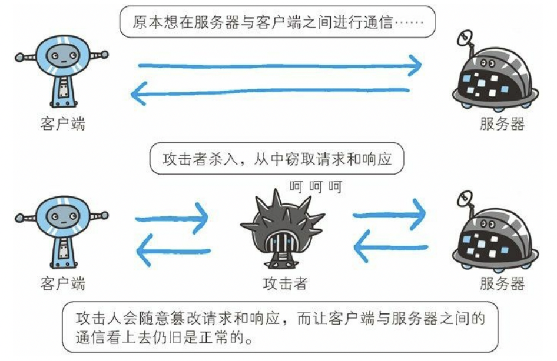
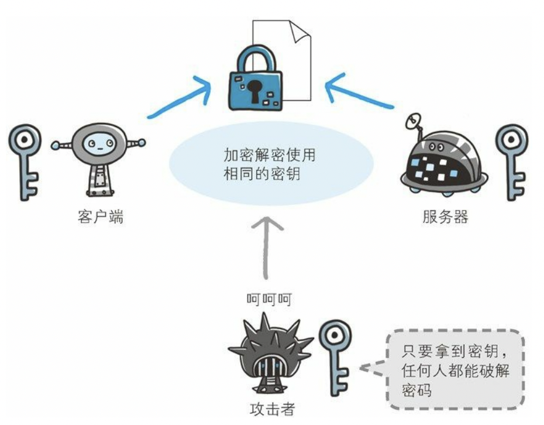
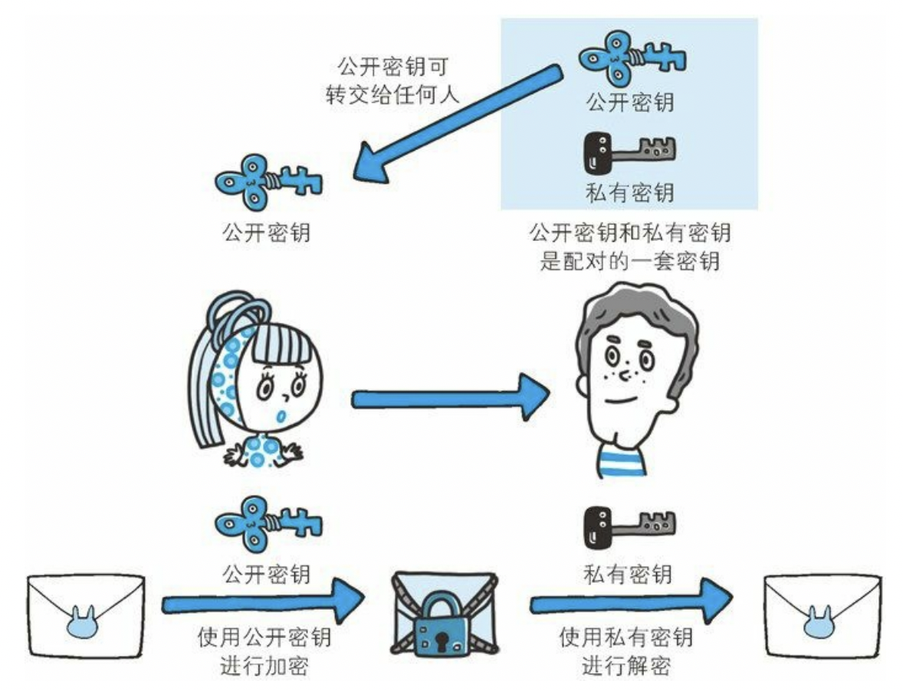
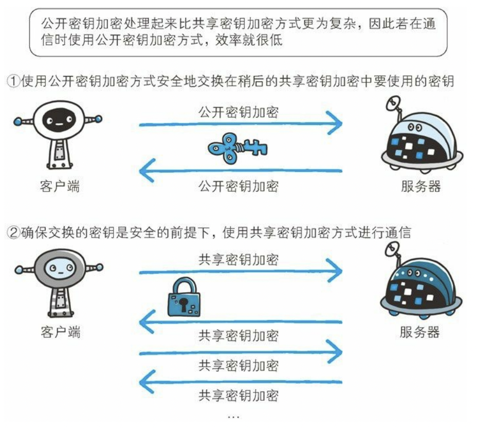
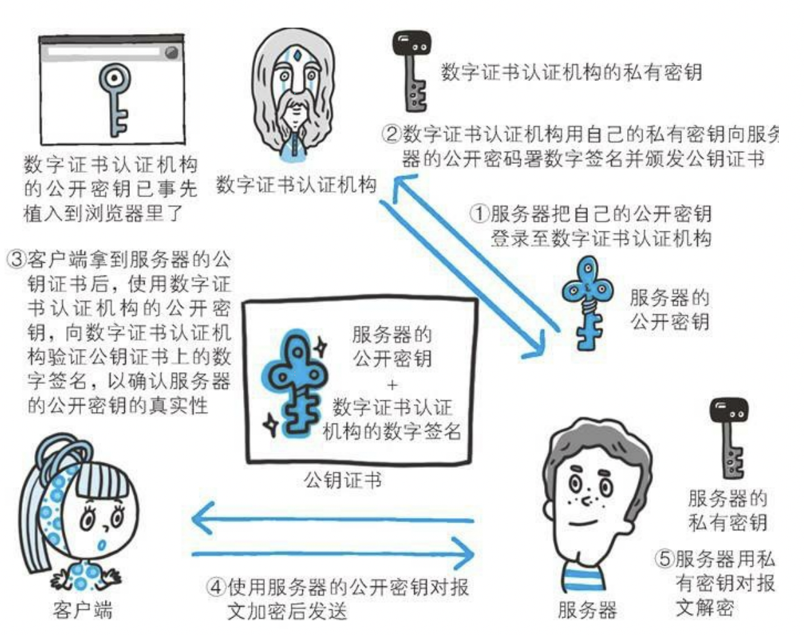
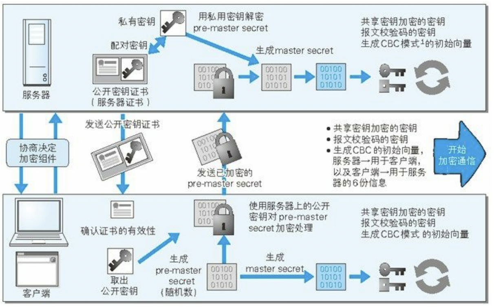

# HTTPS 协议实战

## 为什么需要 HTTPS ？

HTTP 中存在如下一些缺点，例如:

 - 通信使用明文（不加密），内容可能会被窃听。
 - 不验证通信方的身份，因此有可能遭遇伪装。
 - 无法证明报文的完整性，所以内容有可能遭到篡改。

这其实不仅仅是 HTTP 的问题，而是所有未加密的协议中都有可能出现的问题。

## 窃听风险

在 TCP/IP 协议族中的工作机制中，通信内容在所有通信线路上都有可能遭到窥视。如下图所示:


那么，怎么才能加密处理才能防止被窃听呢？加密的方式通常有如下两种:

### 通信的加密

HTTP 协议本身没有加密机制，可以通过和 SSL 或 TLS 的组合使用，加密 HTTP 通信内容，这就是典型的通信的加密。

具体来说，用 SSL 建立安全通信线路之后，就可以在这条线路上进行 HTTP 通信了。
与 SSL 组合使用的 HTTP 被称为 HTTPS 或 HTTP over SSL 。


### 内容的加密

除了直接对通信的加密，还可以直接对传输的内容本身进行加密，即把 HTTP 报文里包含的内容进行加密处理。
这个的前提是客户端和服务端同时具备加密和解密的能力。

## 通信方伪装风险

HTTP 协议中的请求和响应不会对通信方进行确认，也就说存在『服务器是否就是发送请求中 URI 真正指定的主机』、
『返回的响应是否真的返回到实际提出请求的客户端』等类似问题。

在 HTTP 通信协议中，不存在确认通信方的处理步骤，任何人都可以发起请求，
服务器也不会关心是谁发起的请求，都会返回对应的响应。


虽然使用 HTTP 协议无法确定通信方，但使用 SSL 协议则可以具备相应能力。
SSL 不仅仅可以用于数据加密处理，还使用了一种被称为『证书』的手段，可以用于确认通信方。

证书由值得信任的第三方机构颁发，用于证明服务器和客户端是实际存在的。
而伪造证书从技术角度来说是一件异常困难的事，因此只要能确认通信方（服务器/客户端）持有的证书，就可以判断出对应的来源。


## 内容遭遇风险

由于 HTTP 协议无法证明通信的报文完整性，因此无法确认发出的请求/响应和接收到的请求/响应是前后相同的。




像上图所示，在请求或响应的传输途中，遭到攻击者拦截并篡改内容的攻击称为中间人攻击。

在 SSL 中，提供的摘要等相关的功能，可以有效的保证 HTTP 消息的完整性。

## HTTPS (HTTP + 加密 + 认证 + 完整性保护) 原理


HTTPS 就是指在 HTTP 协议的基础上，提供了通信加密、证书认证和完整性保护相关的功能。

在对 SSL 进行讲解时，我们先来讲解一下加密方法。
例如 SSL 采用的是 **公开密钥加密** 的加密处理方式。

目前，加密的算法其实都是公开的，只有密钥才是保密的，正式通过密钥的保密来实现的加密方案的安全性。

加密和解密都会用到密钥。没有密钥就无法对密码进行解密，反过来说，任何人只要持有密钥就能解密了。

### 对称加密(共享密钥)

加密和解密同用一个密钥的方式称为**对称加密**。



以共享密钥方式加密时必须将密钥也发给对方。可怎么才能把密钥安全的传输呢？

### 非对称加密(公开密钥)

公开密钥加密方式很好地解决了共享密钥加密的困难。

公开密钥加密使用一对非对称的密钥。
一把叫做私有密钥（private key），另一把叫做公开密钥（public key）。
顾名思义，私有密钥不能让其他任何人知道，而公开密钥则可以随意发布，任何人都可以获得。

而由于公开密钥和私有密钥的内容其实是不一样的，这就是所谓的『非对称加密』。

使用公开密钥加密方式，发送密文的一方使用对方的公开密钥进行加密处理，对方收到被加密的信息后，
再使用自己的私有密钥进行解密。
利用这种方式，不需要发送用来解密的私有密钥，也不必担心密钥被攻击者窃听而盗走。



### HTTPS 加密

HTTPS 采用**共享密钥加密和公开密钥加密两者并用的混合加密机制**。

公开密钥加密与共享密钥加密相比，其处理速度要慢，但无法保证密钥的安全传输。

所以应充分利用两者各自的优势，将多种方法组合起来用于通信。
在交换密钥环节使用公开密钥加密方式，之后的建立通信交换报文阶段则使用共享密钥加密方式。



### 身份认证机制

通过共享密钥加密和公开密钥加密两者的结合，HTTPS 有效的实现了数据传输过程中的加密机制。

下面，我们来看一下 HTTPS 是如何解决身份认证机制的吧。

HTTPS 中的身份认证机制是由数字证书认证机构（CA）和其相关机关颁发的公开密钥证书实现的。

具体来说，数字证书认证机构处于客户端与服务器双方都可信赖的第三方机构的立场上。

首先，服务器的运营人员向数字证书认证机构提出公开密钥的申请。

然后，数字证书认证机构在判明提出申请者的身份之后，会对已申请的公开密钥做数字签名。

接下来，分配这个已签名的公开密钥，并将该公开密钥放入公钥证书后绑定在一起。

服务器会将这份由数字证书认证机构颁发的公钥证书发送给客户端，以进行公开密钥加密方式通信。
公钥证书也可叫做数字证书或直接称为证书。

接到证书的客户端可使用数字证书认证机构的公开密钥，对那张证书上的数字签名进行验证，
一旦验证通过，客户端便可明确两件事：
一. 认证服务器的公开密钥的是真实有效的数字证书认证机构。
二. 服务器的公开密钥是值得信赖的。

此处认证机关的公开密钥必须安全地转交给客户端。
使用通信方式时，如何安全转交是一件很困难的事。
因此，多数浏览器开发商发布版本时，会事先在内部植入常用认证机关的公开密钥。



上图展示了对于一个WEB服务器而言，是如何使用 HTTPS 进行加密和身份认证的完整流程。

除了直接对服务端进行认证，HTTPS 其实也支持对客户端进行认证。
以客户端证书进行客户端认证，证明服务器正在通信的对方始终是预料之内的客户端，其作用跟服务器证书如出一辙。

不过对于客户端证书而言，通常存在如下两个问题：

1. 是证书的获取及发布。客户端证书需要用户自行购买和安装，对用户充满挑战。
2. 客户端证书毕竟只能用来证明客户端实际存在，而不能用来证明用户本人的真实有效性。

因此，目前的客户端证书其实仅仅在部分的领域中应用而已。

### 自签名证书

我们之前提到了 CA 机构，也就是说通过 CA 机构可以颁发认证的数字签名。

而其实我们自己也可以使用 OpenSSL 这套开源程序，自己搭建一套属于自己的认证机构，
从而可以自己给自己颁发服务器证书。

Ps: 不过这套颁发的证书在互联网上（各个浏览器）并没有内置公开密钥信息，因此浏览器在判断证书的可靠性时，默认会不信任。

独立构建的认证机构叫做自认证机构，由自认证机构颁发的证书也被戏称为自签名证书。



客户端与服务器进行 HTTPS 协议通信的流程如上图所示。

## HTTPS 实战

了解了 HTTPS 相关的原理之后，我们来进行一些相关的 HTTPS 实战吧！

### 创建相关证书

首先，我们需要使用 OpenSSL 二进制程序来制作相关程序用到的公钥证书、私钥等。

Step1: 生成 CA 的证书和私钥

```sh
openssl req -nodes -new -x509 -days 3650 -keyout ca.key -out ca.crt -subj "/CN=Virtual Environment Admission Controller Webhook CA"
```

其中：`ca.key` 表示 CA 私钥，`ca.crt` 表示 CA 证书。

Step2: 生成服务器私钥

```sh
openssl genrsa -out webhook-server-tls.key 2048
```

其中: `webhook-server-tls.key` 表示服务器私钥

Step3: 为私钥生成证书签名请求 (CSR)，并使用 CA 的私钥对其进行签名。

```sh
openssl req -new -key webhook-server-tls.key -subj "/CN=webhook-server.kt-virtual-environment.svc" \
    | openssl x509 -req -days 3650 -CA ca.crt -CAkey ca.key -CAcreateserial -out webhook-server-tls.crt
```

其中: 

1. `webhook-server-tls.crt` 表示服务器公钥证书（包含公钥和CA私钥签名）。
2. `webhook-server.kt-virtual-environment.svc` 表示了服务器的访问地址，客户端验证证书时，会验证访问地址是否与证书中的地址一致。

### 搭建 HTTPS 服务

下面，我们编写一个简单的 Flask WEB 服务来实现一个 HTTPS 服务的搭建：

```python
from flask import Flask
app = Flask(__name__)

@app.route("/")
def hello():
    return "Hello World!"

if __name__ == "__main__":
    app.run(ssl_context=('webhook-server-tls.crt', 'webhook-server-tls.key'))
```

### 编写 HTTPS 客户端

下面，我们还是使用 python requests 客户端来发送 HTTPS 请求。

```python
import requests

url = "https://webhook-server.kt-virtual-environment.svc:5000/"
response = requests.get(url, verify="ca.crt")
print(response.content)
```
