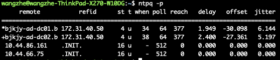

# Ubuntu系统中安装NTP服务器

## 什么是NTP服务

为了避免Linux系统的主机，在长时间运行下所导致的时间偏差，因此需要对时间进行时间同步(synchronize)。

我们一般使用ntp服务来同步不同机器的时间，NTP 是网络时间协议（Network Time Protocol）的简称，它是通过UDP协议，对时间进行同步的。


## NTP服务器安装与配置

下面，我们以 Ubuntu 20.04 操作系统为例，讲解如下安装与配置NTP服务器。

### NTP服务器的安装

在Ubuntu系统中，NTP服务器的安装非常的检查，仅需要执行如下命令即可：

```bash
sudo apt-get install ntp
```

### NTP服务器的配置

NTP服务器的配置文件为: `/etc/ntp.conf`。

在国内的场景下，我们可以直接修改 `/etc/ntp.conf` 文件如下：

```
driftfile /var/lib/ntp/ntp.drift
statistics loopstats peerstats clockstats
filegen loopstats file loopstats type day enable
filegen peerstats file peerstats type day enable
filegen clockstats file clockstats type day enable
server s1a.time.edu.cn prefer
server s2a.time.edu.cn
server s2b.time.edu.cn
server s2e.time.edu.cn
server 127.127.1.0
fudge 127.127.1.0 stratum 5
restrict -4 default kod notrap nomodify nopeer noquery
restrict -6 default kod notrap nomodify nopeer noquery

restrict 192.168.1.0 mask 255.255.255.0 nomodify
```

其中需要注意最后一行：

```bash
restrict 192.168.1.0 mask 255.255.255.0 nomodify
```

restrict 用于权限相关控制，其基本语法为：

```bash
restrict ${IP地址} mask ${子网掩码} ${参数}
```

其中:

1. IP地址也可以是default ，default 就是指所有的IP。
2. 参数支持如下选项：
    1. ignore ：关闭所有的 NTP 联机服务。
    2. nomodify：客户端不能更改服务端的时间参数，但是客户端可以通过服务端进行网络校时。
    3. notrust ：客户端除非通过认证，否则该客户端来源将被视为不信任子网。NTP4.2 版本以后使用会出错。
    4. noquery ：不提供客户端的时间查询：用户端不能使用ntpq，ntpc等命令来查询ntp服务器。
    5. notrap ：不提供trap远端登陆：拒绝为匹配的主机提供模式 6 控制消息陷阱服务。PS：陷阱服务是 ntpdq 控制消息协议的子系统，用于远程事件日志记录程序。
    6. nopeer ：用于阻止主机尝试与服务器对等，并允许欺诈性服务器控制时钟。
    7. kod ： 访问违规时发送 KoD 包。
    8. restrict -6 表示IPV6地址的权限设置。


修改完成配置文件后，我们需要使用如下命令重启NTP服务：

```bash
service ntp restart
```

### NTP服务器功能验证

NTP服务器配置文件修改完成并重启服务后，我们可以执行如下命令进行服务可用性与上级联通性验证：

```bash
ntpq -p
```


