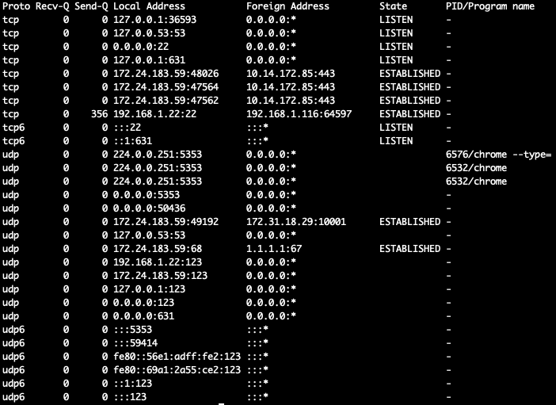
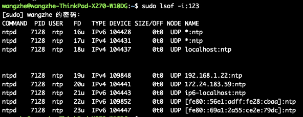
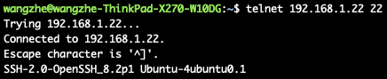
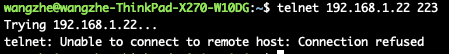
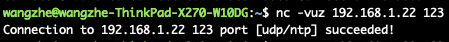
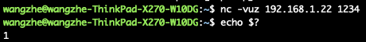

# Linux系统中的端口存活查询与验证

## 前言

在Linux系统中，我们常常需要查询某个端口是否存在，例如:

1. 验证某个服务/进程是否正常启动，最简单的方法就是验证该端口是否存在。
2. 服务启动失败时，判断是否端口已经被其他进行占用时，也需要验证该端口是否已经被绑定。

对于很多同学来说，可能都知道一些常见的命令，例如 `lsof`、 `telnet` 等命令，但是对相关命令往往并不是很了解，因此在使用过程中经常会遇到各种问题。
为此，我们将在本文中针对Linux中端口的检查和存活性验证进行详细的说明。 

## 端口查询

查询端口占用情况最常用的工具就是 `netstat` 以及 `lsof` 了，下面，我们来依次讲解两个命令:

### netstat

netstat用来查看系统当前系统网络状态信息，包括端口，连接情况等，常用方式如下:

```
netstat -atunlp
```

其中，各个参数的含义如下：

1. -t : 指明显示TCP端口
2. -u : 指明显示UDP端口
3. -l : 仅显示监听套接字(LISTEN状态的套接字)
4. -p : 显示进程标识符和程序名称，每一个套接字/端口都属于一个程序
5. -n : 不进行DNS解析
6. -a : 显示所有连接的端口



当前，在上面的输出中，我们会直接得到所有的端口绑定信息，查询起来比较复杂，因此，我们常常会搭配 `grep` 命令来使用，查询对应的进程或指定的端口。

### lsof

lsof的作用是列出当前系统打开文件(list open files)。
通过-i参数也能查看端口的连接情况，-i后跟冒号端口可以查看指定端口信息，直接-i是系统当前所有打开的端口。

最简单的使用方式如下：

```
lsof -i:${ports}
```



## 端口存活性验证

为了验证某一端口是否能够正常访问，我们常常会使用的命令就是 `telnet` 和 `nc` 了，下面来进行具体的说明：

### telnet

telnet是一个用于验证TCP端口连接情况的命令行工具，常用使用方式如下：

```bash
telnet ${ip} ${port}
```

连接成功时，示例如下：



连接失败时，示例如下：




### nc

telnet命令仅适用于tcp协议的端口验证，对于udp协议的端口而言，则需要使用 `nc` 来进行验证。

Ubuntu下的安装方式:

```bash
apt-get install netcat
```

UDP端口检测方式：

```bash
nc -vuz ${ip} ${port}
```

其中:

1. -v 表示打印详细模式
2. -u 表示UDP协议，默认为TCP协议
3. -z 表示仅检测端口，不发送数据

连接成功时，示例如下：



连接失败时，示例如下：


