# 浅谈nginx架构

接下来，在本文中，我们将会和大家浅谈 nginx 的架构和设计。

只有了解了 Nginx 的架构和设计方案，我们才能更好的发挥出 nginx 的优势。

## Nginx 的请求处理流程

首先，我们来了解一下一个请求进入 Nginx 后，整体的处理流程是什么样的。

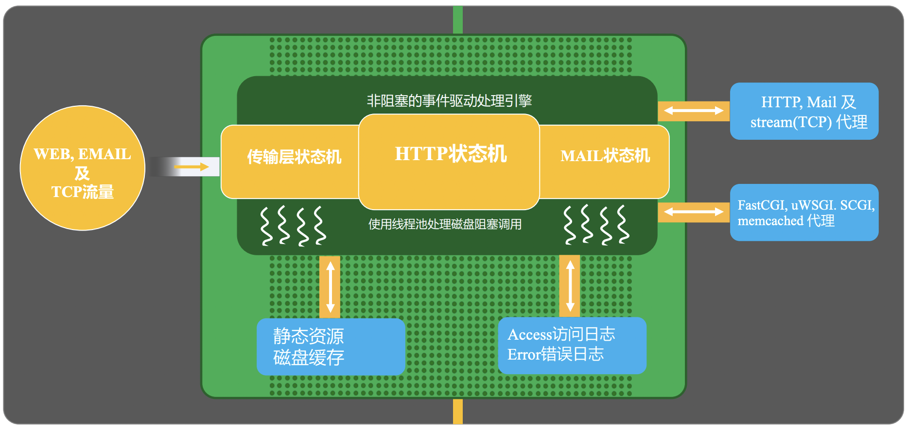

1. 首先nginx接收到输入流量主要是WEB、EMAIL和TCP流量。
2. 由于 Nginx 本身的机制是非阻塞式的 epoll 进行事件驱动处理，因此，为了能够正常实现异步处理，其内部维护了传输层状态机、HTTP状态机、以及MAIL状态机。
3. 对于一个静态资源下载的请求而言，Nginx会直接访问本地的静态资源并通过sendfile的方式进行返回，再涉及到磁盘IO相关的操作时，Nginx维护了一个线程池用于实现磁盘阻塞调用。
4. 对于一个反向代理请求时，Nginx可以将请求转发给对应的代理服务中。
5. 当请求处理完成后，nginx会打印access访问日志和错误日志。


## Nginx 的进程结构

了解了 Nginx 请求处理的主体流程之后，我们再从进程层面了解一下 nginx 的进程结构。

Nginx 本身支持两种不同的进程结构，分别是单进程结构和多进程结构，其中，单进程结构并不适合生产结构，我们此处不再进行说明。

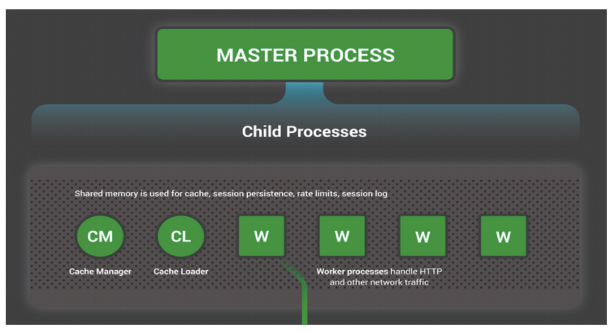

首先，nginx 有一个统一的父进程: master process，主要用于整体的管理。

其中，该父进程又会包含很多子进程，这些子进程大致可以分为2个大类：

1. worker进程，负责真正的请求处理。
2. cache相关进程，包括 cache manager 和 cache loader，负责缓存的管理和载入。

首先，我们先来了解一下nginx为什么选择多进程而非多线程呢？

我们都知道，对于多线程而言，它们会复用内存空间。而一旦出现内存处理异常时，多线程的服务会全部异常，而多进程则影响会小很多。因此，从可用性的
角度来看，Nginx选择了多进程这样的模式。

此外，为了更好的发挥出 nginx 的能力，我们通过会设置 worker 数量与机器的 CPU 数量一致，同时进行绑核，减少缓存失效等问题。

下面，我们通过一些具体的命令操作来观察一下Nginx中各个进程的关系。

首先，我们启动一个包含2个worker进程的nginx服务。Ps: 修改nginx配置文件中worker_processes为2。

```shell
# (base) root@wangzhe-swarm-dev:/home/wangzhe/nginx# ps -ef|grep nginx
root     23382     1  0 09:15 ?        00:00:00 nginx: master process ./sbin/nginx
nobody   23383 23382  0 09:15 ?        00:00:00 nginx: worker process
nobody   23384 23382  0 09:15 ?        00:00:00 nginx: worker process
nobody   23385 23382  0 09:15 ?        00:00:00 nginx: cache manager process
nobody   23386 23382  0 09:15 ?        00:00:00 nginx: cache loader process
root     23390 24374  0 09:15 pts/1    00:00:00 grep --color=auto nginx
```

可以看到，和我们预期的是一样的，查询到的nginx进程包括:

1. 一个master进程。
2. 两个worker进程。
3. 一个cache manager进程。
4. 一个cache loader进程。
5. 其中，master进程是其他所有进程的父进程。

下面，我们可以执行一个 reload 的操作，然后再观察一下进程的变化情况：

```shell
./sbin/nginx -s reload
ps -ef|grep nginx
```

得到的结果如下:

```shell
# (base) root@wangzhe-swarm-dev:/home/wangzhe/nginx# ps -ef|grep nginx
root     23382     1  0 09:15 ?        00:00:00 nginx: master process ./sbin/nginx
nobody   23832 23382  0 09:18 ?        00:00:00 nginx: worker process
nobody   23833 23382  0 09:18 ?        00:00:00 nginx: worker process
nobody   23834 23382  0 09:18 ?        00:00:00 nginx: cache manager process
root     23985 24374  0 09:19 pts/1    00:00:00 grep --color=auto nginx
```

可以看到，master进程的PID没有发生变化，而其他几个子进程的的PID发生了变化，也就是说明了 worker 和 cache进程等在reload操作时，会被master优雅退出原有进程并重新启动新的进程。

下面，我们可以试试当某个worker进程异常退出时会发生什么呢？

```shell
kill 23833
ps -ef|grep nginx
```

观察结果如下:

```shell
# (base) root@wangzhe-swarm-dev:/home/wangzhe/nginx# ps -ef|grep nginx
root     23382     1  0 09:15 ?        00:00:00 nginx: master process ./sbin/nginx
nobody   23832 23382  0 09:18 ?        00:00:00 nginx: worker process
nobody   23834 23382  0 09:18 ?        00:00:00 nginx: cache manager process
nobody   26401 23382  0 09:23 ?        00:00:00 nginx: worker process
root     26403 24374  0 09:23 pts/1    00:00:00 grep --color=auto nginx
```

虽然，原有的`23833`号进程退出了，但是nginx master很快就有创建出来了一个新的子进程，保证nginx worker的存活数量始终满足配置文件的要求。

## 使用信号管理 Nginx 进程

Nginx 本身是一个多进程的程序。 Nginx 进程时间的通信和管理主要也是依赖信号来实现的。

下面，我们来具体看一下是如何通过信号来管理Nginx进程的吧。

### Master 进程

对于 Master 进程而言，最重要的工作之一就是管理 worker 进程了。

而 Master 管理 Worker 进程中最核心的任务就是监控 Worker 进程是否向 Master 进程发送了 CHLD 信号。

Ps: 在 Linux 系统中，如果子进程退出，则会向父进程发送 CHLD 信号。

此外，Master 进程还可以接收一些外部信号来管理 Worker 进程，例如可以接收的信号包括:

 - TERM, INT: 立即停止Nginx进程。
 - QUIT: 优雅停止NGINX进程。
 - HUP: 重载配置文件。
 - USR1: 重新打开新的日志文件，进行日志文件的切割。
 - USR2: 启动热部署，启动一个新的NGINX Master，并自动实现无损流量切换。
 - WINCH: 热部署中，停止旧的NGINX Worker进程。


### Nginx 命令行

在 Nginx 命令行中，我们可以实现一些基础的对 Nginx Master的信号发送。

具体来说：

 - reload: HUP 信号
 - report: USR1 信号
 - stop: TERM 信号
 - quit: QUIT 信号

## Nginx Reload 完整流程

Step1: 向 Nginx Master 进程发送 HUP 信号(reload命令)

Step2: Master 进程检查Nginx最新的配置文件语法是否正确

Step3: Master 进程打开新的监听端口

Step4: Master 进程用新配置启动新的worker子进程

Step5: Master 进程向老的worker子进程发送QUIT信号

Step6: 老的Worker子进程关闭监听句柄，处理完当前连接后结束进程。

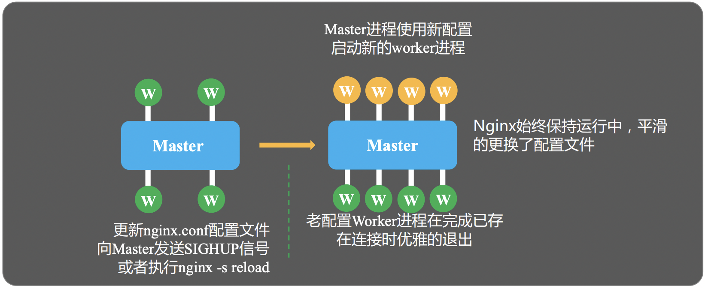

## 热升级完整流程

Step1: 将旧Nginx文件换成新的Nginx二进制文件（注意备份）。

Step2: 向Master进程发送USR2信号。

Step3: Master进程修改pid文件名，加后缀.oldbin

Step4: Master进程用新的Nginx二进制文件启动新Master进程。

Step5: 向老Master进程发送QUIT信号，关闭老Master。

Step6: 回滚: 向老Master发送HUP信号，向新Master发送QUIT信号。

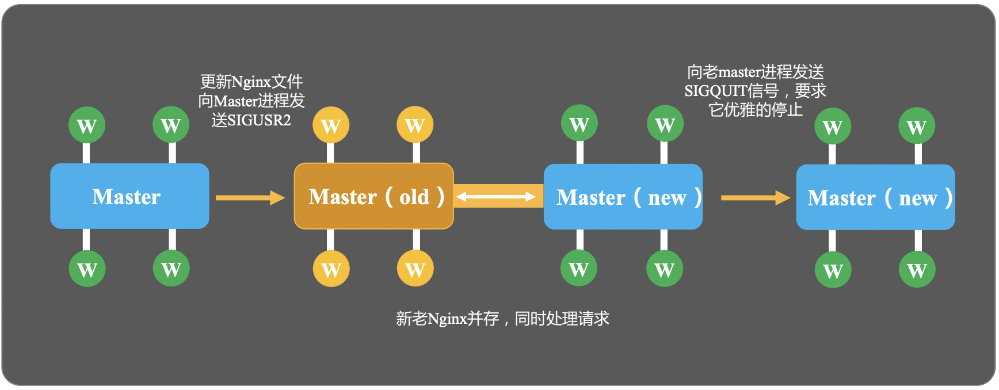


## Worker 优雅退出的步骤

Worker 优雅退出主要针对的是**HTTP请求**。对于websocket或TCP/UDP等协议，优雅退出是无效的。

Step1: 设置定时器 worker_shutdown_timeout。

Step2: 关闭监听句柄。

Step3: 关闭空闲连接。

Step4: 循环中等待全部连接关闭。

Step5: 退出进程。


## Nginx 网络收发相关管理

对于一个网络传输请求而言，在一个主机A访问主机B的请求中，数据流是如何传递的呢？

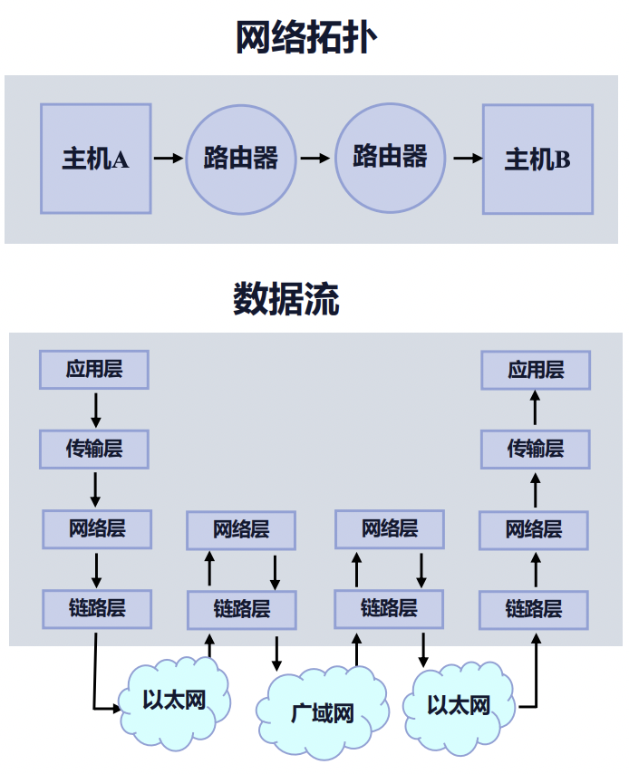

上面的数据流转中，设计到了应用层、传输层、网络层和数据链路层等多个层级的共同作用，那么每一层具体是如果工作的呢？
最终传输的报文又是什么样的？

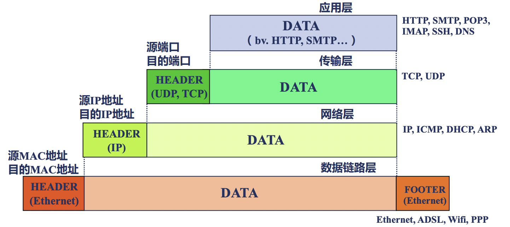

在TCP协议中，每一个报文其实就对应着一个网络事件。

具体来说，在网络事件的分类中，我们用可以把网络事件分为读事件和写事件。

其中，

 - 读事件包括 Accept 建立连接以及 Read 读消息。
 - 写事件包括 Write 写消息。

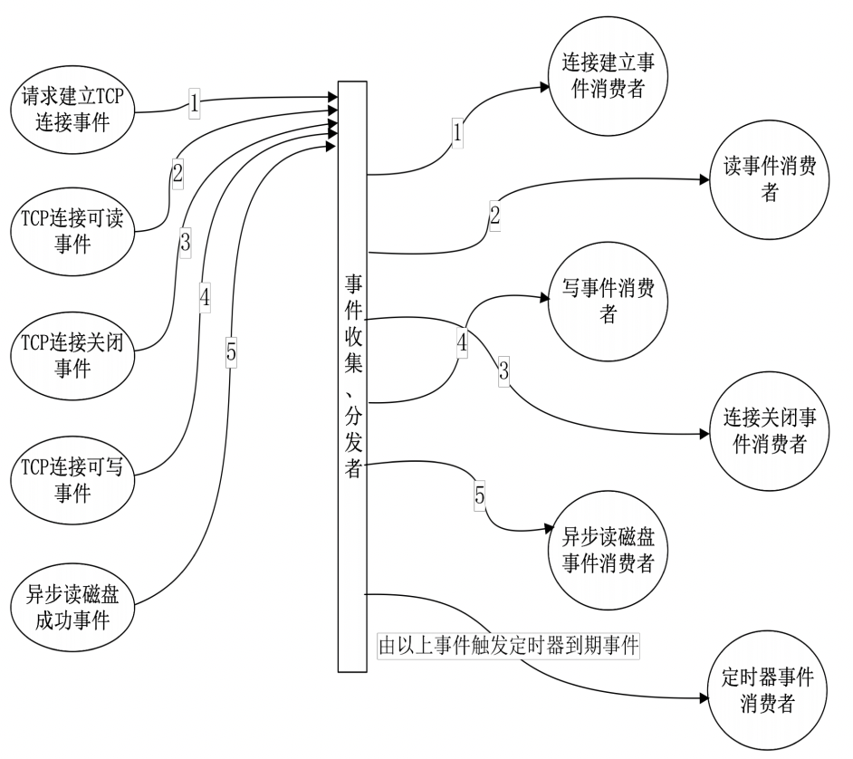

上图显示了一个事件分发的消费器。

## Nginx 的事件处理机制

Nginx 整体的事件处理机制大体如下图所示:

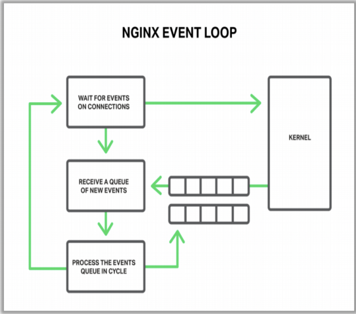


1. Nginx 启动后，就会建立一个连接等待接收事件。
2. 一旦 Linux 内核接收到网络事件时，就会通过队列的形式发送给 Worker 进行执行。
3. worker 执行事件动作时，也可能会产生一些新的事件会继续发给到内核中，等待后续执行。


在上面的流程中，如何从内核中快速的获取到等待处理的事件其实是非常核心的关键点，那么 Nginx 具体是怎么实现的呢？

**epoll**是Nginx从内核中获取等待事件的核心机制。

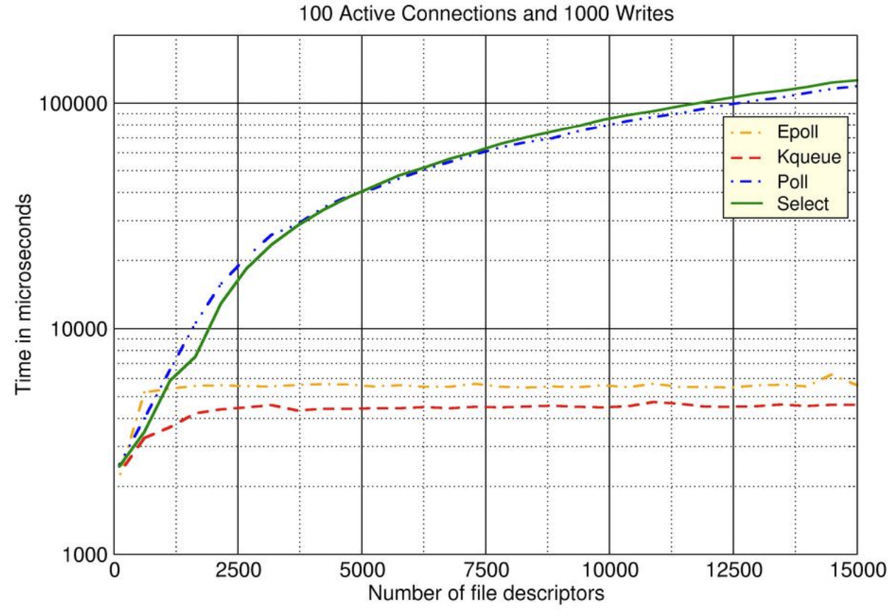

上图表示了对几种不同的事件模型的性能的benchmark测试结果。

其中：

 - 横轴表示文件句柄连接数。
 - 纵轴表示了一次事件处理的耗时。

可以看出epoll随着并发连接数的不断上升，事件处理的耗时相对非常平稳，因此，可以看出 epoll 事件模型非常适合于处理大并发的任务。

在我们日常开发时，我们都知道在处理一下网络请求等相关任务中，异步请求往往比同步等待的效率要高很多。

而Nginx自身能达到很高的性能，也与它选择了非阻塞调用而非阻塞调用有关。

以下图为例:

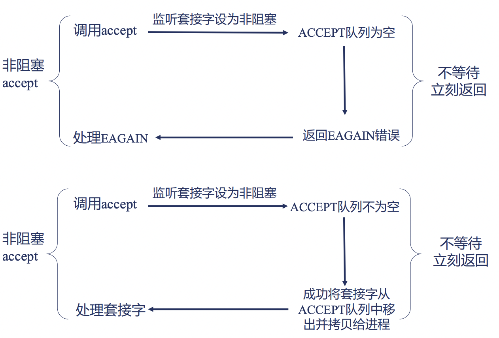

Nginx 在调用 accept 时，如果 accept 队列为空，其实有两种处理方式:

 - 阻塞调用: 进入sleep, 等到 accept 队列收到事件后再处理，这次操作系统会对齐产生进程间切换，让CPU先来处理其他进程的任务。
 - 非阻塞调用，直接返回某个错误，代码自主来控制是进行等待还是进行下一个任务的处理，不会被操作系统自动进行进程切换。

由此可见，非阻塞调用的最大的好处之一是可以通过代码来自主控制何时发生进程切换，不会过于频繁的进行进程切换导致性能下降。

而正式由于Nginx底层的非阻塞调用的实现，哪怕我们在OpenResty中编写的是简单的同步代码，实际底层仍然会是非阻塞的，不会导致性能下降。

## Nginx 的模块

Nginx 的模块设计非常的优雅和精良，对于一些第三方开发者而言，也可以很轻松的编写 Nginx 模块并集成至 Nginx 中。

了解具体的 Nginx 模块时，往往包括如下几个内容：

 - 将对应模块编译进入Nginx中
 - 该模块提供了哪些配置项
 - 如果启用该模块，该模块在何时会生效
 - 该提供提供了哪些变量可以供我们使用


Nginx 官方模块的文档可以参考 [文档](https://nginx.org/en/docs/) 。

官方模块的支持往往都会配有相对完整的文档描述，然而对于一些第三方开发的模块而言，有可能文档就没有那么完善了。

不过不要怕，我们可以通过阅读源码的方式，按照一些技巧快速找到我们需要的内容。

首先，在我们编译 Nginx 之前，会先支持 `./configure` 命令，该命令执行完成后，会生成一个 `objs/` 目录。

在该目录中会包含一个 `ngx_modules.c` 的文件，打开这个文件，你会看到，在这个文件中有一个 ngx_modules 的数组，
这个数组中包含了所有将要编译进入 Nginx 中的模块。

而对于每个模块的源代码而言，默认路径位于 `src/http/modules/` 目录下。

以 gzip 模块为例，我们可以看一下 `src/http/modules/ngx_http_gzip_filter_module.c` 文件。

其中，一定唯一包含一个 nginx_command_t 的数据，它的每一个成员都是它所支持的一个指令名称。

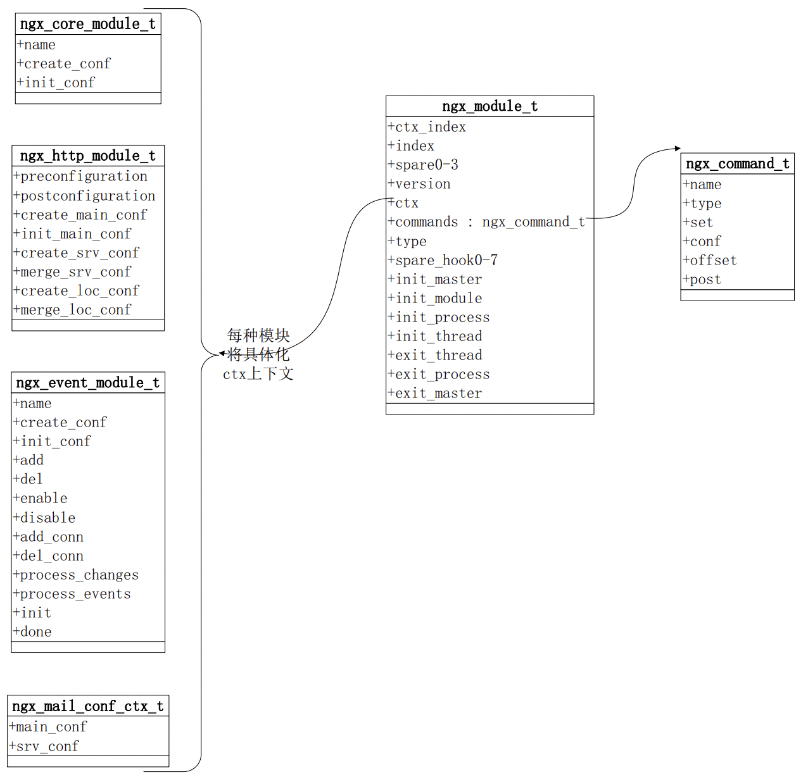

即对于每个 nginx 模块而言，都对应一个 nginx_module_t 这样的结构体，其中又包含的 commands 指定了该模块支持了哪些指令。

此外，nginx 对应不同应用场景的模块又分为了几个不同的大类，例如 core, http, event, stream, mail等，

对于一个 nginx 模块而言，首先，它应该是高内聚的，即它的功能应该是特定且直接的。
同时，它也应该能够被很好的抽象，可以按照统一的机制进行执行。


## Nginx 进程间通信方式

我们已经知道 Nginx 是一个多进程的程序，它的多个 worker 进程之间，往往需要互相通信来共享数据，那么 Nginx 是如何实现多进程通信的呢？

答案是: 共享内存。

下面，我们看一下 Nginx 的共享内存究竟是如何实现的。 即申请一个内存空间，允许多个worker进程同时进行访问和写入。

这里面有两个关键实现:

1. 锁: 具体来说，为了避免多个进程的访问冲突，我们一定需要一个锁机制，目前的主要机制为自选锁，即while true循环。
2. Slab 内存管理器: 提供统一的接口对各个模块使用。

那么，Nginx 在哪些场景下使用了共享内存呢？

 - 红黑树: 如限速、流控、cache、ssl等场景。
 - 单链表: 如upstream_zone。
 - http_lua_api。

