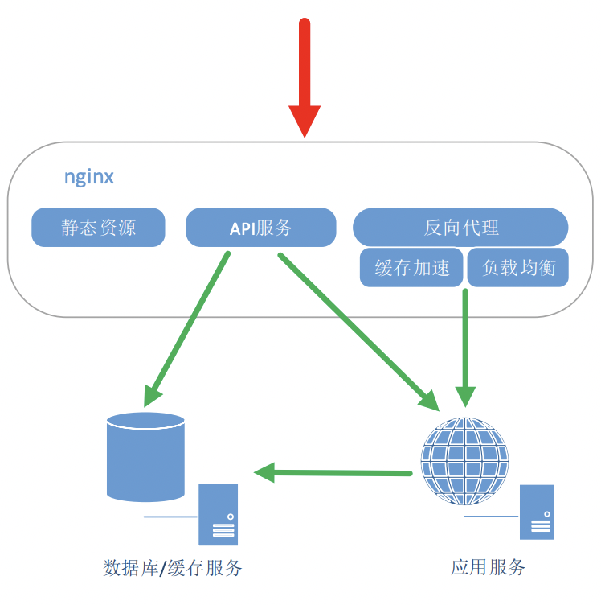
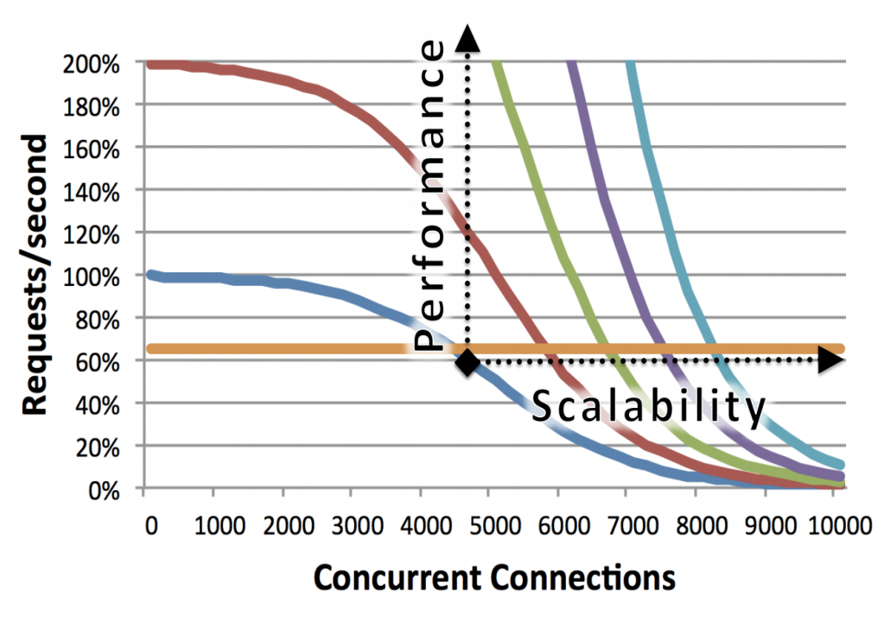

# 初识Nginx

## Nginx 使用场景

首先，我们来看一下 Nginx 是什么？它主要用来做什么。

Nginx 有三个主要场景，分别是：

 - 静态资源服务: 例如通过本地文件系统提供服务，将本地文件实现远程可访问。
 - 反向代理服务: 得益于Nginx的强大性能，常用语于例如负载均衡，缓存等场景。
 - API服务: 主要是指通过OpenResty的扩展从而实现API服务，可以作为网关或流量代理。

## Nginx 的优点

那么，Nginx 主要有哪些优点呢？大致总结一下，主要体现在：

 - 高并发、高性能。
 - 可扩展，丰富的生态圈。
 - 高可靠性，可以长时间的为稳定运行。
 - 热部署，可以在不停止服务的情况下对Nginx进行升级。
 - BSD许可，开源、免费、可以自定义修改。

相对来说，Nginx 同时具备了高并发和高性能的特点。

## Nginx 的组成

Nginx 的组成非常简单，主要包含如下四个部分：

