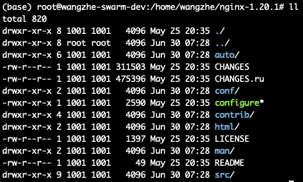

# 初识Nginx

## Nginx 使用场景

首先，我们来看一下 Nginx 是什么？它主要用来做什么。

Nginx 有三个主要场景，分别是：

 - 静态资源服务: 例如通过本地文件系统提供服务，将本地文件实现远程可访问。
 - 反向代理服务: 得益于Nginx的强大性能，常用语于例如负载均衡，缓存等场景。
 - API服务: 主要是指通过OpenResty的扩展从而实现API服务，可以作为网关或流量代理。


## Nginx 的优点

那么，Nginx 主要有哪些优点呢？大致总结一下，主要体现在：

 - 高并发、高性能。
 - 可扩展，丰富的生态圈。
 - 高可靠性，可以长时间的为稳定运行。
 - 热部署，可以在不停止服务的情况下对Nginx进行升级。
 - BSD许可，开源、免费、可以自定义修改。


相对来说，Nginx 同时具备了高并发和高性能的特点。

## Nginx 的组成

Nginx 的组成非常简单，主要包含如下四个部分：


## Nginx 版本选择

Nginx 的下载地址如下: [https://nginx.org/en/download.html](https://nginx.org/en/download.html)

目前，Nginx 最新的 Mainline 版本是 1.21.0，Stable 稳定版本为 1.20.1。

Ps: 其中，中间版本号为奇数时，为主线开发版本，中间版本号为偶数时，为 Stable 稳定版本。

对于普通用户而言，建议使用Stable版本，而如果想要体验新功能的话，则可以使用mainline版本。


点击CHANGES，可以清楚的看到每个发布版本中的修改内容，包括新功能，Bugfix等以及发布信息。


上图表示了 nginx 近些年来发版、Bugfix、重构、新功能等的变化数量。

**NginxPlus**

Nginx 本身是开源的，不过同时 Nginx 也提供了商业版本。

- 开源版本Nginx的地址是: nginx.org
- 商业版本NginxPlus的地址是：nginx.com

那他们有什么区别呢？

商业版本的NginxPlus在第三方工具整合，使用支持方面有更好的支持，但是缺点是它并不开源，因此，其实我们并不常使用NginxPlus。

**Tengine**

Tengine 是阿里巴巴在 Nginx 的基础上，针对大访问量的需求，添加了很多高级功能和特性。Tengine 在阿里的产品中得到的有效的验证，
同时，Tengine也是一个开源项目，我们也可以参与其中进行开发和共建，但是由于Tengine是基于Nginx历史版本进行改造的，无法始终与Nginx保持版本同步，
因此，Tengine的版本往往落后于Nginx版本很多，因此其实我们也并不推荐。

**开源版OpenResty**

OpenResty 是针对 Nginx 扩展了 Lua 语言开发第三方插件。

通过 Lua 的扩展，OpenResty 可以同时以非常低成本和便捷的方式来开发第三方插件，从而快速的扩展Nginx的功能。

**商业版OpenResty**

商业版OpenResty相比社区版而言，主要是增加了技术支持，因此，我们其实并不常用商业版的OpenResty。

## Nginx 的编译与安装

Nginx 的安装主要可以分为两种方式：

 - yum, apt-get 等包管理工具快速安装。
 - 源码编译安装。

其中，通过yum, apt-get等工具安装时，有一个非常大的问题，就是我们无法设置对应的编译参数，例如开启哪些模块等。

因此，在Nginx安装时，我们通常会使用源码编译的方式进行安装。

使用源码编译、安装Nginx主要分为以下4个步骤：

1. 下载 Nginx 源码
2. Configure
3. 编译 Nginx
4. 安装 Nginx


Step1: 下载所需的 nginx 包，我们以 1.20.1 的 stable 版本为例：

```shell
wget https://nginx.org/download/nginx-1.20.1.tar.gz
tar -zxvf nginx-1.20.1.tar.gz
cd nginx-1.20.1
```

解压后的目录结构如下:



其中：

 - auto目录：包含cc, lib, os, types 等相关目录，用于辅助编译和跟进操作系统进行相关判断。
 - CHANGES: 显示每个版本的迭代功能特性
 - conf: 示例配置文件目录
 - configure: 配置脚本
 - contrib: 包含 vim 的 nginx 高亮插件等，可以 `cp -r contrib/vim/* ~/.vim/` 实现nginx vim页面高亮显示
 - html: 提供了index.html和50x的html页面
 - man目录包含了nginx的相关帮助文档
 - src目录包含nginx的源码


Step2: Configure 设置编译配置

首先，我们来看一下配置脚本支持哪些参数：


其中，一些常用参数如下：

 - prefix 指定了nginx编译后的安装目录。
 - modules-path 指定了动态引入模块的模块路径。
 - with-xxx_module 表示启用哪些nginx内置模块。
 - without-xxx_module 表示禁用哪些nginx内置模块。
 - with-xxx 表示指定依赖对应的目录，例如pcre, openssl等依赖的目录等。

一个最简单的nginx配置命令如下：

```shell
./configure --prefix=/home/wangzhe/nginx
```

在执行完 `configure` 命令后，会生成一些中间文件，文件文件位于`objs`目录下。
其中，最核心的文件是`nginx_modules.c`文件，它表明了在接下来的编译过程中，有哪些模块需要编译进来。

Step3: 编译

接下来的操作就非常简单了，只需要执行`make`进行编译即可：

```shell
make
```

其中，生成的二进制nginx文件同样位于`objs`目录下。

Step4: 安装

编译完成后，执行如下命令即可安装:

```shell
make install
```

Ps: 如果是首次安装，可以直接执行上述命令，但是如果希望做热升级，则不能直接进行`make install`，后续我们会讲解如何进行热升级。


## Nginx 的配置文件语法概述

了解了如何进行 Nginx 安装后，下面我们先来初步了解一下 nginx 的配置文件语法。

nginx 的配置语言语法主要包含如下几点：

 - 配置文件由指令块和指令组成。
 - 每条指令以 ; 分号结尾，指令和参数之间使用空格进行分隔。
 - 指令块以 {} 大括号将多条指令组织在一起。
 - include 语句允许组合多个配置以提升可维护性。
 - nginx配置文件中使用 # 进行行注释。
 - nginx配置文件中使用 $ 来使用变量。
 - 部分指令的参数支持正则表达式。


一个示例如下：


nginx 中涉及到时间的配置通常支持如下单位:

1. ms: 毫秒
2. s: 秒
3. m: 分钟
4. h: 小时
5. d: 天
6. w: 周
7. M: 月
8. y: 年

nginx 中涉及到空间大小的配置通常支持如下单位:

1. 无单位: 字节
2. k/K: KB
3. m/M: MB
4. g/G: GB

nginx 中的指令块主要包含如下4个：

1. http: 内部的所有指令均针对http协议，由http模块进行解析。
2. server: 对于一个/组域名，表示对外提供的服务。
3. upstream: 表示上游服务。
4. location: url表达式。


## Nginx 的命令行常用操作

通过 nginx 的命令行，我们可以实现 nginx 管理的全部操作，例如 nginx 的启动、停止、重新加载配置文件、热升级等等一系列操作。

通过`nginx -h`可以查询nginx命令行的帮助文档。

基本的语法格式如下:

```shell
nginx [-?hvVtTq] [-s signal] [-p prefix] [-e filename] [-c filename] [-g directives]
```

其中：

 - -c 指定配置文件。
 - -g 指定配置指令，即可以在命令行中覆盖配置文件中的指令。
 - -p 指定运行目录。
 - -s 用于发送信号，常用的信号包括 stop（立即停止服务），quit（优雅停止服务），reload（重新加载配置文件），reopen（重新开始记录日志文件）
 - -t/T 用于测试配置文件是否语法错误。
 - -v/V 用于打印版本和编译信息等。 


常用的命令如下：

**重载配置文件**

当 nginx 的配置文件发生修改后，我们需要让 nginx 对配置文件进行重载后，修改后的配置文件才能生效。

```shell
./sbin/nginx -s reload
```

**热部署**

热部署是指当前 nginx 已经处于生产环境中正在运行了，此时，我们下载了一个新的nginx，希望对nginx进行无损升级。

Step1: 替换 nginx 二进制文件

```shell
mv nginx nginx.old
cp nginx_new nginx
```

Step2: 发送热部署信号给Nginx Master

```shell
kill -USR2 ${nginx master pid}
```

Step3: 此时， nginx 会启动一个新的 Nginx Master 进行，并自动实现无损流量切换。

Step4: 发送优雅退出信号给旧的Nginx Master，让旧的Nginx Worker进程优雅退出。

```shell
kill -WINCH ${nginx master pid}
```

Step5: 当确认升级没有问题后，可以再次kill掉旧的Nginx Master进程。

**日志切割**

通过nginx命令行，我们还可以实现Nginx日志的文件切割，避免单个文件过大。

```shell
# 第一步: 备份已经打印的nginx日志
mv logs/access.log logs/access.log.bk
# 第二步: 发送命令让nginx重新打印日志
./sbin/nginx -s reopen
```
