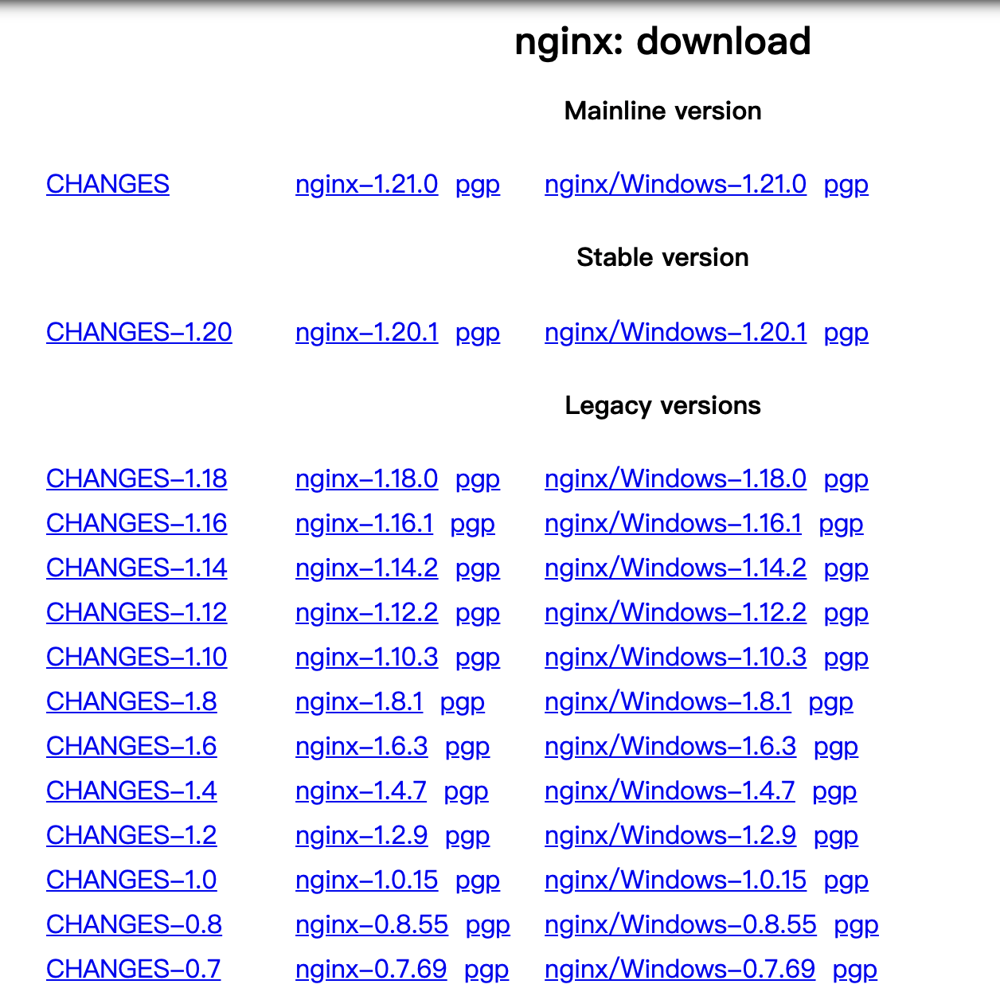

# 初识Nginx

## Nginx 使用场景

首先，我们来看一下 Nginx 是什么？它主要用来做什么。

Nginx 有三个主要场景，分别是：

 - 静态资源服务: 例如通过本地文件系统提供服务，将本地文件实现远程可访问。
 - 反向代理服务: 得益于Nginx的强大性能，常用语于例如负载均衡，缓存等场景。
 - API服务: 主要是指通过OpenResty的扩展从而实现API服务，可以作为网关或流量代理。

## Nginx 的优点

那么，Nginx 主要有哪些优点呢？大致总结一下，主要体现在：

 - 高并发、高性能。
 - 可扩展，丰富的生态圈。
 - 高可靠性，可以长时间的为稳定运行。
 - 热部署，可以在不停止服务的情况下对Nginx进行升级。
 - BSD许可，开源、免费、可以自定义修改。

相对来说，Nginx 同时具备了高并发和高性能的特点。

## Nginx 的组成

Nginx 的组成非常简单，主要包含如下四个部分：

## Nginx 版本选择

Nginx 的下载地址如下: [https://nginx.org/en/download.html](https://nginx.org/en/download.html)

目前，Nginx 最新的 Mainline 版本是 1.21.0，Stable 稳定版本为 1.20.1。

Ps: 其中，中间版本号为奇数时，为主线开发版本，中间版本号为偶数时，为 Stable 稳定版本。

对于普通用户而言，建议使用Stable版本，而如果想要体验新功能的话，则可以使用mainline版本。

点击CHANGES，可以清楚的看到每个发布版本中的修改内容，包括新功能，Bugfix等以及发布信息。

上图表示了 nginx 近些年来发版、Bugfix、重构、新功能等的变化数量。

**NginxPlus**

Nginx 本身是开源的，不过同时 Nginx 也提供了商业版本。

- 开源版本Nginx的地址是: nginx.org
- 商业版本NginxPlus的地址是：nginx.com

那他们有什么区别呢？

商业版本的NginxPlus在第三方工具整合，使用支持方面有更好的支持，但是缺点是它并不开源，因此，其实我们并不常使用NginxPlus。

**Tengine**

Tengine 是阿里巴巴在 Nginx 的基础上，针对大访问量的需求，添加了很多高级功能和特性。Tengine 在阿里的产品中得到的有效的验证，
同时，Tengine也是一个开源项目，我们也可以参与其中进行开发和共建，但是由于Tengine是基于Nginx历史版本进行改造的，无法始终与Nginx保持版本同步，
因此，Tengine的版本往往落后于Nginx版本很多，因此其实我们也并不推荐。

**开源版OpenResty**

OpenResty 是针对 Nginx 扩展了 Lua 语言开发第三方插件。

通过 Lua 的扩展，OpenResty 可以同时以非常低成本和便捷的方式来开发第三方插件，从而快速的扩展Nginx的功能。

**商业版OpenResty**

商业版OpenResty相比社区版而言，主要是增加了技术支持，因此，我们其实并不常用商业版的OpenResty。

## Nginx 的编译与安装

Nginx 的安装主要可以分为两种方式：

 - yum, apt-get 等包管理工具快速安装。
 - 源码编译安装。

其中，通过yum, apt-get等工具安装时，有一个非常大的问题，就是我们无法设置对应的编译参数，例如开启哪些模块等。

因此，在Nginx安装时，我们通常会使用源码编译的方式进行安装。

使用源码编译、安装Nginx主要分为以下4个步骤：

1. 下载 Nginx 源码
2. Configure
3. 编译 Nginx
4. 安装 Nginx

