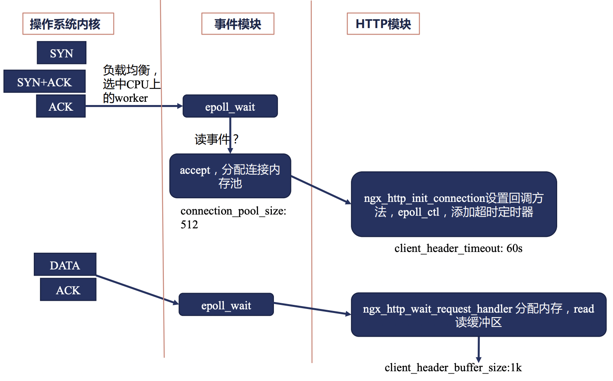
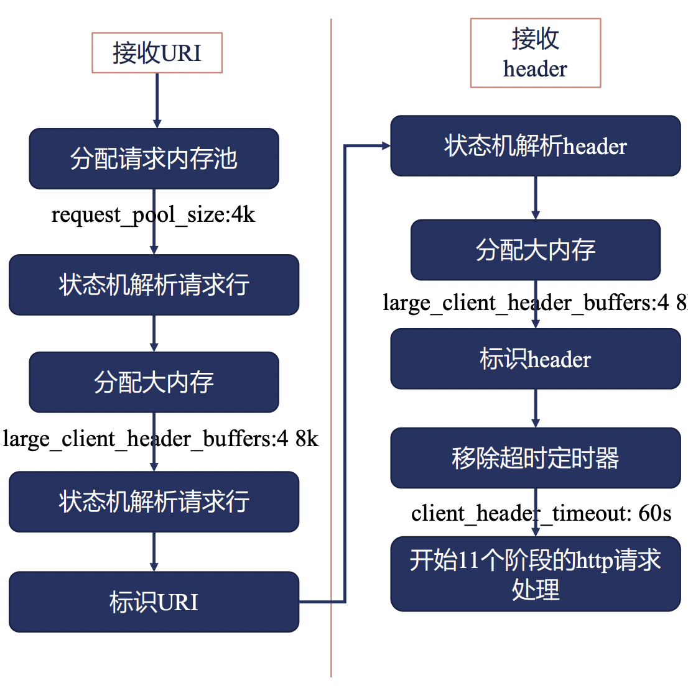
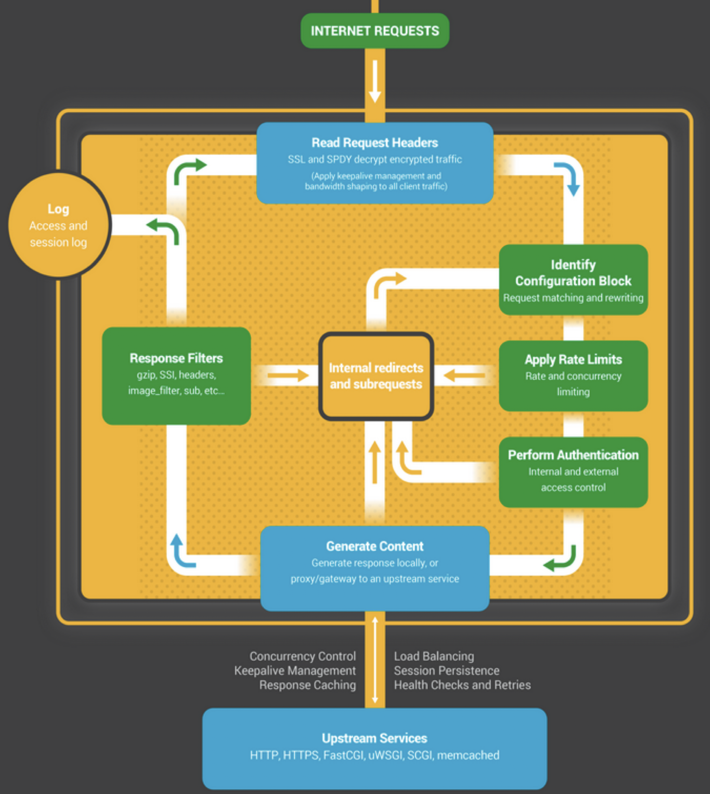
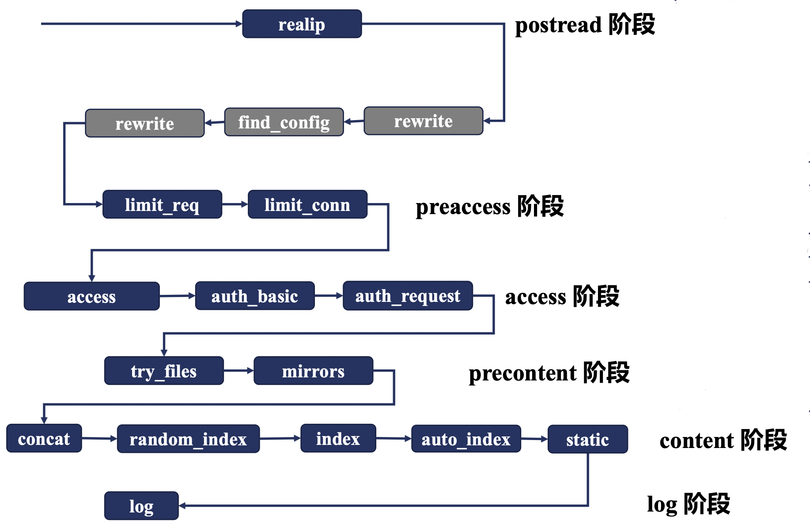
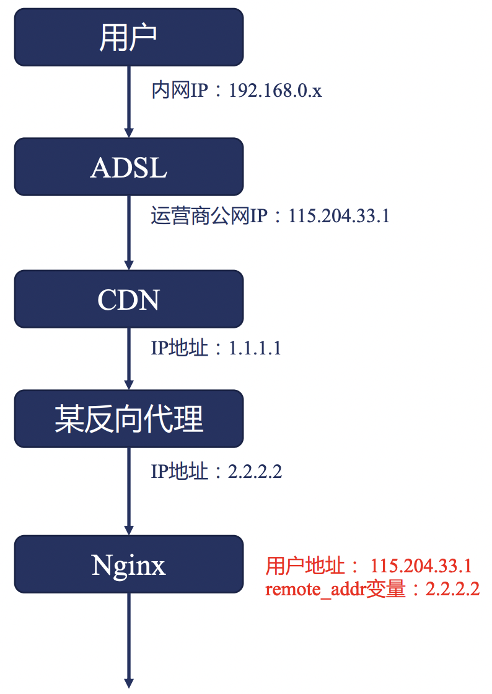

# Nginx HTTP模块详解

在本文中，我们将会以 Nginx 请求处理流程的方式，将 HTTP 模块相关的使用方法进行分析和讲解。

## Nginx 请求事件处理流程

在介绍 Nginx 的 各个 HTTP 模块功能之前，我们需要先来了解一下 Nginx 对于一个请求事件而言，其通用的处理流程是怎么样的。



首先，如果有访问Nginx的服务，首先是会与Linux内核进行一次TCP的三次握手。

当三次握手成功之后，会转给 nginx 的事件管理模块去建立一个连接，此时 nginx 需要对齐分配对应的连接内存池，同时，此时 Nginx 的 HTTP 模块会
对齐设置一个 header 读取的超时时间。

接下来，就是等待客户端继续发送请求的 header 信息了，当客户端发送 header 信息后，nginx 的HTTP模块会继续申请读缓冲区内存，用于接收
客户端发送的 header 信息。



后续的 header 接收与处理逻辑如上图所示。

其中，开启 11 个阶段的 http 请求处理之前的所有逻辑，都是 nginx 服务本身内置的 http 相关的逻辑，而用户可以开发插入的逻辑都集中在
11个阶段中。

那么，nginx HTTP 处理请求的 11 个阶段又是什么样的呢？

我们先来看一个大致的示意图：



 - 首先，对于一个请求而言，我们首先会读取请求的 header 信息，如上述流程所示。
 - 接下来，会根据 header 信息来判断它属于哪一个配置块，找出对应的配置信息。
 - 然后判断是否属于限速、限并发等流量控制策略限定域中。
 - 接下来，会有鉴权相关的访问控制处理。
 - 当确认该请求可以正常进行后，需要生成对应的响应体，其中，对于反向代理场景而言，需要访问上游服务获取对应的响应体。
 - 在返回具体的响应体之前呢，还可以对响应信息再次进行处理，如gzip压缩等。
 - 最后，当上述步骤都处理完成后，先记录access log，并将结果返回给请求客户端。


下面，我们来具体看一下，对于Nginx HTTP请求处理而言，具体包含哪些阶段:

|阶段序号|阶段名称|示例模块|
|------|------|-------|
|1|POST READ|realip|
|2|SERVER_REWRITE|rewrite|
|3|FIND_CONFIG|
|4|REWRITE|rewrite|
|5|POST_REWRITE|
|6|PREACCESS|limit_conn, limit_req|
|7|ACCESS|auth_basic,access,auth_request|
|8|POST_ACCESS|
|9|PRECONTENT|try_files|
|10|CONTENT|index,auto_index,concat|
|11|LOG|access_log|


转换成一张图的话，基本如下图所示：



## 指令与配置块

在正式进入 http 各个模块与指令讲解之前，我们还需要先来了解一下 nginx 中关于配置块和指令的一些基本概念。

对于一个 nginx 指令而言，都有有其对应的上下文的约束，具体来说，就是限制该指令可以出现在什么位置上，例如可以出现在哪些配置块中。
这个上下文约束，我们称之为对应的 context 。

当然，对于一些指令而言，其本身可以在多个不同的配置块中出现，即其 context 可以是多种不同的配置块。

那么，对于一个指令而言，如果它同时出现在了多个不同的配置块中，且指定设置的结果不一致时，这时最终哪个指令配置的结果会生效呢？

这时，基本可以主要分为两种类型：

 - 对于设置配置项值的指令，例如 root, access_log 等，它们可以对配置项进行合并，合并的规则是子配置存在时，直接覆盖父配置，子配置不存在时，继承父配置。
 - 对于设置动作行为类的指令，例如 rewrite, proxy_pass 等，通过无法对其合并，而是在生效结果直接执行。通常，对于动作类指令，主要在 server_rewrite, rewrite, content阶段生效。


## 正则表达式

正则表达式在 nginx 中可以说是得到了相关广泛的应用，因此在正式进入 nginx http 模块学习之前，我们还需要先来了解一下Nginx 中的正则表达式。

Nginx 中的正则表达式中支持的元字符如下表所示：

|代码|说明|
|---|----|
|.|匹配除换行符之外的任意字符|
|\w|匹配字母/数字/下划线/汉字|
|\s|匹配任意空白符|
|\d|匹配数字|
|\b|匹配单词的开始和结束|
|^|匹配行开头|
|$|匹配行结尾|


此外，除了单个字符的匹配之外，还有用于重复的正则字符串的表达方式:

|代码|说明|
|---|----|
|*|重复零次或更多次|
|+|重复一次或更多次|
|?|重复零次或一次|
|{n}|重复n次
|{n,}|重复n次或更多次|
|{n,m}|重复n到m次|


通过正则表达式，我们可以在 location, server_name, rewrite 中取得极大的便利。

## listen 指令

前面聊了这么多的基础知识，下面，我们就可以开始正式了解一些 nginx http 模块中的指令了。

`listen` 指令可以说是 server 块中最最基础的指令了，用于设置在本地监听哪些端口用于接收请求。

`listen` 指令仅允许出现在 `server` 块这个 context 中。


常用的基本语法如下:

```shell
listen address[:port];
listen port;
listen unix:path;
```

例如:

```shell
listen 8000;   # 监听所有网卡的8000端口
listen 127.0.0.1:8001;   # 监听localhost的8001端口
listen unix:/var/run/nginx.sock;  # 监听指定socket文件，仅限于本机通讯
```

## server_name 指令

在 Nginx 配置中，`server_name` 也是一个非常重要的指令，通过 server_name 可以帮助我们找到指定请求对应生效的配置块。

说到这儿你可能就会有一些奇怪了，我们刚才已经讲到了 listen 指令，通过 listen 指令指定的端口不是已经就可以帮助我们找到对应的配置块了嘛？
为什么还需要 server_name 这么一个东西呢？

说起来也简单，由于 Nginx 往往是会作为我们整个网关的一个流量入口，该流量入口上常常可能会绑定多个域名，这时，我们希望多个域名对应的
服务都能够以80，或443这种常用端口来对外提供服务，而nginx可以跟进客户端请求的域名不同，来自动识别到不同的配置块上。

简单的来说，server_name 本身上就是可以根据客户端HTTP请求中header中的HOST信息与server_name进行匹配，找到对应的配置块。

server_name 可以出现的 context 为 http, server 以及 location 中。

其基本的语法格式为:

```shell
server_name www.missshi.cn;  # 精准匹配
server_name *.missshi.cn;    # 泛域名，* 仅支持在最前或最后
server_nane ~^www\d+\.missshi\.cn$;  # ~开头，正则表达式
```

此外，在 server_name 的正则表达式中，我们还可以用小括号来创建变量，并在其余位置使用：

```shell
server {
  server_name ~^(www\.)?(.+)$;
  location / {
    root/sites/$2;
  }
}
```

其中，我们在 location 中就使用了 $2 来表示 server_name 中匹配的域名。

或者是:

```shell
server {
  server_name ~^(www\.)?(?<domain>.+)$;
  location / {
    root/sites/$domain;
  }
}
```

那么，在多个 Server 块都监听了相同的端口，且 server_name 设置不一致但都可能匹配的情况下，会如何进行优先匹配呢？

1. 精准匹配。
2. *在前的泛域名
3. *在后的泛域名
4. 按照文件中顺序匹配正则表达式域名
5. 全部不匹配时，如果有server块被设置为default，则匹配default块。
6. 全部不匹配时，且没有default块时，默认匹配第一个。


## realip 模块

realip 模块处于 Nginx HTTP 处理中的 POST READ 阶段，它是接收完整 header 后进行处理的第一个阶段。

realip 模块的作用是从请求的Header中找出对应的真实客户端IP，从而可以用于后续的限速等场景。

我们都知道，对于一个 TCP 连接的四元组而言，包括了 src ip, src port, dst ip, dst port 四部分，那么我们是不是只需要获取 src ip 信息即可，
为什么还需要一个单独的 realip 模块呢？

因为在真实的网络场景下，客户端到服务端的请求往往不能直接送到，中间可能需要经过很多层代理，如下图所示：



以一个典型的用户上网场景为例，中间可能会经常CDN，反向代理等等，最终才能到达 Nginx 服务器。

这时，如果 Nginx 服务器直接获取 src ip 字段的信息时，得到的信息只能是反向代理的IP，而拿不到真实的用户 IP，这个与我们的需求往往是不符的。

那怎么能拿到真实的客户端IP呢？

对于所有的代理服务器而言，我们有一套统一的规范，即代理服务器在转发请求时，应该在 http header 中包含 

 - X-Forwarded-For 字段，包含 IP 连接链
 - X-Real-IP 字段，用于传递原始的客户端 IP

此时，Nginx 接收到客户端请求后，就可以通过解析 X-Forwarded-For 或者 X-Real-IP 字段的信息，来找到真实的客户端 IP。

那么，再获取到真实的客户端IP后，我们应该如何使用呢？例如怎么用客户端的IP进行请求限速。

答案是 **变量** 。

在 Nginx 中，变量在 Nginx 整个处理流程中，启动了重要的作用。

具体来说，当 realip 处理一个请求后，会重写对应的 binary_remote_add 和 remote_addr 的变量，将该变量改写为客户端的真实IP信息，
后续在限速等场景中，我们可以直接将 binary_remote_add 和 remote_addr 的变量作为限速的 key 即可。

简单对 real ip 模块做一个梳理：

 - realip 模块可以用于查找请求的真实客户端地址。
 - realip 模块默认不会编译进入Nginx中，需要添加 --with-http_realip_module 来启用该功能。
 - realip 模块会生成 realip_remote_addr 和 real_ip_remote_port 两个新的变量，用于记录原始的请求信息（非源头）。
 - realip 模块会重写 binary_remote_add 和 remote_addr 变量，并设置为源头客户端来源IP。


同时，realip 模块本身提供了如下几个指令，我们来了解一下:

**set_real_ip_from**

 - 功能描述: 用于设置哪些来源的请求会解析realip。
 - 语法格式: `set_real_ip_from address|CIDR|unix;`
 - 默认值: 无
 - Context: http, server, location。
 - 说明：只有指定的来源IP区间，我们才会对它的src ip进行解析，否则不会进行相关的src ip解析。

**real_ip_header**

 - 功能描述：设置获取src ip的方式。
 - 语法格式: `real_ip_header field | X-Real-IP | X-Forwarded-For | proxy_protocol;`
 - 默认值: X-Real-IP
 - Context: http, server, location。
 - 说明：默认会根据请求头中的 X-Real-IP 字段来获取src ip，可以跟进自己的需求进行修改。

**real_ip_recursive**

 - 功能描述：是否开启递归realip查询。
 - 语法格式: `real_ip_recursive on | off;`
 - 默认值: off
 - Context: http, server, location。
 - 说明：默认是关闭的，如果开启后，且 real ip 的获取方式为 X-Forwarded-For 且 X-Forwarded-For 的最后一个IP 与 set_real_ip_from 匹配时，递归向前查询，直到找出不匹配的IP作为src ip。


## rewrite 模块下的 return 指令与 error_page 指令

rewrite 模块本身可以出现在两个不同的阶段中，即 SERVER_REWRITE 和 REWRITE 阶段，需要来说，就是在 server 块下出现或者在 location 块下出现。
它们可以使用的命令是一致的。

rewrite 模块的主要作用其实是重新请求的 url。

下面，我们先来了解一下 rewrite 模块下的 return 指令。

**return**

 - 功能描述: 用于返回请求指定的返回码和URL。
 - 语法格式: 
   - `return code [text];`
   - `return code URL;`
   - `return URL;`
 - Context: server, location, if
 - 说明：停止当前的处理逻辑，指定将指定的结果返回给客户端。


其中，return 指令返回的 code 可以是：

 - 444: Nginx 自定义 Code，用于直接关闭连接。
 - 301: HTTP1.0 永久重定向。
 - 302: 临时重定向。
 - 303: 临时重定向且允许改变请求method。
 - 307: 临时重定向且不允许改变请求method。
 - 308: 永久重定向，且不允许改变请求method。


了解了 return 指令后，我们再来看一下 error_page 指令。

**error_page**

 - 功能描述: 设置当返回指定错误码时，可以返回指定的uri或指定页面。
 - 语法格式: `error_page code ... [=[response]] uri;`
 - Context: http, server, location, if


示例代码如下:

```shell
error_page 404             /404.html;
error_page 500 502 503 504 /50x.html;
```

为什么要把 error_page 和 return 放在一起来说明呢？

主要是 return 可以用于自主设置返回码，而 error_page 又是根据返回码的不同来设置特定的行为，那么，同时设置了 return 且匹配和 error_page 的条件后，行为会是什么样呢？

同时试验一下的话，你会发现，return 命令结束后，会立刻进行结果返回，error_page 相关的操作其实是无法生效的。

那么，我们也知道 return 指令可以同时出现在 server 块和 location 块中，那么如果同时出现时，它们的行为又是什么样的呢？

正如我们之前学习到的 http 处理的 11 个阶段， server_rewrite 阶段其实是早于 rewrite 阶段的，因此，在 server 块中的 return 指令执行后，
将会立即返回结果，location 下的 return 指令实际是没有机会执行的。

不知道和你想的是否是一致的呢？

## rewrite 模块下的 rewrite 指令

rewrite 指令是专门针对 uri 进行处理的，具体来说，它可以通过正则匹配 uri，并将正则匹配到的 uri 提供成为一个新的 uri。

**rewrite**

 - 功能描述: 正则匹配原始访问的 uri 并替换称为新的 uri 访问。
 - 语法格式: `rewrite regex replacement [flag];`
 - Context: server, location, if


其中，当 replacement 是以 http:// 或者 https:// 开头时，则等价于返回 302 重定向。

可以看到，在 `rewrite` 指令中的，有一个 flag 参数，这个参数对于 rewrite 行为的影响至关重要，具体来说:

 - last: 用 replacement 替换原始 URI 后再次进行新的 location 匹配。
 - break: 停止当前脚本指令的执行，直接返回对应的结果。
 - redirect: 适用于 http:// 或 https:// 开头，临时重定向。
 - permanent: 适用于 http:// 或 https:// 开头，永久重定向。
 - 不传递时: 继续向后正常执行。


**rewrite_log**

 - 功能描述: 将 rewrite 的行为接入 error 日志中。
 - 语法格式: `rewrite_log on|off;`
 - 默认值: off 
 - Context: http, server, location, if


## rewrite 模块下的 if 指令

rewrite 模块下提供了 if 指令，即可以使用 if 条件判断从而来进行相关行为的设置。

**if**

 - 功能描述: 引入条件判断，可以根据指定的条件来设置不同的行为。
 - 语法格式: `if (condition) {...}`
 - Context: server, location

Ps: 当 condition 为真时，执行大括号内的指令；遵循值指令的继承规则。

那么，if 指令中的条件表达式具体可以是哪些情况呢？

1. 检查变量是否为空或者值是否为0，可以直接使用。
2. 将变量与字符串进行完整匹配，使用 = 或者 !=
3. 将变量与正则表达式进行匹配。
    - 大小写敏感时，使用 ~ 或者 !~
    - 大小写不敏感时，使用 ~* 或者 !~*
4. 检查文件是否存在，使用 —f 或者 !-f 
5. 检查目录是否存在，使用 —d 或者 !-d
6. 检查文件、目录、软链是否存在，使用 —e 或者 !-e
7. 检查是否为可执行文件，使用 —x 或者 !-x 


## find_config 阶段找到对应 location 块 - location 指令

下面，我们来了解一下 FIND_CONFIG 阶段，Nginx 是如何找到对应的 location 块的。

其中，涉及到两个指令，分别是 **merge_slashes** 和 **location**。

其中， **merge_slashes** 相对简单，我们来简单介绍一下。

**merge_slashes**

 - 功能描述: 如果 uri 中包含两个连续的 / 符号，则对齐进行 merge，合并为一个。
 - 语法格式: `merge_slashes on | off;`
 - 默认值: on  
 - Context: http, server

通常，merge_slashes 配置我们都会默认开启。

下面，我们来看一下核心的 **location** 指令。

**location**

 - 功能描述: 设置 location 条件，从而可以让nginx判断针对指定url时，应该执行哪个语法块的逻辑。
 - 语法格式: 
    - `location [=|~|~*|^~] uri {...}`
    - `location @name {...}`
 - Context: server, location

需要说明的是，在 location 的匹配中，仅会匹配 URI，而不会对参数等进行相关的匹配。

在 location 的匹配中，主要包含以下几种情况：

1. 前缀字符串匹配
    1. 默认情况下，不加任何符号时，则表示常规的前缀字符串匹配。
    2. 如果增加了 = 符号，则表示精准匹配。
    3. 如果增加了 ^~ 符号，且最长匹配前缀，则不检查正则表达式。
2. 正则表达式匹配
    1. ~ 表示大小写敏感的正则匹配。
    2. ~* 表示大小写不敏感的正则匹配。
3. 内部跳转的命令location

那么，当一个 Server 块中包含很多 location 的时候，当一个 uri 访问时，可能会同时匹配到多个前缀匹配和正则匹配，
此时具体应该会匹配到哪一个 location 块呢？

这就涉及到了 find_config 的相关逻辑，我们来看一下下图：


 - 首先，最高优先级的就是 = 的精准匹配。
 - 接下来，是 ^~ 的完整匹配。
 - 再其次，是根据配置文件顺序的 regex 正则匹配。
 - 最后，则是根据最长匹配的前缀字符串匹配。


了解了这个规则，你应该就知道对于任意一个 uri 的访问，它预期会进入到哪个 location 块的执行逻辑中了。


## preaccess 阶段下的 limit_conn 模块


## preaccess 阶段下的 limit_req 模块


## access 阶段下的 access 模块


## access 阶段下的 auth_basic 模块 


