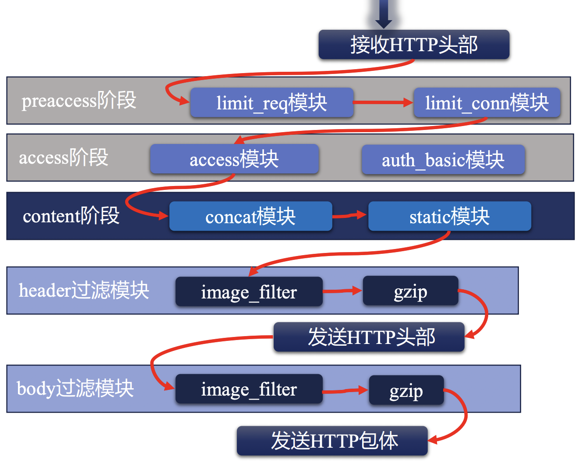
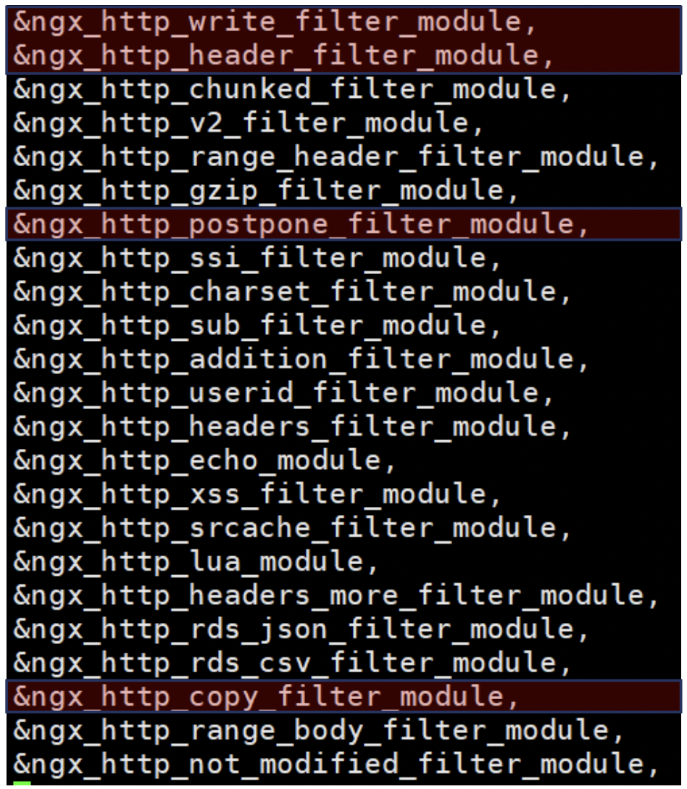

# Nginx HTTP模块详解

在本文中，我们将会以 Nginx 请求处理流程的方式，将 HTTP 模块相关的使用方法进行分析和讲解。

## Nginx 请求事件处理流程

在介绍 Nginx 的 各个 HTTP 模块功能之前，我们需要先来了解一下 Nginx 对于一个请求事件而言，其通用的处理流程是怎么样的。


首先，如果有访问Nginx的服务，首先是会与Linux内核进行一次TCP的三次握手。

当三次握手成功之后，会转给 nginx 的事件管理模块去建立一个连接，此时 nginx 需要对齐分配对应的连接内存池，同时，此时 Nginx 的 HTTP 模块会
对齐设置一个 header 读取的超时时间。

接下来，就是等待客户端继续发送请求的 header 信息了，当客户端发送 header 信息后，nginx 的HTTP模块会继续申请读缓冲区内存，用于接收
客户端发送的 header 信息。


后续的 header 接收与处理逻辑如上图所示。

其中，开启 11 个阶段的 http 请求处理之前的所有逻辑，都是 nginx 服务本身内置的 http 相关的逻辑，而用户可以开发插入的逻辑都集中在
11个阶段中。

那么，nginx HTTP 处理请求的 11 个阶段又是什么样的呢？

我们先来看一个大致的示意图：


 - 首先，对于一个请求而言，我们首先会读取请求的 header 信息，如上述流程所示。
 - 接下来，会根据 header 信息来判断它属于哪一个配置块，找出对应的配置信息。
 - 然后判断是否属于限速、限并发等流量控制策略限定域中。
 - 接下来，会有鉴权相关的访问控制处理。
 - 当确认该请求可以正常进行后，需要生成对应的响应体，其中，对于反向代理场景而言，需要访问上游服务获取对应的响应体。
 - 在返回具体的响应体之前呢，还可以对响应信息再次进行处理，如gzip压缩等。
 - 最后，当上述步骤都处理完成后，先记录access log，并将结果返回给请求客户端。


下面，我们来具体看一下，对于Nginx HTTP请求处理而言，具体包含哪些阶段:

|阶段序号|阶段名称|示例模块|
|------|------|-------|
|1|POST READ|realip|
|2|SERVER_REWRITE|rewrite|
|3|FIND_CONFIG|
|4|REWRITE|rewrite|
|5|POST_REWRITE|
|6|PREACCESS|limit_conn, limit_req|
|7|ACCESS|auth_basic,access,auth_request|
|8|POST_ACCESS|
|9|PRECONTENT|try_files|
|10|CONTENT|index,auto_index,concat|
|11|LOG|access_log|


转换成一张图的话，基本如下图所示：


## 指令与配置块

在正式进入 http 各个模块与指令讲解之前，我们还需要先来了解一下 nginx 中关于配置块和指令的一些基本概念。

对于一个 nginx 指令而言，都有有其对应的上下文的约束，具体来说，就是限制该指令可以出现在什么位置上，例如可以出现在哪些配置块中。
这个上下文约束，我们称之为对应的 context 。

当然，对于一些指令而言，其本身可以在多个不同的配置块中出现，即其 context 可以是多种不同的配置块。

那么，对于一个指令而言，如果它同时出现在了多个不同的配置块中，且指定设置的结果不一致时，这时最终哪个指令配置的结果会生效呢？

这时，基本可以主要分为两种类型：

 - 对于设置配置项值的指令，例如 root, access_log 等，它们可以对配置项进行合并，合并的规则是子配置存在时，直接覆盖父配置，子配置不存在时，继承父配置。
 - 对于设置动作行为类的指令，例如 rewrite, proxy_pass 等，通过无法对其合并，而是在生效结果直接执行。通常，对于动作类指令，主要在 server_rewrite, rewrite, content阶段生效。


## 正则表达式

正则表达式在 nginx 中可以说是得到了相关广泛的应用，因此在正式进入 nginx http 模块学习之前，我们还需要先来了解一下Nginx 中的正则表达式。

Nginx 中的正则表达式中支持的元字符如下表所示：

|代码|说明|
|---|----|
|.|匹配除换行符之外的任意字符|
|\w|匹配字母/数字/下划线/汉字|
|\s|匹配任意空白符|
|\d|匹配数字|
|\b|匹配单词的开始和结束|
|^|匹配行开头|
|$|匹配行结尾|


此外，除了单个字符的匹配之外，还有用于重复的正则字符串的表达方式:

|代码|说明|
|---|----|
|*|重复零次或更多次|
|+|重复一次或更多次|
|?|重复零次或一次|
|{n}|重复n次
|{n,}|重复n次或更多次|
|{n,m}|重复n到m次|


通过正则表达式，我们可以在 location, server_name, rewrite 中取得极大的便利。

## listen 指令

前面聊了这么多的基础知识，下面，我们就可以开始正式了解一些 nginx http 模块中的指令了。

`listen` 指令可以说是 server 块中最最基础的指令了，用于设置在本地监听哪些端口用于接收请求。

`listen` 指令仅允许出现在 `server` 块这个 context 中。


常用的基本语法如下:

```shell
listen address[:port];
listen port;
listen unix:path;
```

例如:

```shell
listen 8000;   # 监听所有网卡的8000端口
listen 127.0.0.1:8001;   # 监听localhost的8001端口
listen unix:/var/run/nginx.sock;  # 监听指定socket文件，仅限于本机通讯
```

## server_name 指令

在 Nginx 配置中，`server_name` 也是一个非常重要的指令，通过 server_name 可以帮助我们找到指定请求对应生效的配置块。

说到这儿你可能就会有一些奇怪了，我们刚才已经讲到了 listen 指令，通过 listen 指令指定的端口不是已经就可以帮助我们找到对应的配置块了嘛？
为什么还需要 server_name 这么一个东西呢？

说起来也简单，由于 Nginx 往往是会作为我们整个网关的一个流量入口，该流量入口上常常可能会绑定多个域名，这时，我们希望多个域名对应的
服务都能够以80，或443这种常用端口来对外提供服务，而nginx可以跟进客户端请求的域名不同，来自动识别到不同的配置块上。

简单的来说，server_name 本身上就是可以根据客户端HTTP请求中header中的HOST信息与server_name进行匹配，找到对应的配置块。

server_name 可以出现的 context 为 http, server 以及 location 中。

其基本的语法格式为:

```shell
server_name www.missshi.cn;  # 精准匹配
server_name *.missshi.cn;    # 泛域名，* 仅支持在最前或最后
server_nane ~^www\d+\.missshi\.cn$;  # ~开头，正则表达式
```

此外，在 server_name 的正则表达式中，我们还可以用小括号来创建变量，并在其余位置使用：

```shell
server {
  server_name ~^(www\.)?(.+)$;
  location / {
    root/sites/$2;
  }
}
```

其中，我们在 location 中就使用了 $2 来表示 server_name 中匹配的域名。

或者是:

```shell
server {
  server_name ~^(www\.)?(?<domain>.+)$;
  location / {
    root/sites/$domain;
  }
}
```

那么，在多个 Server 块都监听了相同的端口，且 server_name 设置不一致但都可能匹配的情况下，会如何进行优先匹配呢？

1. 精准匹配。
2. *在前的泛域名
3. *在后的泛域名
4. 按照文件中顺序匹配正则表达式域名
5. 全部不匹配时，如果有server块被设置为default，则匹配default块。
6. 全部不匹配时，且没有default块时，默认匹配第一个。


## realip 模块

realip 模块处于 Nginx HTTP 处理中的 POST READ 阶段，它是接收完整 header 后进行处理的第一个阶段。

realip 模块的作用是从请求的Header中找出对应的真实客户端IP，从而可以用于后续的限速等场景。

我们都知道，对于一个 TCP 连接的四元组而言，包括了 src ip, src port, dst ip, dst port 四部分，那么我们是不是只需要获取 src ip 信息即可，
为什么还需要一个单独的 realip 模块呢？

因为在真实的网络场景下，客户端到服务端的请求往往不能直接送到，中间可能需要经过很多层代理，如下图所示：


以一个典型的用户上网场景为例，中间可能会经常CDN，反向代理等等，最终才能到达 Nginx 服务器。

这时，如果 Nginx 服务器直接获取 src ip 字段的信息时，得到的信息只能是反向代理的IP，而拿不到真实的用户 IP，这个与我们的需求往往是不符的。

那怎么能拿到真实的客户端IP呢？

对于所有的代理服务器而言，我们有一套统一的规范，即代理服务器在转发请求时，应该在 http header 中包含 

 - X-Forwarded-For 字段，包含 IP 连接链
 - X-Real-IP 字段，用于传递原始的客户端 IP

此时，Nginx 接收到客户端请求后，就可以通过解析 X-Forwarded-For 或者 X-Real-IP 字段的信息，来找到真实的客户端 IP。

那么，再获取到真实的客户端IP后，我们应该如何使用呢？例如怎么用客户端的IP进行请求限速。

答案是 **变量** 。

在 Nginx 中，变量在 Nginx 整个处理流程中，启动了重要的作用。

具体来说，当 realip 处理一个请求后，会重写对应的 binary_remote_add 和 remote_addr 的变量，将该变量改写为客户端的真实IP信息，
后续在限速等场景中，我们可以直接将 binary_remote_add 和 remote_addr 的变量作为限速的 key 即可。

简单对 real ip 模块做一个梳理：

 - realip 模块可以用于查找请求的真实客户端地址。
 - realip 模块默认不会编译进入Nginx中，需要添加 --with-http_realip_module 来启用该功能。
 - realip 模块会生成 realip_remote_addr 和 real_ip_remote_port 两个新的变量，用于记录原始的请求信息（非源头）。
 - realip 模块会重写 binary_remote_add 和 remote_addr 变量，并设置为源头客户端来源IP。


同时，realip 模块本身提供了如下几个指令，我们来了解一下:

**set_real_ip_from**

 - 功能描述: 用于设置哪些来源的请求会解析realip。
 - 语法格式: `set_real_ip_from address|CIDR|unix;`
 - 默认值: 无
 - Context: http, server, location。
 - 说明：只有指定的来源IP区间，我们才会对它的src ip进行解析，否则不会进行相关的src ip解析。

**real_ip_header**

 - 功能描述：设置获取src ip的方式。
 - 语法格式: `real_ip_header field | X-Real-IP | X-Forwarded-For | proxy_protocol;`
 - 默认值: X-Real-IP
 - Context: http, server, location。
 - 说明：默认会根据请求头中的 X-Real-IP 字段来获取src ip，可以跟进自己的需求进行修改。

**real_ip_recursive**

 - 功能描述：是否开启递归realip查询。
 - 语法格式: `real_ip_recursive on | off;`
 - 默认值: off
 - Context: http, server, location。
 - 说明：默认是关闭的，如果开启后，且 real ip 的获取方式为 X-Forwarded-For 且 X-Forwarded-For 的最后一个IP 与 set_real_ip_from 匹配时，递归向前查询，直到找出不匹配的IP作为src ip。


## rewrite 模块

### return 指令与 error_page 指令

rewrite 模块本身可以出现在两个不同的阶段中，即 SERVER_REWRITE 和 REWRITE 阶段，需要来说，就是在 server 块下出现或者在 location 块下出现。
它们可以使用的命令是一致的。

rewrite 模块的主要作用其实是重新请求的 url。

下面，我们先来了解一下 rewrite 模块下的 return 指令。

**return**

 - 功能描述: 用于返回请求指定的返回码和URL。
 - 语法格式: 
   - `return code [text];`
   - `return code URL;`
   - `return URL;`
 - Context: server, location, if
 - 说明：停止当前的处理逻辑，指定将指定的结果返回给客户端。


其中，return 指令返回的 code 可以是：

 - 444: Nginx 自定义 Code，用于直接关闭连接。
 - 301: HTTP1.0 永久重定向。
 - 302: 临时重定向。
 - 303: 临时重定向且允许改变请求method。
 - 307: 临时重定向且不允许改变请求method。
 - 308: 永久重定向，且不允许改变请求method。


了解了 return 指令后，我们再来看一下 error_page 指令。

**error_page**

 - 功能描述: 设置当返回指定错误码时，可以返回指定的uri或指定页面。
 - 语法格式: `error_page code ... [=[response]] uri;`
 - Context: http, server, location, if


示例代码如下:

```shell
error_page 404             /404.html;
error_page 500 502 503 504 /50x.html;
```

为什么要把 error_page 和 return 放在一起来说明呢？

主要是 return 可以用于自主设置返回码，而 error_page 又是根据返回码的不同来设置特定的行为，那么，同时设置了 return 且匹配和 error_page 的条件后，行为会是什么样呢？

同时试验一下的话，你会发现，return 命令结束后，会立刻进行结果返回，error_page 相关的操作其实是无法生效的。

那么，我们也知道 return 指令可以同时出现在 server 块和 location 块中，那么如果同时出现时，它们的行为又是什么样的呢？

正如我们之前学习到的 http 处理的 11 个阶段， server_rewrite 阶段其实是早于 rewrite 阶段的，因此，在 server 块中的 return 指令执行后，
将会立即返回结果，location 下的 return 指令实际是没有机会执行的。

不知道和你想的是否是一致的呢？

### rewrite 模块下的 rewrite 指令

rewrite 指令是专门针对 uri 进行处理的，具体来说，它可以通过正则匹配 uri，并将正则匹配到的 uri 提供成为一个新的 uri。

**rewrite**

 - 功能描述: 正则匹配原始访问的 uri 并替换称为新的 uri 访问。
 - 语法格式: `rewrite regex replacement [flag];`
 - Context: server, location, if


其中，当 replacement 是以 http:// 或者 https:// 开头时，则等价于返回 302 重定向。

可以看到，在 `rewrite` 指令中的，有一个 flag 参数，这个参数对于 rewrite 行为的影响至关重要，具体来说:

 - last: 用 replacement 替换原始 URI 后再次进行新的 location 匹配。
 - break: 停止当前脚本指令的执行，直接返回对应的结果。
 - redirect: 适用于 http:// 或 https:// 开头，临时重定向。
 - permanent: 适用于 http:// 或 https:// 开头，永久重定向。
 - 不传递时: 继续向后正常执行。


**rewrite_log**

 - 功能描述: 将 rewrite 的行为接入 error 日志中。
 - 语法格式: `rewrite_log on|off;`
 - 默认值: off 
 - Context: http, server, location, if


### rewrite 模块下的 if 指令

rewrite 模块下提供了 if 指令，即可以使用 if 条件判断从而来进行相关行为的设置。

**if**

 - 功能描述: 引入条件判断，可以根据指定的条件来设置不同的行为。
 - 语法格式: `if (condition) {...}`
 - Context: server, location

Ps: 当 condition 为真时，执行大括号内的指令；遵循值指令的继承规则。

那么，if 指令中的条件表达式具体可以是哪些情况呢？

1. 检查变量是否为空或者值是否为0，可以直接使用。
2. 将变量与字符串进行完整匹配，使用 = 或者 !=
3. 将变量与正则表达式进行匹配。
    - 大小写敏感时，使用 ~ 或者 !~
    - 大小写不敏感时，使用 ~* 或者 !~*
4. 检查文件是否存在，使用 —f 或者 !-f 
5. 检查目录是否存在，使用 —d 或者 !-d
6. 检查文件、目录、软链是否存在，使用 —e 或者 !-e
7. 检查是否为可执行文件，使用 —x 或者 !-x 


## find_config 阶段找到对应 location 块 - location 指令

下面，我们来了解一下 FIND_CONFIG 阶段，Nginx 是如何找到对应的 location 块的。

其中，涉及到两个指令，分别是 **merge_slashes** 和 **location**。

其中， **merge_slashes** 相对简单，我们来简单介绍一下。

**merge_slashes**

 - 功能描述: 如果 uri 中包含两个连续的 / 符号，则对齐进行 merge，合并为一个。
 - 语法格式: `merge_slashes on | off;`
 - 默认值: on  
 - Context: http, server

通常，merge_slashes 配置我们都会默认开启。

下面，我们来看一下核心的 **location** 指令。

**location**

 - 功能描述: 设置 location 条件，从而可以让nginx判断针对指定url时，应该执行哪个语法块的逻辑。
 - 语法格式: 
    - `location [=|~|~*|^~] uri {...}`
    - `location @name {...}`
 - Context: server, location

需要说明的是，在 location 的匹配中，仅会匹配 URI，而不会对参数等进行相关的匹配。

在 location 的匹配中，主要包含以下几种情况：

1. 前缀字符串匹配
    1. 默认情况下，不加任何符号时，则表示常规的前缀字符串匹配。
    2. 如果增加了 = 符号，则表示精准匹配。
    3. 如果增加了 ^~ 符号，且最长匹配前缀，则不检查正则表达式。
2. 正则表达式匹配
    1. ~ 表示大小写敏感的正则匹配。
    2. ~* 表示大小写不敏感的正则匹配。
3. 内部跳转的命令location

那么，当一个 Server 块中包含很多 location 的时候，当一个 uri 访问时，可能会同时匹配到多个前缀匹配和正则匹配，
此时具体应该会匹配到哪一个 location 块呢？

这就涉及到了 find_config 的相关逻辑，我们来看一下下图：


 - 首先，最高优先级的就是 = 的精准匹配。
 - 接下来，是 ^~ 的完整匹配。
 - 再其次，是根据配置文件顺序的 regex 正则匹配。
 - 最后，则是根据最长匹配的前缀字符串匹配。


了解了这个规则，你应该就知道对于任意一个 uri 的访问，它预期会进入到哪个 location 块的执行逻辑中了。


## preaccess 阶段下的 limit_conn 模块

在 nginx 中，我们常常希望限制单个客户端的并发连接数目，这时，就会用到 Nginx 的 preaccess 阶段下的 limit_conn 模块。

limit_conn 模块的生效范围是全部 worker 进程，它们基于共享内存实现共享数据。

limit_conn 模块涉及到四个指令: limit_conn_zone 、 limit_conn 、limit_conn_log_level 、limit_conn_status ，下面，我们来依次进行讲解。

**limit_conn_zone**

 - 功能描述: 声明一个共享内存空间，用于存放限制连接数相关的信息。
 - 语法格式: `limit_conn_zone key zone=name:size;`
 - Context: http


通过 limit_conn_zone 指令，我们可以自定义一个指定名称、指定大小的共享内存空间，同时，我们还可以设置根据哪个字段进行限制连接。

示例如下：

```shell
limit_conn_zone $binary_remote_addr zone=addr:10m;
```

上述命令表示: 我们申请了一块10m大小的内存空间，并命名为addr。同时，在限制连接时，根据 binary_remote_addr 变量的值进行统计和限制。

**limit_conn**

 - 功能描述: 设置并发连接数的规则。
 - 语法格式: `limit_conn zone number;`
 - Context: http, server, location

示例如下:

```shell
limit_conn addr 5;
```

上式表示我们使用名称为 addr 的共享内存空间进行限制并发判断，且最大的并发数为 5 。

**limit_conn_log_level**

 - 功能描述: 设置当限制并发连接拦截后，error 日志打印的级别。
 - 语法格式: `limit_conn_log_level info|notice|warn|error;`
 - 默认值: error   
 - Context: http, server, location

**limit_conn_status**

 - 功能描述: 设置当限制并发连接拦截后，返回的返回码。
 - 语法格式: `limit_conn_status code;`
 - 默认值: 503
 - Context: http, server, location

limit_conn_log_level 和 limit_conn_status 相对比较简单，我们就不再举例了。


## preaccess 阶段下的 limit_req 模块

在 limit_conn 模块中，我们可以限制的是单个客户端的并发连接数，然而，我们往往还有一种更加通用的需求，就是限制 QPS。

而限制 QPS 的主要方式就是 limit_req 模块了。

与 limit_conn 模块一样，limit_req 模块的生效范围也是全部 worker 进程，它们基于共享内存实现共享数据。

我们先来了解一下 limit_req 模块的实现原理：


如上图为例，假设我们有一个漏盆，它可以接收上游发送过来的请求，而上游发送过来的请求可能突快突慢，但是对于下游发送出去的数据而言，它的最大速率是固定的。

如果一个时间段请求流量非常多，过一阵请求流量很小的话，通过这个漏盆可以有效的均有下游的访问速率。

但是这里面有一个问题，如果上游的请求流量始终大于下游的最大速率时，会持续向盆内积水，这样，最终总会导致盆内的水打满，造成一些水外露，这就是这个盆所能承载的最大容量了。

而 limit_req 模块实现原理其实就是这样的。

我们可以设置一个最大的请求速率，超过这个速率的上游请求我们暂时将其夯住，直到满足速率要求后再发送给下游。但是如果夯住的请求数量超过我们设置的阈值时，将会直接提示失败。

下面，我们来看一下 limit_req 模块设置到几个指令：

**limit_req_zone**

 - 功能描述: 声明一个共享内存空间，用于存放限制QPS的相关信息。
 - 语法格式: `limit_req_zone key zone=name:size rate=rate;`
 - Context: http

Ps：rate 的单位为 r/s 或者 r/m。

通过 limit_req_zone 指令，我们可以自定义一个指定名称、指定大小的共享内存空间，同时，我们还可以设置根据哪个字段进行限制连接以及最大的QPS限制。

示例如下：

```shell
limit_req_zone $binary_remote_addr zone=addr:10m rate=10r/s;
```

上述命令表示: 我们申请了一块10m大小的内存空间，并命名为addr。同时，在限制QPS时，根据 binary_remote_addr 变量的值进行统计和限制，且最大QPS为10。

**limit_req**

 - 功能描述: 设置QPS限速的规则。
 - 语法格式: `limit_req zone=name [brust=number] [nodelay];`
 - 默认值: brust 默认为 0。
 - Context: http, server, location。

示例如下:

```shell
limit_req zone=addr brust=20;
```

上式表示我们使用名称为 addr 的共享内存空间进行QPS速率限制，且最多waiting的请求数为20。

**limit_req_log_level**

 - 功能描述: 设置QPS速率拦截后，error 日志打印的级别。
 - 语法格式: `limit_req_log_level info|notice|warn|error;`
 - 默认值: error   
 - Context: http, server, location

**limit_req_status**

 - 功能描述: 设置QPS速率拦截后，返回的返回码。
 - 语法格式: `limit_req_status code;`
 - 默认值: 503
 - Context: http, server, location

limit_req_log_level 和 limit_req_status 相对比较简单，我们就不再举例了。


## access 阶段下的 access 模块

preaccess 阶段说完了，现在该继续讲解 access 阶段了。

在 access 阶段，最常用的功能之一就是针对指定 IP/CIDR 增加黑白名单了。

access 模块提供的指令包括 allow 和 deny 了，两个指令的使用方式和语法完全一样，只有语义正好相反。

**allow/deny**

 - 功能描述: 设置指定来源IP/CIDR为白名单或者黑名称。
 - 语法格式: `allow address|CIDR|unix:|all;`
 - Context: http, server, location, limit_except

示例如下:

```shell
location / {
    deny 192.168.1.1;
    allow 192.169.1.0/24;
    deny all;
}
```

其中，需要注意的是，在整个匹配的过程中，一旦匹配到某个 deny / allow 指令后，就直接生效了，不会进行后续的 deny/allow 匹配了。


## access 阶段下的 auth_basic 模块 

除了按照 IP 黑白名单的访问控制外，另外一种常用的访问控制就是用户名/密码控制了。即在 Nginx 请求访问中，需要用户输入用户名/密码相关的信息。

这种授权方式就对应到了 nginx 的 auth_basic 模块。

auth_basic 模块涉及到如下两个指令：

**auth_basic**

 - 功能描述: 设置是否开启用户名/密码认证。
 - 语法格式: `auth_basic string|off;`
 - 默认值: off  
 - Context: http, server, location, limit_except

当 `auth_basic` 指令设置为 off 时，表示禁用用户名/密码认证，当设置为其他字符串时，表示启用用户名/密码认证，且设置的字符串作为平台标识。

那么，具体访问的用户名和密码是什么呢？这就又涉及到了另一个指令。

**auth_basic_user_file**

 - 功能描述: 用户名/密码认证配置文件。
 - 语法格式: `auth_basic_user_file file;`
 - Context: http, server, location, limit_except

那么，这个文件应该如何生成呢？

生成这个文件需要用到一个命令行工具：`htpasswd`。

```shell
htpasswd -b -c ${filename} ${username} {password}
```

生成完成后，可以看一下生成的文件内容，格式还是比较清晰的，一行表示一个用户，密码是进行过一些简单的加密的。

当然，如果你本地没有安装 `htpasswd` 工具的话，也可以直接用一些在线的 htpasswd 生成器，例如 [htpasswd](https://tool.oschina.net/htpasswd) ,
它们可以帮助你无需安装命令行工具也可以快速生成对应的文件。

当我们开启了 auth_basic 的功能后，如果你再次从浏览器访问对应的地址，浏览器会自动弹出一个输入框提示输入用户名和密码。


## access 阶段下的 auth_request 模块

上面讲到的 access 阶段的模块，无论是黑白名单或者是用户名/密码的鉴权，相对来说都是比较简单的鉴权方式。

在很多企业里面，我们可以已经有了专门的鉴权中心，因此，很多时候我们需要将 Nginx 的鉴权阶段与其他的内部服务进行打通，也就是说由第三方服务来进行权限控制。

这时，在 nginx 中我们就要用到了 auth_request 模块。

需要注意的是，auth_request 模块默认是没有编译进 Nginx 的，需要在编译时增加 `--with-http_auth_request_module` 参数。

我们先来简单的了解一下 auth_request 模块的实现原理:

1. 首先，nginx 在接收到一个请求后，会生成一个子请求，并通过反向代理的方式把请求传递给上游的服务。
2. 等待上游服务返回响应。
3. 如果上游服务的返回码是2XX，表示权限认证通过，继续后续流程。
4. 如果上游服务的返回码是401或者403，表示权限认证失败，直接将错误码返回给客户端。

了解了 auth_request 模块的实现原理后，我们来看一下如何使用 auth_request 模块。

**auth_request**

 - 功能描述: 设置第三方服务地址用于权限控制。
 - 语法格式: `auth_request uri|off;`
 - 默认值: off
 - Context: http, server, location


当 auth_request 设置为 uri 字符串时，nginx会生成一个子请求，将原始请求信息发送给对应的uri进行鉴权。


## access 阶段下的逻辑控制 satisfy 指令

上面的内容中，我们已经讲解了 access 阶段下的三种访问控制手段: 黑白名单、用户名/密码以及第三方鉴权。

那么，这三种鉴权的关系是什么呢？如果同时开启了这三个access阶段的模块，部分通过，部分失败后的行为又是什么样的呢？

这就用到了一个 `satisfy` 的指令了。

`satisfy` 的指令非常简单:

**satisfy**

 - 功能描述: 设置多个access相关指令的生效关系。
 - 语法格式: `satisfy all|any;`
 - 默认值: all
 - Context: http, server, location


可以看出，`satisfy` 指令仅可以设置为 all 或者 any，其中:

 - all: 所有的 access 模块全部认证通过，才能够继续访问。
 - any: 只要有一个 access 配置认证通过，就可以继续访问。

可以看到，通过合理的利用 `satisfy` 指令，我们就可以组合生成兼容多种不同的认证方式的认证策略。

## precontent 阶段的 try_files 指令

了解完 access 阶段的一些常用指令后，下面我们继续来了解一些 precontent 阶段的一些指令。

首先来看一下 try_files 指令。

**try_files**

 - 功能描述: 依次访问多个指定的文件，如果找到了，则直接返回，如果所有文件都不存在，则返回最后一个 url 结果或者指定返回码。
 - 语法格式: 
   - `try_files file1 file2 ... uri;`
   - `try_files file1 file2 ... =code;`
 - Context: server, location


try_files 指令常常可以用于一些反向代理的场景，在反向代理时，可能会有一些文件直接cache到本地，如果本地没有找到时，再转给业务服务器处理。

## precontent 阶段的 mirror 模块

mirror 模块可以用于复制流量。

具体来说，nginx 在收到一个请求时，会生成一个子请求访问其他服务，但是需要注意的是，此处nginx对子请求的返回值不会进行任何处理。

mirror 模块主要包含如下两个指令：

**mirror**

 - 功能描述: 复制请求流量到另外一个uri中，实现请求流量多写。
 - 语法格式: `mirror uri | off`
 - 默认值: off  
 - Context: http, server, location

**mirror_request_body**

 - 功能描述: 设置在复制流量时，复制的请求流量是否需要传递body信息，默认是传递的。
 - 语法格式: `mirror_request_body on | off`
 - 默认值: on
 - Context: http, server, location


## content 阶段的 static 模块

在 content 阶段，有一个内置的核心模块 static 。

在 static 模块中，提供了一系列的核心指令和变量。下面，我们来依次进行说明。

### root/alias 指令

之前我们已经经常提到了 root/alias 指令，下面，我们来详细看一下二者的异同点。

 - 二者在功能上是一致的，都是将 url 映射为文件路径，并返回静态文件的内容。
 - 二者在使用上是有一些差异的，root 指令会将完整的请求url映射补充至文件路径中，而alias只会将location后url映射补充至文件路径中，不包含location匹配的前缀。

**alias**

 - 功能描述: 将 url 映射为文件路径，并返回静态文件的内容。
 - 语法格式: `alias path`
 - Context: location

**root**

 - 功能描述: 将 url 映射为文件路径，并返回静态文件的内容。
 - 语法格式: `root path`
 - 默认值: html  
 - Context: http, server, location

此外，我们也可以看到，root 是有默认值的，默认为 html; 另外，alias 仅能用于 location Context 中，而root的使用场景则更多。

在通过 url 转化为本地文件访问时，可能会经常出现 url 映射的本地文件不存在的情况，针对这种情况，默认是会打印一条 error 日志的。

如果我们不希望这种场景下打印 error 日志，则可以通过如下指令进行禁用：

**log_not_found**

 - 功能描述: 设置当静态资源找不到时，是否需要打印error日志。
 - 语法格式: `log_not_found on|off`
 - 默认值: on  
 - Context: http, server, location


### 模块内置变量

除了上述提到了 root 和 alias 指令外，static 模块还提供了一些变量，这些变量表示了对应的文件和目录信息等，下面我们来看一下：

 - request_filename: 表示待访问文件的完整路径
 - document_root: 由URI和root/alias规则生成的文件夹路径。
 - realpath_root: 将 document_root 中的软链接替换中真实路径。

那么，这些变量有什么用呢？

例如，我们可以在 if 表达式中判断这些文件/目录的属性、存在性等，并针对不同的结果返回不同的内容。


### nginx 的末尾补 / 机制

当我们访问一个 url 时，如果 url 的末尾不是以 `/` 结尾，但是 Nginx 映射到本地文件后，发现对应的内容是一个目录时，这时会自动触发一个 301 重定向操作。

在该重定向中，nginx 会在 url 的末尾中追加一个 `/` 。

此外，static 模块还提供了一些指令可以进一步控制重定向中的一些其他行为，例如是否需要重写 host, port 等信息。

**absolute_redirect**

 - 功能描述: 设置当uri没有以`/`结尾时，重定向时是否需要设置完整的uri地址（包含host等信息）。
 - 语法格式: `absolute_redirect on|off`
 - 默认值: on  
 - Context: http, server, location

默认情况下，absolute_redirect 配置是开启的，即当触发301重定向追加/时，重定向响应中会返回完整的重定向地址，该地址包含访问的host信息，并会尝试读取host的信息进行Host替换。

**server_name_in_redirect**

 - 功能描述: 设置当uri没有以`/`结尾时，重定向时是否是否配置中的server_name主域名进行替换。
 - 语法格式: `server_name_in_redirect on|off`
 - 默认值: off
 - Context: http, server, location

**port_in_redirect**

 - 功能描述: 设置当uri没有以`/`结尾时，重定向时是否对port信息进行替换。
 - 语法格式: `port_in_redirect on|off`
 - 默认值: on
 - Context: http, server, location


## content 阶段的 index 模块 

在之前的试验中，我们其实已经知道了，当我们通过uri 映射到一个本地的目录时，如果该目录下有`index.html`文件时，会默认返回`index.html`文件的内容。

而这个其实就是 index 模块发挥了作用，下面，我们来了解一下 index 模块。

**index**

 - 功能描述: 当访问指定目录的静态资源时，自动查找该目录下对应的index模块指定的文件。
 - 语法格式: `index file`
 - 默认值: index.html
 - Context: http, server, location

例如，我们也可以增加`index readme.md`指令，此时，再次访问指定目录时，将不会再去找`index.html`文件了，而是会去尝试找`readme.md`文件。

## content 阶段的 autoindex 模块

实际上，访问一个目录时，我们有时不仅仅希望访问指定名称的文件，而是希望查询该目录下包含了哪些文件。

这个就要用到了 autoindex 模块了，autoindex 模块涉及如下指令。

**autoindex**

 - 功能描述: 是否开启URI以/结尾时，返回指定目录的结构。
 - 语法格式: `autoindex on|off`
 - 默认值: off
 - Context: http, server, location

**autoindex_format**

 - 功能描述: 设置目录返回结构的格式。
 - 语法格式: `autoindex_format html|xml|json|jsonp`
 - 默认值: html
 - Context: http, server, location

**autoindex_localtime**

 - 功能描述: 设置目录下文件的时间显示是否显示为本地时间。
 - 语法格式: `autoindex_localtime on|off`
 - 默认值: off
 - Context: http, server, location

Ps: 由于 index 模块的处理顺序早于 autoindex 模块，所以如果该目录下存在index模块指定的文件时，autoindex 模块将会失效，无法返回对应的目录。


## content 阶段的 concat 模块

concat 模块是阿里巴巴贡献的第三方 Nginx 模块，专门用于在页面需要访问多个小文件时，可以将它们的文件内容合并到一次请求中完成，提升请求性能。

由于 concat 模块不是 nginx 的内置模块，需要单独安装。

具体来说，首先需要clone concat对应代码：

```shell
git clone https://github.com/alibaba/nginx-http-concat
```

然后在编译nginx时，引入对应的模块:

```shell
--add_module=../nginx-http-concat
```

那么，这个模块具体应该怎么使用呢？

它可以帮助用户在访问uri的后面加上??，然后通过多个逗号来分隔多个文件。如果本身还有其他参数，可以在最后通过?追加参数。

例如url如下：

```
https://g.alicdn.com/??kissy/k/6.2.4/seed-min.js,kg/global-util/1.0.7/indexmin.js,tb/tracker/4.3.5/index.js,kg/tb-nav/2.5.3/index-min.js,secdev/sufei_data/3.3.5/index.js
```

下面，我们来看一下 concat 模块相关的指令：

**concat**

 - 功能描述: 是否启用 concat 文件合并的功能。
 - 语法格式: `concat on|off`
 - 默认值: off
 - Context: http, server, location

**concat_types**

 - 功能描述: 对哪些文件类型支持文件合并的功能。
 - 语法格式: `concat_types MIME types`
 - 默认值: text/css application/x-javascript
 - Context: http, server, location

**concat_delimiter**

 - 功能描述: 当返回多个文件内容时，中间使用什么样的分隔符进行分隔。
 - 语法格式: `concat_delimiter string`
 - Context: http, server, location

**concat_max_files**

 - 功能描述: 当开启多文件合并请求时，最大请求的文件数量。
 - 语法格式: `concat_max_files number`
 - Context: http, server, location


## log 阶段

最后，我们来看一下 http 模块 11 个阶段中最后一个阶段 - log 阶段。

log 阶段的核心功能就是将 HTTP 请求相关的信息记录到日志中去，对应的就是 log 模块。

log 模块包含如下一些命令，下面，我们来依次进行说明。

首先是定义日志打印格式:

**log_format**

 - 功能描述: 定义日志打印的格式。
 - 语法格式: `log_format name [escape=default|json|none] string;`
 - 默认值: log_format combined '$remote_addr - $remote_user [$time_local] "$request" $status $body_bytes_sent "$http_referer"'
 - Context: http

其中，name 是我们针对该定义的 log_format 设置的对应格式名称，在具体设置access log日志位置时，需要使用到。

**access_log**

 - 功能描述: 设置指定请求的 access log的配置路径等信息。
 - 语法格式: 
   - `access_log path [format [buffer=size] [gzip[=level]] [flush=time] [if=condition]];`'
   - `access_log off;`
 - 默认值: access_log logs/access.log combined;
 - Context: http, server, location

其中，需要说明的是：

 - path 路径可以包含变量，但是为了避免每一行日志写入都需要打开、关闭日志文件，建议需要配置cache（见后续描述）
 - if 可以通过条件来控制对应请求记录是否需要写入日志。
 - buffer 可以将批量日志进行缓存，并统一写入磁盘，可以提升性能，写入磁盘的条件包括: 缓存中的日志大小达到buffer的配置、达到flush指定时间、worker进程执行reopen命令等。
 - gzip 可以批量压缩内存中的日志，再写入磁盘，压缩的默认级别为1（1-9压缩率逐步增高）


上面，我们提到了当 path 中包含变量时，我们需要配置 cache 来保证nginx日志写入的性能，下面，我们来看一下具体应该如何进行配置。

**open_log_file_cache**

 - 功能描述: 对log_file的句柄进行cache，避免重复打开、关闭文件。
 - 语法格式: 
   - `open_log_file_cache max=N [inactive=time] [min_uses=N] [valid=time];`'
   - `open_log_file_cache off;`
 - 默认值: off
 - Context: http, server, location

其中:

 - max 表示缓存中最大的文件句柄数，超过该总数后，使用LRU算法淘汰。
 - inactive: 文件访问完成后，超时关闭的时间，默认为10s。
 - min_uses: 在inactive时间内，使用次数至少达到 min_uses 后才会继续在内存中保留，默认为1。
 - valid: 超过 valid 时间后，将对缓存的日志文件进行检查是否存在，默认为60s。
 - off: 表示关闭缓存文件句柄的功能。


## http 过滤机制

除了上面提到 HTTP 模块处理的 11 个阶段之外，在 Nginx 处理 HTTP 请求中，还有一个非常重要的机制，就是 HTTP 的过滤机制。

HTTP 过滤机制是指对 HTTP 的 content 进行一些处理和过滤，并将处理后的结果返回给客户端。

从执行时机来看，HTTP 的过滤机制通常会在 content 阶段之后，log 阶段之前执行，示例流程图如下所示:



例如上图所示中 gzip 、 image_filter 其实就都是 http 过滤机制来实现的。

HTTP 的过滤机制的实现其实包含了非常多的模块，这些模块分别实现了不同的过滤功能，例如包含的模块如下图所示:



实际在执行的过程中，模块的执行顺序正好与上图相反，即从下向上依次进行执行。

其中，有几个模块的执行时机非常重要，我们来重点关注一下:

 - copy_filter: 读取复制包体的内容，如果想要对数据包内容进行解析，首先需要进行读取包体的信息。
 - postpone_filter: 处理子请求。
 - header_filter: 构造响应的头部信息。
 - writer_filter: 发送响应体信息。


### sub模块

下面，我们来看看第一个用于过滤的模块 - sub 模块。

sub 模块默认没有编译进入 Nginx，需要增加 `--with-http_sub_module` 来启用该模块。

sub 模块的功能是可以对响应中的指定字符串进行替换，替换成新的期望字符串。

sub 模块涉及到如下4个指令，我们来依次看一下。

**sub_filter**

 - 功能描述: 对指定字符串进行替换，将指定string替换成为replacement。
 - 语法格式: `sub_filter string replacement;`'
 - Context: http, server, location

**sub_filter_last_modified**

 - 功能描述: 设置替换字符串后，是否需要在响应头部中传递last modified信息。
 - 语法格式: `sub_filter_last_modified on|off;`'
 - 默认值: off  
 - Context: http, server, location

**sub_filter_once**

 - 功能描述: 设置替换字符串时，是否针对每个字符串最多仅替换一次。
 - 语法格式: `sub_filter_once on|off;`'
 - 默认值: on
 - Context: http, server, location

**sub_filter_types**

 - 功能描述: 设置针对哪些响应格式的数据才进行替换。
 - 语法格式: `sub_filter_types mime-type;`'
 - 默认值: text/html
 - Context: http, server, location


### addition 模块

下面，我们再来看一下 addition 模块。

addition 模块默认没有编译进入 Nginx，需要增加 `--with-http_addition_module` 来启用该模块。

addition 模块的功能是可以在原始的响应前后分别通过请求新的url，并将新url的响应组装到原有响应的前后，得到一个新的响应结果。

addition 模块的使用涉及到如下三个指令，下面我们来依次了解一下。

**add_before_body**

 - 功能描述: 在原有响应的前面追加body信息。
 - 语法格式: `add_before_body uri;`
 - Context: http, server, location

**add_after_body**

 - 功能描述: 在原有响应的后面追加body信息。
 - 语法格式: `add_after_body uri;`
 - Context: http, server, location

**addition_types**

 - 功能描述: 设置针对哪些响应格式的数据才进行前后请求和响应组装。
 - 语法格式: `addition_types mime-type;`'
 - 默认值: text/html
 - Context: http, server, location


## Nginx 变量

变量是 Nginx 中最核心的功能之一，通过 nginx 变量，我们可以获取很多相关信息甚至是控制部分 Nginx 的行为。

此外在 Nginx 中，很多模块存在的唯一作用就是去生成一些特定的变量供我们使用，因此，在继续后续的模块学习之前，我们需要先来了解一下 Nginx 中变量的基本机制。

首先，Nginx的变量是有来源的，例如，各个模块甚至Nginx系统本身都会提供一些变量，而一旦这些变量被创建出来，就可以在后续nginx的其他流程中直接进行使用了。

其次，Nginx的变量不是一成不变的，在各个模块的处理流程中都可能会有一些已经存在的 nginx 变量进行修改，而 Nginx 变量在具体使用时，则是以当前阶段的变量值为准。

下面，我们来大致了解一下 Nginx 框架本身提供了哪些类型的变量:

 - HTTP 请求相关的变量
 - TCP 连接相关的变量
 - Nginx 请求处理过程中的变量
 - 发送 HTTP 响应时相关的变量
 - Nginx 系统变量

下面，我们依次来进行说明。

### HTTP 请求相关的变量

|变量名称|变量含义|
|---|----|
|arg_参数名|url中某个参数具体传递的值|
|http_头key|返回Header中指定Key对应的值|
|args|全部url参数|
|query_string|同args|
|is_args|判断请求url中是否包含参数，包含则返回?，否则返回空|
|content_length| HTTP请求中标识包体长度的Content-Length头部的值|
|content_type|标识请求包体类型的Content-Type头部的值|
|uri|请求的URI（不包括?后的参数）|
|document_uri|同uri|
|request_uri|请求的url，包括?后的请求参数|
|scheme|协议名称，例如http,https等|
|request_method|请求方法，例如GET或者POST|
|request_length|请求体的大小，包括请求行、头部、包体等|
|remote_user|由HTTP Basic Auth协议传入的用户名|
|request_body_file|临时存放请求包体的文件
|request_body|请求中的包体，当且仅当在反向代理且使用内存暂存包体时有效|
|request|原始请求行，包括方法，URL，协议版本等|
|host|优先获取Host头部，找不到的话从请求行中获取，还找不到的话，返回Nginx中匹配的server_name|


### TCP 连接相关的变量

|变量名称|变量含义|
|---|----|
|server_addr|服务器端地址（Nginx侧）|
|server_port|服务器端端口（Nginx侧）|
|server_protocol|服务器端协议，例如HTTP/1.1|
|binary_remote_addr|客户端地址的整型格式|
|remote_addr|客户端地址|
|remote_port|客户端端口|
|proxy_protocol_addr|从proxy_protocol协议中返回的客户端地址|
|proxy_protocol_port|从proxy_protocol协议中返回的客户端端口|
|connection|递增的连接序号|
|connection_requests|当前连接上执行过的请求数目，当且仅当keep-alive模式下有意义|
|TCP_INFO|TCP内核层参数


### Nginx 请求处理过程中的变量

|变量名称|变量含义|
|---|----|
|request_time|请求处理到现在的耗时，单位为秒，精确到毫秒|
|server_name|匹配到的Server块的server_name|
|https|是否开始了TLS/SSL协议，开启返回 on ，否则返回空|
|request_completion|请求处理完成，则返回 OK ，否则返回空|
|request_id|以16进制输出的请求标识ID，随机生成|
|request_filename|待访问文件的完整路径|
|document_root|待访问文件的所属目录|
|realpath_root|待访问文件的所属真实目录（软链对应的目录）|
|limit_rate|客户端响应时的速度上限，单位为字节数/s，可以通过set 指令进行设置|


### 发送 HTTP 响应时相关的变量

|变量名称|变量含义|
|---|----|
|sent_http_头部key|响应头部中某个具体key对应的取值|
|body_bytes_sent|响应中body包体的长度|
|bytes_sent|全部http响应的长度|
|status|http响应中的返回码|


### Nginx 系统变量

|变量名称|变量含义|
|---|----|
|time_local|以本地时间标准输出的当前时间，例如 14/Nov/2018:15:55:37 +0800|
|time_iso8601|使用 ISO8601 标准输出的当前时间，例如 2018-11-14T15:55:37+08:00|
|nginx_version|Nginx 版本号|
|pid|所属 worker 进程的进程 id|
|pipe|使用了管道则返回 p，否则返回 .|
|hostname|所在服务器的主机名，与 hostname 命令输出一致|
|msec|1970 年 1 月 1 日到现在的时间，单位为秒，小数点后精确到毫秒|


## referer 模块 - 简单的防盗链方式

首先，我们来了解一下防盗链的场景是什么样的。

例如，我们的网站内部有一些比较优质的资源，我们希望这些相对优质的资源只能给我们网站的用户单独使用。

而可能有另外一些网站直接在它们的网站页面中嵌入了我们对应页面的url，从而希望可以直接从它们的网站中获取我们的资源，实现提升它们网站的流量。

那么，我们应该怎么样拒绝这种非正常的网站跳转访问我们站点的资源呢？

此处，我们需要先提及了一个各个浏览器中默认都包含的规则，即在浏览器发送 HTTP 给后端服务器时，会将当前浏览器所在的页面 url 带上加入 header 中，
告诉服务器本地的请求是来自于哪些页面发起的。

而正是由于浏览器可以帮助我们向服务器传送请求来源的url信息，因此，我们其实可以根据浏览器传送过来的信息，进行判断是否允许该请求访问。

而这个过程中，浏览器用于传递来源信息的方式就是 header 中的 referer 字段，而 nginx 用于处理这一问题的模块名称同样是 referer 。

下面，我们先来简单看一下 referer 涉及到的相关指令：

**valid_referers**

 - 功能描述: 设置允许哪些referer的头部信息状态访问。
 - 语法格式: `valid_referers none | blocked | server_names | string;`'
 - Context: server, location

其中:

 - none 表示允许缺失 referer 头部的请求访问
 - block 表示允许 referer 头部的值为空时的请求访问
 - server_names 表示当 referer 头部的值与我们 server_name 中设置的域名一致时允许访问
 - string 表示可以是域名及URL的字符串或者正则表达式，匹配后允许访问，需要主要的是，对于域名而言，可以使用前后缀 * 做通配符。
 - valid_referers 指令接收的参数可以是多个，多个参数之间用空格分隔，条件之间是 或 的关系。


另外，需要注意的是，`valid_referers` 指令判断是否应该允许访问后，如果预期不允许访问，不是直接对请求进行拦截，而是会生成一个 invalid_referer 变量。

 - 允许访问时，变量值为空
 - 不允许访问时，变量值为1

需要用户自行根据 invalid_referer 变量的值，来进行条件判断编写相应的行为。

**referer_hash_bucket_size**

 - 功能描述: 设置 referer Hash 缓存的 bucket 大小。
 - 语法格式: `referer_hash_bucket_size size;`'
 - 默认值: 64  
 - Context: server, location

**referer_hash_max_size**

 - 功能描述: 设置 referer Hash 缓存的最大值。
 - 语法格式: `referer_hash_max_size size;`'
 - 默认值: 64  
 - Context: server, location

一个关于 referer 模块使用的示例代码如下:

```shell
server_name referer.missshi.cn

location / {
  valid_referer none blocked server_names *.missshi.com www.missshi.org/nianshi ~\.baidu\.;
  if ($invalid_refer) {
    return 403;
  }
  return 200 'valid';
}
```

## secure_link 模块 - 更强大的防盗链工具


