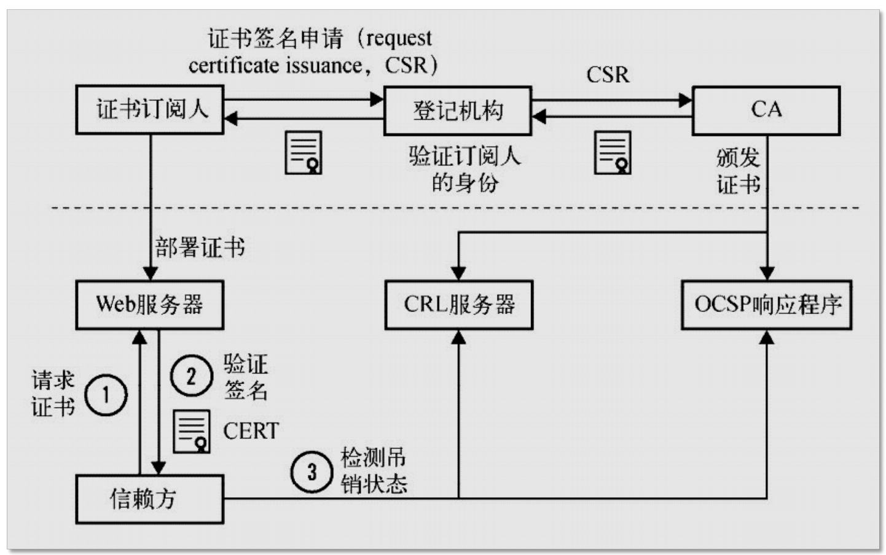
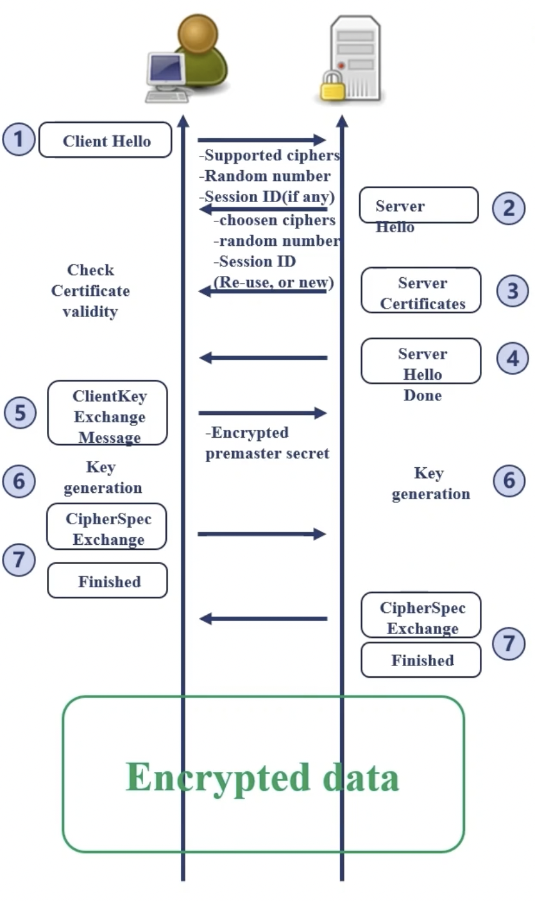

# nginx与HTTPS协议

目前，对于网络安全的重视程度越来越高，基本全部的公开服务的网站全部都是基于 HTTPS 协议的。

那么，我们将在本文中讲解一些 HTTPS 协议的基本原理，以及如何在 Nginx 中使用 HTTPS 协议。

简单的说，HTTPS 协议其实就是使用 HTTP 协议进行通讯，但是利用 SSL/TLS 协议来进行加密封包。

## 网络模型概述


对于 OSI 七层模型而言，SSL/TLS 协议位于表示层。
它通过握手、交换密钥、告警、对称加密等方式使得在应用层无感的情况下对数据传输过程进行了安全性保证。 

## 对称加密与非对称加密

在加、解密的过程中，我们经常会听到对称加密、非对称加密方式。

那么，对称加密、非对称加密分别是什么含义呢？

对称加密是指加密用到的密钥和解密用到的密钥是相同的，如下图所示：


一个典型的对称加密算法就是异或算法，对一组数字按位进行2次异或操作之后，仍然会得到原始的一组数字。

对称加密的优点的性能非常好，计算的方式简单。

那么，什么是非对称加密呢？

非对称加密是指加密和解密用到的密钥是不同的，如下图所示：


非对称加密的密钥总是成对出现的，其中，对外公开的密钥部分称之为公钥，隐私保管的密钥称为私钥。

对于一段文本而言，可以用公钥加密、私钥解密；也可以用私钥加密、公钥解密。

## SSL 证书

在目前的互联网中，我们有时会担心我们是否是访问到的一个虚假的诈骗网站等，这时，就需要一个公立的第三方机构来进行相关的认证，类似与互联网上的公安局。

而在这之中呢，最核心的就是CA证书了。



一个完整的使用流程如下：

1. 网站的维护者（证书订阅人）首先需要在某个登记网站/机构进行证书申请，并填写相关的机构组织等信息，CA机构认证通过后，会生成一对证书，并返回给证书订阅人，同时自己也保留公钥证书。
2. 网站的维护者拿到公私钥证书后，需要将该证书部署到Web服务器下，例如Nginx。
3. 当用户的浏览器访问我们的WEB站点时，首先会请求获取相关证书，Nginx会将公钥证书发给浏览器。
4. 浏览器查询CA机构提供的OCSP服务验证证书的有效性。


了解了证书的使用流程后，我们来看一下，证书具体有哪些类型呢？

 - 域名验证证书(DV): 该证书的验证性很弱，仅仅保证域名的正确性。
 - 组织验证证书(OV): 该证书的验证性相对较强，会保证证书归属的组织的正确性。
 - 扩展验证证书(EV): 该证书做了更严格的认证，大部分浏览器都对它的显示进行了一定程度的优化，例如将认证信息显示在浏览器中。


## TLS 的通讯过程

在 TLS 的通讯过程中，主要包含如下四个步骤：

1. 验证身份
2. 达成安全套件共识
3. 传递密钥
4. 加密通讯


主体流程如下图所示：




## 用免费SSL证书实现一个HTTPS站点

首先，安装 Let's Encrypt 工具：

```shell
sudo add-apt-repository ppa:certbot/certbot
sudo apt-get update
sudo apt-get install python3-certbot-nginx
```

安装完成后，我们可以找到一个 `certbot` 的命令，它可以帮助我们直接修改nginx的配置文件。

接下来，我们可以执行如下命令将我们的域名申请对应的证书。

```shell
certbot --nginx --nginx-server-root=/home/wangzhe/nginx/conf/ -d www.missshi.com
```

然后就会自动生成相关的证书并修改对应的nginx配置文件。
