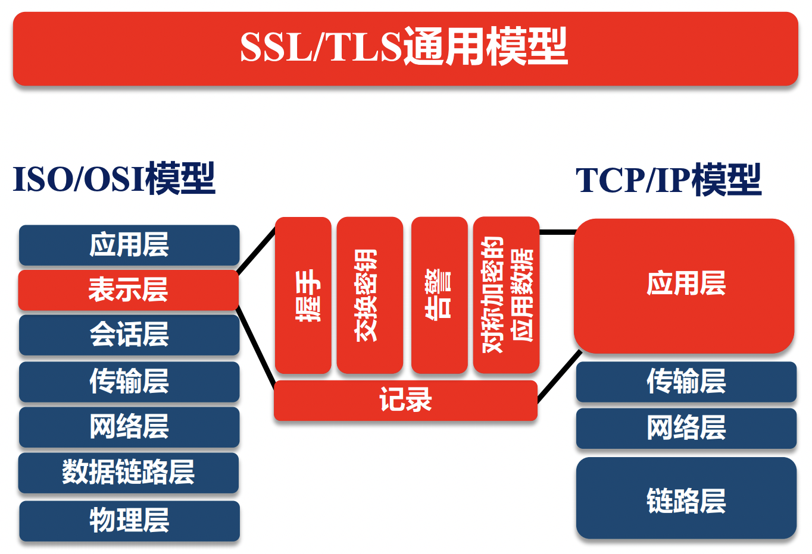
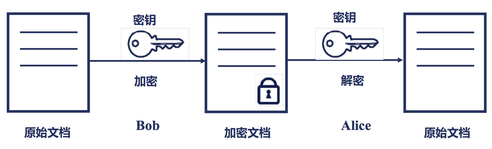
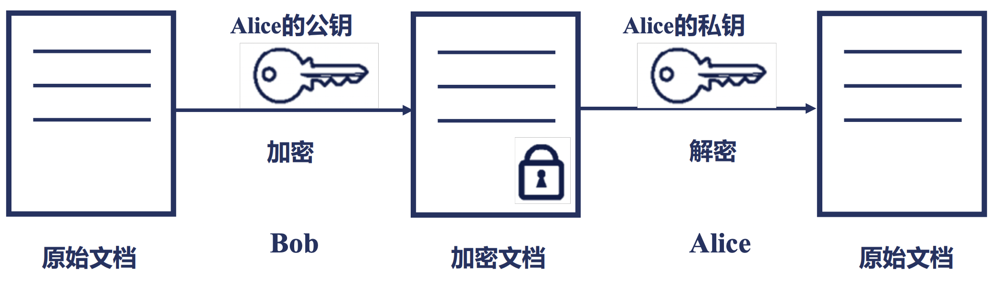

# nginx与HTTPS协议

目前，对于网络安全的重视程度越来越高，基本全部的公开服务的网站全部都是基于 HTTPS 协议的。

那么，我们将在本文中讲解一些 HTTPS 协议的基本原理，以及如何在 Nginx 中使用 HTTPS 协议。

简单的说，HTTPS 协议其实就是使用 HTTP 协议进行通讯，但是利用 SSL/TLS 协议来进行加密封包。

## 网络模型概述

对于 OSI 七层模型而言，SSL/TSL 协议位于表示层。
它通过握手、交换密钥、告警、对称加密等方式使得在应用层无感的情况下对数据传输过程进行了安全性保证。 

## 对称加密与非对称加密

在加、解密的过程中，我们经常会听到对称加密、非对称加密方式。

那么，对称加密、非对称加密分别是什么含义呢？

对称加密是指加密用到的密钥和解密用到的密钥是相同的，如下图所示：

那么，什么是非对称加密呢？

非对称加密是指加密和解密用到的密钥是不同的，如下图所示：

