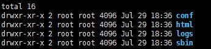

# Nginx的安装

本文中，我们将会讲解Nginx在各种平台下的安装方式。

## Linux下安装Nginx

首先，第一步需要从官网下载nginx安装包：http://nginx.org/en/download.html 。

目前的稳定版本是1.18。

接下来， 我们首先需要解压安装包：

```bash
mkdir ./Ngnix
cp ~/nginx-1.18.1.tar.gz ./Ngnix
cd ./Ngnix
tar -zxvf nginx-1.18.1.tar.gz
cd ./nginx-1.18.1
```

此时，解压缩得到nginx目录结构如下：


下一步是需要利用configure文件安装Nginx:

```bash
mkdir -p /home/zhiyun/nginx

./configure --prefix=/home/zhiyun/nginx \
--with-http_ssl_module  \
--with-http_realip_module  \
--with-http_addition_module  \
--with-http_sub_module  \
--with-http_dav_module  \
--with-http_flv_module  \
--with-http_mp4_module  \
--with-http_gunzip_module  \
--with-http_gzip_static_module  \
--with-http_random_index_module  \
--with-http_secure_link_module  \
--with-http_stub_status_module  \
--with-http_auth_request_module \
--with-threads  \
--with-stream  \
--with-stream_ssl_module  \
--with-http_slice_module  \
--with-file-aio  \
--with-http_v2_module
```

其中，--prefix用于指定Nginx的安装路径。

在安装过程中可能会提示缺少PCRE库，此时需要执行如下命令进行安装：

```bash
apt-get install libpcre3 libpcre3-dev openssl libssl-dev zlib1g zlib1g-dev
```

执行该命令后，可以看到命令行会有一系列的检查和安装日志，结束后会产生一个Makefile文件。

```bash
make
make install
```

安装完成后，切换到`/home/zhiyun/nginx`目录下，当前的目录结构如下：



其中，sbin文件夹下只有一个nginx的文件，即为Nginx服务器的主程序。

执行如下命令可以直接启动nginx:

```bash
./sbin/ngnix
```

启动成功后，访问localhost，可以看到如下页面：


