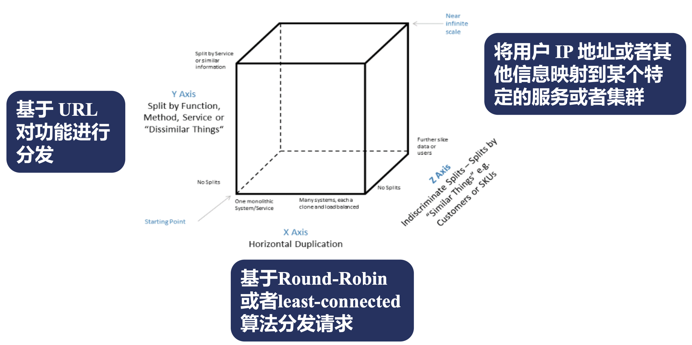

# Nginx 反向代理详解

在本文中，我们将会详细介绍一下在 Nginx 中，反向代理与负载均衡是如何实现和使用的。

## HTTP 反向代理流程主体

首先，我们来看一下在 Nginx 中，对于一个 HTTP 反向代理的场景而言，它的完整处理流程是什么样的。


可以看到:

 - HTTP 反向代理的工作是从 content 阶段开始的。
 - 首先会判断是否命中了之前的 cache, 如果命中则直接返回，否则继续。
 - 然后根据相关指令和接收到的 header 来生成发往上游的 http 头部。
 - 读取客户端发送的包体信息。
 - 根据负载均衡策略选择对应的上游服务器。
 - 根据参数连接上游服务器。
 - 向上游服务器发送请求。
 - 接收上游服务器响应的头部。
 - 处理上游服务器的响应头部。
 - 接收上游服务器的响应体。
 - 发送给客户端响应头部。
 - 发送给客户端响应体。
 - 如果开启了cache，则将响应信息写入cache。
 - 关闭或复用连接，结束本次反向代理请求任务。

了解了一次 HTTP 反向代理的主体流程之后，下面，我们将根据主体流程的步骤，来依次说明每个步骤中，Nginx 的相关指令与功能。

## HTTP 协议的反向代理 - proxy 模块

我们首先要来了解的第一个模块就是 proxy 模块了。

proxy 模块是 Nginx 中用于对上游服务进行 http/https 协议进行反向代理的核心模块。

### 指定上游服务地址

proxy 模块中，包含了一个 **proxy_pass** 指令，这个也是反向代理的入口指令，用于设置对应的上游服务的地址。

**proxy_pass**

 - 功能描述: 指定反向代理的上游服务地址。
 - 语法格式: `proxy_pass URL;`'
 - Context: location

可以看到，看起来 proxy_pass 模块仅仅接收一个 URL 参数，比较简单，但是其实 URL 参数本身有着一些规则，使用中需要非常注意，下面我们来了解一下：

 - URL 必须以 `http://` 或者 `https://` 开头，后面接域名、IP、unix socket地址或者upstream名称，最后是一个可选的 URI。
 - URL 中是否携带 URI 会导致对上游请求转发的行为完全不同，具体来说：
    - 当不携带 URI 时，客户端请求中的URL会直接转发给上游，里面location中使用了正则表达式，@名字时，一般采用该方式。
    - 当携带 URI 时，客户端请求中的URL会将location参数中匹配的部分替换为 proxy_paas 中携带的 URI 内容。
 - URL参数中，也可以携带?+变量。


了解完反向代理的入口指令后，我们接下来继续了解一下 Nginx 在 HTTP 反向代理中是如何生成向上游服务器发送的 http 头部和包体的。

Ps: 由于 cache 部分相对独立，我们后续统一进行说明。

HTTP 反向代理中生成发往上游的请求其实主要包含三个部分：

 - 请求行
 - 请求头部
 - 请求体

下面，我们来依次进行说明：

### 生成请求行

HTTP 反向代理中，生成发往上游服务请求行中，主要包含如下两个指令:

**proxy_method**

 - 功能描述: 设置/修改 HTTP 反向代理发往上游请求的请求方法。
 - 语法格式: `proxy_method method;`'
 - Context: http, server, location

在生成发往上游服务请求行时，默认会使用客户端发往 nginx 的请求方法，但是你也可以通过 `proxy_method` 指令进行修改。

**proxy_http_version**

 - 功能描述: 设置/修改 HTTP 反向代理发往上游请求的HTTP协议版本。
 - 语法格式: `proxy_http_version 1.0|1.1;`'
 - 默认值: 1.0 
 - Context: http, server, location

在生成发往上游服务请求行时，默认会使用HTTP 1.0协议与上游服务进行通信，可以手动调整为HTTP 1.1。


### 生成请求头部

下面，我们来看一下 HTTP 反向代理中如何生成向上游服务发送的 HTTP 请求头部。

**proxy_set_header**

 - 功能描述: 设置/修改 HTTP 反向代理发往上游请求头部的指定字段。
 - 语法格式: `proxy_set_header field value;`'
 - 默认值: 
    - Host: $proxy_host;
    - Connection close;
 - Context: http, server, location

Ps: 在上述 `proxy_set_header` 命令中，如果指令的 value 为空字符串，那么，对应的key-value其实都不会发送。

**proxy_pass_request_headers**

 - 功能描述: 设置 HTTP 反向代理发往上游请求头部时是否将客户端发送过来的头部全部带过去。
 - 语法格式: `proxy_pass_request_headers on|off;`'
 - 默认值: on
 - Context: http, server, location

默认情况下，客户端发送给 Nginx 的请求头部，Nginx 会全部直接转发给上游业务服务。

### 生成发往上游的包体

接下来，我们来看一下 HTTP 反向代理中如何生成向上游服务发送的 HTTP 请求体。

**proxy_pass_request_body**

 - 功能描述: 设置 HTTP 反向代理发往上游请求包体时是否将客户端发送过来的包体全部带过去。
 - 语法格式: `proxy_pass_request_body on|off;`'
 - 默认值: on
 - Context: http, server, location

默认情况下，客户端发送给 Nginx 的请求包体，Nginx 会全部直接转发给上游业务服务。

**proxy_set_body**

 - 功能描述: 手动设置 HTTP 反向代理发往上游的请求包体。
 - 语法格式: `proxy_set_body value;`'
 - Context: http, server, location

除了直接转发客户端发送过来的请求体之外，Nginx HTTP 反向代理中，也允许自定义请求包体发送给上游业务服务。

### 客户端的包体接收方法

从之前的 HTTP 反向代理逻辑图中，我们其实可以看到，在 Nginx 处理客户端发送过来的包体时，有两种不同的处理方式。

 - 方案一: 先将客户端发送过来的请求包体全部接收下来，然后在与上游服务器建立连接统一发送。
 - 方案二: 先与上游服务器建立连接，然后在一边接收客户端的请求，一边发送给上游服务器。

这两种方式在 Nginx 的反向代理服务器中，可以说是各有优劣，下面，我们来展开说明：

对于方案一而言，比较适合于客户端网速较慢，服务端网速很快且服务端并并发连接数比较敏感的场景，在该场景下，由于 Nginx 会完整接收到客户端
的包体后再将服务端发送请求，所以可以有效的避免服务端的连接浪费，降低服务端的压力。

而对于方案二而言，可以更加及时的将请求信息发送给服务端，无需等待Nginx完全接收完客户端的请求，同时对于Nginx自身而言，可以有效降低nginx读写
磁盘的消耗（因为在方式一中，如果包体较大的话，nginx会先讲包体写入一个临时文件，然后时再从临时文件中读取）。

具体选择哪个方案，这个其实是需要从业务的角度来进行考虑的。

那么，在 nginx 中，又是如何配置该方案呢？下面，我们来讲解 **proxy_request_buffering** 指令：

**proxy_request_buffering**

 - 功能描述: 设置 HTTP 反向代理时，接收客户端包体和发送服务端包体的先后依赖关系。
 - 语法格式: `proxy_request_buffering on|off;`'
 - 默认值: on
 - Context: http, server, location

也就是说，默认情况下，Nginx 会先将客户端发送过来的包体接收完成，然后再与上游服务端建立连接并发送包体。

那么，我们下面来看一下具体Nginx是怎么接收客户端包体信息的。

首先，Nginx 在接收客户端发送头部信息的时候，可能会当头部信息传输完成后，顺带传递部分包体信息进来，此时将会出现如下一些情况：

 - 接收头部时，顺带已经将包体全部接收了，此时，针对包体的接收，则无需再做任何操作，已经接收完成了，否则如下。
 - 根据头部中说明的包体的大小，计算待剩余接收的包体大小，此时，如果剩余包体并不算太大时（小于client_body_buffer_size），直接分配对应内存接收body。
 - 如果剩余的包体很大时，那么，我们会将body信息写入临时文件来进行保存，然后发送请求时，再从临时文件中读取。

通过上述的描述，我们知道在这一个过程中，有一个阈值对包体的接收非常重要，即 client_body_buffer_size 。

下面，我们来看一下如何配置 client_body_buffer_size：

**client_body_buffer_size**

 - 功能描述: 设置 HTTP 反向代理时，使用内存接收包体的大小限制。
 - 语法格式: `client_body_buffer_size size;`'
 - 默认值: 8k|16k
 - Context: http, server, location

此外，在接收包体的配置中，还有一个参数也比较重要，就是 **client_body_in_single_buffer** :

**client_body_in_single_buffer**

 - 功能描述: 设置 HTTP 反向代理时，接收客户端包体时，设置是否在单一buffer块中保存包体。
 - 语法格式: `client_body_in_single_buffer on|off;`'
 - 默认值: off
 - Context: http, server, location

如果我们在 nginx 的配置中，频繁使用了 `request_body` 变量的话，那么建议开启该配置，直接可以避免频繁的内存拷贝操作。

在接收客户端包体信息中，我们还可以设置客户端发送包体的最大长度：

**client_max_body_size**

 - 功能描述: 设置 HTTP 反向代理时，设置接收客户端包体的最大长度。
 - 语法格式: `client_max_body_size size;`'
 - 默认值: 1m
 - Context: http, server, location

Nginx 中，会对请求头部中的 Content-Length 进行判断，如果超出我们设置的最大长度时，会直接返回 413 错误。

除了最大长度之外，我们还可以设置接收包体的超时时间:

**client_body_timeout**

 - 功能描述: 设置 HTTP 反向代理时，设置接收客户端接收包体时包体发送的数据间隔超时时间。
 - 语法格式: `client_body_timeout time;`'
 - 默认值: 60s
 - Context: http, server, location

之前，我们已经提到了当客户端发送的包体大小超过我们设置的阈值时，nginx 会先讲包体的内容保存在一个临时文件中，那么，具体关于临时文件保存，
有如下两个配置：

**client_body_temp_path**

 - 功能描述: 设置 HTTP 反向代理时，接收客户端包体后，如果需要保存临时文件时，临时文件所在的路径。
 - 语法格式: `client_body_temp_path path;`'
 - 默认值: client_body_temp
 - Context: http, server, location

**client_body_in_file_only**

 - 功能描述: 设置 HTTP 反向代理时，接收客户端包体后，是否需要保存在临时文件中。
 - 语法格式: `client_body_in_file_only on||clean|off;`'
 - 默认值: off
 - Context: http, server, location

其中：

 - on: 表示针对每个请求，都创建一个临时文件保存包体，并且保留临时文件不删除，主要用于debug等场景。
 - clean: 表示针对每个请求，都创建一个临时文件保存包体，但请求完成后，删除对应临时文件。
 - off: 按需创建临时文件，临时文件用完后自动删除。


## Nginx 负载均衡策略

在接收完成客户端发送来的请求并且生成需要发送给上游服务的请求信息后，下面要做的就是根据负载均衡策略选择上游服务器了。

而关于负载均衡，这是一个很大的话题，我们来展开聊一聊。


首先，来看一下负载均衡可以帮我们做一些什么。

随着现在互联网业务用户的不断扩大，单个实例提供的访问能力始终是有限的，因此，我们往往会针对一个服务部署一组实例，从而能够共同分担请求压力。

而对于用户或者下游服务而言，我们又需要一个统一的请求入口，这时，Nginx 负载均衡/反向代理就要登场了。

Nginx 负载均衡可以提供一个统一的入口，并将请求转发给一组上游的业务服务器，同时，当上游的业务服务器需要宕机、扩容等状态时，负载均衡器可以将流量
转发至其他正常运行的业务服务器上，从而不影响整体业务和用户。

那么，我们具体来看一下 Nginx 是如何来帮助我们进行负载均衡的：



从上图可以看出，Nginx 的反向代理和负载均衡主要可以分为三个方面：

 - 首先是最简单的水平扩展，水平扩展是指上游业务服务是无状态的，且每个实例能处理也业务逻辑完全一致，此时，可以通过Round-Robin或者Least-Connected算法来将请求相对均匀的分发给上游业务服务器。
 - 其次，有时我们期望能够将不同地域的请求发送到就近的服务器，或者将不同的用户请求发送到不同的服务时，可以根据请求的信息来进行映射到特定实例。
 - 此外，当我们希望把一个单体应用拆分为多个微服务时，可能多个服务提供不同的url和功能，但是我们希望能有一个统一的入口对外访问，此时，就可以用到Nginx中基于URL对不同的功能请求进行分发了。


下面，我们来看一下 Nginx 都支持哪些协议吧：


可以看出，Nginx 既可以处理 4 层的 udp, tcp 协议（支持的功能比较简单），也可以处理 7 层的 HTTP 协议。

尤其是对于 7 层协议而言，Nginx 的反向代理能力非常强大，甚至可以在客户端发送过来 HTTP 请求转发成为其他各种协议并发送给上游业务服务器。

除此之外，在反向代理中，缓存也是非常重要的一环。


如上图所示，对于同一个资源请求而言，如果用用户在一段时间内请求过之后，Nginx 可以将响应内存先在本地暂存，而在暂存的时间内，如果又有请求
访问相关的资源时，那么，此时 Nginx 可以将本地暂存的结果直接返回给客户端，而不需要再次去访问上游服务了。

这样一来，一方面可以大幅度的上游服务的业务压力，另一方面，也可以有效的降低客户端请求资源的耗时。

了解了基本的原理之后，下面我们来介绍一些负载均衡与上游配置相关的一些 Nginx 指令吧，从而了解一下如何使用 Nginx 的负载均衡功能。

首先，我们需要指定上游服务的地址，这里面涉及到两个指令，分别是 upstream 和 server 指令。

**upstream**

 - 功能描述: 设置上游服务的名称和对应的上游服务的配置。
 - 语法格式: `upstream name {...};`'
 - Context: http

**server**

 - 功能描述: 设置上游服务的具体地址和访问策略。
 - 语法格式: `server address [parameters];`'
 - Context: upstream

其中，address 可以是域名、IP地址或者unix socket地址，对于域名和IP而言，后面可以加端口，默认为80端口。

其中，常用的 parameters 参数包括：

 - weight: 服务访问的权重，默认是1。
 - max_conns: Server 的并发连接数，仅作用于单个worker，默认为0，表示无限制。
 - max_fails: 指定时间内最大访问的失败次数，达到最大失败次数后，指定时间内不会再访问该实例。
 - fail_timeout: 单位为s，默认为10，表示一段时间内的最大失败次数，以及达到最大失败次数后不能访问的时间。
 - back: 指定对应实例为备份实例，仅当其余实例不可用时，才会转发至该server
 - down: 标识该实例已经下线，不在服务


除了基本的上游地址配置之外，我们还可以对上游服务来建立 keep-alive 的长连接。

Ps: 在上一篇文章中，我们已经介绍过了Nginx如何与客户端建立长连接，接下来，我们就来交接一下nginx如何与上游服务建立长连接。

**keepalive**

 - 功能描述: 设置与上游服务最多建立的长连接的数目。
 - 语法格式: `keepalive number;`'
 - Context: upstream

**keepalive_requests**

 - 功能描述: 设置与上游服务建立的每个长连接最多处理的请求个数。
 - 语法格式: `keepalive_requests number;`'
 - 默认值: 100
 - Context: upstream

**keepalive_timeout**

 - 功能描述: 设置与上游服务建立的长连接的超时时间。
 - 语法格式: `keepalive timeout;`'
 - 默认值: 60s
 - Context: upstream

Ps: 需要重点说明的是，在 nginx 与上游连接建立连接时，默认使用的是 http 1.0 协议并且头部信息中的 connection 是 closed 。
因此，为了能够与上游服务建立长连接，我们需要在 `location` 块中主动设置 http_version 和头部信息中的 connection，如下所示：

```shell
upstream upskeepalive {
	server 127.0.0.1:8011;
	keepalive 32;
}

server {
	server_name rrups.taohui.tech;
	error_log myerror.log info;

	location /{
		proxy_pass http://upskeepalive;
		proxy_http_version 1.1;
        	proxy_set_header Connection "";
	}
}
```

上面描述的负载均衡算法非常简单，只能适用于水平扩展的场景且无法针对请求信息（如客户端来源）进行负载均衡，下面，我们来介绍一些更加高级的一些负载均衡模块。

首先介绍的第一个模块就是基于客户端IP地址的Hash算法来实现的负载均衡 - **upstream_ip_hash** 。

它可以以客户端的IP地址作为哈希算法的关键字映射到特定的上游服务器中，其中，它也可以基于realip来获取原始客户端的请求IP地址，
同时它还可以复用之前round-robin算法中weight的相关的配置参数。

**ip_hash**

 - 功能描述: 启动根据客户端IP来进行负载均衡。
 - 语法格式: `ip_hash;`'
 - Context: upstream

**upstream_ip_hash** 只能用于针对客户端IP进行哈希算法，而如果想要根据其他请求特征来进行，那么它就无能为力了。

不过，nginx 中提供了一个更加通用的哈希负载均衡模块 - **upstream_hash** 。

该模块同样是通过哈希来进行负载均衡，不过它没有强制设置客户端IP作为哈希的key，而是允许用户自定义哈希的key。

**hash**

 - 功能描述: 启动根据自定义Key来进行哈希，从而实现负载均衡。
 - 语法格式: `hash key [consistent];`'
 - Context: upstream

其中:

 - key可以是变量、字符串或者是它们的组合。
 - consistent 表示是否使用一致性hash，一致性hash可以避免当实例数量发生变化时，大批量路由规则变化导致缓存失效的相关问题，

除了使用哈希算法来进行上游选择之外，nginx 还支持优先选择连接最少的上游服务器，这就用到了 **upstream_least_conn** 模块。

**least_conn**

 - 功能描述: 启动根据连接数选择当前连接最小的实例进行请求转发。
 - 语法格式: `ip_hash;`'
 - Context: upstream

在上面我们所有的配置中，默认配置都仅仅在单个worker中单独生效，如果想要让所有worker共同生效时，就需要用到 **upstream_zone** 模块了。

upstream_zone 模块可以用于分配共享内存，将其他upstream模块定义的负载均衡策略数据、运行时每个上游的状态数据存放在共享内存中，
从而生效于所有的worker进程。

**zone**

 - 功能描述: 分配共享内存，使得共享内存策略在所有worker中共同生效。
 - 语法格式: `zone name [size];`'
 - Context: upstream

在负载均衡和上游实例选择的最后，我们再看看看 upstream 模块提供了哪些变量可以给我们使用，cache相关的暂时不再此处讨论，后续会有专门的内容来对cache进行说明。

 - upstream_addr: 上游服务器的ip地址。
 - upstream_connect_time: 与上游服务器建立连接的耗时，单位是s。
 - upstream_header_time: 接收上游服务响应头部的耗时，单位是s。
 - upstream_response_time: 接收完整上游服务响应所消耗的时间，单位是s。
 - upstream_http_名称: 上游服务返回的响应头部信息。
 - upstream_bytes_received: 从上游服务接收到的响应包体长度，单位为字节。
 - upstream_response_length: 从上游服务返回的响应包体长度，单位为字节。
 - upstream_status: 上游服务返回的HTTP响应码，如果没有正常连接上，返回值为502。
 - upstream_cookie_名称: 从上游服务返回的响应头中的Cookie中取出对应的cookie值。
 - upstream_trailer_名称: 从上游服务的响应尾部取到的值。

