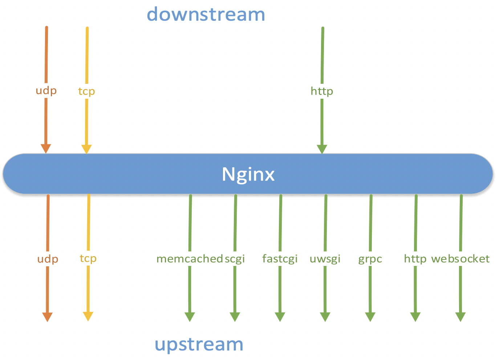
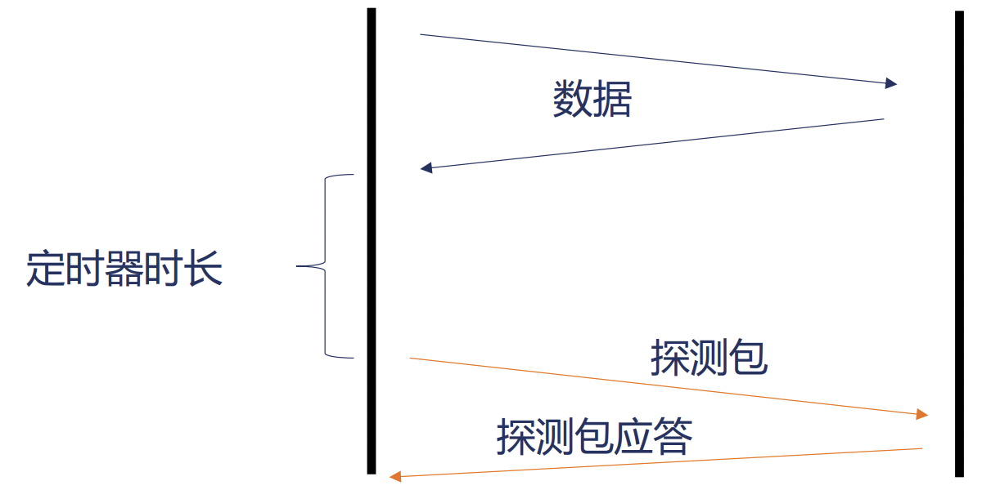
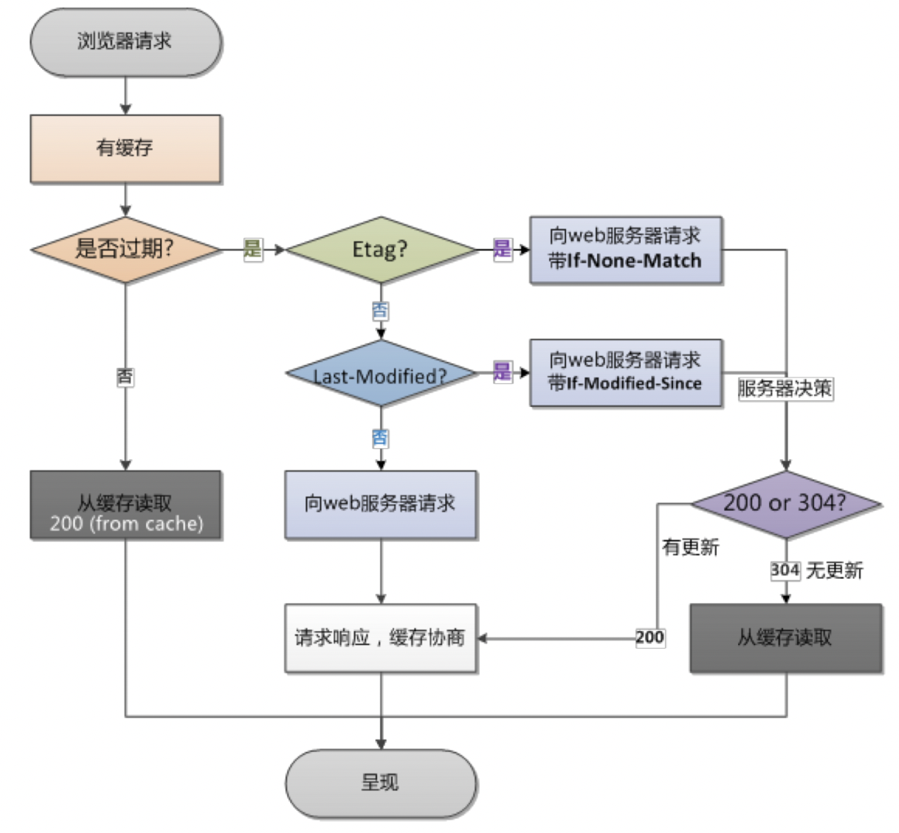
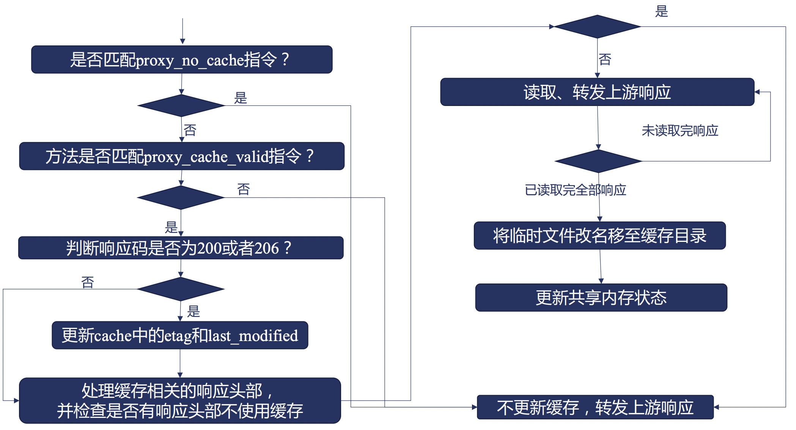
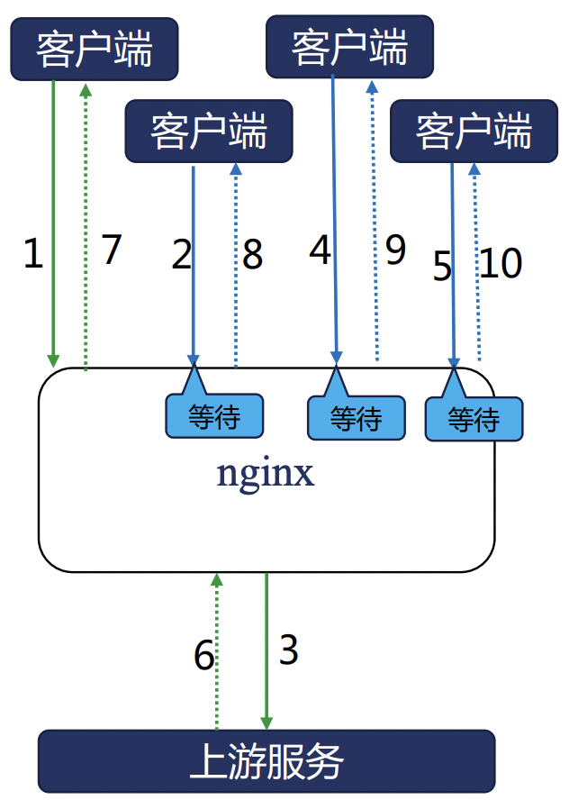
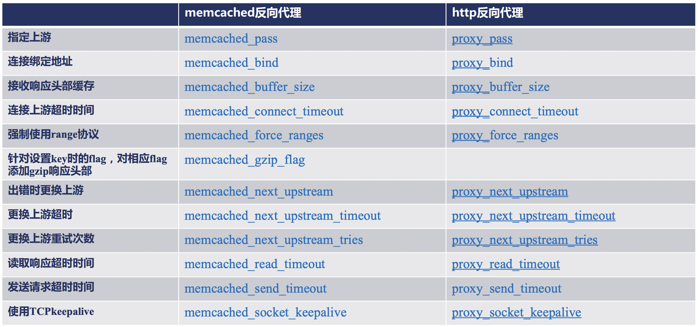

# Nginx 反向代理详解

在本文中，我们将会详细介绍一下在 Nginx 中，反向代理与负载均衡是如何实现和使用的。

## HTTP 反向代理流程主体

首先，我们来看一下在 Nginx 中，对于一个 HTTP 反向代理的场景而言，它的完整处理流程是什么样的。


可以看到:

 - HTTP 反向代理的工作是从 content 阶段开始的。
 - 首先会判断是否命中了之前的 cache, 如果命中则直接返回，否则继续。
 - 然后根据相关指令和接收到的 header 来生成发往上游的 http 头部。
 - 读取客户端发送的包体信息。
 - 根据负载均衡策略选择对应的上游服务器。
 - 根据参数连接上游服务器。
 - 向上游服务器发送请求。
 - 接收上游服务器响应的头部。
 - 处理上游服务器的响应头部。
 - 接收上游服务器的响应体。
 - 发送给客户端响应头部。
 - 发送给客户端响应体。
 - 如果开启了cache，则将响应信息写入cache。
 - 关闭或复用连接，结束本次反向代理请求任务。

了解了一次 HTTP 反向代理的主体流程之后，下面，我们将根据主体流程的步骤，来依次说明每个步骤中，Nginx 的相关指令与功能。

## HTTP 协议的反向代理 - proxy 模块

我们首先要来了解的第一个模块就是 proxy 模块了。

proxy 模块是 Nginx 中用于对上游服务进行 http/https 协议进行反向代理的核心模块。

### 指定上游服务地址

proxy 模块中，包含了一个 **proxy_pass** 指令，这个也是反向代理的入口指令，用于设置对应的上游服务的地址。

**proxy_pass**

 - 功能描述: 指定反向代理的上游服务地址。
 - 语法格式: `proxy_pass URL;`
 - Context: location

可以看到，看起来 proxy_pass 模块仅仅接收一个 URL 参数，比较简单，但是其实 URL 参数本身有着一些规则，使用中需要非常注意，下面我们来了解一下：

 - URL 必须以 `http://` 或者 `https://` 开头，后面接域名、IP、unix socket地址或者upstream名称，最后是一个可选的 URI。
 - URL 中是否携带 URI 会导致对上游请求转发的行为完全不同，具体来说：
    - 当不携带 URI 时，客户端请求中的URL会直接转发给上游，里面location中使用了正则表达式，@名字时，一般采用该方式。
    - 当携带 URI 时，客户端请求中的URL会将location参数中匹配的部分替换为 proxy_paas 中携带的 URI 内容。
 - URL参数中，也可以携带?+变量。


了解完反向代理的入口指令后，我们接下来继续了解一下 Nginx 在 HTTP 反向代理中是如何生成向上游服务器发送的 http 头部和包体的。

Ps: 由于 cache 部分相对独立，我们后续统一进行说明。

HTTP 反向代理中生成发往上游的请求其实主要包含三个部分：

 - 请求行
 - 请求头部
 - 请求体

下面，我们来依次进行说明：

### 生成请求行

HTTP 反向代理中，生成发往上游服务请求行中，主要包含如下两个指令:

**proxy_method**

 - 功能描述: 设置/修改 HTTP 反向代理发往上游请求的请求方法。
 - 语法格式: `proxy_method method;`
 - Context: http, server, location

在生成发往上游服务请求行时，默认会使用客户端发往 nginx 的请求方法，但是你也可以通过 `proxy_method` 指令进行修改。

**proxy_http_version**

 - 功能描述: 设置/修改 HTTP 反向代理发往上游请求的HTTP协议版本。
 - 语法格式: `proxy_http_version 1.0|1.1;`
 - 默认值: 1.0 
 - Context: http, server, location

在生成发往上游服务请求行时，默认会使用HTTP 1.0协议与上游服务进行通信，可以手动调整为HTTP 1.1。


### 生成请求头部

下面，我们来看一下 HTTP 反向代理中如何生成向上游服务发送的 HTTP 请求头部。

**proxy_set_header**

 - 功能描述: 设置/修改 HTTP 反向代理发往上游请求头部的指定字段。
 - 语法格式: `proxy_set_header field value;`
 - 默认值: 
    - Host: $proxy_host;
    - Connection close;
 - Context: http, server, location

Ps: 在上述 `proxy_set_header` 命令中，如果指令的 value 为空字符串，那么，对应的key-value其实都不会发送。

**proxy_pass_request_headers**

 - 功能描述: 设置 HTTP 反向代理发往上游请求头部时是否将客户端发送过来的头部全部带过去。
 - 语法格式: `proxy_pass_request_headers on|off;`
 - 默认值: on
 - Context: http, server, location

默认情况下，客户端发送给 Nginx 的请求头部，Nginx 会全部直接转发给上游业务服务。

### 生成发往上游的包体

接下来，我们来看一下 HTTP 反向代理中如何生成向上游服务发送的 HTTP 请求体。

**proxy_pass_request_body**

 - 功能描述: 设置 HTTP 反向代理发往上游请求包体时是否将客户端发送过来的包体全部带过去。
 - 语法格式: `proxy_pass_request_body on|off;`
 - 默认值: on
 - Context: http, server, location

默认情况下，客户端发送给 Nginx 的请求包体，Nginx 会全部直接转发给上游业务服务。

**proxy_set_body**

 - 功能描述: 手动设置 HTTP 反向代理发往上游的请求包体。
 - 语法格式: `proxy_set_body value;`
 - Context: http, server, location

除了直接转发客户端发送过来的请求体之外，Nginx HTTP 反向代理中，也允许自定义请求包体发送给上游业务服务。

### 客户端的包体接收方法

从之前的 HTTP 反向代理逻辑图中，我们其实可以看到，在 Nginx 处理客户端发送过来的包体时，有两种不同的处理方式。

 - 方案一: 先将客户端发送过来的请求包体全部接收下来，然后在与上游服务器建立连接统一发送。
 - 方案二: 先与上游服务器建立连接，然后在一边接收客户端的请求，一边发送给上游服务器。

这两种方式在 Nginx 的反向代理服务器中，可以说是各有优劣，下面，我们来展开说明：

对于方案一而言，比较适合于客户端网速较慢，服务端网速很快且服务端并并发连接数比较敏感的场景，在该场景下，由于 Nginx 会完整接收到客户端
的包体后再将服务端发送请求，所以可以有效的避免服务端的连接浪费，降低服务端的压力。

而对于方案二而言，可以更加及时的将请求信息发送给服务端，无需等待Nginx完全接收完客户端的请求，同时对于Nginx自身而言，可以有效降低nginx读写
磁盘的消耗（因为在方式一中，如果包体较大的话，nginx会先讲包体写入一个临时文件，然后时再从临时文件中读取）。

具体选择哪个方案，这个其实是需要从业务的角度来进行考虑的。

那么，在 nginx 中，又是如何配置该方案呢？下面，我们来讲解 **proxy_request_buffering** 指令：

**proxy_request_buffering**

 - 功能描述: 设置 HTTP 反向代理时，接收客户端包体和发送服务端包体的先后依赖关系。
 - 语法格式: `proxy_request_buffering on|off;`
 - 默认值: on
 - Context: http, server, location

也就是说，默认情况下，Nginx 会先将客户端发送过来的包体接收完成，然后再与上游服务端建立连接并发送包体。

那么，我们下面来看一下具体Nginx是怎么接收客户端包体信息的。

首先，Nginx 在接收客户端发送头部信息的时候，可能会当头部信息传输完成后，顺带传递部分包体信息进来，此时将会出现如下一些情况：

 - 接收头部时，顺带已经将包体全部接收了，此时，针对包体的接收，则无需再做任何操作，已经接收完成了，否则如下。
 - 根据头部中说明的包体的大小，计算待剩余接收的包体大小，此时，如果剩余包体并不算太大时（小于client_body_buffer_size），直接分配对应内存接收body。
 - 如果剩余的包体很大时，那么，我们会将body信息写入临时文件来进行保存，然后发送请求时，再从临时文件中读取。

通过上述的描述，我们知道在这一个过程中，有一个阈值对包体的接收非常重要，即 client_body_buffer_size 。

下面，我们来看一下如何配置 client_body_buffer_size：

**client_body_buffer_size**

 - 功能描述: 设置 HTTP 反向代理时，使用内存接收包体的大小限制。
 - 语法格式: `client_body_buffer_size size;`
 - 默认值: 8k|16k
 - Context: http, server, location

此外，在接收包体的配置中，还有一个参数也比较重要，就是 **client_body_in_single_buffer** :

**client_body_in_single_buffer**

 - 功能描述: 设置 HTTP 反向代理时，接收客户端包体时，设置是否在单一buffer块中保存包体。
 - 语法格式: `client_body_in_single_buffer on|off;`
 - 默认值: off
 - Context: http, server, location

如果我们在 nginx 的配置中，频繁使用了 `request_body` 变量的话，那么建议开启该配置，直接可以避免频繁的内存拷贝操作。

在接收客户端包体信息中，我们还可以设置客户端发送包体的最大长度：

**client_max_body_size**

 - 功能描述: 设置 HTTP 反向代理时，设置接收客户端包体的最大长度。
 - 语法格式: `client_max_body_size size;`
 - 默认值: 1m
 - Context: http, server, location

Nginx 中，会对请求头部中的 Content-Length 进行判断，如果超出我们设置的最大长度时，会直接返回 413 错误。

除了最大长度之外，我们还可以设置接收包体的超时时间:

**client_body_timeout**

 - 功能描述: 设置 HTTP 反向代理时，设置接收客户端接收包体时包体发送的数据间隔超时时间。
 - 语法格式: `client_body_timeout time;`
 - 默认值: 60s
 - Context: http, server, location

之前，我们已经提到了当客户端发送的包体大小超过我们设置的阈值时，nginx 会先讲包体的内容保存在一个临时文件中，那么，具体关于临时文件保存，
有如下两个配置：

**client_body_temp_path**

 - 功能描述: 设置 HTTP 反向代理时，接收客户端包体后，如果需要保存临时文件时，临时文件所在的路径。
 - 语法格式: `client_body_temp_path path;`
 - 默认值: client_body_temp
 - Context: http, server, location

**client_body_in_file_only**

 - 功能描述: 设置 HTTP 反向代理时，接收客户端包体后，是否需要保存在临时文件中。
 - 语法格式: `client_body_in_file_only on||clean|off;`
 - 默认值: off
 - Context: http, server, location

其中：

 - on: 表示针对每个请求，都创建一个临时文件保存包体，并且保留临时文件不删除，主要用于debug等场景。
 - clean: 表示针对每个请求，都创建一个临时文件保存包体，但请求完成后，删除对应临时文件。
 - off: 按需创建临时文件，临时文件用完后自动删除。


## Nginx 负载均衡策略

在接收完成客户端发送来的请求并且生成需要发送给上游服务的请求信息后，下面要做的就是根据负载均衡策略选择上游服务器了。

而关于负载均衡，这是一个很大的话题，我们来展开聊一聊。


首先，来看一下负载均衡可以帮我们做一些什么。

随着现在互联网业务用户的不断扩大，单个实例提供的访问能力始终是有限的，因此，我们往往会针对一个服务部署一组实例，从而能够共同分担请求压力。

而对于用户或者下游服务而言，我们又需要一个统一的请求入口，这时，Nginx 负载均衡/反向代理就要登场了。

Nginx 负载均衡可以提供一个统一的入口，并将请求转发给一组上游的业务服务器，同时，当上游的业务服务器需要宕机、扩容等状态时，负载均衡器可以将流量
转发至其他正常运行的业务服务器上，从而不影响整体业务和用户。

那么，我们具体来看一下 Nginx 是如何来帮助我们进行负载均衡的：


从上图可以看出，Nginx 的反向代理和负载均衡主要可以分为三个方面：

 - 首先是最简单的水平扩展，水平扩展是指上游业务服务是无状态的，且每个实例能处理也业务逻辑完全一致，此时，可以通过Round-Robin或者Least-Connected算法来将请求相对均匀的分发给上游业务服务器。
 - 其次，有时我们期望能够将不同地域的请求发送到就近的服务器，或者将不同的用户请求发送到不同的服务时，可以根据请求的信息来进行映射到特定实例。
 - 此外，当我们希望把一个单体应用拆分为多个微服务时，可能多个服务提供不同的url和功能，但是我们希望能有一个统一的入口对外访问，此时，就可以用到Nginx中基于URL对不同的功能请求进行分发了。


下面，我们来看一下 Nginx 都支持哪些协议吧：



可以看出，Nginx 既可以处理 4 层的 udp, tcp 协议（支持的功能比较简单），也可以处理 7 层的 HTTP 协议。

尤其是对于 7 层协议而言，Nginx 的反向代理能力非常强大，甚至可以在客户端发送过来 HTTP 请求转发成为其他各种协议并发送给上游业务服务器。

除此之外，在反向代理中，缓存也是非常重要的一环。


如上图所示，对于同一个资源请求而言，如果用用户在一段时间内请求过之后，Nginx 可以将响应内存先在本地暂存，而在暂存的时间内，如果又有请求
访问相关的资源时，那么，此时 Nginx 可以将本地暂存的结果直接返回给客户端，而不需要再次去访问上游服务了。

这样一来，一方面可以大幅度的上游服务的业务压力，另一方面，也可以有效的降低客户端请求资源的耗时。

了解了基本的原理之后，下面我们来介绍一些负载均衡与上游配置相关的一些 Nginx 指令吧，从而了解一下如何使用 Nginx 的负载均衡功能。

首先，我们需要指定上游服务的地址，这里面涉及到两个指令，分别是 upstream 和 server 指令。

**upstream**

 - 功能描述: 设置上游服务的名称和对应的上游服务的配置。
 - 语法格式: `upstream name {...};`
 - Context: http

**server**

 - 功能描述: 设置上游服务的具体地址和访问策略。
 - 语法格式: `server address [parameters];`
 - Context: upstream

其中，address 可以是域名、IP地址或者unix socket地址，对于域名和IP而言，后面可以加端口，默认为80端口。

其中，常用的 parameters 参数包括：

 - weight: 服务访问的权重，默认是1。
 - max_conns: Server 的并发连接数，仅作用于单个worker，默认为0，表示无限制。
 - max_fails: 指定时间内最大访问的失败次数，达到最大失败次数后，指定时间内不会再访问该实例。
 - fail_timeout: 单位为s，默认为10，表示一段时间内的最大失败次数，以及达到最大失败次数后不能访问的时间。
 - back: 指定对应实例为备份实例，仅当其余实例不可用时，才会转发至该server
 - down: 标识该实例已经下线，不在服务


除了基本的上游地址配置之外，我们还可以对上游服务来建立 keep-alive 的长连接。

Ps: 在上一篇文章中，我们已经介绍过了Nginx如何与客户端建立长连接，接下来，我们就来交接一下nginx如何与上游服务建立长连接。

**keepalive**

 - 功能描述: 设置与上游服务最多建立的长连接的数目。
 - 语法格式: `keepalive number;`
 - Context: upstream

**keepalive_requests**

 - 功能描述: 设置与上游服务建立的每个长连接最多处理的请求个数。
 - 语法格式: `keepalive_requests number;`
 - 默认值: 100
 - Context: upstream

**keepalive_timeout**

 - 功能描述: 设置与上游服务建立的长连接的超时时间。
 - 语法格式: `keepalive timeout;`
 - 默认值: 60s
 - Context: upstream

Ps: 需要重点说明的是，在 nginx 与上游连接建立连接时，默认使用的是 http 1.0 协议并且头部信息中的 connection 是 closed 。
因此，为了能够与上游服务建立长连接，我们需要在 `location` 块中主动设置 http_version 和头部信息中的 connection，如下所示：

```shell
upstream upskeepalive {
	server 127.0.0.1:8011;
	keepalive 32;
}

server {
	server_name rrups.missshi.com;
	error_log myerror.log info;

	location /{
		proxy_pass http://upskeepalive;
		proxy_http_version 1.1;
        	proxy_set_header Connection "";
	}
}
```

上面描述的负载均衡算法非常简单，只能适用于水平扩展的场景且无法针对请求信息（如客户端来源）进行负载均衡，下面，我们来介绍一些更加高级的一些负载均衡模块。

首先介绍的第一个模块就是基于客户端IP地址的Hash算法来实现的负载均衡 - **upstream_ip_hash** 。

它可以以客户端的IP地址作为哈希算法的关键字映射到特定的上游服务器中，其中，它也可以基于realip来获取原始客户端的请求IP地址，
同时它还可以复用之前round-robin算法中weight的相关的配置参数。

**ip_hash**

 - 功能描述: 启动根据客户端IP来进行负载均衡。
 - 语法格式: `ip_hash;`
 - Context: upstream

**upstream_ip_hash** 只能用于针对客户端IP进行哈希算法，而如果想要根据其他请求特征来进行，那么它就无能为力了。

不过，nginx 中提供了一个更加通用的哈希负载均衡模块 - **upstream_hash** 。

该模块同样是通过哈希来进行负载均衡，不过它没有强制设置客户端IP作为哈希的key，而是允许用户自定义哈希的key。

**hash**

 - 功能描述: 启动根据自定义Key来进行哈希，从而实现负载均衡。
 - 语法格式: `hash key [consistent];`
 - Context: upstream

其中:

 - key可以是变量、字符串或者是它们的组合。
 - consistent 表示是否使用一致性hash，一致性hash可以避免当实例数量发生变化时，大批量路由规则变化导致缓存失效的相关问题，

除了使用哈希算法来进行上游选择之外，nginx 还支持优先选择连接最少的上游服务器，这就用到了 **upstream_least_conn** 模块。

**least_conn**

 - 功能描述: 启动根据连接数选择当前连接最小的实例进行请求转发。
 - 语法格式: `ip_hash;`
 - Context: upstream

在上面我们所有的配置中，默认配置都仅仅在单个worker中单独生效，如果想要让所有worker共同生效时，就需要用到 **upstream_zone** 模块了。

upstream_zone 模块可以用于分配共享内存，将其他upstream模块定义的负载均衡策略数据、运行时每个上游的状态数据存放在共享内存中，
从而生效于所有的worker进程。

**zone**

 - 功能描述: 分配共享内存，使得共享内存策略在所有worker中共同生效。
 - 语法格式: `zone name [size];`
 - Context: upstream

在负载均衡和上游实例选择的最后，我们再看看看 upstream 模块提供了哪些变量可以给我们使用，cache相关的暂时不再此处讨论，后续会有专门的内容来对cache进行说明。

 - upstream_addr: 上游服务器的ip地址。
 - upstream_connect_time: 与上游服务器建立连接的耗时，单位是s。
 - upstream_header_time: 接收上游服务响应头部的耗时，单位是s。
 - upstream_response_time: 接收完整上游服务响应所消耗的时间，单位是s。
 - upstream_http_名称: 上游服务返回的响应头部信息。
 - upstream_bytes_received: 从上游服务接收到的响应包体长度，单位为字节。
 - upstream_response_length: 从上游服务返回的响应包体长度，单位为字节。
 - upstream_status: 上游服务返回的HTTP响应码，如果没有正常连接上，返回值为502。
 - upstream_cookie_名称: 从上游服务返回的响应头中的Cookie中取出对应的cookie值。
 - upstream_trailer_名称: 从上游服务的响应尾部取到的值。

## Nginx 与上游服务建立连接和收发请求

当Nginx均衡策略找到对应上上游服务实例后，接下来就可以与上游服务来建立连接并且收发请求了。

### 与上游建立连接并发送数据

与上游建立连接时，使用到了如下一些指令：

**proxy_connect_timeout**

 - 功能描述: 设置与上游服务建立连接的超时时间（三次握手时间），达到超时时间后，会返回客户端的响应码为502。
 - 语法格式: `proxy_connect_timeout time;`
 - 默认值: 60s
 - Context: http, server, location

**proxy_socket_keepalive**

 - 功能描述: 设置使用与上游服务建立 TCP keep alive 机制。
 - 语法格式: `proxy_socket_keepalive on|off;`
 - 默认值: off
 - Context: http, server, location



Ps: 如上图所示，此处表示的是 TCP 协议上的 keep-alive 机制，
通过开启该 keep-alive 机制，可以定期扫描 TCP 连接对端是否已经服务停止等，从而及时释放连接。

此外，在与上游建立连接并发送 TCP 请求时，我们还可以修改 TCP 连接中的 SourceIP 地址。

**proxy_bind**

 - 功能描述: 设置使用与上游服务 TCP 连接中的 SourceIP 地址。
 - 语法格式: `proxy_bind address [transparent] | off;`
 - Context: http, server, location

Ps: address 可以使用 $remote_addr 来实现 SourceIP 的透传，这时也需要开启 transparent （当address非本地IP时）。

此外，如果我们一台机器上有多块网卡时，也可以通过 `proxy_bind` 来指定对应的 IP。

另外，当客户端与 Nginx 断开连接时，默认情况下 nginx 也会放弃与上游服务继续访问，但是，我们也可以通过如下配置强制保持与上游服务的交互：

**proxy_ignore_client_abort**

 - 功能描述: 设置当客户端断开连接时，是否需要与上游服务继续交互。
 - 语法格式: `proxy_ignore_client_abort on|off;`
 - 默认值: off 
 - Context: http, server, location


**proxy_send_timeout**

 - 功能描述: 向上游发送请求时的超时时间。
 - 语法格式: `proxy_send_timeout time;`
 - 默认值: 60s
 - Context: http, server, location

### 接收上游的响应

接收上游的响应并处理过程中涉及到了如下指令，我们来依次了解一下：

**proxy_buffer_size**

 - 功能描述: 设置接收上游的HTTP响应头部的最大大小。
 - 语法格式: `proxy_buffer_size size;`
 - 默认值: 4k|8k
 - Context: http, server, location

**proxy_buffers**

 - 功能描述: 设置接收body时可用的内存大小空间，超过该大小时会进行IO操作临时文件保存。
 - 语法格式: `proxy_buffers number size;`
 - 默认值: 8 4k|8k
 - Context: http, server, location

**proxy_buffering**

 - 功能描述: 设置接收body时是否先把上游响应全部接收下来再返回客户端还是边收边返回。
 - 语法格式: `proxy_buffering on|off;`
 - 默认值: on
 - Context: http, server, location

Ps: 只有开启全部接收后再返回时，我们才能对接收到的信息进行过滤再返回，否则无法进行响应处理。

**proxy_max_temp_file_size**

 - 功能描述: 设置接收body并保存到临时文件时的最大大小，即能接收上游响应的最大值。
 - 语法格式: `proxy_max_temp_file_size size;`
 - 默认值: 1024m
 - Context: http, server, location

**proxy_temp_file_write_size**

 - 功能描述: 设置接收body并保存到临时文件时，每次写入的块大小。
 - 语法格式: `proxy_temp_file_write_size size;`
 - 默认值: 8k/16k
 - Context: http, server, location

**proxy_temp_path**

 - 功能描述: 设置接收body并保存到临时文件时，临时文件存放的目录。
 - 语法格式: `proxy_temp_path path;`
 - 默认值: proxy_temp
 - Context: http, server, location

**proxy_busy_buffers_size**

 - 功能描述: 设置接收body并达到指定大小时，就开始向客户端发送响应信息。
 - 语法格式: `proxy_busy_buffers_size size;`
 - 默认值: 8k/16k
 - Context: http, server, location

**proxy_read_timeout**

 - 功能描述: 从上游服务中两次读数据的请求间隔时间。
 - 语法格式: `proxy_read_timeout time;`
 - 默认值: 60s
 - Context: http, server, location

**proxy_limit_rate**

 - 功能描述: 从上游服务中读取响应中的网速限制。
 - 语法格式: `proxy_limit_rate rate;`
 - 默认值: 0
 - Context: http, server, location

**proxy_store**

 - 功能描述: 是否开启上游响应包体的持久化并保存。
 - 语法格式: `proxy_store on|off|string;`
 - 默认值: off
 - Context: http, server, location

其中：

 - on 表示开启上游响应包体的文件持久化，并保存在 root 目录下。
 - off 表示关闭上游响应包体的文件持久化。
 - string 表示开启上游响应包体的文件持久化，并保存在 string 指定的目录下。

**proxy_store_access**

 - 功能描述: 是否开启上游响应包体的持久化的文件所属用户和权限。
 - 语法格式: `proxy_store_access users:permissions;`
 - 默认值: user:rw
 - Context: http, server, location

### 加工和处理上游的响应

在上一篇 http 模块的介绍中，我们已经知道了在 Nginx 中可以使用一些 HTTP 过滤模块对 HTTP 的响应结果进行处理。
而这些过滤模块在反向代理的场景中同样也是有效的。例如：

 - copy_filter: 复制包体内容
 - postpone_filter: 处理子请求
 - header_filter: 构造响应头部
 - write_filter: 发送响应等

在 HTTP 的响应头部中，有一些响应头部是有一些特殊功能的，我们可以使用 **proxy_ignore_headers** 指令来禁用相关的功能。

**proxy_ignore_headers**

 - 功能描述: 禁用上游返回的HTTP头部中的包含一些特殊含义的header信息。
 - 语法格式: `proxy_ignore_headers field;`
 - Context: http, server, location

例如，可以被禁用的头部如下：

 - X-Accel-Redirect: 由上游服务指定在 nginx 内部重定向，控制请求的执行。
 - X-Accel-Limit-Rate: 由上游服务控制发往客户端的速度限制，等价于limit_rate。
 - X-Accel-Buffering: 由上游控制是否缓存上游的响应。
 - X-Accel-Charset: 由上游控制Content-Type中的Charset。
 - X-Accel-Expires: 由上游控制上游响应响应在 nginx 中的缓存时间，单位为s。
 - Expires: 控制nginx的缓存时间，优先级低于X-Accel-Expires。
 - Cache-Control: 控制Nginx的缓存时间，优先级低于X-Accel-Expires。
 - Set-Cookie: 响应中如果出现了Set-Cookie则不会触发缓存。
 - Vary: 响应中出现Vary则不缓存。

除了具体特殊功能影响的header之外，还有一些header在nginx中转发过程中会没有意义，因此，nginx在转发过程中，默认会忽略掉一些header信息。
包括如下：

 - Date: Nginx 会重写为Nginx发送给客户端响应头部的时间。
 - Server: Nginx 会重写为Nginx对应的版本信息。
 - X-Pad: 通常是Apache为避免浏览器BUG生成的头部，默认忽略。
 - X-Accel-: 用户控制nginx行为的响应，无需向客户端发送。

如果，我们希望强行保留如上的部分 header 时，可以使用如下指令：

**proxy_pass_header**

 - 功能描述: 强行把上游返回的HTTP头部中的一些header信息传递给客户端。
 - 语法格式: `proxy_pass_header field;`
 - Context: http, server, location

当然，我们也可以主动忽略掉更多的header字段。例如：

**proxy_hide_header**

 - 功能描述: 忽略上游返回的HTTP头部中的一些header信息。
 - 语法格式: `proxy_hide_header field;`
 - Context: http, server, location

此外，我们来可以修改上游服务返回的Cookie和Location信息，此处不再赘述了。

### 上游失败下的容错策略

当 Nginx 作为反向代理时，我们常常会通过负载均衡策略找到一个特定的实例进行请求转发。
然而，在请求到特定的实例时，可能会由于网络问题或者是服务稳定性问题时，请求失败。

这时，为了保证整体服务的高可用性时，我们可以设置在当请求失败时，增加一些重试的策略，例如重新选择其他的上游实例进行重试，这就要用到如下实例了。

**proxy_next_upstream**

 - 功能描述: 设置当上游实例在哪些情况下访问失败时，需要进行重试。
 - 语法格式: `proxy_next_upstream error | timeout | invalid_header | http_500 | http_502 | http_xxx | off;`
 - 默认值: error timeout
 - Context: http, server, location

其中:

 - error: 表示连接建立失败。
 - timeout: 表示连接访问超时。
 - invalid_header: Header非法。
 - http_: http返回指定的错误码。
 - off: 禁用失败重试策略。

**proxy_next_upstream_timeout**

 - 功能描述: 设置当上游实例访问失败重试时的超时时间。
 - 语法格式: `proxy_next_upstream_timeout time;`
 - 默认值: 0
 - Context: http, server, location

**proxy_next_upstream_tries**

 - 功能描述: 设置当上游实例访问失败重试时的最大重试次数。
 - 语法格式: `proxy_next_upstream_tries number;`
 - 默认值: 0
 - Context: http, server, location

**proxy_intercept_errors**

 - 功能描述: 当上游响应的响应码大于300时，是否需要将响应码中对应的error_page指令进行对应的处理，默认没有生效error_page指令。
 - 语法格式: `proxy_intercept_errors on|off;`
 - 默认值: off
 - Context: http, server, location


## Nginx 的 HTTPS 协议

在 Nginx 中，我们既可以将其当做服务端，对外提供 https 协议，同时，我们还可以将其当做反向代理，用于客户端向上游服务器发起请求，如下图所示。


可以从上图看出，其中涉及到了如下一些指令：

 - 指定自身使用的证书（客户端使用）:
   - proxy_ssl_certificate
   - proxy_ssl_certificate_key
 - 验证服务器证书（客户端使用）:
   - proxy_ssl_verify
   - proxy_ssl_trusted_certificate
 - 验证客户端证书（服务端使用）:
   - ssl_verify_client
   - ssl_client_certificate
 - 指定自身使用的证书（服务端使用）:
   - ssl_certificate
   - ssl_certificate_key


## Nginx 缓存

我们都知道，在一个项目中，Nginx 一般都是用作代理层，充当客户端与服务端的代理。

因此，对于 Nginx 的缓存而言，其实也包含着两部分：

 - 告知客户端（如浏览器）可以自行缓存相关内容，对于部分资源请求可以无需再次访问 Nginx 。
 - 设置 Nginx 可以缓存部分服务端的响应信息，在下次请求 Nginx 时，无需再次访问上游业务服务器。

下面，我们简单的来对比一下浏览器缓存和 Nginx 缓存：

|缓存方式|优点|缺点|
|------|----|----|
|浏览器缓存|没有网络消耗、缓存最快|仅仅针对一个电脑用户生效|
|客户端缓存|提升所有用户体验|用户侧依然需要一定的网络消耗|

从上表中，我们可以看到，浏览器缓存和Nginx缓存各自有着它们的优缺点，不过幸运的是，这二者并不是冲突的，我们可以对它们组合使用，从而
达到最好的效果。

### 浏览器缓存

下面，我们先来从浏览器缓存看起。
你可能会问，我们为什么要看浏览器缓存呢？浏览器缓存不是浏览器做的工作么？和Nginx有什么关系呢？

实际上，浏览器本身其实是不知道一个资源是否应该被缓存的，而具体的缓存策略，其实是可以在 nginx 中配置的，浏览器只是执行 nginx 响应中配置的缓存策略而已。



上图表示了在一次资源请求中，浏览器是如何来判断自身行为的。

在上图中，我们可以看到一些 Etag, If-None-Match, If-Modified-Since, Last-Modified 的相关的关键词，
下面，我们来对其中涉及的一些核心概念进行说明。

#### Etag

ETag 是 HTTP 响应头中设置资源的特定版本的标识符。
通过 ETag，可以让缓存更加高效，例如在请求时，如果内容对应的标识符没有发生变化时，Web 服务器不需要发送完整的响应。
而如果内容发生变化，使用 Etag 有助于防止资源同时更新相互覆盖。

如果给定的 url 中资源发生更改，则一定要生成新的 Etag 的值，比较 etag 可以用于快速判断资源是否发生变化。

**etag**

 - 功能描述: 是否自动为响应生成etag头部。
 - 语法格式: `etag on|off;`
 - 默认值: on
 - Context: http, server, location

其中，Etag 的生成规则也比较简单，通常是使用 last_modified_time 与 response_content_length 拼接得到。

#### If-None-Match

If-None-Match 是一个条件式请求首部，它是通过带着 etag 信息去服务器请求，判断是否有新的资源更新。

对于 GET 和 HEAD 请求而言，当服务器资源的 ETag 与请求中的 Headers 信息不匹配时，响应码为200并返回完整信息；
否则服务器端会返回响应码 304 （Not Modified），且不会返回响应体。

Ps: 对于Post等会引发服务器状态变化的请求，ETag 不匹配时，会发送412（前置条件失败）。

#### If-Modified-Since

If-Modified-Since 也是一个条件式请求首部，它是带着 Last-Modified 信息去服务器请求，判断是否有新变更的内容。

只有当服务器对于所请求的资源在给定的日志时间之后，对内容有修改时，才会返回资源内容并返回码为200；
否则，会返回一个不带Body体的304响应，并在 Last-Modified 中带有上次修改时间。

Ps: 当 If-Modified-Since 与 If-None-Match 同时出现时，If-Modified-Since 会被忽略。

了解了浏览器访问的过程之后，我们再来看一下对于 Nginx 而言，具体是如何实现针对浏览器的请求设置缓存策略的吧。

对于 nginx 而言，在该场景中，最核心的就是 **not_modified 过滤模块** 了。

它的功能是针对客户端不确定缓存是否过期时，在请求中传入了 If-Modified-Since 或 If-None-Match 头部时，
通过将其值与响应中的Last-Modified值相互比较，决定是否通过200返回全部内容还是仅返回304响应码，让浏览器复用之前的缓存。

下面，我们来看一下其中涉及到的一些指令。

**expires**

 - 功能描述: 告诉客户端该响应信息在多久之后失效。
 - 语法格式: `expires max|off|epoch|time;`
 - 默认值: off
 - Context: http, server, location

该指令表示告知浏览器该响应的内容可以在多长时间之后失效。

其中，可选项如下：

 - max: 返回 Expires 头部为 2037年12月31号，Cache-Control 为 10年。
 - off: 不添加 Expires 和 Cache-Control 头部。
 - epoch: Cache-Control 为 no-cache。
 - time: 可是设置具体时间，可以携带单位 
   - 一天内的指定时刻，例如 @18h30m
   - 正数：设置该值为 Cache-Control 并自动计算 Expires。
   - 负数：设置Cache-Control 为 no-cache，并自动计算 Expires。

Ps: 你可能会好奇为什么会同时有 Expires 和 Cache-Control 呢？
最早的时候其实时候的是 Expires 字段，但是考虑到服务器时间和浏览器时间可能有差异，因此使用绝对时间会导致缓存时间异常，
因此，增加了一个相对时间的字段，Cache-Control。
目前，优先选择为 Cache-Control 。

了解了 nginx 如何给返回给客户端的响应设置缓存时间后，我们来看一下 Nginx not_modified 过滤模块的完整工作流程。


在上图中，我们又看到了两个我们之前没有接触过的 If-Unmodified-Since 和 If-Match 请求头，下面，我们先来了解一下这两个请求头吧。

#### If-Unmodified-Since

If-Unmodified-Since 也是一个条件式请求首部，它是带着 Last-Modified 信息去服务器请求，判断是否有新变更的内容并进行操作。

只有当服务器对于所请求的资源在给定的日期时间之后，对内容没有修改时，才会返回资源内容或者接收POST之类的变更请求；
否则，就会返回412错误。

If-Unmodified-Since 常常在控制并发的场景中出现，例如避免多人同时编辑等问题中。

#### If-Match

If-Match 是一个条件式请求首部，它是通过带着 etag 信息去服务器请求，判断是否有新的资源更新。

对于 GET 和 HEAD 请求而言，当服务器资源的 ETag 与请求中的 Headers 信息匹配时，响应码为200并返回完整信息；
对于Post等会引发服务器状态变化的请求，ETag 不匹配时，会发送412（前置条件失败）。

针对 modified_since 场景而言，nginx 还提供了一个指令可以控制相关行为：

**if_modified_since**

 - 功能描述: 设置修改时间与上次响应时间在不同条件下的行为。
 - 语法格式: `if_modified_since off|exact|before;`
 - 默认值: exact
 - Context: http, server, location

其中：

 - off: 忽略请求中的 if_modified_since 头部。
 - exact: 精确匹配 if_modified_since 头部与 last_modified 的值。
 - before: 如果 if_modified_since 大于等于 last_modified 的值，则均返回 304 。


### Nginx 缓存上游响应

了解了浏览器的缓存和使用方式之后，我们再看来一下 Nginx 的缓存是怎么使用的吧。

**proxy_cache_path**

 - 功能描述: 设置一个目录用于存放 nginx 缓存数据。
 - 语法格式: `proxy_cache_path path [levels=levels] [use_temp_path=on|off] keys_zone=name:size [inactive=time] [max_size=size] [manager_files=number] [manager_sleep=time] [manager_threshold=time] [loader_files=number] [loader_sleep=time] [loader_threshold=time] [purger=on|off] [purger_files=number] [purger_sleep=time] [purger_threshold=time];`
 - Context: http


proxy_cache_path 是 Nginx 配置缓存中最重要的指令之一了，它指定了 Cache 在本地存放的目录以及 cache 的相关属性。

下面，我们来依次了解一下相关的参数的含义吧：

 - path: 设置缓存文件存放的路径。
 - levels: 定义缓存路径的目录层级，最多3级。
 - use_temp_path: 支持 on|off 。 on 表示先使用 proxy_temp_path 定义的临时目录存放响应，off 表示直接使用 path 目录存放临时文件。建议 proxy_temp_path 和 path 在同一块磁盘上。
 - keys_zone: 定义 zone 的名称和大小，名称在 proxy_cache 中指定，size 是共享内存大小，1MB 大约存放 8000 个 key。定义一个 zone 之后可以在多个 location 中使用。
 - inactive: 在 inactive 中没有被访问的缓存会被淘汰，默认为 10min 。
 - max_size: 最大缓存文件大小，超出后会按 LRU 链表淘汰。
 - manager_files: cache_manager 进行在一次淘汰过程中，淘汰的最大文件数，默认为100。
 - manager_threshold: cache_manager 进行在一次淘汰过程中，最大的耗时时间，默认为50ms。
 - manager_sleep: cache_manager 进行在一次淘汰后的休眠时间，默认为200ms。
 - loader_files: cache_loader 进程载入磁盘缓存文件至内存时，单次最多处理的文件数，默认为100。
 - loader_threshold: cache_loader 进程载入磁盘缓存文件至内存时，单次最长耗时，默认为50ms。
 - loader_sleep:cache_loader 进程载入磁盘缓存文件至内存一次后的休眠时间，默认为50ms。
 

**proxy_cache**

 - 功能描述: 指定缓存块名称。
 - 语法格式: `proxy_cache zone|off;`
 - 默认值: off 
 - Context: http, server, location

**proxy_cache_key**

 - 功能描述: 指定缓存的key。
 - 语法格式: `proxy_cache_key string;`
 - 默认值: $scheme$proxy_host$request_uri 
 - Context: http, server, location

**proxy_cache_valid**

 - 功能描述: 指定缓存什么样的响应。
 - 语法格式: `proxy_cache_valid [code] time;`
 - Context: http, server, location

示例如下：

```shell
proxy_cache_valid 404 5min;
```

其中，如果不指定 code 时，默认仅对 200, 301, 302 响应码的请求进行缓存。

另外，上游服务器中返回的响应头部也会影响缓存的时长：

 - X-Accel-Expires: 单位为s，可以设置缓存时长，为0时表示禁用缓存，可以通过@设置缓存到一天中的某一时刻。
 - 响应头中含有 Set-Cookies 时，不会缓存。
 - 响应头中含有 Vary: * 则不会缓存。


**proxy_no_cache**

 - 功能描述: 设置什么场景下，响应不写入缓存。
 - 语法格式: `proxy_no_cache string;`
 - Context: http, server, location

**proxy_cache_bypass**

 - 功能描述: 设置什么场景下，不从缓存中读取数据。
 - 语法格式: `proxy_cache_bypass string;`
 - Context: http, server, location

**proxy_cache_convert_head**

 - 功能描述: 设置是否自动将 HEAD 请求转化为 GET 请求。
 - 语法格式: `proxy_cache_convert_head on|off;`
 - 默认值: on 
 - Context: http, server, location

**proxy_cache_methods**

 - 功能描述: 针对哪些方法的请求进行缓存。
 - 语法格式: `proxy_cache_methods GET|HEAD|POST;`
 - 默认值: GET HEAD
 - Context: http, server, location

除了上述指令之外，在 Nginx 的 Cache 使用中，还可以通过 **upstream_cache_status** 变量查询是否命中了缓存，它有如下取值：

 - MISS: 未命中缓存。
 - HIT: 命中缓存。
 - EXPIRED: 缓存已经过期。
 - STALE: 命中了陈旧的缓存。
 - UPDATING: 命中的缓存内容已经过期，但是正在更新。
 - REVALIDATED: Nginx 验证了过期的缓存仍然是有效的。
 - BYPASS: 缓存被主动跳过，从上游服务器请求获取了响应。


此外，我们再来介绍两个指令，它们也可以有效提升系统的响应速度。

**slice**

 - 功能描述: 通过range协议将大文件分解为多个小文件，更好的用缓存为客户端的range协议服务。
 - 语法格式: `slice size;`
 - 默认值: 0
 - Context: http, server, location

Ps: 该模块默认没有编译进入 nginx 中，需要使用 `--with-http_slice_module` 来启用。

**open_file_cache**

 - 功能描述: 缓存文件句柄，避免每次读写都需要打开和关闭文件句柄。
 - 语法格式: `open_file_cache off|max=N [inactive=time];`
 - 默认值: off
 - Context: http, server, location


### Nginx 缓存处理流程

只了解 Nginx 缓存相关的指令，但是不了解 Nginx 在缓存中的处理流程的话，其实很难用好 Nginx 缓存的功能。

下面，我们来看一下 Nginx 接收到客户端的请求后，Nginx 是如何处理这个请求中是否可以从缓存中获取响应的流程的吧。


可以看到，Nginx 有自己的一套机制并结合配置信息判断是否读取缓存。
如果当 Nginx 如果没有查询到现成可用的缓存数据时，会继续向上游发送请求，此时，接收到上游的响应后，会尝试将其缓存下来，
其主体流程如下图所示：



需要注意的是，在上游的响应中，其中有一些响应头部是可以控制 Nginx 的缓存行为的，我们来依次了解一下。

 - X-Accel-Expires: 由上游服务定义缓存多长时间，单位为s，@开头时表示缓存到当天的某个时间。
 - Vary: *: 表明该响应不会被缓存。
 - Set-Cookie: 上游响应头部中包含 Set-Cookie 时，不会对响应进行缓存。

### 避免缓存穿透

当新增 Nginx 实例后，Nginx 初始状态是没有缓存的，此时，为了避免大量的并发请求全部打到上游服务器，导致压垮上游服务器，我们可以在 Nginx 中一些
策略，从而避免更多的请求转发至上游服务器中。

#### 合并回源请求

合并回源请求是一种常用的避免缓存穿透的方法。

它的主要解决场景是同一时刻有多个请求请求相同资源时，可以通过加锁的状态，只放一个请求去请求上游服务，其他请求在nginx侧等待，直到上游服务返回响应后，
其他请求全部使用同样的响应结果进行返回，并 cache 响应结果。



其中涉及到的一些指令如下：

**proxy_cache_lock**

 - 功能描述: 是否开启合并回源请求，开启后同一时间，仅第1个请求发向上游，其他请求等待第1个响应返回或者超时后，使用缓存响应客户端。
 - 语法格式: `proxy_cache_lock on|off;`
 - 默认值: off
 - Context: http, server, location

**proxy_cache_lock_timeout**

 - 功能描述: 等待第1个请求返回响应的最大时间，到达后直接向上游发送请求，但不缓存响应。
 - 语法格式: `proxy_cache_lock_timeout time;`
 - 默认值: 5s
 - Context: http, server, location

**proxy_cache_lock_age**

 - 功能描述: 上一个请求反向响应的超时时间，到达后再放行一个请求发向上游。
 - 语法格式: `proxy_cache_lock_age time;`
 - 默认值: 5s
 - Context: http, server, location

#### 使用 stale 陈旧的缓存

除了使用回源请求之外，Nginx 还允许在缓存过期后，一定时间段内继续使用陈旧的缓存来进行响应，从而减少回源请求。


**proxy_cache_use_stale**

 - 功能描述: 设置在什么情况下，暂时使用过期的缓存。
 - 语法格式: `proxy_cache_use_stale error | timeout | invalid_header | updating | http_500 | http_502 | http_503 | http_504 | http_403 | http_404 | http_429 | off;`
 - 默认值: off
 - Context: http, server, location

其中，各个配置的含义如下：

 - updating: 当缓存内容过期时，有一个请求正在访问上游试图更新缓存时，其他请求直接使用过期的内容返回客户端。此外，上游返回的响应头的也可以定制缓存行为：
   - stale-while-revalidate: 缓存过期后，定义一段时间，在这段时间内updating设置有效，否则请求依然访问上游服务，例如 Cache-Control: max-age=600, stale-while-revalidate=30
   - stale-if-error: 缓存过期后，定义一段时间，在这段时间内如果上游服务出错后继续使用缓存，否则请求依然访问上游服务，例如 Cache-Control: max-age=600, stale-if-error=1200
 - error: 当与上游建立连接、发送请求、读取响应头部等情况出错时，使用缓存。
 - timeout: 当与上游建立连接、发送请求、读取响应头部等情况超时时，使用缓存。
 - http_${code}: 缓存指定错误码信息。

**proxy_cache_background_update**

 - 功能描述: 当使用的 proxy_cache_use_stale 允许使用过期响应时，将同步生成一个子请求，通过访问上游服务更新过期的缓存。
 - 语法格式: `proxy_cache_background_update on|off;`
 - 默认值: off
 - Context: http, server, location

**proxy_cache_revalidate**

 - 功能描述: 更新缓存时，是否开启If-Modified-Since和If-None-Match作为请求头部，从而可以接收304响应码减少body传输。
 - 语法格式: `proxy_cache_revalidate on|off;`
 - 默认值: off
 - Context: http, server, location

### 手动立即清除缓存

除了定时删除缓存之外，Nginx 还可以通过第三方模块的方式来支持立即清除缓存。

其中，第三方模块的地址为 [ngx_cache_purge](https://github.com/FRiCKLE/ngx_cache_purge) 。

可以在编译 Nginx 时，使用 `--add-module` 的方式将对应模块加入到 nginx 中。

其功能是通过接收 HTTP 请求后立即清除缓存。

ngx_cache_purge 模块支持两种使用方式。

方式一: 在已有的 location 中，针对某些 method 请求时，可以触发释放缓存的操作。

**proxy_cache_purge**

 - 功能描述: 该在指定IP通过指定方法访问对应的请求时，会触发缓存释放的操作。
 - 语法格式: `proxy_cache_purge on|off|<method> [from all|<ip> [.. <ip>]];`
 - 默认值: off
 - Context: http, server, location

方式二: 定义一个单独的 location 块，即提供一个 url ，当访问该 url 时，触发对应的缓存删除操作。

**proxy_cache_purge**

 - 功能描述: 当访问对应的location块时，能够触发立即删除缓存的操作。
 - 语法格式: `proxy_cache_purge zone_name key;`
 - 默认值: none
 - Context: location


## memcached 反向代理

虽然 HTTP 是 Nginx 反向代理中支持的核心协议，但其实，Nginx 远远不仅仅支持 HTTP 协议。

下面，我们就来看一下 Nginx 支持的其他协议吧，首先来看一下 memcached 反向代理。

memcached 反向代理仅处的场景是指客户端向 Nginx 发送 HTTP 协议，而 Nginx 与 memcached 进行交互，并将结果返回给 HTTP 客户端。

具体来说：

 - 将 HTTP 请求转化为 memcached 协议中的 get 请求，转发请求至上游 memcached 服务。
 - get 命令: get <key>*\r\n
 - 通过 memcached_key 变量来构造 key 键。

其中涉及到的一些指令如下，并且与 http 指令进行了对比：



示例配置如下：

```shell
server {
	server_name memcached.missshi.com;
	#root html/;
	default_type text/plain;

	location /get {
		set            $memcached_key "$arg_key";
		memcached_pass localhost:11211;
	}
}
```

即将所有访问 `/get` 地址的请求，读取其中 key 的参数，并将该key的查询转发至memcached中。

## websocket 反向代理

websocket 其实是一种基于 HTTP 1.1 的一种支持双向通信的协议。

Nginx 想要支持 websocket 协议非常简单，仅需要增加如下配置即可：

```shell
proxy_http_version 1.1;
proxy_set_header Upgrade $http_upgrade;
proxy_set_header Connection "upgrade";
```

## HTTP 2.0 协议反向代理

HTTP 2.0 是 HTTP 1.1 协议的升级版本。

它的主要特性包括：

 - 通过二进制传输和标头压缩的方式，使得传输的数据量大幅度减少。
 - 支持多路复用。
 - 支持服务器消息推送。

Nginx 中 http 2.0 支持的模块默认没有编译进入 nginx 中，需要使用 `--with-http_v2_module` 来编译 nginx ，从而支持 http 2.0 协议。

此外，HTTP 2.0 要求必须在 TLS/SSL 协议之上工作，即必须开启 TLS/SSL 协议。

使用方法是：

```shell
listen 443 ssl http2;
```

同时，如果想要从 Nginx 向客户端主动推送资源时，可以用到如下两个指令。

**http2_push_preload**

 - 功能描述: 根据上游返回的头部信息，推送指定文件到客户端。
 - 语法格式: `http2_push_preload on|off;`
 - 默认值: off
 - Context: http, server, location

**http2_push**

 - 功能描述: 根据指定uri，推送指定文件到客户端。
 - 语法格式: `http2_push uri|off;`
 - 默认值: off
 - Context: http, server, location

示例配置如下:

```shell
server {
	server_name http2.missshi.com;

	root html;
	location / {
		http2_push /mirror.txt;
		http2_push /video.mp4;
	}

	location /test {
		add_header Link "</style.css>; as=style; rel=preload";
		http2_push_preload on;
	}

    listen 4430 ssl http2; # managed by Certbot
    ssl_certificate /etc/letsencrypt/live/http2.missshi.com/fullchain.pem; # managed by Certbot
    ssl_certificate_key /etc/letsencrypt/live/http2.missshi.com/privkey.pem; # managed by Certbot
    include /etc/letsencrypt/options-ssl-nginx.conf; # managed by Certbot
    ssl_dhparam /etc/letsencrypt/ssl-dhparams.pem; # managed by Certbot
}
```

此外，http 2.0 还支持各种相关配置指令，此处不再一一介绍。

## GRPC 反向代理

GRPC 是 google 提出的一种基于 HTTP 2.0 的RPC通信协议。


其主要指令如上表所示，与 HTTP 协议比较类似。

## stream 四层反向代理

在上面的所有内容中，都还是将对于应用层（7层）是如何进行反向代理的。

下面的内容中，我们也会简单来看一下对于传输层（4层）协议而言，Nginx 可以如何帮助我们实现反向代理。

在传输层的反向代理中，主要涉及到如下7个阶段：

1. POST_ACCEPT: realip
2. PREACCESS: limit_conn
3. ACCESS: access
4. SSL: ssl
5. PREPEAD: ssl_preread
6. CONTENT: return, stream_proxy
7. LOG: access_log

关于每个模块中具体的指令，此处我们不再细讲了，大家有需要的话可以去 Nginx 官网进行查询。

其中，有一些变量在 Nginx 反向代理的配置中，我们可能会用到，我们也来大致了解一下：

 - binary_remote_addr: 客户端地址的整型格式。
 - connection: 递增的连接序号。
 - remote_addr: 客户端地址。
 - remote_port: 客户端端口。
 - proxy_protocol_addr: proxy_protocol 协议中的地址。
 - proxy_protocol_port: proxy_protocol 协议中的端口。
 - protocol: 传输层协议，TCP/UDP。
 - server_addr: 服务器地址。
 - server_port: 服务器端口。
 - status: 返回码，200/400/403/500/502/503
 - bytes_received: 客户端收到的字节数。
 - bytes_sent: 发送到客户端的字节数。
