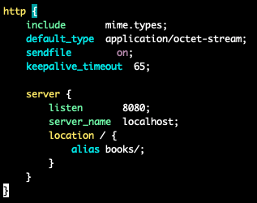
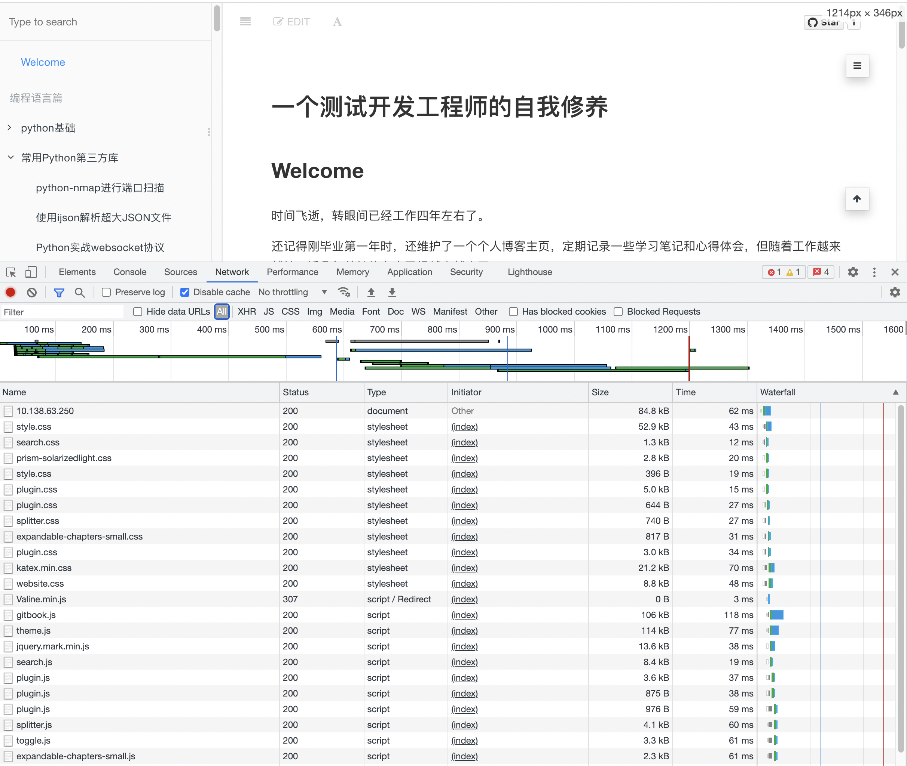
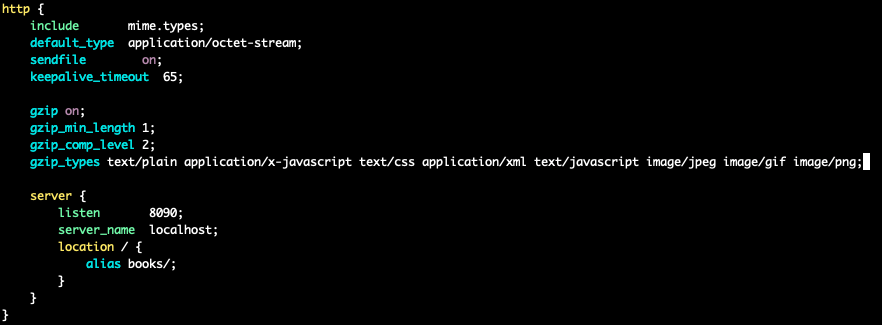
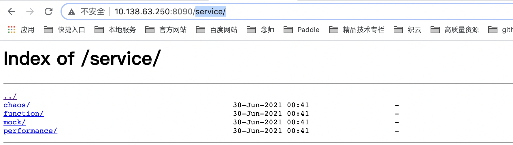
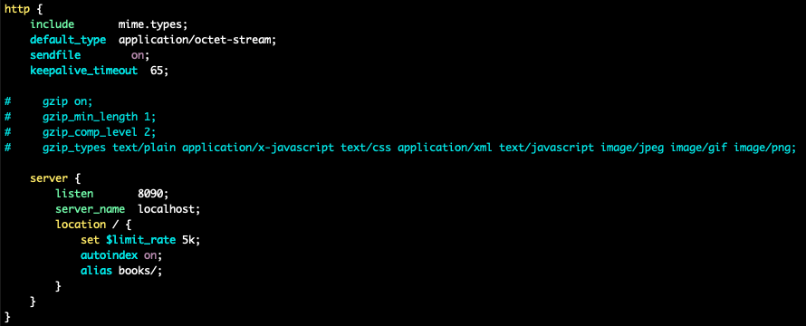
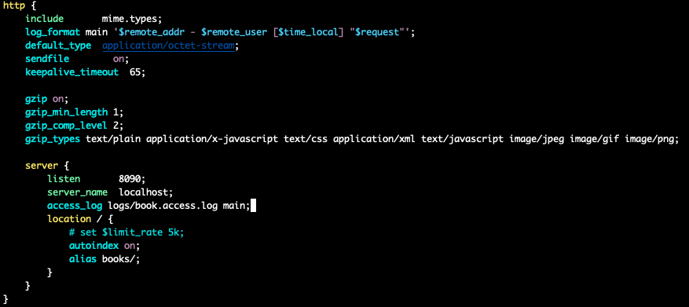
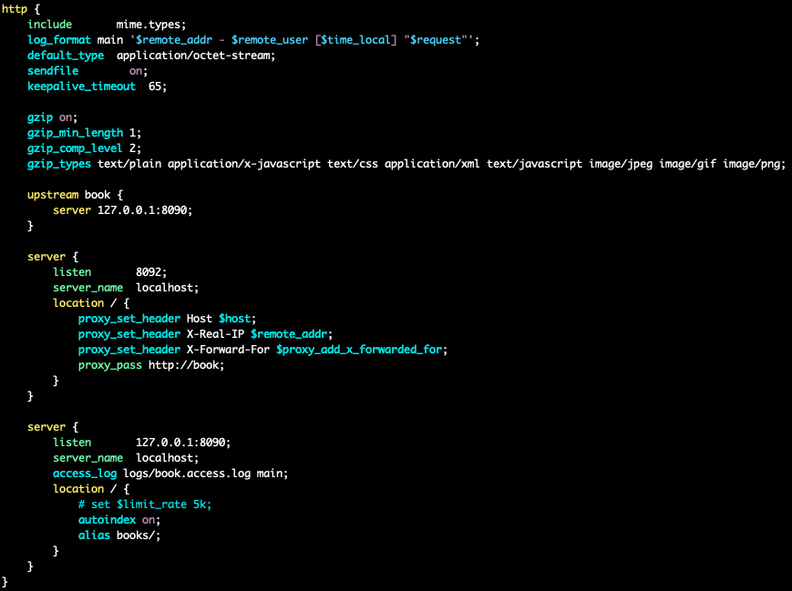
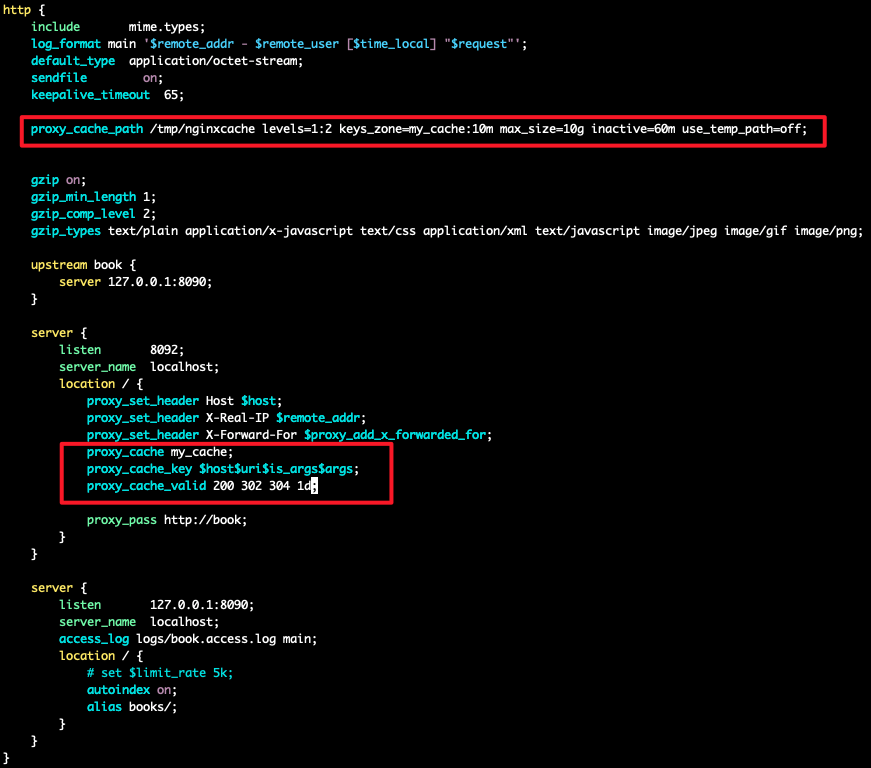
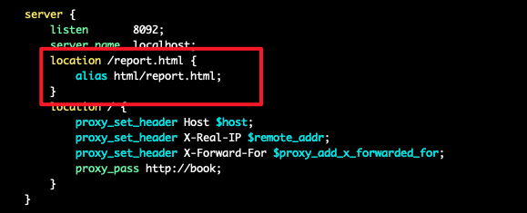
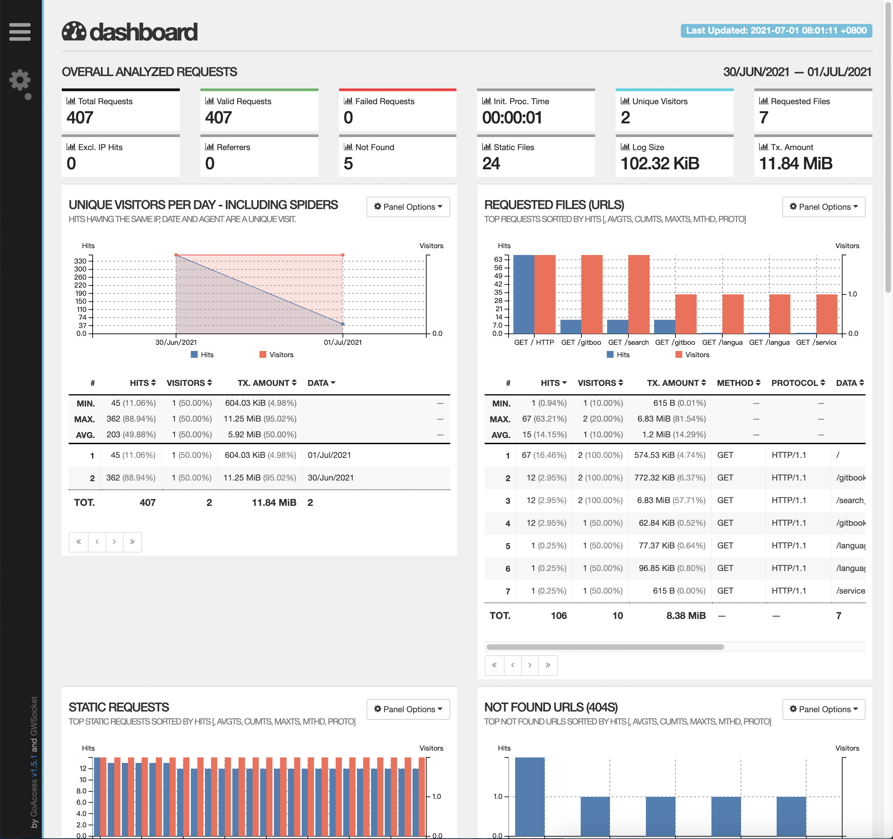

# nginx的快速上手

在之前的文章中，我们已经讲解了一些 nginx 的基本概念并且安装了 nginx 的基础环境。

接下来，我们本文中，我们将会带着大家使用nginx完成一些基础的功能，简单的把nginx使用起来。

## 使用nginx搭建一个静态资源WEB服务器

### 基本服务启动

假设，我们在本机的 `/home/wangzhe/nginx/books/` 目录下存在了一系列的静态资源，如index.html文件，jpg文件等。

下面，我们来看一下如何配置nginx，使得可以创建一个静态资源的WEB服务器。

首先，WEB服务器首先是属于http块内部的。

下面，我们来看一下http下的server块内容应该如何编写：



我们来解读一下上述配置文件：

 - 首先，我们监听的端口设置为8080.
 - 接下来，我们定义了一个 location 块，直接监听了所有访问 / 根目录的请求，同时，对于所有访问 / 根目录的请求，会将根目录转化为本地 books/ 目录下的文件，并对后缀进行匹配。

下面，我们来启动nginx看一下。



赞~现在我们的页面已经可以正常打开了。

### gzip 压缩

打开network选项卡后，你可以发现我们发送请求查询静态资源时，得到的文件大小与真实的文件大小是一致的。

那么，我们有没有什么办法可以对传输的文件进行压缩呢？从而可以有效的节省我们的网络带宽。

对，是有的，就是 gzip 压缩。

下面，我们来继续修改 nginx 配置文件：



可以看到，我们在 http 块中加入了一些 gzip 相关的指令：

 - 开启gzip压缩。
 - 设置启用gzip压缩的最小文件大小为1字节。
 - gzip的压缩级别为2。
 - 同时也指定了哪些数据传输类型需要进行gzip压缩。


完成上述配置后，我们重新加载一下nginx的配置来看一下效果，可以看到，我们对于同一个文件，从之前的80多k降低到了13k。


### autoindex

下面，我们来看一下如果我们希望将本地的目录结构对外暴露到WEB服务中，使得用的可以根据需要自主选择文件进行进行查询和下载。

在 nginx 中提供了一个 `autoindex` 的模块，参见[文档](https://nginx.org/en/docs/http/ngx_http_autoindex_module.html) 。

`autoindex` 的模块可以在我们访问 `/` 结尾的url时，可以显示该目录的结构信息。

使用方式也非常简单，只需要在 location 块中增加 `autoindex on;` 指令即可。

接下来，我们再次访问一个 books/ 目录下包含的一个目录，例如service/。



此时，我们就可以看到该目录下对应的目录结构了。用户也可以自己根据目录进行嵌套查询相关的内容。

### 请求限速

有时，当我们的nginx WEB服务器会被很多用户访问时，为了避免个别请求打满整个带宽，导致其他用户无法正常访问的情况出现，我们可能会需要对单个请求的访问速率进行限制。

此时，需要用到 set 命令配置一些特殊变量来实现相关的功能。



在上述命令中，我们设置了 `limit_rate` 变量的值为 5k，表示单个请求的最大下载速率为 5k/s。

关于 `limit_rate` 的文档，可以参考[文档](https://nginx.org/en/docs/http/ngx_http_core_module.html#limit_rate) 。

### 规范日志打印格式

下面，我们来看一下如何设置nginx的日志打印格式。



我们在 http 块中通过 log_format 指令来定义了一个 main 名称的 access log 的日志打印格式。

可以看到，我们在日志格式中，引用了大量的nginx内置的特殊变量，例如remote_addr等。

接下来，我们在server块中通过access_log指定设置了对于该server块的access_log存储的位置以及使用的日志打印格式。


## 使用nginx搭建一个具备缓存的反向代理服务

### 启动一个反向代理服务器

除了搭建静态资源WEB服务器之外，Nginx 最常用的一个场景应该就是通过反向代理来实现负载均衡了。

在真实的业务场景中，业务服务由于存在着相对复杂的业务逻辑，单实例的QPS往往无法满足业务的需求，这时，我们就需要部署多个实例来分担用户请求。
同时，我们还希望可以提供给用户一个统一的请求入口，而不是每个实例单独提供入口，因此，这时，我们就需要一个反向代理服务器来进行流量的接入了。

下面，我们进行一个简单的示例演示。

我们还是使用上一部分中通过nginx搭建的静态资源服务器来作为业务服务器（上游服务），然后再通过nginx启动另外一个Server用于反向代理。

通常，上游服务器是禁止公网直接访问的，因此，我们可以修改一下之前nginx的配置，将server监听的端口从8080修改为127.0.0.1:8080，即表示该端口仅允许本机访问。

此时，为了使得配置生效，需要先将nginx停止再启动才能生效:

```shell
./sbin/nginx -s stop
./sbin/nginx
```

再次访问时，就会发现服务已经无法正常访问了。

下面，我们来修改配置文件，增加反向代理server：



在反向代理服务器的配置中，我们首先先设置了一个 upstream 块。

upstream 块其实就是用于包含上游业务服务器的地址，此处，我们指向了刚才的静态资源WEB服务器的地址。如果有多个上游服务器实例时，只需要在 upstream 块中包含多个server记录即可。

接下来，我们定义了反向代理服务器 Server 的配置。

首先，该反向代理服务器监听的是 8092 的端口，同时将所有访问 / 目录的请求都转发给了刚才定义的 upstream 上游服务器。

此外，在这个 location 中，我们还定义了一些 set_header 的操作，即将原始访问的一些地址信息，请求信息等添加至header中并转发给上游服务。

相关的文档可以参考 [文档](https://nginx.org/en/docs/http/ngx_http_proxy_module.html) 。

### 增加缓存

对于每一个请求，都通过反向代理访问业务服务器无疑是相对低效率的，那么对于一些请求响应相对固定的请求来说，
我们是否可以直接在反向代理中增加一些缓存，从而在面对相同的请求时，无需再次访问上游服务器，而是直接从缓存中读取内容并返回。

下面，我们来看一下如何和反向代理中，实现缓存的功能：



其中：

 - proxy_cache_path: http块中，设置了缓存文件的存储位置，共享内存的大小和名称，最大缓存大小等。
 - proxy_cache: location块中，设置需要使用哪个共享内存。
 - proxy_cache_key: location块中，设置哪些条件匹配时可以使用cache。
 - proxy_cache_valid: location块中，设置哪些状态码下可以使用cache以及cache生效的时间。

下面，可以简单做一个试验，修改配置文件后，对nginx重新加载配置。

然后访问nginx反向代理服务器，预期可以正常访问。接下来，删除books/index.html文件，即原始静态资源服务器的文件会丢失，静态资源服务器直接访问的话预期会异常。

但是，我们再次访问nginx反向代理服务器，可以发现，嗯...竟然仍然可以正常访问，看来的确是缓存生效了。


## 用GoAccess实现可视化并实时监控access日志

在 nginx 中，access log 对我们而言是非常重要的，我们可以从 access log 中分析有哪些访问用户，访问请求量有多大等等。

但是 access log 毕竟是以文本的方式在 nginx 机器上存放，不利于我们快速的进行分析，此处，我们将会介绍一款工具，GoAccess。

它可以以可视化的方式，帮助我们来进行实时可视化的access log的数据分析。

GoAccess 的官方介绍网站如下: [https://goaccess.io/get-started](https://goaccess.io/get-started)

### GoAccess 的安装

GoAccess 的安装相对简单，可以直接使用如下命令进行源码编译和安装:

```shell
wget https://tar.goaccess.io/goaccess-1.5.1.tar.gz
tar -xzvf goaccess-1.5.1.tar.gz
cd goaccess-1.5.1/
apt-get install gettext autoconf gcc autopoint libmaxminddb-dev libncursesw5-dev
./configure --enable-utf8 --enable-geoip=mmdb
make
make install
```

### GoAccess 的启动

GoAccess 安装完成后，启动就非常简单了。示例命令如下：

```shell
goaccess ./logs/access.log -o ./html/report.html --real-time-html --log-format=COMBINED --port 8890
```

上述命令表示：

1. 监听的是 logs/access.log 文件。
2. 输出结果写入到 html/report.html 文件中。
3. 实时access log，并更新html文件。
4. access log的日志格式为默认是的日志格式。
5. 设置 goaccess WebSocket 的端口为8890，保证浏览器可以正常访问端口，从而实现数据的实时更新。

下面，我们可以查看html/report.html文件，发现的确已经有了这一文件。

### GoAccess 效果观察

那么，我们应该如何从浏览器访问该 HTML 页面呢？详细通过上面的学习你已经很快能想到了！

对，就是再添加一个静态资源的WEB Location配置即可。

修改 Nginx 的配置，增加如下配置即可：



下面，我们打开浏览器进行访问：



棒，我们已经成功启动了 goaccess ，并能够从浏览器中看到相关的数据了，关于各个数据图的含义就需要你下面仔细了解了。

## 基于 OpenResty 用 Lua 语言实现简单服务

之前的讲解我们都还是基于原生的 Nginx 进行演示，下面，我们来看一下如何基于 OpenResty 用 Lua 语言实现简单服务。


