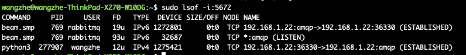

# RabbitMQ的安装

本文中，我们将会讲解RabbitMQ在各种平台下的安装方式。

## Ubuntu下安装RabbitMQ

在Ubuntu系统下，RabbitMQ的安装非常简单，可以直接使用 `apt-get` 命令安装即可。

```bash
sudo apt-get install rabbitmq-server
```

安装完成后，我们可以检查服务状态已经端口是否正常启动：

```bash
# 检查服务状态
service rabbitmq-server status

# 检查端口是否正常启动
sudo lsof -i:5672
```



## RabbitMQ配置与管理

RabbitMQ搭建完成后，我们需要添加一个管理员用户用于RabbitMQ的管理。

```bash
sudo rabbitmqctl add_user  admin  admin
```

赋予该用户管理员权限：

```bash
sudo rabbitmqctl set_user_tags admin administrator
```

赋予virtual host中所有资源的配置、写、读权限以便管理其中的资源:

```bash
sudo rabbitmqctl  set_permissions -p / admin '.*' '.*' '.*'
```

启用RabbitMQ管理页面:

```bash
sudo rabbitmq-plugins enable rabbitmq_management
```

之后在浏览器访问 [http://server-ip:15672/]，账号与密码都是刚才设置的 admin。

