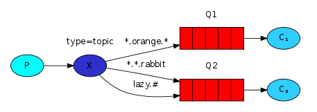

# RabbitMQ的Topic类型的Exchange（多维度订阅）

在之前的文章中，我们分别学习了fanout和direct类型的Exchange。

相比fanout类型，direct类型已经支持我们部分有选择性的接收消息。

然而，在实际应用中，direct类型有时仍然无法支持我们的需求，本文将会继续讲解topic类型的Exchange。

## 场景描述

direct类型的Exchange可以根据某个维度进行有选择性的分发。

例如在之前的例子中，节点可以根据日志级别进行有选择的接收消息。

然而，在面对更复杂的需求时，将会显得无能为力。

例如:
日志来源来源于服务1和服务2两个服务。我们希望节点1接收所有服务的error级别的日志，而希望节点2接收服务2的所有级别的日志。

即direct类型的Exchange只能解决单维度选择的问题，无法解决多维度消息分发的问题。

为了解决上述描述的场景，我们需要使用topic类型的Exchange。

## topic类型的Exchange

对于发送向topic类型的Exchange的消息而言，routing_key有着严格的格式研究：它必须是由点分隔的一组单词，例如service1.info。

这些有点分割的单词都表示某种含义，例如service1.info可以表示服务1的info级别的日志。

Ps: routing_key可以由任意的单词组成。

在绑定消息和通道时，也是有着类似的规则，区别在于绑定消息和通道可以使用一些有特殊含义的符号进行代替：

 - *可以表示任意一个单词。
 - \#可以表示任意0个至多个单词。

因此，在绑定通道时，可以使用*和#进行通配。



以上图为例：
消息中的routing_key由三个单词组成，分别表示动物的习性、颜色以及物种。

我们在Exchange和队列中绑定了三个部分：

 - 将所有橙色的动物消息发送至队列1
 - 将所有兔子信息发送至队列2
 - 将所有懒惰的动物信息发送至队列3

## 完整实现

最后，我们来学习一下它的具体实现吧：

消息发送端：`emit_log_topic.py`:

```python
#!/usr/bin/env python
# -*- coding: UTF-8 -*-

import pika
import sys

connection = pika.BlockingConnection(pika.ConnectionParameters(host='localhost'))
channel = connection.channel()
channel.exchange_declare(exchange='topic_logs',
                         exchange_type='topic')
# 第一个参数表示routing_key，即有.分割的一组词
routing_key = sys.argv[1] if len(sys.argv) > 2 else 'anonymous.info'
# 第二个及后续的参数表示发送的消息
message = ' '.join(sys.argv[2:]) or 'Hello World!'
channel.basic_publish(exchange='topic_logs',
                      routing_key=routing_key,
                      body=message)
print(" [x] Sent %r:%r" % (routing_key, message))
connection.close()
```

消息接收端: `receive_logs_topic.py`:

```python
#!/usr/bin/env python
# -*- coding: UTF-8 -*-
import pika
import sys

connection = pika.BlockingConnection(pika.ConnectionParameters(host='localhost'))
channel = connection.channel()
channel.exchange_declare(exchange='topic_logs',
                         exchange_type='topic')
result = channel.queue_declare(exclusive=True)
queue_name = result.method.queue
binding_keys = sys.argv[1:]
if not binding_keys:
    sys.stderr.write("Usage: %s [binding_key]...\n" % sys.argv[0])
    sys.exit(1)
# 接收多个参数
# 每个参数表示一组bind，且参数为routing_key
for binding_key in binding_keys:
    channel.queue_bind(exchange='topic_logs',
                       queue=queue_name,
                       routing_key=binding_key)
print(' [*] Waiting for logs. To exit press CTRL+C')
def callback(ch, method, properties, body):
    print(" [x] %r:%r" % (method.routing_key, body))
channel.basic_consume(callback,
                      queue=queue_name,
                      no_ack=True)
channel.start_consuming()
```

## 测试

测试一下吧：

首先启动节点1接收所有服务的error级别的日志：

```shell
python receive_logs_topic.py "*.error"
```

接着启动节点2接收服务2的所有级别的日志：

```shell
python receive_logs_topic.py "service2.*"
```

下面，我们来发送一些消息：

```shell
python emit_log_topic.py "service1.error" "message1"
python emit_log_topic.py "service2.error" "message2"
python emit_log_topic.py "service2.info" "message3"
```

怎么样？是否符合预期呢？
