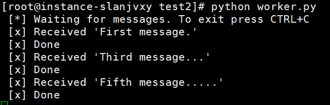
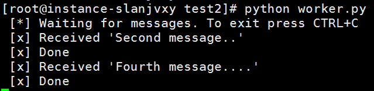

# RabbitMQ的工作队列（均匀分配模式）

在本文中，我们将会创建一个工作队列 ，用于在多个Worker之间分配任务。

## 循环调度

工作队列的主要思想是避免立即执行资源密集型任务，且任务完成后才返回请求信息。 相反，我们接收到一个任务后并不立即处理，返回信息已收到，并后续排队依次进行处理。

此时，我们可以将任务封装为消息并将其发送到队列。在后台运行的工作进程将会接收到消息并最终执行该任务。

当存在许多工作节点时，这些任务将在他们之间分配调度。

在本文的介绍中，我们将会发送一些表示复杂任务的消息。

在消息产生中，我们发送一些带有"."的字符串，其中，每一个"."表示等待1s。 例如，hello... 则表示等待3s钟。

下面，我们来编写一个消息产生的文件`new_task.py`:

```python
#!/usr/bin/env python
# -*- coding: UTF-8 -*-
import sys
import pika  # pika是Python连接RabbitMQ的工具


connection = pika.BlockingConnection(pika.ConnectionParameters(host='localhost'))
channel = connection.channel()
channel.queue_declare(queue='hello')
# 接收所有输入的参数，并将每个参数用空格连接在一起
message = ' '.join(sys.argv[1:]) or "Hello World!"
# 发布消息
channel.basic_publish(exchange='',
                      routing_key='hello',
                      body=message)
print(" [x] Sent %r" % message)
connection.close()
```

我们继续来实现一个任务处理端的代码`worker.py`：

```python
#!/usr/bin/env python
# -*- coding: UTF-8 -*-
import time
import pika


connection = pika.BlockingConnection(pika.ConnectionParameters(host='localhost'))
channel = connection.channel()
channel.queue_declare(queue='hello')


def callback(ch, method, properties, body):
    print(" [x] Received %r" % body)
    # 每个小数点表示1s
    time.sleep(body.count(b'.'))
    print(" [x] Done")

channel.basic_consume(callback,
                      queue='hello',
                      no_ack=True)
print(' [*] Waiting for messages. To exit press CTRL+C')

channel.start_consuming()
```

使用任务队列的优点是可以对任务进行并行调度。也就是说我们可以启动多个Worker实例来共同完成任务。

下面，我们首先启动2个Worker的实例：

```shell
# shell 1
python worker.py
# => [*] Waiting for messages. To exit press CTRL+C
```

```shell
# shell 2
python worker.py
# => [*] Waiting for messages. To exit press CTRL+C
```

在Worker已经启动后，我们可以启动消息生成者来创建一些消息任务了：

```shell
python new_task.py First message.
python new_task.py Second message..
python new_task.py Third message...
python new_task.py Fourth message....
python new_task.py Fifth message.....
```

此时，我们可以查看一下其他两个终端，从来看一下任务分配情况：

终端1:



终端2:



很明显，任务1,3,5分配给了第一个Worker处理，而任务2,4分配给了第二个Worker处理。

这种调度方法我们称之为循环调度，即依次将任务分配给每个Worker并循环进行任务分配。

## 消息确认

每个Worker完成一个任务可能需要几秒钟的时间。

在这个过程中，我们希望知道任务是成功完成了还是在任务执行的过程中由于一些原因导致任务未完成。

按照目前的实现方式，一旦RabbitMQ将消息传递给Worker，它将会立即将该任务删除。

在这种情况下，如果你终止了一个Worker进程，那么，它正在处理的消息以及已经分配至该Worker的任务都将会丢失。

但实际应用中，我们不希望消息丢失，即一旦某个节点挂掉，我们希望将任务交付给另一个节点进行处理。

为了确保消息永不丢失，RabbitMQ本身支持消息确认功能。即Worker发回ack（请求）告诉RabbitMQ已经收到并处理了该消息，此时，RabbitMQ才会删除该消息。

如果Worker挂掉（其通道关闭，连接关闭或TCP连接丢失），RabbitMQ将理解消息未被完全处理，并将重新进行任务分配。

如果有其他Worker同时在线，它会迅速将其重新发送给其他的Worker。 这样，即使有Worker节点挂点，也可以确保没有任何信息丢失。

消息确认功能默认是启用的。在之前的例子中，我们通过设置`no_ack = True`标志明确地将消息确认功能禁用。否则，只有当我们真正完成某个任务后，才会通知消息中心删除该消息。

消息确认的功能实现如下：

```shell
def callback(ch, method, properties, body):
    print " [x] Received %r" % (body,)
    time.sleep( body.count('.') )
    print " [x] Done"
    # 消息确认
    ch.basic_ack(delivery_tag = method.delivery_tag)

channel.basic_consume(callback,
                      queue='hello')
```

此时，我们可以实验一下，当任务正在处理中时，我们直接杀死该Worker，会发现任务会重新发送给其他Worker。

## 消息持久化

我们已经知道如何确保即使Worker死亡，任务也不会丢失。 但是如果RabbitMQ服务器挂掉，我们的任务仍然会丢失。

默认情况下，当RabbitMQ退出或崩溃时，它会丢失队列和消息。

需要做两件事来确保消息不会丢失：我们需要将队列和消息进行持久化。

解决方案如下，在声明队列时将其设置为持久的：

```python
channel.queue_declare(queue='hello', durable=True)
```

Ps：需要说明的是，由于我们之前已经声明过hello这个队列了，因此重复声明是无效的，也不会修改其持久性，因此，我们需要声明一个其他名称的队列，例如：

```shell
channel.queue_declare(queue='test_durable', durable=True)
```

我们需要在消息产生者和消息处理者中都对该队列进行声明。

上面的部分是可以将队列进行持久化，此外，我们还需要对消息进行持久化，持久化的方式如下：

```shell
channel.basic_publish(exchange='',
                      routing_key="task_queue",
                      body=message,
                      properties=pika.BasicProperties(
                         delivery_mode = 2, # make message persistent
                      ))
```

其中，delivery_mode = 2表示对消息进行持久化。

## 均匀调度

在之前的循环调度中，可能会有一些缺点。

例如，当我们存在两个节点时，如果所有奇数的任务耗时都很长，而所有偶数的任务耗时都很短，此时，就会导致一个节点始终会有任务堆积，而另一个节点则总是处于空闲的状态。

为了解决这种问题，RabbitMQ还支持了另外一种调度方法，即均匀调度。

我们可以使用`basic.qos`函数和`prefetch_count = 1`的参数设置来告诉RabbitMQ一次不要向一个Worker发送多个消息。

即只有当每个Worker确认当前任务已经处理完成后，才会将下一个任务发送给它。

总结一下，完整的实现代码如下：

`new_task.py`:

```python
#!/usr/bin/env python
import pika
import sys

connection = pika.BlockingConnection(pika.ConnectionParameters(host='localhost'))
channel = connection.channel()
channel.queue_declare(queue='task_queue', durable=True)
message = ' '.join(sys.argv[1:]) or "Hello World!"
channel.basic_publish(exchange='',
                      routing_key='task_queue',
                      body=message,
                      properties=pika.BasicProperties(
                         delivery_mode = 2, # make message persistent
                      ))
print(" [x] Sent %r" % message)
connection.close()
```

`worker.py`:

```python
#!/usr/bin/env python
import pika
import time

connection = pika.BlockingConnection(pika.ConnectionParameters(host='localhost'))
channel = connection.channel()
channel.queue_declare(queue='task_queue', durable=True)
print(' [*] Waiting for messages. To exit press CTRL+C')

def callback(ch, method, properties, body):
    print(" [x] Received %r" % body)
    time.sleep(body.count(b'.'))
    print(" [x] Done")
    ch.basic_ack(delivery_tag = method.delivery_tag)
    
channel.basic_qos(prefetch_count=1)  # 同时接收消息的数量
channel.basic_consume(callback, queue='task_queue')
channel.start_consuming()
```
