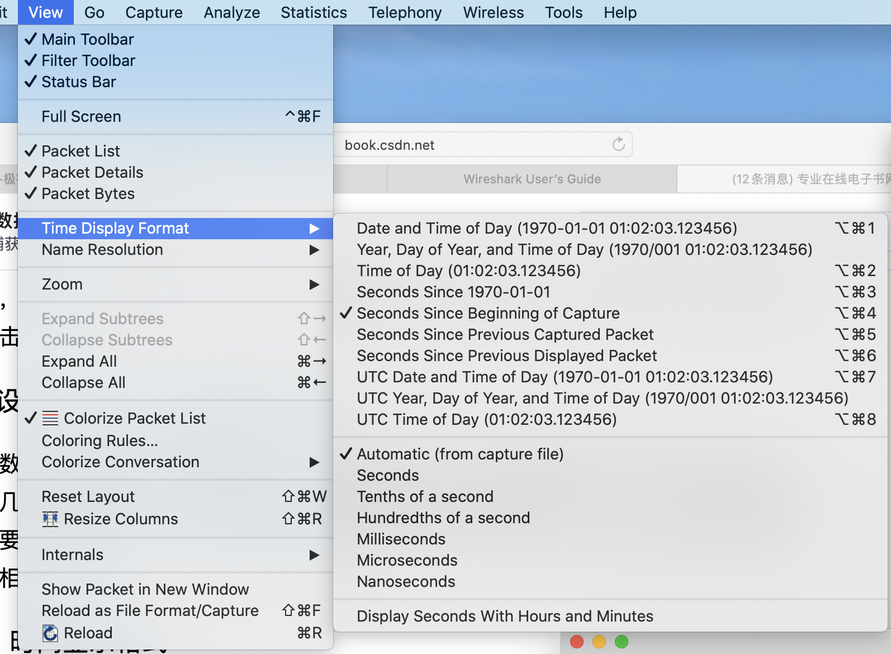
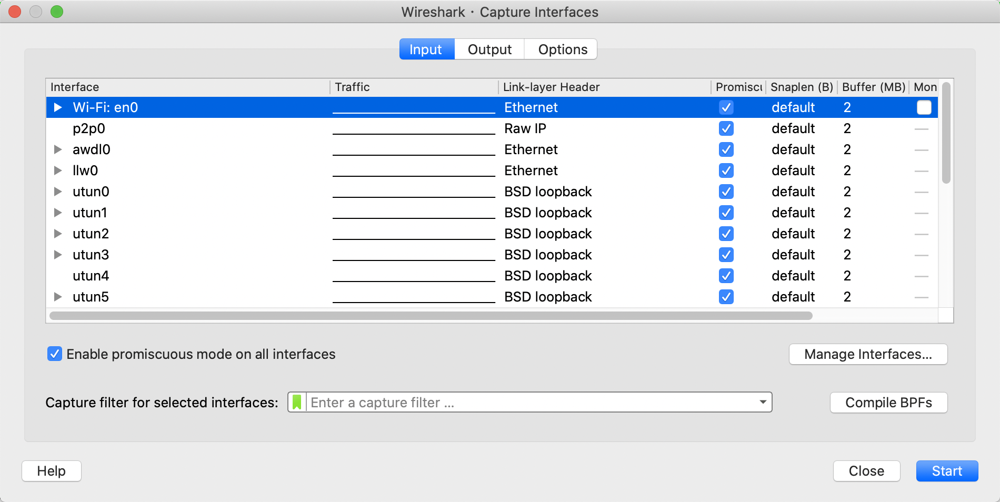
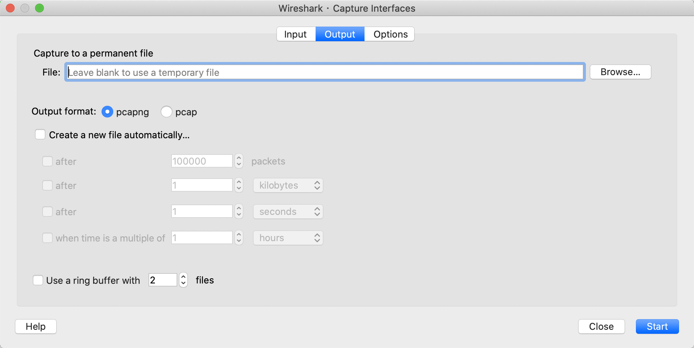
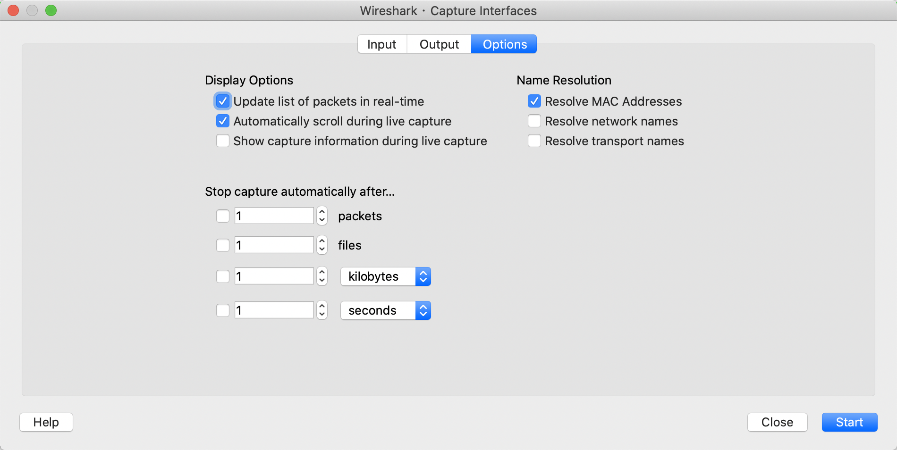

# Wireshark上手使用

## 文件的导入与导出

Wireshark支持将数据包捕获下来进行保存，同时还支持导入之前保存的结果进行分析。

### 导入和导出捕获文件

导出捕获的数据包非常简单，只需要点击File -> Save as，然后可以打开对话框。
输入想要保存的文件位置即可。
默认的文件格式是`.pcapng`。

### 合并捕获文件

有时，我们需要将多个捕获文件合并成为一个文件。

只需要选择File -> Merge，这时会查询Merge With Capture File的对话框，然后即可选择对应的文件列表进行合并。

## 时间格式设定

Wireshark所捕获的每一个数据包都会有赋予一个时间戳。
Wireshark可以显示这个数据被捕获的绝对时间戳或者是与上一个捕获数据包的相对时间戳。

与时间显示相关的选项可以在主菜单的View菜单中找到，如下图所示：

## 设置捕获选项

在使用Wireshark进行数据捕获时，有相关的捕获选项可以配置。

想要查看这些选项，只需要选择Capture -> Options即可。

该页面包含三个标签页，分别是输入、输出和选项。

### 输入标签页

在输入标签页种，可以显示所有抓包的影响接口和有关这些接口的基本信息。如下图所示：

此时，还可以根据接口的捕获过滤器来过滤哪些包希望被抓取。

### 输出标签页

与之前我们所讲的先抓流量再存文件的方式不同，输出标签页中我们可以直接把抓的流量包存成一个文件。

### 选项标签页

在选项标签页面中，包含着一些其他的抓包配置，包含显示选项、解析名称和自动停止捕获等，如下图所示：

