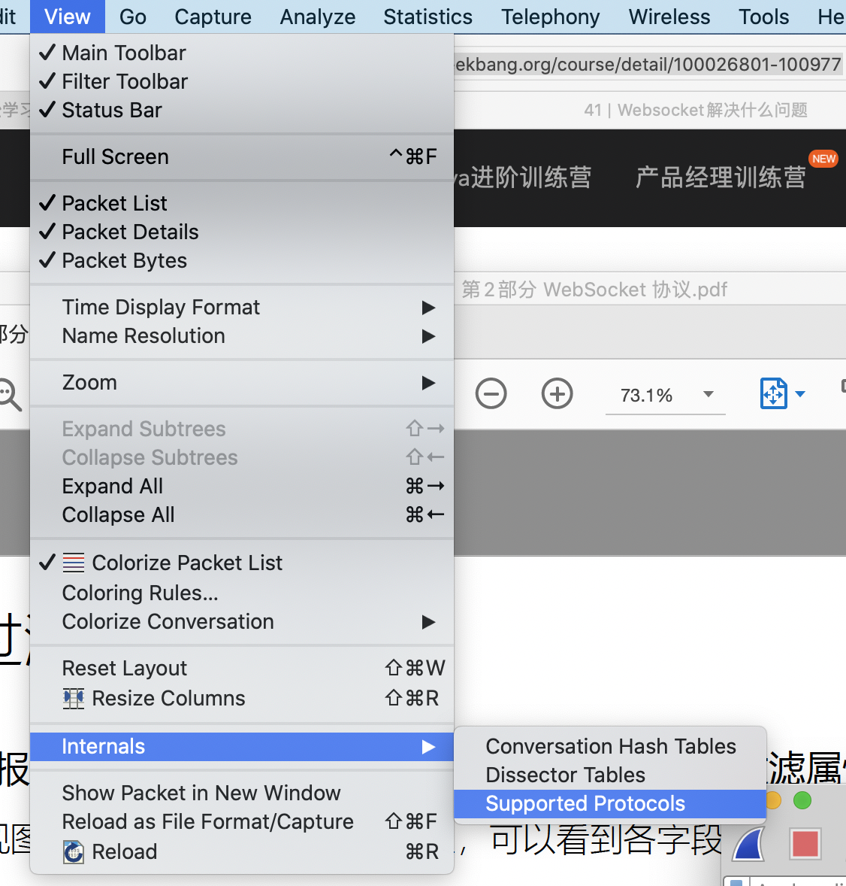
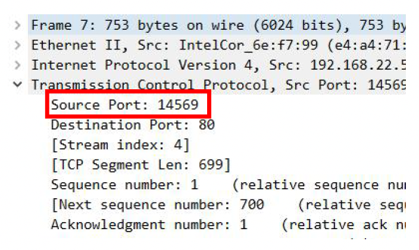
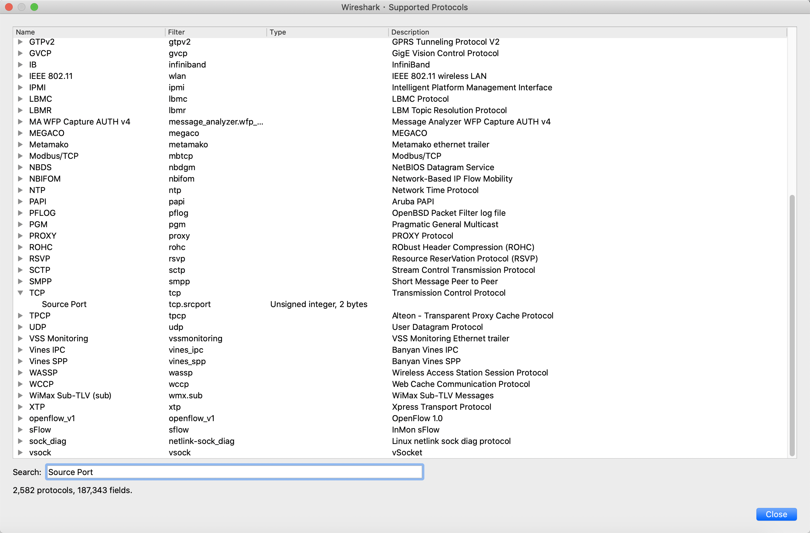
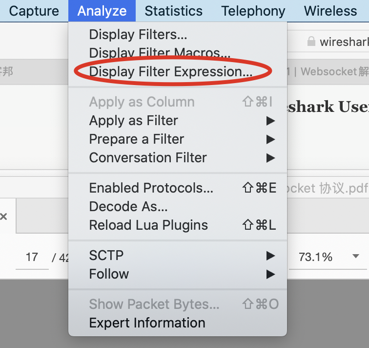

# Wireshark显示过滤器

## 概述

上一节中，我们已经了解了什么是捕获过滤器，而接下来，我们将会继续学习显示过滤器。

显示过滤器的功能比捕获过滤器的功能要更加强大，任何在报文细节面板中解析得到的字段名称都可以作为过滤属性。

但是需要注意的是，报文细节面板中得到的字段名称与过滤属性中的字段名称并不一致。

而是在 View -> Internals -> Supported Protocols可以找到对应字段名称的属性名称。

例如，在TCP的报文细节面板中，我们可以看到一个Source Port字段。

我们可以在Supported Protocol中进行搜索即可：

## 显示过滤器比较符号

|英文|符号|示例|
|---|---|---|
eq|==|ip.src == 1.1.1.1
ne|!=|ip.src != 1.1.1.1
gt|>|frame.len > 10
lt|<|frame.len < 10
ge|>=|frame.len >= 10
le|<=|frame.len <= 10
contains| |sip.To contains "a1762"
matches|~|host matches "acme\.(org|com|net)"
bitwise_and|&|tcp.flags & 0x02

## 显示过滤器数据类型

1. 无符号整型
2. 有符号整型
3. 布尔值
4. -或者.分隔的6字节地址，例如eth.dst这样的Mac地址
5. IPv4地址
6. IPv6地址
7. 文本字符串

## 多个表达式之间的组合

|英文|符号|
|---|---|
and|&&
or|
xor|^^
not|!
[...]|
in|

## 其他常用操作符

1. 大括号操作符：例如tcp.port in {443 4430..4434}
2. 中括号[]Slice操作符：例如
    1. [n:m]表示n是起始偏移量，m是长度
    2. [n-m]表示n是起始偏移量，m是截止偏移量
    3. [:m]从开始处到m截止偏移量
    4. [m:]从m起始偏移量到结尾字段
    5. [m]偏移量m处的字节
    6. [,]使用,逗号分隔时，允许以上方式同时出现

## 支持的函数

1. upper
2. lower
3. len
4. count
5. string

## 显示过滤器对话框

除了自己从头开始输入显示过滤器表达式外，我们还可以借助显示过滤器可视化对话框来进行输入。

这样，我们就可以不需要记住所有的关键词、数据类型和比较符号了。
